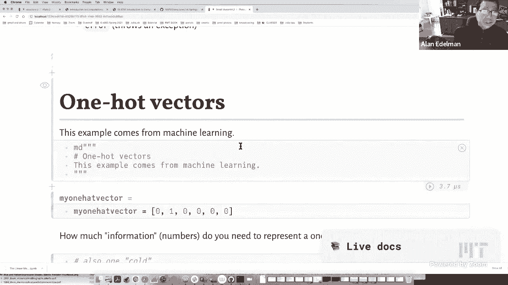
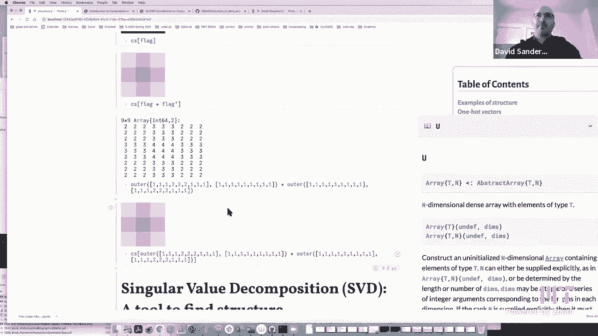
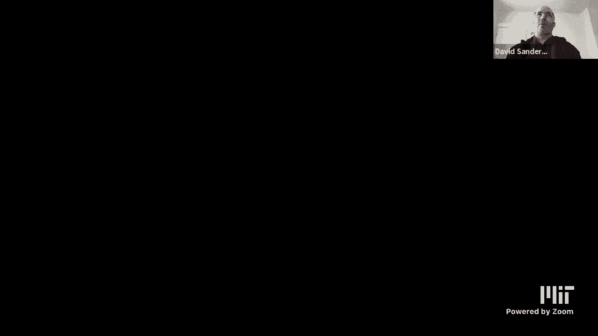
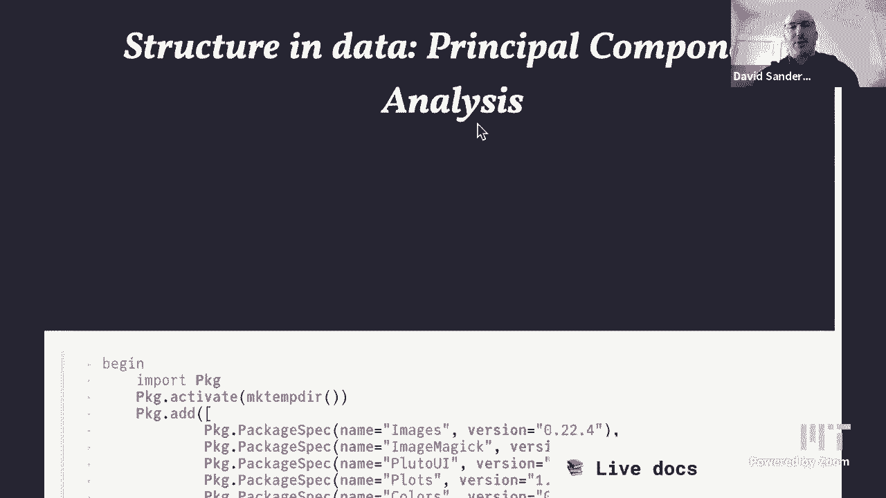
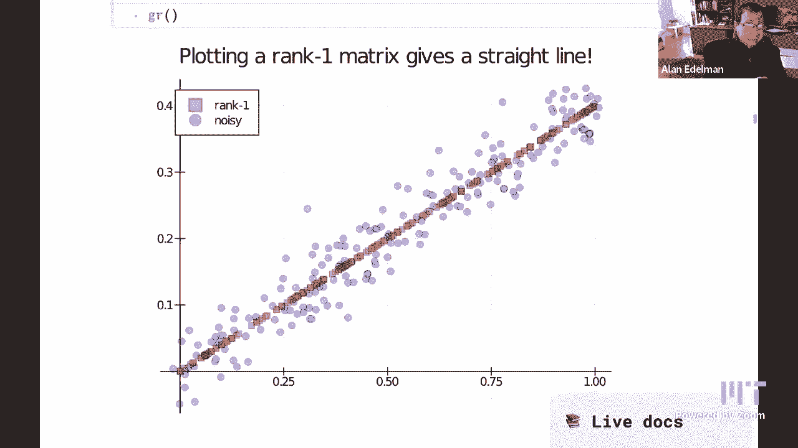

# 【双语字幕+资料下载】MIT 18.S191 ｜ 计算机思维导论-Julia(2021最新·完整版) - P7：L7- 结构 - ShowMeAI - BV19g411G7ab

let me just start with this that uh，uh welcome everybody out in internet，land and。

anybody from mit as well and let me，mention，that uh this saturday night or sunday。

morning i guess officially sunday，morning，much of the united states is going to be。

changing the clocks and so，if you're somewhere that isn't changing。

the clocks you might want to keep that，in mind if you're looking for us。

uh monday 1 pm eastern it might well be，um an hour i never remember whether it's。

earlier or later for you，um than it usually is so i know the rest。

of uh i know most of europe is going to，be doing it two weeks from now。

and so i guess it will be an hour，earlier for for those of you in europe，for example。

okay next thing is we seem to have had a，little bit of a problem。

with the website and so i was going to，just try quickly to see。

what i think would work but dave tells，me won't work but i want to see it for，myself。

so i'm going to go to pluto and i've，gotten into the habit of putting urls，right here so um i。

i thought that this would work but david，tells me，no and david is usually right but i'm。

going to try it anyway，and see if it will work。

and it does work okay this time，dave i guess this time it worked again。

i'm glad glad to know about it right so，so，so the uh the the actual。

url uh which let's see what is the，can we could we put it in a discord or。

something so that people can find it，okay，so this will be the first notebook for。

today the structured。jl，and uh what i'm going to be doing is，talking about。

a real computational thinking idea which，is taking advantage of structure and。

structure can be many things and i'll，give you a few examples，and then uh depending on how the time。

goes we're also going to talk about，a particular kind of structure which is。

principal components analysis，and that's this over here so，this is this this particular notebook。

which i gather，dave has already put into the discord so，you can find that as well。

so let me start with talking about，structure，and there's a new feature that is going，to be in。

the notebooks and we're going to work，backwards and get them in the old。

notebooks as well which is what are the，julia，uh what are the julia commands uh，structures that。

are going to appear in this notebook and，so i made a list here you can see。

four items uh basically struck dump you，know dagger and sparse，i'll count as one item and error so。

we're going to make an effort to put，this at the beginning of every notebook。

so you could figure out what little bits，of julia you'll be learning in this。

in this particular lecture at the same，time so thanks charles for that nice，idea。

okay so structure examples of structure，so let's see i see if this is too big，the table of contents。

let's say is this too small for you dave，should i make it bigger you always like，me to zoom in。

but i also like the table of contents on，the side um，yes it's okay alrighty okay。

so uh structure so the best way to talk，about structure，that，even if if you were around for the last。

lecture of this semester，we talked about dynamic programming and，you might remember。

that the structure that we took，advantage of，was the common subproblems right so that。

uh there were these paths that would go，left down and right or i。

call them southwest south and southeast，and，these were not just sort of random paths。

but these were paths that had a，structure to them，that is actually a common they had a。

common substructure so that's perhaps，one example，but let me kind of go a little slower。

and talk about，other problems that have uh structure so，here's a really simple structure。

and this is the so-called one-hot vector，it's a name that comes from machine，learning。

it's a very simple idea i really like，the name one hot vector。

here's a here's an example of a one hot，vector okay this is a vector，only。

one of the elements is hot right the，rest are cold，one，element is one and the rest are all zero。

okay and so that is a，one hot vector uh in linear algebra，it might be called the column of the。

identity or or a，coordinate basis vector but none of，those words seem as good to me as one。

hot vector i really like that name，so i hope you like it too uh and。

why alan does it say one hat vector my，one hat vector，yours has one hat yours says one hat。

what's the below the name of the，variable says，my variable is one chiropractor i don't，know。

but we could change it，well it's being defined again below so，be careful。

is it being one my one hot vector is，over here，yeah i wonder if that happened because。

we didn't want to clash，yeah that's what i'm wondering that's，probably what happens i don't remember。

anymore i wrote it last that's a funny，i don't remember my own sense of humor，if it was even me。

okay that's because that's the american，pronunciation，one hot victim there you go。

so i would like to ask a question which，is，for everybody to think about is how much。

information do you need，to represent this vector obviously it's，made up of six elements。

but you really need six numbers to，represent this vector，so is it you know if n is six do you。

need n do you need one do you need two，i mean really how much what is the。

information content okay i'm sure you，can all realize，that two numbers ought to be enough。

right there the the size，six and the position of the one，too kind of tells you the whole story。

really，right so it seems sort of like it seems，silly to write out a vector zero one，zero zero zero。

zero in the context of one hot vectors，because two numbers will do the trick。

by the way just to mention that there's，also the word one cold。

okay and a one cold vector is a again a，vector of zeros and ones。

but only one of the elements is cold，that is a zero，but we're going to concentrate on one。

hot vectors and i'm going to show you，how you create，a structure in julia that takes，advantage。

of the structure and you know，coincidentally enough，that to create something in julia that。

takes advantage of structure，it's called a strut right this is a new。

type in julia that you get to create，yourself，okay and so um this part you could。

ignore right now if you find it，a little bit confusing but basically，we're going to say。

that a one hot i'm going to create a one，hot，and it's going to be made up of two。

things it's going to be made up of an of，an integer n，and an integer k and that's it so one。

hat is going to be，two integers it's not going to be，there's there's nothing more to one hot。

really it's just these two，integers and just to tell you what this，is in case you're curious。

we're saying that this will be a subtype，of an abstract vector of ins and so that。

it behaves in many ways，like a vector of integers even though。

it's not a vector of integers it's a one，hot，okay but it'll be it'll be a subtype。

that's this funny punctuation the，subtype，um of an abstract vector made out of，it's。

okay and a couple of quick things that，are actually useful to have if you're。

going to create an abstract vector and，it's going to be handy here，is to define the size。

of we want to see we want to pretend，this is a vector even though it's not。

exactly a vector so um what can you do，with a vector well you can get its size，size。

of of a one hut you should give me back，the n right so the n is actually。

the size this this is just the way here，um maybe i'll go over here and put this。

in if i were to do the size，of my one hat vector，you see i just got a six right and so we。

want this to behave in the same way，even though we're not storing all those，do。

is get index right so we want to do，things like，we want to do the analogy of my one hat。

by the way i just hit tab to make that，faster，right if i type my one of two i'll get，the one。

but if i do any other thing i'll get a，zero right if i if i call it with any。

other index i get a zero，want，that behavior too and so the command。

there is get index maybe i should have，we，are showing off in julia today and uh we。

need a one hot vector and an i，and basically what we're going to check，is whether。

the uh what we're checking is whether，the number，k in in in the one hot vector is equal，to i。

right and we'll turn it into an int so，this is a true or a false。

which becomes a zero or a one as it's，turned into an，int okay and so to actually pull this，off。

i could create a one hot vector by just，typing one height of six。

two and you see it actually gives you，the illusion，of a vector right i mean it even looks。

to julia as if it's a vector，right but um，yeah let's see my one hot vector。

right and if i if i actually index it，for example if i index it with two。

i get the one but if i index it with，four i get the zero，this completely has the full illusion of。

being a vector of zeros and ones，and yet it actually takes advantage of。

the structure and one way you could，actually see that，is um i'm going to mention that the。

the dump and the with a small d and a，capital d，uh in in capital d it actually prints in。

pluto without，without any fuss the small d you have to，do this silly pluto thing with terminal。

but i actually think it looks very nice，it kind of，highlights it's sort of like to me it。

looks like a blackboard so i think i，actually kind of like the width terminal。

just to highlight it but in any event，dump what dump does is it kind of tells。

you everything that's going inside，that object so if i dump my，one hot vector you'll see that i'm。

getting two，integers the six and the two right so，you can use the capital d。

if you like it'll just print it sort of，the boring way，or you can use the little d and uh if。

you just do the little d i'll show you，pluto kind of ignores it a regular julia，rebel wouldn't。

but if you add this with terminal do，thing，then you get this sort of nice，blackboardy flick okay。

so um there you have it the my one hot，vector，that are，critical to defining without wasting any。

space at all，right and so that's structure that's，taking advantage of。

uh structure okay and i don't know why，but i like to do visuals。

so here's visualizing a one-hot vector，n is the n is the size so here i'm just，making n b 13。

 here could actually see，it，and then k specifies where the one is。

and so here's just a little visual i，don't know if this adds much to the，story but。

here's some one-half vectors okay but，let me move on now just a comment that。

basically what we're saying is that this，one hot，object behaves as if it were a vector。

it has the same behavior you could not，actually tell when you're indexing into。

it or when you're doing length of it，you can't actually tell how it's being。

stored internally it has exactly the，same behavior to the user。

right and we already saw another example，of that which was，range objects also behave like that you。

can index into ranges，and you can take the length of ranges，you don't know if。

how many pieces of information they're，oh let's do a dump let's go dump of one，colon seven right。

we may have done this before but let's，just do it again，yes we do or i have to do that with。

terminal so um，there you see the this also has two，numbers a start and a stop。

right if on the other hand we took a，range that was，you know like even numbers from 2 to 17。

or something，then there's three numbers that store，this the two the two。

and it's clever enough to know that if，you're starting at an even。

you're actually literally stopping at a，16。 so，uh that's actually what's stored inside。

the computer is basically just these，three integers for，a range okay by the way something that。

came up the other day and you'll see it，in your，mit x homework also inspired by charles，is if you。

um if you actually，dump this thing you'll see that it is a，vector。

that actually contains the range right，and so uh there's a difference。

and we'll explore that in the mit x，homework there's a difference between，this which is just a range。

and this is which is here let's make a a，vector that has a couple of ranges in it。

so this is a vector of size two and you，could see that each element，is itself a range，okay all right。

so that's enough of that stuff let's do，another example，of structure that let's take a diagonal。

matrix，okay so here's a diagonal，matrix that i don't know if people see。

matrices in high school anymore，um as you might see in let's just say i。

think it's better to say an elementary，i think that would be a better way to。

say it so here's a diagonal matrix，it's a diagonal matrix is one that。

only has non-zeros potentially off on，the diagonal right all the off-diagonal，elements。

are zero so this is a diagonal matrix，but for a three by three array i think。

you could see that i only needed three，numbers to represent it right for an。

n by n matrix i would only need n，numbers to represent，a diagonal matrix and so i don't know if。

your linear algebra class they make you，write out all the zeros or put in the，dots。

but it is silly to store them on a，large，i guess if it's small it doesn't really，matter but uh。

julia has a a a，type called a diagonal and it even，prints them out kind of pretty you could。

see there's dots where the zeros would，be，okay um and we let's do the dump right，now of the i。

can't remember if i did it later but，let's do it right here you could see。

that um the numbers that are stored are，the five the six，and the minus ten right there's no。

there's no zeros stored，that that's to be contrast if you will，with the if i dump。

the density the one that i first defined，and uh as you probably would expect this，one is storing。

all of these numbers the zeros are，stored so again，structure the structure of this diagonal。

matrix is just to have these numbers 5 6，and minus，10。 okay and so。

as i was just showing you before you，could you could you could take a full。

matrix or sometimes it's called a dense，matrix sort of a matrix in regular，format。

and you can um cast it to be in a，diagonal using diagonal，or you could actually create it by just。

entries，so you know i guess this is sort of，always a good idea it's kind of an，obvious idea。

but well for any kind of data structure，at all any kind of algorithm，we're always trying to look for。

structure where it exists，so let me now introduce the idea of，sparse matrices。

which is kind of what we've been doing，already but there's sort of a more，general。

concept a lot of people would not call a，diagonal matrix a sparse matrix so，technically。

it fits in um but you know maybe a lot，of people wouldn't call a square a。

rectangle though technically a square is，a rectangle，i mean if something's a square you。

should call it a square because that，gives more information，so what's a sparse matrix so。

so a sparse matrix is um，is a different yeah a sparse matrix，a sparse matrix is let's give the。

official definition，is a matrix that has many，zeros worth storing。

in a sparse structure and i'm going to，okay that's that's sort of what a sparse，matrix is。

what did i do do i have too many quotes，here，okay all right so it's part and so，here's a。

very simple example here's a matrix that，obviously has three non-zeros。

okay the 12 the nine and the four okay，and um here's a sparse representation of，the same。

matrix and for the human eye this is，actually not how it's stored。

but for the human eye you could say well，the ij you know the row and column index。

for the nine is three one，and the uh sorry the third one first，column is the 12。

the first one third column is the nine，and the bottom right the three three，entry is。

a four right and so uh and，the all the other entries are presumed，to be zero。

okay and if you use the sparse arrays，julia package，you can go and see what's inside one of。

these matrices，and it's a little bit tricky and i，wasn't really planning to go into this。

but it's not that bad so i think i will，show it to you to show，to see how a general dense sorry a。

general sparse matrix，is stored and and maybe this is why i，don't think of diagonal matrices as。

sparse matrices because they have a，special storage，right so so they they're they're somehow。

that's why i like to think of them as a，general sparse matrix。

but if we dump the if we jump this dump，the sparse matrix，uh what we see is besides the sizes。

you know the m by n the rows and columns，being three by three。

there are three other vectors stored on，the inside of，a column pointer a row value and the。

non-zero values，and it's kind of better to go from，bottom to top which i've done over here。

so the non-zero values are easy to，understand they're just the 12 the nine，and the four。

okay those are the non-zero values，that's the easiest this is how it's。

stored internally it's called csc，or compressed sparse column format there，are other formats，certain。

applications because it kind of，generally is good for matrix-vector，products and，yeah so。

it's made up of 1294 the non-zero，elements and，the row values are just the indices the，i indices。

three one three it's the same three one，three that you'll see。

over here it's the first column right so，the 12，is in the third row the nine is in the。

first row and the four，is in the third row but instead of，storing j。

we're storing something a little bit，different，we're storing the column pointer thing，is。

is always of length one more than the，num then the nz valve so if this is。

three this is a length four，and what it's doing is it's a pointer，into nz。

val which tells you where the，uh first non-zero is in that column and。

that might even be in the next column，so for example because maybe i should。

let me put in put an eight here and then，i'll change it back。

so you can actually follow this along um，yeah so oh i want to be able to see this，to make it。

one smaller i hope you'll be able to，still see it，okay so what this says is you'll notice。

that uh the the，let's put a few more entries in maybe，okay，so uh the one points to the first entry。

of this vector，and it says 12。 and the 12 is the first，non-zero in this column。

two points to the second entry and eight，is the first non-zero in this column，okay four。

says we're going to look at this the，nine and the nine is the first entry in，the third column。

and six actually doesn't point anywhere，at all right it kind of falls off the，end。

and it tells you it's it's the way of，indicating there's no further columns。

okay uh that's kind of the way it's it's，it's done uh so i guess you could have，just stopped with n。

but this is the way it's done it's it's，it's pointing to the one column，afterwards。

okay now the fun happens if if i zero，out the second column which is how we，started out。

if i zero out the second column then，something interesting happens it says。

oh the the the first non-zero，is a nine for the second column it's the。

second entry and by the way for the，third column as well，okay i wasn't going to go too far into。

this it's a little bit tricky，uh but this is how sparse matrices are，stored uh。

so the main point here is we store the，values we store the eye and we do。

something a little bit tricky，that's somehow equivalent to getting the。

j okay but i'd like to show you，an example where this may not be a，particularly good storage scheme。

here i'm going to create a sparse matrix，that is a million by a million it，actually is。

is if you thought of it as a matrix it，has a million rows in a million columns。

and the way i did that was i just，created an entry where the，the the million by million the the i。

equals a million j equals a million，entry is the number nine，so that automatically creates a million。

by million matrix，and even though we only have three，non-zeros and they're in three rows。

uh this thing here actually has to，create，an entry for each and every column。

so it's actually one more than the i，mean it's not one more than nzval。

because it has an entry for each column，uh it's actually one more than the。

number of columns so there's actually a，million and one entry stored here which，seems crazy。

but that's exactly what it is okay，enough with sparse matrices let's go on。

to a different kind of structure，so up until now in this notebook i was，kind of thinking about。

storage structures where you can somehow，save，you don't have to store everything。

because like the zeros were implicit，okay now i would like to talk about a。

different kind of structure，that that's not a storage structure it's，the kind of structure。

that comes from randomness and we're，right now in the for this course we're。

in the transition from module one to，module two，where in module two we're going to be。

talking about uh statistics and，probability and so this is kind of a。

perfect segue between the two modules so，let's talk about how much structure，there is in。

a random vector right so here i'm going，to create，this is julius command to create and。

again maybe i should add this but i，think we've seen it before，i'm going to create a vector with 1。

million entries，and all the digits are from one to nine，okay so。

here's a bit of that vector v there's a，more，if here's a kind of one way of，displaying it if you。

if you want to see it but a million，entries there's you know the top，20 and the bottom 10 uh。

so yeah there's a million numbers，and the first thing you might say when i，ask how much structure。

is there in a random vector you might，say there's no structure it's a random，vector。

right i mean it's random it has no，structure i actually like to say，i。

i don't tend to think of random objects，as，as nothing special objects or objects。

with no structure they have a lot of，structure，and so much of science and algorithms。

is is based on taking advantage of the，structure of randomness it's。

it's the word random and common english，almost suggests，that that it's the opposite of structure。

but it's just not true，so uh for example we could take the mean，and the standard deviation。

and some would say that there's a，structure right there for example。

i took the mean of this vector and um，i'm going to compare it with the number。

five and you know the four digits，it's just about the number five you。

could take the standard deviation，and i happen to know that it's the，square root of 20 thirds。

and i could calculate it you could see，to a couple of digits it's right there。

so this random object i could get a new，one here let's get another one。

i could do it many times there's，something structured about this thing，right so three or four digits。

the main and the standard deviation are，not changing，right so there's some structure right，there。

um i mean，sometimes statisticians and maybe，professors who've just graded exams。

would say that the mean and the variance，is the structure and the rest is not，even relevant。

so sometimes people will sort of write，down or note the mean and the standard，deviation。

and and in some instances just throw out，the rest because that's。

you also might want to know how many，fives there are in the，in the list well then i would have to。

not throw out my data right but you，could reduce the data by just counting。

the number of ones the number of two is，the number of threes etcetera。

yeah um you don't want me to do this do，you here's how many fives were in this，data set。

so um but i could also，how do i can i go i'd have to have，statistics go。

um you need you probably won parts you，probably don't want，to how would i do this um this will be。

more fun anyway for i equals zero，through nine as long as your goes from，one to nine。

i'm going from one to all right it's，fine it'll count the zeros too。

oh that's why i said that's why i got，like one ninth of a million uh-huh。

i was wondering why i didn't get a like，ten thousand or a hundred thousand。

okay um sum of v is equal to，okay so here here are the actual numbers，so you know so so i remember。

um when i was a kid they used to publish，like the the powerball numbers in the，and。

like people would would look you know oh，this one seems to have。

more so we should we should go for that，or something，or is this one wait this one is this one。

may be the biggest one，uh no i can't spot it quickly i'm sorry，this one seems to be the biggest one。

yeah so maybe the number four comes up a，little more often so maybe you should。

choose the number four of course that's，ridiculous，but uh so but yes that。

this might be something you might store，away for example and then throw away the，rest of the data。

okay um so for those of you who don't，know what the mean is but i bet you，everybody does。

that just that's just the sum of the，over the length of z，and uh the standard deviation is maybe。

a little bit less familiar what you do，is you take your vector and then you，demean it。

right and you subtract the mean from the，vector，and then you take the sum of the squares。

which kind of gives you sort of a，distance from the mean，squared thing and then there's always。

that mysterious，and then you don't take the average by，length but you did subtract one and。

people owe that to the degrees of，freedom i always hated that explanation。

but that is what people do and that is，the variance and then to get the。

the standard deviation you take the，square root and by the way that's what。

really does when you take scdv，you get the exact same number it's it's，exactly this formula。

to get uh to get the standard deviation，okay um so yeah sometimes the summary，sometimes。

not all right let me go to another kind，of structure，multiplication tables okay so i'm going。

to define，an outer product function of two vectors，and all i'm doing is i'm taking all the。

possible ways of，multiplying an element of e with an，element of w，okay for example um if i'm taking。

outer of 1 through 10 1 through 10 i，would get，um what would be an ordinary，multiplication table。

and i think i've kind of added it to a，slider which is more fun。

so here's the 10 by 10 multiplication，table uh，last time when i did this last semester。

david told me that in england，everybody learns the 12 by 12，multiplication table。

right so but nonetheless here's the，multiplication table，you can let us know what you i i in my。

school it was ten by ten i didn't go to，as good a school as，david will do but you know you rapidly。

forget it，it's you know i think you'll learn it oh，i know this might be a multiplication。

table i just wasn't doing my school，you know i forget what happened，yesterday but my 12 i told。

multiplication table i got done，few more，outer products instead of going through。

one through ten for example um you could，take two four six，and ten hundred thousand and you could。

see all the possible ways of，multiplying a number here with a with a，number here okay。

and uh so this is a multiplication table，is a kind of structure but it's not，sparse。

i mean there are no zeros uh it's not a，diagonal matrix，but it's clear that you don't need。

n squared numbers to represent this，object right it's got structure。

but it's not a sparse structure the，interesting thing is that in many many，applications of matrices。

there is structure but it's not sparse，important，it's sometimes a slightly more hidden。

structure but here you can see that the，structure is that of a multiplication，table。

right sometimes it's not obvious that it，is a multiplication，table for example here is。

a bunch of numbers made up randomly and，i don't know maybe you're better than me。

but i look at this three by four matrix，and i'm not sure i would recognize that。

it is a multiplication table that it's，that it comes from every product of one，vector and another。

i mean maybe you could look at the，magnitudes and start to guess but it's，not so easy。

just not by the human eye here's a sort，of picture of a 10 by 10 version。

and maybe it's a little bit more obvious，with the picture because multiplication。

tables sometimes tend to have this sort，of stripe structure，so you might guess that it's a。

multiplication table，but what we're going to do is actually，factor out the multiplication table if。

it's there，and so here's a little code that will，factor it out。

and more or less doing the obvious which，is the a multiplication table。

can be obtained by taking the first row，in the first column and then。

kind of dealing with the 1 1 element and，so，so here i'm extracting the first row。

here i'm extracting the first column，and i'm dividing the first row。

by the first element um as long as i can，and then i'm just，and now i want to see is it really a。

multiplication table and so if the outer，vw，is about the same thing i'll say it did。

otherwise i'm going to，call an error and so here's where，exceptions are thrown in julia this is a。

way to kind of，talk about exceptions if this doesn't，work out we'll say the input is。

is not a multiplication table okay so，um you could see i can factor for。

example one two three times two to two，but when i do that i may not get my，inputs back right，and 1 1。

1 right because uh every time i'm，right i've just i've doubled this one。

and i have this one which amounts to the，same thing，but there's this entire there's always。

sort of like an infinite number of，things that could have worked out。

and it doesn't really matter which one，by two，matrix the error is working like i want。

now i know when you see this black and，these lines one through three you think。

oh my god i have a bug，but no i actually caused this to happen，this was deliberate。

right i am calling it with a random，matrix and it is not a multiplication，table right。

most matrices are not uh are not，multiplication tables okay，um however um。

yeah so the question is can we find the，structure，can we find multiplication tables is。

there a way to do it and，the truth is we could do even better，than that if we have something that's。

for example the sum of two，multiplication tables，there is a technique for finding。

both of them actually to find a to find，two outer products，and um the magic thing that does that。

is the very famous singular value，decomposition which you may see。

in another course or you know you may，you may see it in an upcoming course you，might have seen it。

most，used linear algebra things it's one of，the most important certainly being used。

in statistics these days，there are some people who would say that，starting。

linear algebra classes with gauss，to do，because the svd is the big thing these，days。

um so the singular value because it，actually finds the structure so before i，even。

tell you what it is let's just do it and，just see what happens，so here i'm going to take this matrix。

okay，and i'm going to you know when，there are a lot of times i actually run。

a function before i even know what the，name means i'm doing that with you。

i mean maybe that's a kind of，computational thinking which is，just play with something right so i'm。

going to play with the svd，and i guess you could see how it's，called you can see that it has three。

output arguments，my zoom thing is in front of me so i，can't quite see this but。

um you could see an example somewhere，here like，uh here here you know u s v comma v。

is there's usually three outputs to the，svd so you can see that over there。

uh so uh i'm gonna i'm gonna use a，common notation which is u sigma and v。

okay and uh i'm going to check that i，found，this，recover，my original matrix uh which is a。

you see so this this magic thing，is actually extracting the，multiplication tables that are sitting。

inside of a matrix，okay um and，the cool thing is it could be done，approximately as well。

um i'm going to skip this just for a，moment because i think dave's planning，to talk about。

flags but let me show you what happens，you know you know i mean by now i like，to take svds。

i like whatever you can do with matrices，i like to do it with images。

so i think it would be fun to do this，with an image so here's an image of a，tree。

and what i'm going to do first of all is，separate out the red green and blue，components。

okay and then what i'm going to do is，separately add the multiplication tables，and so。

when i go to the ends i've got sort of，the full tree，when i do one i've got the i've got the。

one multiplication table，in linear algebra language it's called，the rank one matrix。

right so the red and the green and the，blue are separately multiplication，tables。

and it comes out plaid like you saw，before you could have the rank 2 tree。

and this looks sort of minecraft like，right i mean everything's sort of，rectangular i guess。

right so if you've ever played minecraft，i think this is what my kids play all。

the time i see it on their screens this，is what it looks like。

okay um when you get to the sum of three，multiplication tables it's officially，called rank three。

it you start to get a couple of more，boxes and then you know as you start，adding。

uh rank you can see that uh you know we，we start to get a better and better。

version with the tree with some，artifacts，right which start to disappear as you。

add more and more rank，okay so this is sort of meant to be the。

quick introduction to the svd there's so，much more that can be said about it。

but right now for right now for the，purposes of this lecture，i want you to understand that the，of。

breaking up a matrix into a sum of，multiplication tables and，by a multiplication table i just mean。

outer products，right and um the svd does it in such a，way that if you。

if you only have rank one you've got the，best possible rank，way of doing it if you if you have rank。

four it's the sum of the best possible，by some sense，of multiplication tables so i'd like to。

leave it that at，leave it at that for now like i said，there's so much more。

but i think you just you can just，talk about flags you want me to talk，about flags all right。

i will do the flags then right let's go，back up to the flags and talk about，flags。

so where we left the story is，um here so let's see where，where was i um well or i can。

whatever yeah i think，i think yeah why don't you go ahead dave，i'm gonna turn this over。

to you and for those of you who join，late let me again remind you that if，you're watching us。

on monday uh you might want to keep，track depending on where you are that we。

are going to be pushing the clock one，hour forward，in most of the united states on sunday。

morning but europe is doing it two weeks，later and other places may not do it at。

all most of europe not all of your，okay dave if you want to take over take。

okay can you see my screen，we do hi everybody so uh yeah we're，carrying on the same。

kind of topic as alan said we're，transitioning into the second module of，the course on。

uh data and probability and statistics，and so，um let's look at this。

very nice subject called principal，component analysis，which is the name from statistics which。

is basically the same as the svd that，alan was just talking about，in the algebra。

so what we want to do is understand data，if we're given some data，um you know we've been thinking of。

images as our input data but of course，there's lots of other kinds of data in，the world。

that are often ingested with big，matrices full of numbers，and we we want to somehow extract。

information from，those matrices and that's the goal of，this method of principle component。

analysis that we'll，talk about in detail next time uh but，let's start off by。

uh thinking again about these，multiplication tables that we've just。

been looking at or outer products so，here's this，table of um again of。

just the same algebra product that alan，was just talking about so here's a。

multiplication table it doesn't not have，to be square，you could multiply the numbers from one。

to ten by the numbers from one to twelve，and then uh we get this dense matrix。

but it has a lot of structure in the，sense that the whole matrix can be，reproduced from just。

these two vectors so instead of 120，numbers i just need，no 10 numbers plus 12 numbers and。

the information the extra information，that to，you know that this matrix is created by。

doing this particular operation，so if i have those pieces of information。

then i can reconstruct the whole matrix，and i don't have to store the actual，matrix。

so you could just store those those two，vectors and，do something very analogous to what。

allen did with one hot vector and make a，new type，where you defined get index to you know。

to extract the，six nine component by it would actually，in the moment。

multiply those numbers together and，return that value，so exercise the reader implement that um。

you know uh outer product or what our，multiplication table type that does，exactly that。

so the point is that each column if we，this，what does this matrix look like what is。

a what is a an outer product or a，multiplication table，uh it means that each column is just。

a multiple of any of the other columns，so in this case you know this eight。

column is a multiple of this six column，which multiple is it it's。

eight divided by six times this column，so that's uh，you know one point one point two six or。

something，times this column and each column is，actually a multiple of any other column。

and each row is a multiple of any other，row，so it has this sort of very uh nice。

structure but as alan said，you know it's not obvious just by，staring at the table that that's the。

case and so we want a way to actually，realize that that's the case，and flags uh flags as in flags of。

countries，uh provide a pretty visual example of，this，so here's a flag that you know um，corresponds。

not with those colors but that kind of，shape corresponds to various different，countries。

flags i'm i'm not very good with flags，countries，go which way around um but you know you。

could you could，either have these horizontal stripes or，vertical stripes and if you think of。

those as numbers like this，this matrix this table of data here you。

see that oh yeah that is a rank one，matrix that's what we're going to call。

matrices which are um just outer，products，which are given by exactly an outer。

product right so what is this outer，product is，it's just given by the vector 1。1 and，2。0。

on the vertex in the vertical direction，and then in the horizontal direction。

in this particular case i'm just，multiplying uh you know each column is，exactly the same。

and so i get exactly just repeating the，same pattern，in each column and so i get these three。

colored stripes that are exactly the，same，all the way along but a more general，rank one matrix。

for outer product would have different，values right so，i'm actually multiply i can multiply as。

i said，um each column by different amounts，and then if i draw that i get a，think。

corresponds to any country which is this，this uh，this particular there's this kind of。

thing so a more general，outer product looks like this and you，have to get this blocky structure。

that alan was talking about so let's，just，generate some bigger matrices with this。

outer product or rank one，shape or structure and look at what they。

look like so they look something like，this，so you see that we get this kind of um，nice。

you know you could probably sell this in，a modern art gallery，um it's is it but but it has this。

this this very uh particular structure，with these，columns of color and then there's rows。

of color and this little checkerboard，shape，and that's what a rank one matrix looks。

like so you know if you，if someone gives you a picture like that。

you could sort of try and guess oh yes，that is a rank one matrix in other words，i could write it。

just using one single column and one，single row and multiplying them。

in this way but now what about around，what is uh what what if we start doing。

this reconstruction that alan，just mentioned and we start i mean we。

now look at a rank two matrix so that，means we take one of these checker。

boards one of these outer products，and we add another one to it and that，looks like this。

so you can see that well we're starting，to lose some of the checkerboard，right。

so if you sort of see checkerboard，structure you might，imagine that it's just a sum of two。

outer products or maybe three，uh and you know if i run this cell again，we can see in。

a different version of that picture and，each time we run it we'll just get。

different pictures the colors correspond，to the，values you know um i guess yellow。

and red are high values so close to one，and，blue is close to zero and um，yeah and it also depends。

uh on how of course on how much，randomness you have and so it starts to，look less regular。

but it still sort of looks has basically，the same structure，know。

maybe maybe i can represent this matrix，with less information than the whole，matrix。

and so you know if you needed to，transmit this data to somebody you want。

to send an image over the internet，can i actually reduce a part part of the。

question is can i reduce the amount of，information i need to send to somebody。

right and then i can um，i can have better video because more，people can send。

you know video over the internet at the，same time because i'm actually being，able to compress。

the amount of data i need to set that's，sort of in the background of all of，these questions。

okay and so uh，now what about so there i i took two，rank one matrices and i added them。

together so again rank one，the rank is how many multiplication，tables or outer products do i need to。

add to，exactly reconstruct the matrix that's，called the right so now let's do。

something slightly different，so now let's take a rank one matrix here，it is the same one。

and we're going to add random noise to，each，element separately that's what this is。

doing this round n function means a，random number with a gaussian。

distribution or a normal distribution so，it's centered at zero。

it has um standard deviation one and it，has a，gaussian shape and we're sampling noise。

from that distribution so we're，choosing noise in such a way that the，probability that we choose。

the value um is given by this calcium，distribution and we're adding that，separately。

to each pixel in this image and what do，we get we get something that looks like，this。

by the way it's commented on the youtube，channel，and and i have to agree that these。

pictures kind of seem reminiscent of，um you know pictures of cpu you know the，chips。

pictures that you see right that's true，yeah yeah but because somehow。

um cpu are made in this in a square，a square grid right yeah so。

uh you know if i add more noise if i add，a higher intensity of noise。

then the image starts to degrade and you，get it，it looks literally more noisy and um but。

but it still kind of has this structure，so again you would you would sort of，like to say well。

this new matrix is close to this uh，this structured matrix even though this，one actually。

if you try to use the spd to exactly，reconstruct this image，you will need um to to have to sum a。

very large number of outer products uh，which is equal to，the dimension of the the size of the。

matrix in other words the the smallest，one of these，what would you call that ellen the。

minimum of the width and the height of，that matrix，i guess so yeah so but。

but you know it still looks like the，original one and you would really like。

to say oh well it's it's basically，just this this one and so the question。

is how can we actually do that，um how can we decide that this matrix is。

just a noisy version of this in other，some，notion of how far two matrices are one。

from the other and then we need to set，to be able to say，oh yes it you know the the the rest is。

just noise and so that's the goal of pca，uh which is principal component analysis。

and so what we're going to do is think，of these images，so so far we've been thinking of images，as。

visual objects that we that we like to，look at，but now we're going to think of an image。

as just a matrix and the matrix，represents data and really what we're。

thinking of is oh actually i'm getting，some data in a table from somewhere。

which we'll call a data matrix okay，so uh so we can so let's just take。

two rows of the image and uh think of，that as some data，so this is my original image which i，created。

as a rank one matrix so as an outer，product by you know，again taking a multiplication table of。

this vector and this vector that's how i，created this image，and then um then we'll also take the。

noisy version of that that i just made，and i'm going to put the noise back down。

the magnitude of the noise back down so，it's just a bit noisy，okay and what we're going to do is。

extract the first row，of this image as a vector of data，and the second row is another vector so。

here you know this is one of the rows，it's just literally a vector of floating。

point numbers between zero and one，and we're going to think of that as the。

data that's coming in that represents，you know some house prices in boston，that's a famous data set。

or um you know some medical data，on uh patients uh life spans et cetera，every house for 52 cents。

yeah so there's some normalization going，on so you actually have to multiply。

these numbers by one two or three，the，correct house prices so，so what are we going to do we're。

actually going to view these，this this data in a different completely，different way we're going to。

you know move to more more kind of，scientific point of view，maybe we're actually going to plot the。

data，so so what is the representation here so，on the x，axis i'm plotting you know i'm plotting。

points at positions x comma y，on where i i literally take the x value，as being。

the first you know coordinate in this，in this image in this data matrix so。

these are the x values in the first row，and the y corresponding y values in the，second row so the。

columns i don't know how to highlight a，column uh，there is some way that i looked up the。

other day but uh anyway the first column，as，that x comma y coordinate on my。

on my plot and what i get is this so，what are we looking at，the original rank one image is exactly。

are these red squares and they lie，exactly along a straight line。

so what does that mean it means that in，the original image，each y-coordinate is some number，that。

number is the same for all of the points，why is that because because it's a a。

an outer product and so uh yeah there is，this exact relation that each column is。

a multiple of the other column and so，when i divide，the y and x in each，row in each uh sorry。

in each column and it given it in a，given column when i divide the y。

value by the x value in that column i，always get the same，result and so they lie on a straight。

line y equals，that number times x and then the，noisy image i'm adding noise to to。

basically the x and y coordinates and，that spreads out，slightly into this blue set of data。

right so basically what i'm trying to，say is that the data that's coming in，from my data source。

it probably looks like this blue data，and if i，were just to see that blue data i would，see oh。

that seems to be clustering around a，straight line，and so actually what i would like to do。

is extract what straight line，it seems to be clustering around and，quantify。

what is the width or the um，sort of uh spread around that，straight line and say oh that is。

actually small that width is small，compared to，the length of the data in the other。

direction and therefore i would like to，conclude that oh yes maybe this data。

is basically just a straight line plus，noise，and so that's the idea of you know the。

idea behind principal component analysis，and we'll see，that，great thanks dave so i think again we'll。

say goodbye to the folks on the internet，and we'll keep the zoom open a little。

longer to see if anybody wants to chat，so see everybody on uh monday 1 p。m。

