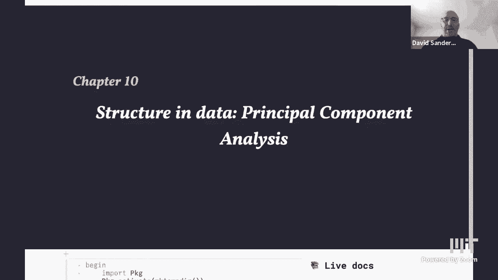
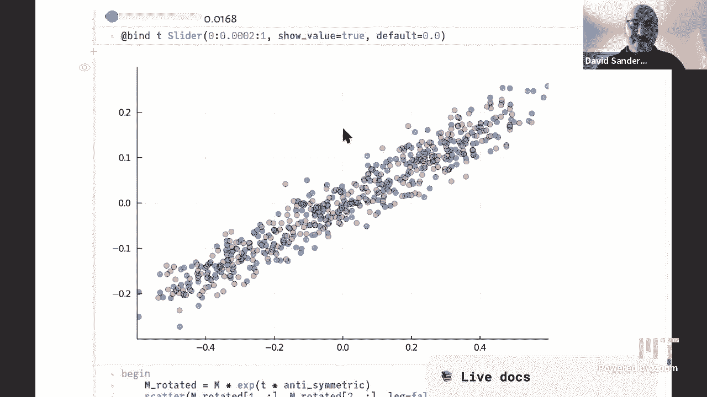

# 【双语字幕+资料下载】MIT 18.S191 ｜ 计算机思维导论-Julia(2021最新·完整版) - P8：L8- 主成分分析 - ShowMeAI - BV19g411G7ab

uh so yeah we were talking about images，and how we can interpret images as data。

and um now we're going to be，transitioning towards the second module，which is going to be about。

sort of data but viewed from the point，of view of more of statistics and，probability and this is。

kind of a nice bridge topic between，those two where we'll，look at a matrix as data and or data as。

a matrix and try and analyze it with，some of the tools to do with。

transformations that we've already seen，so let's just recall what we were doing。

we want so we want to understand some，some data in some way and um so we're。

looking at this this kind of，this kind of matrix and you'll be，looking at this in the homework uh as。

well，which i think is uh going to be released，very very shortly。

so we were looking at outer products and，what is an outer product again。

it's just a multiplication table so we，have，on you know if we look at the first，column uh we have。

the numbers from one to ten and then in，the second column we have。

two times that same first column and in，same，first column so basically that we have。

the same information if you like，in each column of the matrix and if and，similarly。

if you look at each row we have the same，information just each，each row is just a multiple of the。

previous row and those multiples，can of course just be real numbers they，don't have to be integers。

so this is what we call um you know uh，this is，basically what we're going to call a，rank one matrix。

so rank one matrix is just what we mean，by that is，we basically just have one vector worth。

of information，uh in in the matrix so uh you know，we just have the same column repeated。

each each time basically，but we actually have two vectors，involved。

one which is you know this the column，and then one which are the sort of this。

other vector which tells us how，what the multiple of that first column，is in each。

other column so we need two vectors to，store a rank one matrix。

and then the the matrix will actually be，produced as this just。

taking products of each element of each，of the two vectors，and so in the homework you're actually。

going to make a new julia type，which does this so you inside your，object you will store。

only two vectors but then when you index，into this object it will behave like a。

matrix so it's another example of an，abstract array，it's an object which you know looks to，the user。

like an array in this case like a matrix，since you know，this was this is similar to the one hot。

vector that alan was talking about last，time，uh that that was an object that stored，vector。

when you index into it and here we have，an object that，only stores two vectors and looks like a。

matrix when you index into it，so it's a very good example where you。

know there are no zeros in this matrix，so it's not you know a diagonal matrix。

it's not sparse it's not any of the，um maybe more usual kinds of things that。

people think about when they，think about a matrix with structure but，it definitely，that。

we only need a small amount of，information to actually reproduce the，entire object。

right okay and so yeah so，we're calling this a rank one matrix，because it basically just has。

one column that's that's，that's where the one comes from even，though we actually need two。

vectors to store it and so um，i showed these last time these are。

examples your visual examples of that so，of，you know sort of low rank structure so，in other words。

so for example uh rank two matrix will，be a sum of two of these things。

and uh we always get these checkerboard，kind of，of patterns when we look at rank one，just。

remember what that looks like here，sort of，checkerboard because you know again in。

each column we have each column looks，the same，but it's scaled by some number and so。

if we draw that with colors you will get，some kind of repeating。

colored pattern and the colors change，according to the intensity of you know，column。

okay and then when we start adding，another one on top so we start with。

one rank one matrix and then we add，another rank one matrix on top of that。

we get something like this and we can，see that that checkerboard pattern，starts to disappear。

and at the end of last lecture alan was，showing you know that。

there's this tool which we'll come back，to later the in in the lecture the svd。

and a tool from from linear algebra and，numerical in the algebra，which actually enables us to take a。

matrix and decompose it into，basically a sum of rank one matrices。

and so in and so that's enabling us，basically to sort of，extract you know given a matrix to get。

back to，one，one interpretation of the word structure，in that matrix and then we we started to。

add noise and see what，what that did and so now then we we，started to do this transition towards。

away from images and towards data，so we're going to take uh what we did，last time again。

the end was to take rows of the image，and think of it，think of those as coordinates of some。

data right so we'll just，um you know take to take some sub-piece，of the image。

and just look at the numbers that，and then we'll just take the first row。

of the image as x coordinates and the，second row of the image as y。

coordinates and we'll plot those on a，normal，kind of，graph right so again what what are we。

visualizing here，so i'm plotting you know each of these，points is a column，of this two two row image。

right so each column has two data points，in it，an x coordinate and a y coordinate。

upstairs and downstairs，so the the first row is the the x，coordinates the second row the y。

coordinates and i'm just going to plot，those，as x y pairs on my graph so that's what。

these points are，and the red points are for the first，version，where we just took a single rank one。

matrix a single multiplication table，and the second version is where we took。

that same matrix and then added just，added noise to each element separately。

so noise just means a random number you，know distributed，in some way we took a normal。

distribution and i think，i don't remember and um yeah with mean，zero basically and so。

the points get scattered sort of scatter，away from the line，but it's clear that they're close to the。

this，new matrix as just some data that，somebody gave you，and you want to understand that data。

then the first thing you will do is，probably plot the data，and you'll see you know this the blue。

curve right so if i，remove for a moment this red red one，so somebody gives you this data and you。

you plot it and you look at it and，you'll probably say oh that looks like。

it basically lies along a straight line，and you know you would like to find。

which straight line it is，and um you know get some estimate of how。

far away from the straight line you，might be，so that's what we're going to do right，now so。

let's suppose we don't know that this，data comes from this underlying straight，line with noise。

and we want to actually reconstruct that，and that's that's the idea and so of。

course this is the whole subject of，statistics，and these days machine learning um。

which is sort of the same as statistics，that's a big debate so so we want to，sort of。

find you know what is the best straight，line，in some sense that fits this data。

and then how far away does this，does the cloud of data you know go away，from the straight line，first。

uh reaction might be oh well i've heard，of this least squares。

uh fitting procedure where you you sort，of try a straight line，and you drop perpend uh you drop down。

uh you measure the distance of each you，know say i，i choose some straight line and then i。

measure the distance of each point from，the straight line vertically。

in a vertical direction that's important，that's that's，least squares fitting and then i take。

the sum of all of those and i try to，minimize，the sum of the squares sorry of all of。

those distances the vertical distances，to the straight line，so i basically have two parameters of my。

straight line an intercept and a slope，and i can i should have actually done，this animation sorry。

and uh you know exercise try and do the，animation，it's pretty neat to see and。

uh so as you're you're changing these，two parameters the intercept and the，slope。

of this straight line this sum of，squares of these things will actually。

be changing and you're trying to find，the the value of the intercept in the。

slope so two parameters which minimizes，this sum，that's one way you could do it that's。

not what we're going to do right now，we're going to do something slightly。

different which is to try and minimize，the square distances when you take。

perpendicular distances from the，straight line instead of，the dropping the the straight line。

vertically，okay so it's a it's a different idea，and it's um how it generalizes。

nicely okay so so let's just think uh，let's go back to this uh。

add back this straight line so why did，we get a straight line here。

let's just think about that a bit more，carefully，so this straight line in red in the red，squares。

is the original image so basically if i，have，i'm saying that if i have a column in。

the original image here，let's say it's basically 0。5 comma 0。2，and another one here that's basically。

0。25 comma 0。1，well the fact that they lie almost same，straight line through the origin。

as actually the same as saying that you，know，y divided by x is the same number a，constant。

and so all of these have the same，you know value of y divided by x because。

each of them is a multiple of the others，right so，mathematically you just have if you have。

two columns x 1 y 1 and x 2 y 2，and you know x 2 is some constant times。

x1 and y2 is some constant times y1，of course if you now divide x2 y2 by x2。

then it's the same as y1 by x，divided by x1 and so they lie on the，same straight line with with this。

particular slope，okay so how can we actually，you know go think about this cloud of。

blue points and we want to measure，its size somehow basically right so。

so how how could we uh so let me remove，how could you how could we actually。

measure the size of this object so the，first thing you could think of doing。

might be to take this cloud and just，sort of say oh what is its width so。

that's the first thing we would like to，measure，the width of the cloud and so we're just。

going to sort of ignore how tall it is，for the moment，to start with and just calculate its。

width so what would be a natural way to，do that oh well you just find the。

maximum value here and the minimum value，here，and um that so you're subtracting when。

that gives you the width of this cloud，but that's uh actually not such a good，idea why。

because there might be a point sort of，way over uh you know at 100。

000 that suddenly somehow got into your，data for some，for some reason so we call that an，outlier。

that sort of isn't really doesn't really，belong to the data there was some，trans。

you know error in transmission of the，data or something and，or it might even be a valid a real a。

real data point actually，but uh it's sort of away from the the。

main bulk of the data and so we want to，exclude that or we want to sort of，temper we want to。

weight the influence how influential，that point is in our in our measurement，of how big the data is。

so we're actually going to want to use a，statistical technique instead of just，taking this maximum。

minimum so basically we want some kind，of average，measure of how far away these data。

points are from from，uh from you know the center so the first，thing we。

we're going to do is just find where is，the center of this cloud。

in other words the mean and so that's，just and that's another statistical。

measure so let's just sort of take the，sum of all of the data and divide by the。

number of data points，and so um there is a function mean in，julia。

to do that of course you can easily，define your own and in fact you did in。

the first problem set um so this，function mean comes from the statistics。

standard library which we imported at，the start，hi alan so，so what's the first thing we're going to。

do just subtract the mean from each data，this，point wise minus so uh you know we have。

x's and y's are these separate vectors，of data and we'll just take，the mean off each of those。

and then uh so we just get the same，clout when we plot that we get the same。

cloud but now centered around zero zero，and now we can now we're in position。

where we can do this calculation of the，width，so what would a natural way to do that，be uh，need。

some kind of average again so if i just，take the average of this new。

center data if i just take the standard，mean i'll just get zero because i。

just you know the mean of something，minus its mean is zero，so i i have to do something a bit more。

clever a bit more uh，interesting so what so we're thinking of。

the width so what we're really doing is，taking all of this data and projecting，it down。

perpendicular to this x-axis，in other words the line y equals zero so。

here are the perpendicular projections，in these dotted lines，and then we get this new cloud of data。

which is just the x-coordinates which，just lies along the x-axis。

so we want you know basically to measure，sort of how wide is that，in a statistical sense and so the。

problem is we have these，negative values and positive values and。

when we take the mean they cancel each，other out，and so uh but if you think about the you。

know the words，what would you really like to find you，would like to find something like the，mean。

distance from the origin and so distance，we usually think of as a positive number。

so these negative numbers over here we，need to convert into positive numbers。

a quick question yeah of course so so if，i look at the，x-axis there are some some of these。

orange circles look darker i guess，that's because there are a lot more。

points kind of right above yeah that's a，great question yeah so uh we're using。

transparency so each of these orange，points is is actually，this very faint orange color and then。

when several of those accumulate，on the same place they they overlap and。

you get a darker orange color so yeah，now the the amount of darkness is sort。

of how many points so if you can，if you look here for example there's，because。

many many points are accumulating with，roughly the same value of。

x and they're just being superposed uh，down here yeah so you get to get a，darker color so that's。

that's some kind of measure it's like a，sort of kind of his kind of histogram of。

how many points are actually at that，value of x，yeah so that we have to take that into。

account when we，calculate this average uh just another，quick question dave。

um in in the code here i see，where x x and and y，y got defined but i don't see where xs。

okay uh that's right here you say oh，there it is，okay very good so i just took this。

point we have a feature request to pluto，that you can like，highlight a variable and see where it's。

defined you know move to that place，so for example if you if you if i'm down。

here and i and i see xs i should be able，to sort of click on it and then do，something and。

and jump to where it's defined that，would be nice great，does that answer your question yes thank。

you okay，so yeah so okay we want to find some，yeah i was saying we want the。

the average distance from the origin so，one way we could do that is to literally。

take the distance what is the distance，is just the absolute value。

of you know the data point minus zero in，this case，and so it's just the same as taking the。

absolute value of all of the x's，once i've centered them and then，calculating the mean。

and that gives me 0。25 let's say，and that's roughly here and indeed if，you think about it。

basically the data set is sort of，symmetrical it's not actually，symmetrical。

uh about the you know when it's not，quite rotationally symmetric。

but if you rotate it at 180 degrees it，almost，basically lies back on itself and so we。

basically have some kind of symmetry and，um so if you basically if you sort of，take these values。

and just reflect them over this y-axis，and land them back on here then um。

you get a cloud of just positive numbers，we can actually draw that so uh。

so i'm just going to take the absolute，value of each of them again using this。

and that is what the cloud looks like，once i've folded it over，onto itself and let me even use a。

a bit more，carefully clearly，so i don't know if you can see that。

there's a cloud of blue points and again，some of them are darker and now we want，to find the average。

of those at those distances and it gave，me 0。25 which is somewhere like here and。

that indeed is sort of halfway along，this data set can you，can you do what can i ask you what you。

asked me last week can you histogram，these，great ideas yeah so basically i mean。

what i'm hearing you say is you've got，some data which in absolute value is，between zero and a half。

roughly and you're telling me that it's，kind of like a quarter，um which might be true if it was。

uniformly distributed，yeah so that's between that's that's，value。

so let me take the absolute value as，and yeah so it's uh quite unevenly，distributed if you like。

i don't know if you smoothed it out it，might be even，humans actually have a pretty bad。

intuition about what random，means and so this is actually a pretty，random uniform distribution maybe。

well maybe not so uniform yeah there's，not of course there's not so many at the，edge。

but apart from that it's maybe uniform，it's so，we'll be discussing this more in detail。

what uniform means uh maybe next，lecture yeah great idea，we can do the same with y of course and。

we should probably expect something，similar and again，at the edge right so this is now i've。

taken the absolute value so this is both，edges actually，and we see that there's definitely fewer。

values at right at the edge，yeah okay so maybe it's not uniform，anyway it also depends how exactly i。

okay so this is just a measure of how，many of the points fell，in each of these bins in each of these。

boxes so between 0。1 and 0。0。1 and 0。15 uh，0。12 or something uh how many。

points have x coordinate in that range，that's what i'm drawing here that's this，number。

the height of the bar so，so that's one way we just take the，absolute value of these um。

distances that that's actually not the，way that we usually do it we usually。

take the absolute value i take take a，different measure of distance which is。

this root mean square distance，called the standard deviation which i'm，sure many people have。

heard about so we literally take these，these values and square them first and。

then take the mean of that，and so again um we can we can，actually draw that there's something。

that people do not usually do，but you could do a histogram of the。

squares and that looks something like，this，so that has a very different kind of。

shape it's definitely not uniform，and um i don't know is that some。

some known that's probably some known，like a chi-squared distribution i don't。

know we'll have to think about what that，is，now we're going to take the mean of that。

so what why did we why do we square，these numbers，well um basically it's a way of sort of。

giving i was going to say giving less，weight to the larger values but actually。

maybe it's giving is giving more weight，anyway it's just a different way of。

basically we're giving weight to how far，things are away from，from the origin and actually yeah the。

one that the data points with larger，values，are get getting more weight than they。

did before because well，uh okay the values here are uh less than，one。

that's confusing i guess if they're less，it's not clear to me what happens。

and then okay anyway so that that gives，us what the the something called the。

variance this mean of the，uh of the squares of the data once we've，centered them around zero。

and then we take the square root and，which is usually called sigma and so um。

here i've drawn the same data again and，i've calculated the sigma x and sigma y。

um lines at sigma x and sigma y，so currently these lines are two sigma x，and two sigma y。

and we see that that basically encloses，almost all of the data there are some。

data points that sort of stick out，that are slightly beyond two sigma x or，two sigma y。

but base uh so usually if if the data，has a sort of some in some sense a，about。

95 percent of the data to be within a，distance two sigma，of the mean uh on either side。

david can i imagine that i'm in a class，and i have a，some kind of score on two exams。

right where it looks like on the first，exam my score，could never been better than like 60 out，of 100。

and uh on my the second exam the top，student only got like 21。

maybe is that um and so what you plot is，your score on the two exams and you're，saying that。

um all the students are pretty much all，inside this box，because the professor always gives you。

the standard deviation i mean that's you，because the what did you say the perfect。

you always every every student，is familiar with getting you know the。

standard deviation of the variance for，for exams，you，usually just talk about those okay sure。

i don't know i don't know whether people，know that，you know it's a standard thing to tell。

people in the class you know what the，scores are and what the。

what what what the standard distribution，is，but so yeah so if you just do the。

standard you know one standard deviation，instead of two then，you'll only expect something like。

seventy percent of the data，people to be less than one standard，deviation away from the mean。

and so the sort of good students will be，between one and two standard deviations，away basically。

okay so but if we yeah if we look at，this box you know so far we've。

calculated these two numbers which are，the widths，the width and the height of this data in。

some sense but it's clear that we have，not captured，all of the information about the data。

because you know we don't，we these numbers don't tell us how this，data is arranged。

inside this box it could be going from，the up you know，the top left corner down to the bottom。

right and that would mean，something very different about how these。

two tests that alan was talking about，are related，so here you can see that uh you know if。

you did well on one test you pretty much，did well on the other test but。

um if the data were the other way around，it would be the opposite you if you did。

well on the theoretical test you did，versa，maybe which was my case uh，track。

those that relation or so we call that，correlation，but it's basically yeah is there a。

relationship between the data，do it if i know that x is big do i know。

that y is big or maybe i know that y is，small if x is big，so how can we actually grab that。

information from the data，so it's clear that we just calculating，these two widths that we did so far。

is not enough so what can we do instead，well we somehow want to，sort of rotate our point of view。

and line up our point of view with the，data somehow，of course，there are standard ways to do this in。

statistics，but um you know it's uh but we're trying，to understand from a computational point。

of view what would you want to do and，then how does that relate to what you，would do in statistics。

so you know one idea would be literally，let's rotate our axes。

so that's the first thing we want to do，let's try rotating our axes。

so somewhere there's a plot where，and uh let's start off aligned with the，data，be。

a new axis so i'm literally sort of，rotating my head and lining this arrow，up。

along what seems to be the direction of，biggest，you know growth the biggest extent of，the data sorry。

and as i then rotate around this axis，and so again i'm now projecting the data，this。

arrow or perpendicular to this new axis，so this is，and as i you know rotate round so i'm，also。

again showing the projection of each，point on this new axis，and as we rotate round you can see that。

the projection，changes how wide it is so basically what，i want to do is measure。

how wide that projection is and now we，know how to measure you know width of。

projection we're just going to measure，the standard deviation but in that。

direction so that's one way we could，look at it we're rotating an axis but，the other way。

an alternative way is equivalent is，instead of rotating the axis let's，rotate the data。

so here's the same picture but now i'm，rotating the data，so i'm sort of fixing the horizontal。

x-axis now，as what was the red arrow above，and the data is rotating is that it's，basically the same。

but maybe it's easier to see uh in in，this case and it's certainly easier to，calculate。

so again you know the same picture but，as i rotate the date around。

we you know measure the width just in，the x direction now，in this in this point of view or along。

the arrow in the other point of view，and uh we want to know well how does，that width change。

as the angle changes，and the r so so we can plot that curve，and and here it is。

so this is the variance in direction，theta and you can see it's some kind of，sine。

sine wave uh or or something like that，sinusoidal，as a function of the angle theta in。

degrees around the circle，so in particular there are two，directions where we get the biggest。

variance which is when the arrow is，pointing along this sort of long axis of，the data。

and there are two directions where we，get the smallest when it's pointing。

around basically perpendicular to，that long direction so what we need are，actually to just。

extract these values of theta where it，takes a maximum value and a minimum，value。

and so one way of doing that a，computational you know，thinking kind of way of doing that would。

be literally oh well i just calculate，all this data，now i literally you know just find the。

one which is the max，find the two values which are the，maximum and find the two values which。

are the minimum，and so when you do that so this is what，i've done here so there's this arg max。

function，in julia which uh calculates sorry，which tells me which is the maximum。

which which value in the array gives me，the maximum value，of yeah sorry i'm trying to i'm not。

finding the maximum value，uh yet i'm finding which，uh you know which position in the array。

gives me the maximum value，right so here i've calculated the，variance in each direction and i'm。

calculating，which one is the maximum then i'm taking，that，i'm，taking the variance at that point and。

that because i need both of those pieces，of information to to draw this point on。

this graph right which feature，where i am in in theta and what is the，value there。

so some of the folks in the audience may，have heard，of probably have heard of of。

fitting a line of the least squares line，that，oh sorry then i missed that okay and。

you're right this this is not these，squares right，this is something different right。

because did you mention because we have，errors in x and y，i didn't actually know yeah so the the。

key difference is least squares is，gimmicked up，for when you have no error in the x，direction and。

only one you know every everything x is，considered fixed like，like you know maybe prime or something。

where you know exactly what time it is，um but principal components is what you，do when。

both there are errors in x and in y so，our uncertainties i should say in x。

and y and it's a very commonly used，method these days，yes good point yeah so uh so here i've。

you know again same data set it's always，the same data set and then。

uh well i've literally taken you know，vectors at these directions and um。

at these directions that i just，calculated numerically just by taking，this maximum。

and i'm just plotting uh vectors，in those directions of in those values。

you know those directions theta，and these lengths are the the the size。

that we calculated in each of those，directions i think，or is it two times that yeah two times。

so again it's two sigma in each of those，directions so we have kind of solved the，problem，as in。

which is the which are the important，directions which is the maximum which is。

the minimum and how big，is the data set in those directions you，know in a，so。

another way of visualizing that is，actually to put this ellipse on top of，the data。

so basically what we did is calculate，the semi-major axis，length of the ellipse and the semi-minor。

axis length of the ellipse，and then uh literally draw an ellipse，with those semi-major axes and that。

particular rotation angle，and then we see that basically what we，have done is。

in some sense although alan doesn't like，this interpretation we have，fitted an ellipse to that data。

you know except that we haven't because，what does it，actually mean to fit an ellipse to the。

data it's it's not too clear，and so that's you know there are better，have。

is some kind of two-dimensional，bell-shaped curve normal distribution。

and we're fitting that to the data，i'll accept the fact that that ellipse。

seems to capture most of the blue dots，it's good，yeah so um，so yeah we've done this in a pretty。

numerically intensive way where we sort，of rotated this thing around and we，calculated。

all the values and then we took the，maximum is there a better way to do this。

and so the answer is yes there is um，fortunately，so um that is you know um。

so this is the idea you know the，intuitive idea but behind this method。

principal component analysis so what，does why is it called that because。

you can think of this sort of uh this，direction that i drew here。

that is the principal component the the，longest direction，what does that mean it means if i know。

you know if we sort of change，coordinates if we rotate round，and we and you tell me how far you are。

along this direction，i basically know everything i need to，know about the data point。

not quite because there's this sort of，error in the other direction or there's。

this width of the distribution in the，other direction but basically i know，everything i want to know。

uh i distinguish the data best by，moving along this direction if you just。

tell me where you are in this other，perpendicular direction i i，know almost nothing about where you。

actually lie on this two dimensional，plane，but if i know the x value sorry not the。

x value that the value along this，direction this，this long direction then i know almost，plane。

so if i might explain sorry if i might，provide an interpretation with the two，test scores。

if i know where i am along the principle，component that is the long red arrow。

then you know i think i kind of know my，standing in the class right that。

if there was one number that kind of，captures the two exams，it would be sort of the distance you。

know along that line，right and then you could ask what is，this perpendicular distance then。

that's the detail of you know how did i，do on my first or second test relative，to each other。

maybe less important it's it's arguably，right that，the principal component is is probably，the big。

is the long red arrow and that tells me，how i'm doing in the tab in the in the，class。

yeah great great interpretation thanks，okay so how can we actually uh calculate，this。

in in some other way okay before we do，that so let's let's think about what。

happens in higher dimensions，uh so so far we've just been working in。

two dimensions we have had data that，lives in two dimensions what about if。

the data lives in three dimensions，uh then uh sorry i've，got things out of order oh maybe i just。

deleted the，uh i had a visualization of what these，rank one matrices。

look like in one and two dimensions that，seems to have disappeared sorry about，that。

okay so well so the answer is that a，rank one matrix in，three dimensions so again where we have。

you know the same，effectively the same column now，three-dimensional column。

uh repeated in my matrix a lot of times，with different multiples。

when i plot that in three dimensions all，the points will lie along。

again align a single straight line but，now in three dimensions that passes。

through the origin in some direction，and if i add noise then i'll get some，kind of cylinder。

that surrounds that that line with some，you know points distributed inside the，cylinder。

whereas if i take a rank two matrix then，what i basically have is some。

rank one matrix pointing in one，direction and some rank two rank one，matrix pointing。

in another direction and when i add all，the combinations of，all the points along each of those lines。

i'll get the plane，that contains the two lines and then，of fat，plane thick plane，[Music]。

and that was a nice visualization of，that that got，somehow disappeared sorry okay，so yeah so what is。

the singular value decomposition so that，is the mathematical，or numerical technique algorithm that。

enables us to actually，calculate um all this whole，you know this whole information that we。

just just did of spanning all of these，angles in two dimensions and，to work out which the important。

directions are，so the singular value decomposition，enables us to write any matrix。

in terms of simple matrices，simple you know simpler kinds of，matrices。

and um if we think about linear，transformations we know that any matrix。

corresponds to a linear transformation，then what it says is that a linear，transformation any。

arbitrary linear transformation can be，written can be decomposed as，first do a rotation then stretch。

then do another rotation it's pretty，surprising that，you know oh and i guess there might be。

reflections as well sorry，what i where i said rotation it's，actually rotation or。

so um so if we think about writing that，in matrix language，if we have a matrix m then it's possible。

to find，three matrices u sigma and v such that，when we multiply those matrices together。

which corresponds to this composition，of transformations we get back the。

original matrix and these matrices，are have a particular structure。

u and v are both orthogonal matrices，which means they are rotations or。

or and or reflections and sigma is a，diagonal matrix，with just numbers just down the diagonal。

which are，called the singular values which which，are the stretch factors。

and the way i like to describe this，thing for two-dimensional data。

uh i'd like to point out that you've，already seen this if you if you remember。

back when i was doing various，transformations of images，um you know i was having a lot of fun。

right you remember all the，i was doing warps and i was doing uh，prospective projections。

but two of the simpler things that i did，if you recall was i defined the rotation。

and i also defined that x and y scaling，right and so，what this says is that that。

every every image every picture of，corgis if you will，or any other picture for that matter can。

be written as，um as remember remember the compose，symbol with the little。

circle it could be the composition of，rotation，stretching and rotation um we could have。

shown it to you in that in that notebook，right there，yeah we probably should have but um what。

i'm doing now is taking，um this particular matrix two one one，the famous matrix in context of。

dynamical systems，of，you know as i just said of the rotation，the stretch and the rotation。

and uh so i'm actually uh，so what what what does the rotation，matrices。

look like in two dimensions it's just，cause of some angle theta。

um and then sine of angle of the same，angle，minus sine of theta and cos of theta。

that's what it the rotation looks like，and the stretch，looks like uh sort of。

so this is this is what we're actually，visualizing uh，right right here so i'm starting with。

these points in the unit disk，so firstly we need to know how to sample。

point randomly inside a unit disk，so one way to do that one way to do that。

would be to use polar polar coordinates，where you say oh i need a radius between，zero and one。

and an angle between zero zero and two，pi and，this，uh we're gonna talk about random。

sampling so this is maybe a good moment，to point out，that um yeah what happens if we actually。

do that so let's say row，uh sort of let's say radii rs，are going to be random points between 0，and 1。

and i'm going to take sort of capital n，let's say a thousand and then thetas。

are going to be random angles between，zero and two pi so i'm going to generate，n random numbers。

between zero and one so uh rand，generates we've seen this already random。

uniform random numbers between zero and，one，real numbers floating point numbers and。

then we need to multiply this by two pi，point uh element wise to get angles，between zero and two pi。

and uh so is it going to work do i have，i've already used the word fetus let's，call it theta。

uh fetus in words okay，and now we want to uh take r，oh it's not so easy as i thought it's uh。

going to be，rs number i times，you could go r dot times cosine dot of，thetas and r s dot times，times。

cosine of thetas and rs，dot times sine of theta you have to you，have to go cosine dot。

thanks cosine dot sine dot and now i，want to plot this，so i'm just gonna scatter these。

positions and again i need a ratio，equals one and i what i should see。

is that effect yes that's all i was，let's generate more points。

okay so hopefully you can see that there，are sort of，it's denser in the middle and less dense。

around the edge，so if we did a histogram of how many，points have，given radius that's easy to do now。

because i have the radii，[Music]，uh we'll see that there are actually，more points oh。

no no the uniform it's a two-dimensional，phenomenon，yeah that's not what i wanted to do，right。

yes if you actually if you plotted the x，coordinates or something it's。

or i don't know but we all see we all，see that it's，yeah that's a good idea that's probably。

x coordinates yeah，even that's not a perfect thing to do，but anyway we all see that it's darker。

in the middle that，you just can't take a random，radius and a random angle and expect to，get。

it even in the disc，yeah and that that's the same you know，if you want to to generate um。

yeah there we go nice uh if we want to，generate，random points for example uniformly。

distributed on the surface of a sphere，it's actually，you know more complicated than you think。

you might think you you generate random，angles theta and phi with spherical，coordinates uh。

circle polars but that's not actually，right if you see random latitudes and。

longitudes everybody would be on the，market south pole or something。

right yeah okay so that's not what we do，so what we actually do is generate。

points uniformly in a box from minus one，to one，that surrounds the disk and then we。

reject those that lie，outside the disk so that's called，rejection sampling。

and it's useful for to produce these，kind of weird，you know sampling sample from weird，weird shapes。

so that's what i've done so i generated，these points in the unit disk。

and then um so let's start yeah，and so now now what we're going to do is。

we're going to work up to that，transformation 2 1 1 1，uh bit by bit and so i've got this。

slider which is，starting at the identity transform and，ending at this two one one one。

and we'll and as as we move the slider，this，is a bit slow but uh this this circle，sort of。

you know in in on the left i'm just，looking at the stretch component of this，transformation and。

on the right i'm stretching it and，rotating it in other words i'm applying。

this transformation that the matrix m，basically to all the points to each，point in the unit。

so as alan said you know we could of，course do this with corgis。

and that would be nice but um i think，it's also nice to to not have the corgis，in the way。

and just i think i'd have corgis in the，okay so you know we're getting this kind。

of picture of saturn，um on one plane and then this is，actually what saturn looks like。

you know rotated when you look at it，uh yeah so so so how am i calculating。

these stretch factors right so you can，see that，the the the effect of applying the whole，matrix is。

you know visually it's clear that it is，i'm stretching，the y-coordinate by this particular。

factor and the x coordinate by that，other factor i'm squashing the x sorry。

the other way around i'm stretching x，i'm squashing y，and then i'm taking the result and i'm。

rotating it，uh and that gives me the effect of the，full transformation。

so how am i calculating those stretch，factors that is what this。

um you know that's what we did before by，scanning all the directions and choosing，the maximum one。

and the minimum one but now i'm doing it，using this um，this uh of this algorithm called the。

singular value decomposition so i'm，literally taking the singular value。

decomposition of this matrix and that，gives me back three matrices so let's，look at those matrices。

so i've got my matrix two one one one，i'm taking the svd of it，and i forgot and。

uh so what it returns are three things，the the u factor，which is this two by two matrix the set。

a vector of two uh singular values，this，these，two matrices in this particular case i。

chose a symmetric matrix maybe，that wasn't the best idea let's you know，matrix。

whatever and um so these are actually，the the columns of this u matrix are。

pointing in the directions，of this this maximum and minimum，stretching uh factors。

so if i might just sort of interject，just a little i mean i don't you know。

so some of you may have taken a linear，algebra class maybe yes maybe no or，maybe you will someday。

and you might hear about the singular，value decomposition and。

you'll hear about it being connected to，these scary things called eigenvalues。

they're probably not that scary，but um the in a way you know when，when we think about computational。

thinking i think it's more interesting，to just sort of see what this svd thing。

does i mean it's kind of nice to drill，all and，you know you can get that in a linear。

algebra class but really，i think when you just experiment with，the computer and you see that。

that uh you know a circle is becoming an，ellipse and and，you know there's there's two stretch。

factors you know one in one direction，one in the other right if you。

if you look at the ellipse that's on the，right you know the saturn on the right。

i mean it's clear that there there's，there's some，there's an ellipse it's specified by by。

the lengths of the axes and the，directions of the axis，and simply put the svd is giving you。

that information right i mean you know，if you take a linear algebra class you。

learn how to calculate you could get an，a on your exam，by you know calculating the eigenvalues。

but you know，you may or may not get the intuition of，the thing but hopefully you will。

but it's the stretching of of the data，in this case that that is completely，captured by the svd and。

that's why it is so critical for for the，statistical approach of principal，components analysis。

yeah thanks yeah because basically the，that's，that's going on that's true and there's。

rotation it's sort of like changing，coordinates，yeah so these singular values are these。

the distances that it got stretched so，here we see 2。6 and 0。38 and。

if we look at this left-hand picture we，see indeed that，this sort of extremum of the ellipse。

landed around 2。6 and this one，landed around 0。4 and so um，this is actually capturing these。

stretching factors，and these uh as i said these columns of，this u matrix。

are giving me the the vectors unit，vectors pointing in the directions。

of the maximum they correspond to those，stretching vectors，so just to finish off the class uh。

so you know this this svd applies to any，matrix and we have a matrix，that is actually in you know 2。

times 300 that's the the size of this，image matrix，if i just look at the matrix it's 2 rows。

and 300 columns and so we can take the，svd of that matrix，and uh so what what is that doing it's。

sort of telling us，how to think of that matrix you know，what is the effect of that matrix is it。

actually in some sense，um we are working in 300 dimensions so，another way of thinking about this。

matrix is that，it's，two points in 300 dimensions and so，that's somehow。

what transpose is doing if we you know，took this matrix and thought of it。

as uh two columns of 300 points，then we're now living in we have two，points in 300 dimensions。

and so what we can do is actually do a，rotation in 300。that's really boggles my mind that like。

that there's like a duality between，know which，i mean it seems like a lot of points but。

i could kind of see it in front of my，eyes，or two points in 300 dimensions which in。

a way sounds simpler like it's only two，points，but you know i can't see it in front of。

my eyes like 300 dimensions who can see，that，right but it's amazing that you can go。

back and forth and，and you know they're both sort of you，know the math doesn't care it's kind of。

the same thing for the math，i just that boggles my mind some of you。

might think about that a little bit，yeah indeed uh，yeah so so what can we do uh so in this。

in the svd we have this other matrix v，that we actually sort of did not capture。

in the pictures that we've just been，looking at，and that's another rotation and um in。

this case it's going to be a rotation in，those 300 dimensions，and so how can we actually what does。

that even mean it it，it sort of literally means you you know，you're in 300 dimensions。

and you'll just sort of rotate your head，a bit，and um uh but you're doing a。

transformation which preserves all the，sort of all the lengths or uh whatever，in 300 dimensions。

and so we can actually generate one of，those things so first we're going to，generate a random matrix。

in 300 dimensions 300 by 300 and then，we're going to make it anti-symmetric。

by remove it by subtracting，the transpose of that matrix and so。

you know that it looks like this and so，we try well so we transpose it so we。

flip x and y in the matrix and then uh，we subtract one from the other and we，see that indeed we get。

zeros all along the diagonal and then，it's antisemetric which means that the，ij。

element is minus the ji element and you，these，elements that you can see and then we。

do something called the matrix，exponential on that uh，on that anti-symmetric matrix and that。

actually gives us，let's see let's see let's rotate it as，the result looks like this so if we，start。

at zero so we have again a sort of a，path of matrices in this space。

i don't know why sometimes it does this，where you you can't actually see the。

strange so here we go so um this is the，same cloud of data yet again 300 points。

in two dimensions but now we're thinking，of it in this three-dimensional 300，dimensional space。

i'm going to rotate around in that space，and see what it looks like。

as i move this slider so we so you can，to，sort of dance around so each。

one moves away from where it originally，was and，it looks kind of like it's some kind of。

rotation but we're actually protecting，sorry i feel like it's celestial like，yeah。

you know yeah rotating around the well，this is sort of yeah like the stars in。

the sky and we're seeing，seeing one of these time-lapse photos，every day as they move around。

but they're moving around you know sort，of each somehow independently。

um and that that's what we're what we're，seeing here somebody's actually a。

you couldn't projection the rotation in，300 dimensions you know you can go and，say oh i just did。

i just saw them so what we're seeing is，you know，somehow a projection from the 300，dimensional space。

down to these two dimensions okay so，um i guess we've run out of time so um。

yeah so from now on we will be talking，more about these random。

how do you generate random objects what，does that mean and how do you analyze um。

randomness using probability theory and，some statistics and，apply that to data analysis okay see you。

