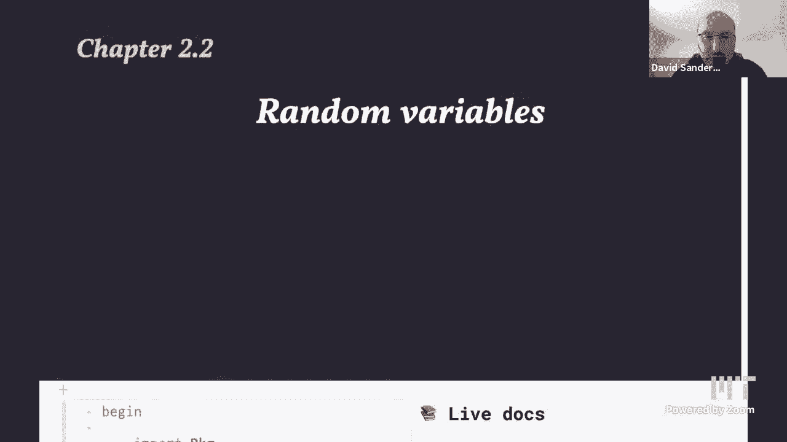

# 【双语字幕+资料下载】MIT 18.S191 ｜ 计算机思维导论-Julia(2021最新·完整版) - P9：L9- 抽样与随机变量 - ShowMeAI - BV19g411G7ab

two random variables okay hi everybody，so welcome back to another lecture in。

this computational thinking course in，spring 2021 semester，and today we are going to start talking。

more in more detail about probability，randomness，um which you can also call stochastic，behavior。

uh so stochastic is just another word，for random basically and so we'll be，talking about。

what what you could call random，variables and i don't know how to get。

rid of those live docs，things right there so，uh so let's start off by looking at a，few of the julia。

uh just summarizing a few of the the the，pieces of julia that we're going to see，today。

there are a couple of functions like sum，and，uh which takes the sum of a collection。

of so so in all of these，um in all of this description capital s，is some collection uh of of data。

which lives for example in an array，because there are various，types of uh types of container object。

that it could live in，so some of s will take the sum literally。

the sum of all of the values contained，in this collection in this。

for example array random s uh we'll do，some kind of，draw something randomly from that，collection。

mean and standard deviation um we'll，calculate those，statistical quantities and so some of。

these functions that we'll look at come，from different packages。

and so we're trying to be more explicit，about which packages，you need to load to get each function。

so for example so when you look when you，load julia，there's a library called base。

automatically loaded so you don't need，to do anything special and all of these。

things will be available but if you need，the mean function for example。

at the moment uh you need to load the，statistics package，and it turns out that that is actually a。

standard library package in julia which，means that it comes pre-loaded with any，julia installation。

so all you need to do to load it is to，using statistics，with a capital s and you know the name。

of the package so，we put using and then the name of the，package to load the package。

and that will bring into scope uh all of，the the names that are exported from，that package and。

mean and std for standard deviation are，two of those function names and then。

there are various other packages that，we're going to use，and so this first uh cell up here is。

actually loading in specifying some，versions，of packages that we need and loading in。

all of the packages that will be used，during the notebook，that's what if you've been wondering。

what this strange syntax is and so，we're working on a better mechanism，first for doing this package。

specification，so uh we're going to use a function，called countmap and that lives in，statsbase。

jl so this is separate from，the statistics package and this is，actually a separate package that does。

not come pre-installed，so you will need to do you know package，add。

stat space so which we did in the cell i，just showed，and then using stat space to load it in。

but anyone using this particular pluto，notebook doesn't have to do。

anything exactly yeah but this pluton，but also，automatically loads all these packages。

for you so we've already used the，plots。jl package a few times today we'll。

look at histograms and bar charts which，um have these functions defined in that，package，the colors。

jl package we've used as well，and we'll be uh looking at，using the distinguishable colors。

function and then um，that's probably all we'll have time for，so let's start off by talking about。

randomness，so uh how can we get random numbers or，random objects in julia。

so by the way uh what does random，actually mean that's a very comp，you know difficult philosophical。

discussion and actually we can't，really generate true randomness in a，computer。

um but there's something that's almost，as good which is sort of。

something that just looks very random，and we won't enter into the details。

right now about how that works，but maybe we can i can't have random。

bugs all the time what do you mean that，so actually one of the rate one of the。

ways of getting randomness on a computer，is actually just to，from the time。

you turn the computer on and all when，exactly all of the key presses。

are happen and that will effectively，generate some randomness for you because。

the next time you turn your computer on，you you won't have the exact exactly the。

same sequence of key presses，at exactly the same moment so you can，actually use that as a source of。

kind of true randomness on a computer，so juliet has sort of abstracted that，all away。

and it just gives us this function，called rand and rand is actually a very。

versatile function so what does it do，so if i give it a collection so for。

here's a collection one colon six we，know that's a range，so that contains in some sense all the。

numbers between the integers between one，and six，so when i do rand of one codon six it，will。

pick one of these at random so one of，the objects in this collection。

will prick at random and return it this，is a strange function from a。

mathematical point of view because i'm，giving it the same input but it gives me。

a different output every time，so actually what's happening is there's。

some other implicit hidden function，which is sort of，some random number generator object and。

that is actually being modified，and so um that's that's hidden from us，so it looks like it's just。

generating random numbers so i'm just，going to run this a few times and you，can see that。

sometimes it spits out the same number，twice in a row and anyway it's giving me。

random numbers between one and six and，um，yeah and so of course i can give just。

some other vector of random numbers like，these few prime numbers here and。

i'll do round of that vector and it just，picks one of these numbers at random one。

of these five numbers and so，you know you can ask well how often。

should i expect it to give me the number，two，and we'll discuss that in a bit what。

other kinds of containers or collections，can i use you can actually use a string。

so here's just a normal julia string，the string mit and when i do round of，that string it just。

treats the string as a collection of，characters and so it just gives me a，random character。

from the string and so note that a，string in julia has these double quotes，a character has。

single quotes and it's a special，different object called char which we've，already seen。

you know we so we've already used this，function you know quite a few times，especially in。

uh the homework on language languages，uh but now we're saying in more detail，so you can also do this。

uh this this cute thing where you can，take the character a，colon the character z so that gives me a。

range so what is this，range，right so the type of this is a so-called，step range。

um where the char inside so characters，inside，and then so that's you know the。

collection of all the characters from，a to z and when i take a random element。

from there it just picks one，you know equally likely and and returns，it。

now what what about if i don't put，anything inside here there's actually a，default，actually。

uh float64 as it's going to take a it's，going to give us a random number。

between zero and one a random real，number or rather a random floating point。

number with 64 bits of precision，so we we uh you'll be working a bit with。

floating point numbers on homework five，and um uh we'll talk about it more later，in the course。

what happens if i take brands without，parentheses，oh yeah great great question so what。

happens if we type rand without，parentheses，well we're referring to a function。

called rand and when i execute that cell，indeed it tells me that oh you know that。

thing that i just asked for is，just the function called rand and it，tells me。

oh look it has 119 methods so，i i'm not sure have we talked about，methods before。

so what is a method it's just a version，of the rand function so，you know this rand that takes in a a。

sequence of characters is a，actually a different version of the，function or a different method。

than the rand that takes in uh you know，some other，object like a string and so there are。

actually all these different versions or，methods of the rand function we can see。

them all with methods of brand，and it just gives me a list of all the。

different ways that i can call rand，and you can go and see exactly you can。

click on one of these and go and see，exactly how it's defined，in the source code which we won't do。

right now，okay so um yeah so rand is a，that's why i say it's very versatile。

these are all the different things that，you can generate，randomness from basically so for example。

here，we took distinguishable colors of three，so what does that do，it's from this colors。

jl package we've，already used it a couple of times it's，just a function。

which returns a vector of this many，colors and uh using some particular。

algorithm to make them distinguishable，maximally distinguishable for a human，being sort of visual。

uh visual mechanism in in our eyes，so if i do this distinguishing colors of。

10 it'll it just literally returns me a，vector of colors right so if i。

do type of this this thing it'll tell me，that it's a vector of。

well i guess i should then just make a，new cell for that，and so now we can choose so since。

there's a vector we can just do the same，as we did before and just choose a，random one of those。

even though these are color objects it，will just return you'll choose one of，these colors at random。

right so that might be something so i'm，just reevaluating the cell running the。

cell with shift enter several times and，i see again it sometimes reproduces the，and。

often gives me a different one of these，three random colors，okay so so far we've only。

generated uh one random object，from a collection how about if i want，you know to generate 10。

random objects from the same collection，i can do that easily，so i could do that just by making a my。

own comprehension，array comprehension like this a random，one column 6 will。

will throw a roll of a six sided die，and then i'm going to repeat it ten，array。

comprehension syntax that we've been，using a lot and that will produce。

an array of ten items and when i rerun，it because rand is generating new，randomness。

every time i'll get a new random vector，but actually um you know the。

people who wrote julia realize that this，is a very common thing to want to do and。

so you can just actually add another，argument，to rand like this so round of one round，of of。

s this collection capital s and then n，this number of elements will actually do，that for me so。

you know i don't have to write this，comprehension myself and actually it's。

even more general than that，you can make uh arrays of random numbers，so here's a random。

matrix of one one through six so again i，give one through six and then i give the，dimensions。

of the array for example 10 12 will make，a random，10 by 12 matrix of you know these dice，rolls。

die rolls and um when i run that again，and again i get a different random。

and of course i can do the same with，colors and so here's a nice color of。

matrix and you can see that you know，sometimes，you get these sort of connected regions。

of colors and sometimes you don't，how so you could uh start to ask，questions like how likely is it。

that i get a region with sort of what is，that six，connected uh cells of the same color for，example。

so you can start to ask questions like，we've been doing in the previous。

few lectures about how you know what is，the histogram what is the distribution。

how many um how likely is it that like，you know how，how many clusters of size one do i have。

how many clusters of size two whereby，cluster i mean，these connected um colors and that's。

actually very，uh a super important question for，example in statistical physics。

and percolation problems so for example，you know um，is it possible to get a one single one，the。

whole system from one side to another，that's the key question in，percolation theory and um you can。

investigate those questions numerically，well how how uh，yeah if i make so for example could i。

make yellow be more probable than the，other colors and then how probable。

how likely does it need to be in order，to span to have a cluster that crosses，the whole system。

this is totally relevant to um，virus transmission yes yes，very good point yes so if these are。

people in a，city uh and we're representing the space，you know，uh space inner city then uh and you。

you have connections to your neighbors，because you go and have coffee with them。

or you talk to them over the fence，and you might end up sort of，unfortunately projecting some some。

some droplets from your mouth towards，them then uh you can represent that as。

a connection on this uh on this space，and as charles，says that you know that that that can。

model can a trap can a virus actually，cross the city and so we'll be going，into into that。

subject in much more detail uh later in，the course，and in the context of networks so this。

is basically some kind of network and，you want to know how connected is the，network。

okay and and just for fun we can also，use random images right so，uh here's an image of a us penny。

for some reason the quality of the，picture is less good than it was okay uh。

a us penny has heads and tails just like，any other coin，and um so we just downloaded an image。

and split it into the head piece so that，that image，actually contains both the head and the。

tail when so we，using our image tools that we've looked，at in the first couple of lectures。

we can just split that into two pieces，and call them head and tail。

and then i can make an array of this，head image and the tail，image and i'm just going to sample from。

that and make a 5x5 matrix of of those，images，and this all sort of just works in julia。

um it's pretty it's pretty neat and that，can you know give us a nice intuition。

for sort of randomness，can you execute that line a couple of，times yeah。

exactly so we i don't know i just enjoy，the the movie，sort of，it's as if we're shuffling around。

actually it looks like visually like，we're shuffling around，you know which ones are pennies and。

which ones are heads but actually what，we're doing is sort of。

randomly flipping each one independently，and you know the whether whether this。

particular one comes out，heads or tails next time is independent。

does not depend on what the other values，are in this，simple um way of sampling could we。

point to our sound effects to pluto is，but but you could of course say oh well，i actually want to。

coin，depending on what its neighbors are and，that is again，a very important um kind of uh process。

in many different contexts for example，in statistical physics，here。

what we've been doing is is what's，called uniform sampling so what do we，mean by uniform。

we mean that each possible object that，we're choosing from，has the same probability as as the other。

ones，and what do we mean by sampling we just，mean picking a random object，know。

um we might actually want to pick，different objects more often。

certain objects more often than others，and we'll see how to do that in a minute。

so uh so what do we want to do so we've，we've，we've got our collection of objects and。

we're generating a lot of you know，say let's think about rolling a die we，have six possible values。

six possible outcomes and we want to，know，if we roll the die 100 times how many，outcomes。

um our head are one how many are two et，coin，so we can flip a coin with heads and。

tails uh with the string heads and tails，and we'll take ten，top tosses and um sorry。

i can't put a space there i can put a，space there，and what we're actually doing is uh we。

want to count，how many times each we get heads and how，many times we get tails。

you know so here's the result of tosses，it's just a sequence of a vector。

of a julia vector of strings containing，strings，so it has the string head then head then。

head then tail et cetera，and we want to count just how many times。

does head occur and how many times does，tail occur，so you can probably think of various。

ways to do that counting，but，let's just see that we can actually load。

in a package that does it for us and，gives us a，kind of nice answer which is this count，map function。

um so you know it's called that because，it's counting，and somehow mapping that count over the，data。

and um so i've called the vector of，outputs，this，counting is toss counts and we can see。

what type is it is that outcome it's，actually a new type，called dict for dictionary so if you。

if you're familiar with python for，example you you probably use，dictionaries a lot。

because it's very important uh in in，python but in julia it's，not not so not used so much uh as in。

python but，it's definitely used uh in many，circumstances，so you can see that what is a dictionary。

well it takes some，have，assigned to that label and uh we write，that with this。

arrow which in julia you would actually，write as，equals an equal sign and then a greater。

than sign and so，um you can actually make an object which，is tail。

arrow three and that's actually that，that particular object，is called the type of that object is。

actually called a pair，and so a dictionary contends contains a，sort of you can think of it as。

containing a sequence of pairs，uh and we can ask is，we can ask for um what is the value。

of tail that corresponds to the key tail，inside this dictionary by by indexing as。

if it were an array，string，itself so that's called a key in，computer science。

okay so if so count map is just designed，to return a dictionary work which gives。

us you know the the numbers，of uh value of the number of times that，each of these。

occurs can you can you um，once again just run that a couple of，times。

yeah so uh i'm just going to run that，several times where we're i'm generating。

new data you can see the data up here，and then we're counting it down here。

because we're using pluto everything，just updates when i rerun this。

so you can see that okay so you might，expect to have roughly the same number。

of heads and tails and often we do have，roughly the same number but sometimes。

uh it gets more extreme and you know，again you can ask the question how often。

will you see for example，eight two so we haven't actually seen。

eight two oh there we had we saw a two，how often do we are we now gonna see。

nine one there was a nine one how often，will this eat n zero，which is possible but very unlikely so。

that's the kind of question that we want，to ask，okay and so we can actually calculate。

that probability right this is just the，number，of times so we have if we have the。

number of times that the outcome was，tails is four，then we can call the probability four。

divided by ten，and so that we can calculate that like，this and um。

as i as i was generating the data over，and over again so let's go up to。

now 100 for example and um so，there were 45 tails on this run and the，probability is therefore 0。45。

and so of course and we all know that，you know intuitively that we expect that，as we run。

more and more simulations so if we go up，to sort of 10 000，we expect the probability of getting。

tails，to somehow become closer and closer to，one half，and that seems to be what's happening。

and so again we we，want to ask the question well how far，away from one half，might it be okay。

so so far we've only been doing our，uniform sampling where，all of the options the possible outcomes。

have the same probability or they're，chosen，you know in an equal even way how could。

we do the opposite，how could we actually make it so that i，chose one possible value。

more often than another one so um，so we could literally think of a，physical coin where we tape。

you know some extra piece of lead or，something on one side of the coin so，when i flip it。

it's more likely to land on one side，than another so that's literally what we。

mean by a weighted or biased coin，and you know if you're an unscrupulous，casino you might do that。

um and actually i mean they in roulette，for example，uh you know you would expect all of the。

values all of the positions of the，roulette wheel that it could land on to，be equally likely。

but the casino guarantees that it makes，money on average by，where。

nobody makes money except because so，they're effectively making the game，weighted in their favor。

so we shouldn't you know play roulette，lose，how how can we model that so what we。

want to do is say something like okay，the probability that，i'll get heads i want it to be 0。7 and。

the probability that，i get tails i want to be 1 minus that so，probabilities always have to sum to 1。

because of the way we define them as，just dividing，the number of outcomes by the total。

number of outcomes so when we sum，up all of the possible outcomes and。

divide them by the total number we，should get one，and so um so a simple way to do that。

would be to say oh well，for，on average uh seven，so so basically i assign the outcome you。

know the word head，seven of those，possible uh values that i'm going to，generate。

out of 10 and tails to the other three，so one of the ways，to do that in julia would be like this，so。

defining a function called a simple，weighted coin i'm generating a random。

number random integer between one and，ten，so that's gonna as i said generate you，know unit those。

with uniform probabilities are equally，likely but then i'm saying。

if the outcome is between one and seven，if it's less than or equal to seven。

and i'm going to return the string heads，otherwise i'm going to return the string，tails。

so just a couple of points about julia，here，so we have if else end which i'm not。

sure we've actually seen before，that's how you do an air sort of if then，else in julia so if。

this then do this else otherwise do this，and you could have an。

else if something something as well with，uh，so like that could have else if that's。

actually one single word else if，uh that's another option and then。

otherwise we'll return tails and so you，see that this，if statement is actually going to return。

a value return，either this sort of or has a value，this the statement has a value heads or。

tails so basically all statements in，julia，have a value um and you can use that。

value so i could actually even say，sort of outcome equals and then put the。

if statement here and then，outcome would sort of collect that value，from inside the if statement。

and then i could return outcome like，that，but i haven't done that i've just um。

well let me leave that in and then i'll，make a new cell，so the question is is this um simple way。

to coin two，okay so these are two different versions，i can't have two different。

you know definitions of the same，function in pluto in two different cells。

so that does actually return a value so，what's going on the if statement returns，a value and then。

the function itself returns the last，value that was calculated inside that，function。

so you don't even need this return，statement actually you could just put，outcome。

and it will return that value but i i，find it better，more readable to actually explicitly。

tell it than what i want to return，and by the way um one exception to this。

uh everything has a value is a for loop，the value of a for loop is actually。

nothing right so if i do um，four iron one to ten sort of，um whatever nothing and then i say uh。

result equals that，what is the value of result it's，actually empty。

uh but that's actually you know um，there's a special value in juliet，nothing and。

the value of result is actually that，nothing but that nothing is displayed as，literally empty okay。

no i'm getting nothing from something，okay so um yeah so，that was an example where okay it was。

it was easy to do because we had this，sort of seven tenths you know i could，have written this。

as a fraction actually seven tenths and，three tenths，and so it's it's clear that oh in that。

case i just generate，you know random integers between one and。

whatever the denominator of my fraction，is，uh and then uh it's sort of uh it's，clear。

that uh hopefully that that's that，should be，the correct thing to do but what if i。

have a you know just an arbitrary，real number p between zero and one how，can i generalize this。

and so what we actually want to do is，generate you know some，uniform values that can be anything。

between zero and one，and the way we do that is with this rand，with nothing inside。

that as we saw gives me um you know，rat uniform random numbers real random。

numbers or floating points，random numbers between zero zero and one，and then i just want to check。

when is that actually when is that，output actually below 0。7，and that should occur uh fraction 0。7 a。

proportion 0。7 of the time in other，words with probability 0。7，again。

i should get some trues and some forces，and the num the proportion of crews，should be about，0。

7 and and the point is i can you know，make this um，like um 0。314159。

and then i should get trues and forces，that proportion of the time。

so of course we want to check if that's，actually true，but before we do that um this is called。

a bernoulli trial，with probability p uh after you know，the bernoulli family in the 17th century。

basically were some of the creators of，probability theory，and so uh bernoulli of p is a function。

that i'm going to define，where i pass in the value of p i want，and this is a。

a much shorter version of of the code，that we just had，right so what am i doing here i'm saying。

generate a random，uniform random floating point number，between zero and one check。

and check if it is less than p and as i，showed up，as i showed up here and forgot to，mention just now。

a comparison like less than in julia，also returns a value，so i don't have to check is this equal。

to true it just，sort of is true right and so what i'm，doing here is，this is returning true or false。

and i'm assigning that as the output of，this function，and so if i actually run this function，once。

with some input value like 0。7，it does return true or false when i run，it a few times。

you know it mostly returns true but，sometimes it returns false，so that is a nice short way to write。

that function and you should sort of，you know process process what's going on。

here uh step by step to make sure you，know，so this you know again we've seen this，before i guess but。

it says defining a function with a short，form syntax，where equals defines this function name。

with this input argument to be，the output with output whatever's on the。

right hand side of the equal sign，so here is where we're actually，computing um。

you know using count map to count up how，many times we get false and how many，times we get true。

when we flip it's biased or weighted，coin with probability p，or we do a bernoulli trial with。

probability p a thousand times，and i can you know just in tim to make a，nice slider，so with 0。

7 i get approximately 700 out，of a thousand，being true and let's just run that a few。

times and so we can see that this number，is always hovering，somewhere near 700。

and the other numbers hovering around，300。 if i move that down to 0。23，or let's say 0。

1 you can see that，about 1 10th of the time indeed i get，a true coming out which is what i wanted。

so we we have successfully generated a，non-uniform，thing so what is that thing that we're。

generating it's actually what we call a，random variable which is。

what was the title of the lecture so，what is a random variable it's。

a bit of a bad name in my opinion so you，know random is okay because there's。

something random going on，variable is a bit strange because you。

know it's not really a variable in the，sense of computer science。

it just means an ob a an object a thing，such that it takes on it can actually。

take on different values，uh every time we sort of run an，experiment there's some experiment。

somewhere and we're running it，and there's some output um and that，output。

is this round the value of that output，is one of the possible values of this。

this object called a random variable，and then what we're interested we are。

interested in is the probability，that that random variable object takes，each possible outcome。

and that set of uh correspondences，between the possible value。

possible outcomes and the probability of，those outcomes，is what we'll call the distribution the。

probability distribution of that random，variable，so how can we act so so that all sounds。

very abstract so how can we actually，make it more concrete，well we can visualize it of course。

that's always，what we want to do you know just been，playing with all these numbers they。

don't make much sense，we actually want to see something so how，can we do that。

we'll use um both bar charts and，so we want to count we've been counting，how many。

is there a comment so we've been，counting how many times，things have occurred so let's actually。

try and visualize that，as i just said so let's roll a die to，start with so。

a normal fair die so it will generate，uniform，random outcomes between 1 and 6 integers。

between 1 and 6，100 times and so，by the way excuse me if we don't know，about the function count map。

how can we actually count up do these do，these counts by hand，well we we can literally just you know。

write some little uh piece of julia code，so here's，an example of one of those pieces of，count。

that uh we forgot to add to the list of，functions that we're using。

uh what does counts do it actually takes，in a vector of boolean，values trues and falses。

so um let's look at that so what are we，doing here so，want to，check if two things are equal in julia。

you do equals equals，so double equal sign and then the dot uh。

i guess we've mentioned a few times does，something called broadcasting so we're，doing。

element-wise comparison so we're，comparing each element of，this output vector roles with one and。

when we do that，we get a vector of trues and falses，so it's the first one equal to one no is。

the second one equal to one no up，uh et cetera so we get falses until this。

one here and then we get a true，and now we're just going to count how。

many of those are actually true，that's what this count function does。

so you could also use sum actually when，i do some i get the same answer but it's，just sort of。

conceptually nicer to do count，uh it counts how many of them，are equal to one and so that's what。

we've done here we've done，that for each i in one to six and put，that in an array comprehension。

and so we get out all of the counts but，if you think about it from a point of。

view of computer science，if you have a very big vector um，of data you know maybe 100 million maybe。

it doesn't fit on your disk，uh you know maybe actually 100 million。

is pretty small these days maybe uh，100 you know 1000 million 100 billion uh，bits of。

data that's pretty normal size for you，know for example click data from。

uh big websites you could have a hundred，million clicks a week or a day even。

maybe um sorry billion i mean，and so you want to go through and see。

well how many people clicked on this，element of the website how many people，clicked on that element。

so you literally want to do this count，uh but，what we're doing is very inefficient。

actually because we're looping through，the the whole data set，and just picking out the ones and then。

storing that number and then we're，looping through again，and storing just the twos and then again。

and storing just the threes，and so you know um the computer，scientists on the。

on the call will think that's a terrible，idea and we should just be looping。

through the algorithm a single time，sorry the data a single time and at。

each time we see a value we should store，that in the appropriate place。

and so of course that would be a more um，a better algorithm and that's what count，map actually does。

so you should think about how could i，how could you actually implement that，yourself。

and we'll probably put that on the，homework so，now we want to plot these numbers right。

so i have six numbers which are，etc，appear in my data and my dice roll data。

now i want to plot that and so we'll do，that，in a bar chart so i'm sure everybody has。

seen bar charts before，uh so there's two different concepts，that we we're going to use。

a bar chart and a histogram and they are，actually different，so a bar chart is for data which is。

categorical so，it has categories discrete values，discrete categories。

so in this case the discrete categories，are just the numbers one two three four，five and six。

and so you can see that the bars are，separated and the，the the width of the bar really does not。

mean anything in a bar chart，but the height of the bar tells me how，many of that category i saw。

so in this case i saw you know 20 ones，and，well some number of it's actually going，off the top。

um so why is it going off the top oh，because of this yeah so um。

so there we go that's the complete the，complete distribution，and and so this is telling us you know。

just the height of these bars is telling，us how，uh common each each one is and then we。

added this horizontal line，which tells us what we actually expect，the result to be right we expect。

i i was claiming that these generate，uniform random，random variables random numbers random。

variants sorry，um and so they should each be the same，height and that height should be。

the total number of die rolls divided by，six and we're seeing that actually well。

we're pretty far away from that，and so now i'm just going to pull down，that slider。

and i don't have a slider sorry gonna，pull down this data generation。

uh cell so that we can just change that，number and，rewr so i'm just gonna first rerun the。

cell a few times and we see that，you know this histogram updates and。

actually when we have a very few，die rolls we can be pretty far away from，this sort of average value。

but if i if i just fix my intention on，the on the on this，six column and i rerun it a few times。

you can see that，sometimes it's below the average，sometimes it's above the average so you。

can imagine that if i，re-ran the whole experiment about you，know a thousand times。

and i sort of averaged over these，histograms you would find an，average histogram that was around bar。

charts sorry that was around，this middle uh value，so again that's something you can do on。

for homework，you add some more zeros now i can add，another zero exactly。

so if i add one more zero oh it seems to，be closer to that，mean value you know so the scale changed。

by the way right，um so i'm just going to regenerate uh，things with a thousand and。

it doesn't get so far away you know when，we zoomed out，that it looks sort of the same but it。

doesn't get so far away，and when i add another couple of zeros，it's actually really pretty close。

to this average but it's still the cell，not exactly equal to the average right。

on it's it's sort of almost never going，to be exactly equal to the average。

so uh you know that's um what we're，seeing there is basically what's called，the law of large numbers。

that as you uh increase this value you，should，you should get closer and closer to the。

to the mean or expected，value that we think should occur，even though you know in principle you。

could in principle even in 100 000 roles，you could get zero sixes coming out you。

could be all the way down here，it's just extremely unlikely that that。

would happen and we'll never actually，see it when we run a simulation。

because we can't do enough iterations，bar，chart for categorical data so for data。

which lives in discrete categories now，we're going to change，to think about actual numbers so。

here we were just thinking of the labels，of a face of a die，as uh labels we're just thinking of。

labeling the faces of a dye so we could，have called these you know，um cow sheep pig goat or whatever。

on the different sides of the dye and，we're just saying which one。

came out now we're actually going to，move to thinking about those as actual，that numerical values so。

uh we're going to roll multiple dice and，then we're going to think of。

the outputs as numbers that we're going，to sum so let's，write a function called roll dice with。

an argument n，where we're going to sum sum up m dice，rolls so rolling n random dice between。

one and six，that gives me a vector and then we're，actually，doing arithmetic so we're really。

thinking about you know real num，actual numbers and um yeah，and then we're just going to write a。

function called experiment which is roll，dice of n and now n is a。

a variable that i'm going to change with，this slider，so uh i'm also going to have a number of。

trials so we'll start with a small，number of trials，100 again 10 to the power 2。

and so here is the output of my data，when i run the experiment。

a certain number of times trials and i，make another array comprehension。

so let's actually look at what that data，looks like，so that data looks like this it's，basically。

currently it's the same basically the，same plot because i'm using n equals one。

but now i'm using a different function，which is this histogram function。

and so a histogram is like a bar chart，but now the width，of the bars actually matters so what。

we're measuring with a histogram，is areas the area is now supposed to be，proportional。

to the um value of，the the the you know，yeah so what we're actually doing with。

the histogram is saying there are this，the area of this bar，is let's say equal to or proportional to。

the yeah the number the total number of，data points that fall，into the bin or you know region。

defined by the bottom of the bar that's，what's happening，so what happens when i take this n and。

move it around，so let's go to two dice so i'm rolling，two dice，and i'm summing up the results so。

i have i the minimum possible value i，can get is one plus one which is two and。

the maximum possible is six plus six，which is twelve so here's some。

here's a twelve you know somewhere in，here there's a two and there's a hundred。

of those numbers and i'm just going to，see how likely each of them is。

and you probably know that the answer is，that the most likely is set always seven。

because there are basically six possible，ways you can get seven，and there are only there's only one。

possible way you could get two out，and so we should have bars which are，height。

one and seven right so here i i have，approximately，two outcomes and here i have。

approximately 20 something outcomes so，in this particular case。

i actually have more sevens than i was，expecting or fewer twos maybe than i was，expecting。

and so of course what we need is more，data so let's just up the number of，trials to 10 to the fourth。

maybe and then we see that now i have，something like 250 twos，and i have something like 1 500 sevens。

and so there's a，okay and so，and so we actually end up with this sort，of triangular。

shape for the district of the，probability distribution，of uh to the sum of two dice so i'm just。

going to keep on，adding more dice and this is the sum of，three dice，and the sum of four dice and you。

probably，maybe know what to expect as i add more，and more dice together。

um what we're seeing is that the shape，of the resulting，that，is after i reach a certain number of。

dice basically stops，changing too much and it looks，sort of bell-shaped and that let's。

actually add even more trials，and as i add more trials it really you，and。

sort of almost smooth i could probably，add more bins now，200 and we start seeing a pretty nice。

bell-shaped curve so here's a by the way，a picture of a bell，and indeed it looks pretty similar to。

and so yeah and so again what what is，this histogram doing it's counting the。

number of data points that fall，within the width that defined by this，bin bottom。

okay so let's do that again，so uh as we change the number of dice。

the picture you know the graph seems to，be，sort of settling down to a particular，shape but。

everything else is changing the y-axis，is changing and the x-axis is changing。

so somehow it seems like well there's，something，interesting going on it seems to be。

converging to a shape，but i'm not respecting that because my，axes are changing so what i need to do。

is actually find the way，to scale the axes or scale the data，so that i i get something which。

sort of really stops changing and if i，can do that，then i've actually sort of discovered a。

mathematical truth，or mathematical idea in this data which，is that there's some。

limiting distribution uh going on，and it's something and this distribution，is actually converging。

uh in a sense to you know how like a，function，and the shape of the function is。

converging to another function，so what is that function is the the。

famous normal distribution or gaussian，distribution，and which has a and hasn't an actual。

analytical formula so how can we do this，scaling，so that's what we're going to do now so。

the first thing to do，is that we can look at the y-axis and we。

see that the y-axis is just growing and，growing because it's。

uh the sum of more and more dice so that，you know when i sum up。

10 dice i'll sum up 20 dice obviously 20，dice is going to，give me a sum of something like twice as。

big as something up 10 days，so the first thing to do is well then i。

should just divide by the number of dice，basically，so that's uh that's effectively what。

we're going to do，um uh and so there's，but what we're actually going to do is，divide。

by the uh divide such that，the total area of all of these bars is，said so。

effectively we have to divide by the，number of dice but then we have to worry。

about the width of these bars as well，and so there's an option to this，histogram function which is。

uh norm equals true，and that will actually normalize，normalize the output。

so that the total area of the bars is，one，so there are various other options for。

this histogram function and i，sort of summarize them uh a bit further，down in the notebook。

just let's just comment what they are so，i pass in the data i want to take the，histogram of。

then alpha is the transparency so you，can see that the，the grid lines are showing through。

slightly i hope you can see that uh，behind the the data so that's useful。

just to sort of see exactly how high we，are，this legend equals false if i put legend。

equals true it puts this key thing back，on with the labels of the data and。

that's sometimes useful to have but，often，it isn't so useful so we'll just turn it，off and then uh。

bins is the number of regions that i'm，splitting this，x-axis up into and i can actually。

specify either a number of bins that i，would like，or the actual uh sort of edges of the。

bins themselves，so yeah they're often called bins um i，think that's the standard。

term for this and then i can specify a，color，for the um the bars with a c。

or color keyword and there are actually，a zillion，uh different possible colors you could。

use so here we we，did light salmon one so there's a link，to um，further down in the notebook to the。

colors。jl documentation where you see，all of those color names whenever i look。

at that link i feel like i'm in a pink，store you know like you've got more，options。

you never know maybe i should just um go，to that link but，yeah where did i put that。

oh i guess further up oh did i get rid，of it，it's too easy still too easy to。

accidentally delete cells unfortunately，and uh oh there we go，here is a list of name colors right so。

let me just put a，little title here options for the，histogram options for plotting functions。

there's really options for general，plotting functions and there are a，couple that are specific to。

histogram um so i was trying to，separate out which ones are specific and。

which ones are general yeah so，um and i go to this link and you see as。

alan said here's you know like these，paint swatches or whatever they're，called。

um there's all these different colors，and they all have these names and so you，can just。

call them by name but also you can just。

give the rgb values which are these，triples that we've already seen of red，green and blue。

numbers you can also specify it like。

that，okay so sorry i now lost my window，okay great so we don't see it yet。

so yeah so just to finish off so we're，going to normalize the y-axis by。

by by that trick so when we do that，and we you know change let me drag this。

and we we add more uh more and more dice，so here's the number of dice because see。

that the y axis basically has stopped，changing，i mean it's it's changing a bit but。

basically this the scale is now，uh pretty pretty much fixed，so i could actually fix the scale。

and so when i do that you can see that，as i add more and more dice。

okay it's it is it is changing a bit but，but gradually，it sort of settles down there's the，down yeah。

it's not settling down yeah so the，problem is it's spreading out more and。

so actually i was i was saying the wrong，thing uh，why don't you just do both the y and the。

and then people will see now so，so so now the problem is so i what i was。

what i was saying before was that，the the values were getting bigger and。

bigger that's on the x-axis sorry，yeah so uh now we need to normalize the，x-axis as well。

so how are we going to do that well we，see that this distribution now has some，kind of width。

and we already know about width of，distributions from last lecture。

on pca and so we know that what we need，is the standard deviation or any other。

measure of the width actually will also，be fine so for example。

that mean absolute value that i did uh，last time but if we take the standard。

deviation we can do that with this std，function that i mentioned from the stats。

statistics package standard library，i'm going to call sigma that standard。

deviation so here are the mean and date，and standard deviation of this data so，that's。

that seems like the mean the average，value of this distribution and the，standard deviation。

says that it's 11 and that that's about，this，sort of width of sort of half width of。

this distribution，that's good and so what we're going to，do is d mean the data。

and then divide it by the standard，deviation and that's something again。

you're going to do in homework，and so when we do that i'm and i'm going，to drag the n。

you can see that now basically，the distribution is pretty much fixed in，place。

and it is actually converging to some，limit，some limiting shape that gets sort of。

smoother and smoother and more，more more and more bell-like basically，and um and so as i take。

n higher and higher that is actually，some，something happening where it's literally。

converging to some，sort of limiting distribution and that，is the normal distribution of。

gaussian distribution and what we're，plotting is called，the probability density of or。

probability density function of that，distribution，and here it is in red is given by this，explicit。

analytical expression exponential of，minus x squared，over two all divided by this。

normalization constant square root of，two pi to make the area one，and um you may well have seen that。

before，and you see that it really does fit，extremely well to this sum，of dice so um。

as we take more and more dice and we，normalize we scale everything in the，correct way。

we see that we actually do really get，closer and closer to this limiting，gaussian distribution。

red curve just hugs the histogram just，so beautifully it's just a pleasure to，look at。

yeah so actually that's really why the，normal distribution is so，ubiquitous so common in nature is。

because actually if you take，almost any sequence of independent，random variables。

with certain technical conditions and，you add them up，the result will be we'll have this kind。

of distribution，and that is the content of the famous，central limit theorem。

um so it's a theorem about the limit of，you know what we just did was take a。

limit as we're trying to do is take a，limit as the number of dice goes to，infinity。

and when we scale everything in the，correct way and this turns out to be the，correct way。

everything converges to this sort of，this uh，this this distribution at least you know，close to。

near enough to zero everything converges，to this distribution，far away from zero is not is different。

you mean this is not only special for，six sided dice，that's right it's yeah if we if we went。

back and now，did you know three-sided dice instead of，six-sided dice we would get the same。

thing happen，we could actually do that right so then，we just do three。

three-sided dice and the same thing，nice，but that doesn't work on twelve sided。

so the only problem might be if if we，ever uh summing up too many things then。

we get an overflow but i don't think，that's gonna happen，with 12 days yeah so here like。

this distribution is sort of much wider，and flatter than it used to be because。

we're summing up bigger numbers，but when we scale everything in the，correct way。

suddenly it pops back into this normal，shape，so yeah i so it's very you know um。

this is something that of course you see，in a probability class。

but personally you know i saw this in a，property class and i had no idea。

what was going on but if you actually，see it numerically you know。

in a computational thinking kind of way，it's suddenly，pretty intuitive as to what's actually。

happening to some extent，so we've um that's the end of the hour。

so i think that's a nice place to stop，let me again remind everybody that。

there's uh monday is a holiday at mit，i guess it's um what replaces what we。

used to call spring break but we don't，have one this semester，so um the next class will be wednesday。

a week from today yeah so exactly no，class on monday，march 22nd uh。

and the next class will be wednesday the，24th of march one week from today。

okay thanks very much everybody internet。

