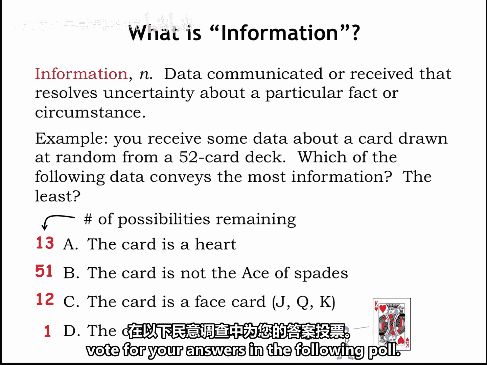

# 001：什么是信息？💡

在本节中，我们将学习信息的基本概念，以及如何从工程角度量化信息。我们将通过一个简单的例子来理解信息如何消除不确定性，并引入衡量信息量的数学方法。

为了构建能够处理、传输或存储信息的电路，我们需要一些工程工具来帮助我们判断所选的信息表示方式是否良好。这正是本章的主题。我们将研究将信息编码为比特的不同方法，并学习帮助我们判断编码是否有效的数学知识。我们还将探讨，当我们的表示方式因错误而损坏时，我们可以做些什么。能够检测到问题发生，甚至可能纠正问题，这将是很有用的。

让我们从提问开始：什么是信息？从工程的角度来看，我们将信息定义为**传达或接收的数据，这些数据消除了关于特定因素或情况的不确定性**。换句话说，在接收到数据后，我们将更了解那个特定的因素或情况。数据所消除的不确定性越大，数据所传达的信息就越多。

让我们看一个例子。从一副标准的52张扑克牌中随机抽取了一张牌。在没有任何关于所选牌的数据的情况下，这张牌的类型有52种可能性。

现在，假设你收到了以下关于选择的一条数据：

以下是四种可能的数据情况：

*   **A.** 你得知这张牌的花色是红心。这将选择范围缩小到13张牌中的一张。
*   **B.** 你得知这张牌不是黑桃A。这仍然留下了51张可能的牌。
*   **C.** 你得知这张牌是一张人头牌（即J、Q或K）。所以选择是12张牌中的一张。
*   **D.** 你得知这张牌是“自杀国王”。他那位拿着小蓝剑的朋友向我们表明，这实际上是一张特定的牌——红心K，国王正把剑刺进自己的头。这里没有不确定性。我们确切地知道选择是什么。

哪一条可能的数据传达了最多的信息？换句话说，哪条数据最大程度地消除了关于所选牌的不确定性？同样地，哪条数据传达的信息量最少？

在我们讨论这些问题正确答案背后的数学原理之前，请先在下面的投票中选出你的答案。

在本节中，我们一起学习了信息的工程定义：信息是消除不确定性的数据。我们通过扑克牌的例子，直观地理解了不同数据所消除的不确定性程度不同，从而传达的信息量也不同。接下来，我们将引入数学工具来精确地量化信息。