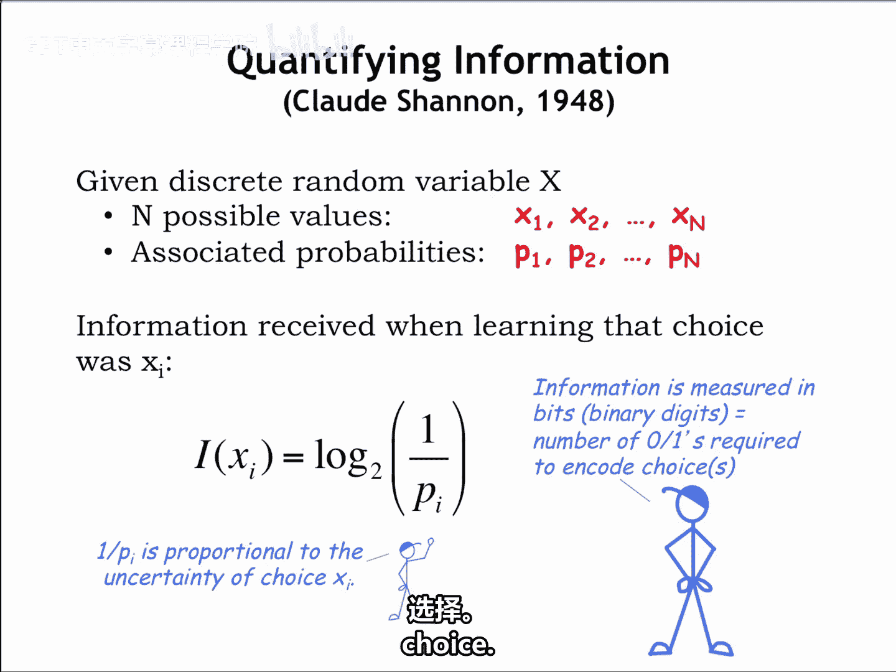
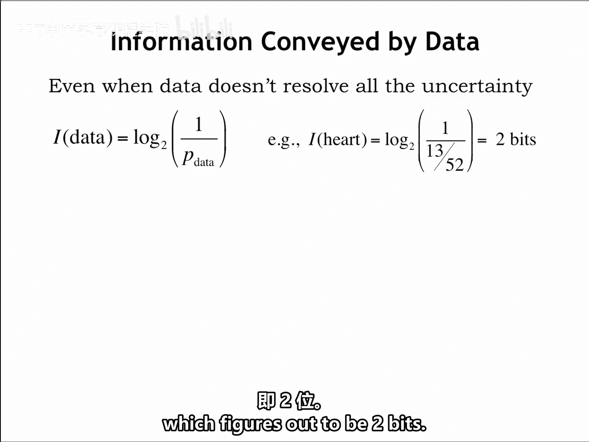
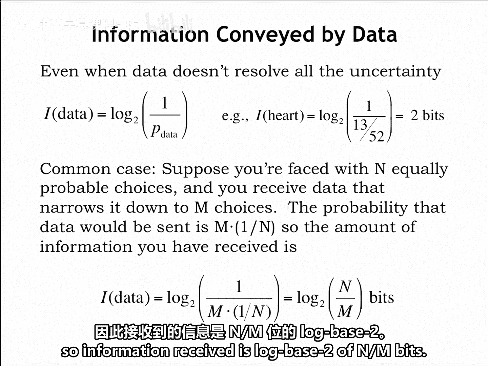
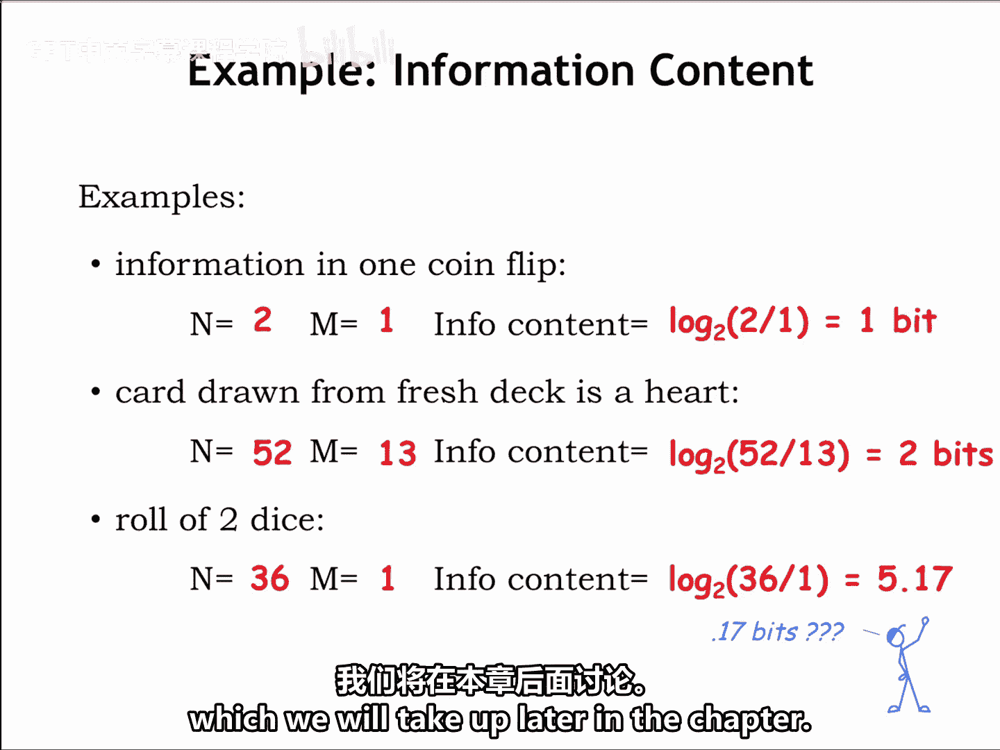
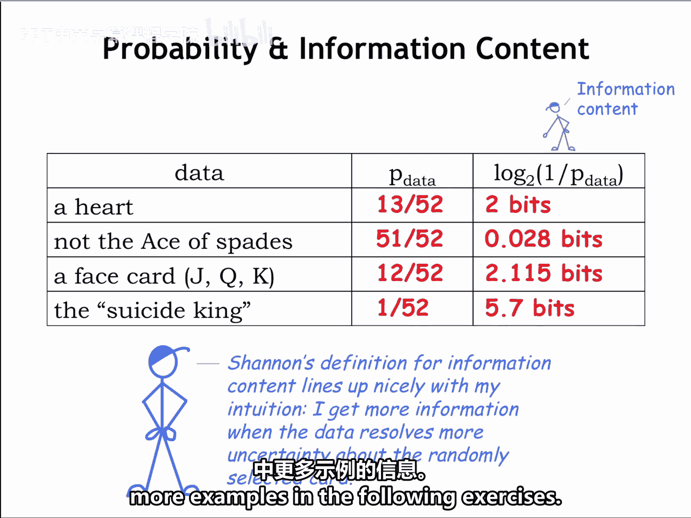

# 002：1.2.2 量化信息

在本节课中，我们将学习如何量化信息。我们将引入随机变量的概念来描述不确定性，并学习克劳德·香农提出的信息量计算公式。通过纸牌游戏的例子，我们将理解信息量与事件概率之间的关系，并学会计算不同情境下接收到的信息量。

## 引入随机变量

数学家喜欢通过引入随机变量的概念来模拟特定情况下的不确定性。在我们的应用中，总是处理具有有限数量 `n` 个不同选择的情况。

因此，我们将使用一个离散随机变量 `X`，它可以取 `n` 个可能值中的一个：`x₁, x₂, ..., xₙ`。

`X` 取值为 `x₁` 的概率由概率 `P₁` 给出，取值为 `x₂` 的概率由 `P₂` 给出，以此类推。概率越小，`X` 取该特定值的不确定性就越大。

## 信息量的定义

克劳德·香农在其关于信息论的开创性工作中，定义了当我们得知 `X` 取值为 `xᵢ` 时所接收到的信息量。

信息量 `I` 的计算公式为：
```
I = log₂(1 / Pᵢ)
```
请注意，一个选择的不确定性与它的概率成反比。因此，对数内的项 `(1 / Pᵢ)` 本质上代表了该特定选择的不确定性大小。



我们使用以2为底的对数来以比特（bit）为单位衡量不确定性的大小，其中1比特是一个可以取值为0或1的量。

可以将信息内容视为编码这个选择所需的比特数。


## 处理部分信息

上一节我们介绍了在完全确定结果时如何计算信息量。本节中我们来看看，如果接收到的数据没有解决所有的不确定性，该如何计算。

例如，之前我们收到数据说抽到的牌是红心。部分不确定性已被消除，因为我们比收到数据前更了解这张牌，但我们还不知道具体是哪张牌。因此，仍然存在一些不确定性。

我们仍然可以使用上一张幻灯片中的信息量公式，利用我们收到的数据的概率来计算信息量。



在我们的例子中，从一副52张牌中随机抽取一张牌，得知它是红心的概率是 `13/52`（红心的数量除以总选择数）。

所以 `P_data = 13/52` 或 `1/4`，信息量计算为 `log₂(1 / (1/4))`，结果是2比特。




## 等概率选择的通用情况

这是一个我们经常遇到的例子。我们收到关于 `n` 个等概率选择的部分信息，每个选择的概率为 `1/n`。这使选择范围缩小到 `M` 个。

收到此类信息的概率是 `M * (1/n)`，因此接收到的信息量为：
```
I = log₂(n / M) 比特
```


## 实例分析

让我们看一些例子。

*   **抛一枚公平的硬币**：如果我们得知抛一枚公平硬币的结果（正面或反面），我们从2个选择变为1个选择，因此接收到的信息是 `log₂(2/1)`，即1比特。这很合理：我们需要1比特来编码两种可能性中实际发生的那一种，例如，1代表正面，0代表反面。

*   **回顾纸牌花色的例子**：得知从一副新牌中抽出的牌是红心，我们得到 `log₂(52/13)`，即2比特信息。这同样合理：我们需要2比特来编码四种可能的牌色中出现的哪一种。

*   **掷两个骰子**：考虑掷两个骰子（一个红色，一个绿色）得到的信息。每个骰子有六个面，因此有36种可能的组合。一旦我们得知确切的掷出结果，我们就收到了 `log₂(36/1)`，即大约5.17比特的信息。

那些分数比特是什么意思？我们的电路只能处理整比特。所以，要编码单个结果，我们需要使用6比特。但假设我们想记录连续10次掷骰的结果。按每次6比特计算，总共需要60比特。而这个公式告诉我们，我们不需要60比特，只需要52比特就能明确无误地编码结果。我们是否能提出一种达到这个下限的编码方式，是一个有趣的问题，我们将在本章后面讨论。




## 总结与回顾

最后，让我们回到最初的例子。下表显示了接收到的数据的不同选择，以及该事件的概率和计算出的信息量。

以下是不同事件及其信息量的总结：

*   **得知牌是红心**：此事件的概率为 `13/52`，信息量为2比特。
*   **得知牌不是黑桃A**：此事件可能性很高，因为它是黑桃A的机会只有 `1/52`，因此我们从此事件中获得的信息量很小，约为0.028比特。
*   **得知牌是花牌（J，Q，K）**：一副牌中有12张花牌，所以此事件的概率为 `12/52`，我们收到约2.115比特。比得知花色获得的信息稍多，因为剩余的不确定性略少。
*   **得知具体是哪张牌**：当所有不确定性都被消除时，我们获得的信息最多，略多于5.7比特。

这些结果与蓝先生的直觉很好地吻合。解决的不确定性越多，我们接收到的信息就越多。

现在，请尝试在下面的练习中计算更多示例的信息量。



---


本节课中我们一起学习了如何量化信息。我们引入了离散随机变量来描述不确定性，并掌握了香农信息量的计算公式 `I = log₂(1/P)`。通过分析从完全确定到部分确定的各种情况，我们理解了信息量与事件概率之间的反比关系，并能够计算在等概率或非等概率选择下接收到的信息量（以比特为单位）。这些概念是理解信息编码和压缩的基础。