# 数字系统与计算机架构：1.2.3：信息熵 📊

在本节中，我们将学习如何评估编码方案的有效性。我们将介绍信息熵的概念，它衡量了随机变量所包含的平均信息量。理解熵是设计高效编码方案的基础。

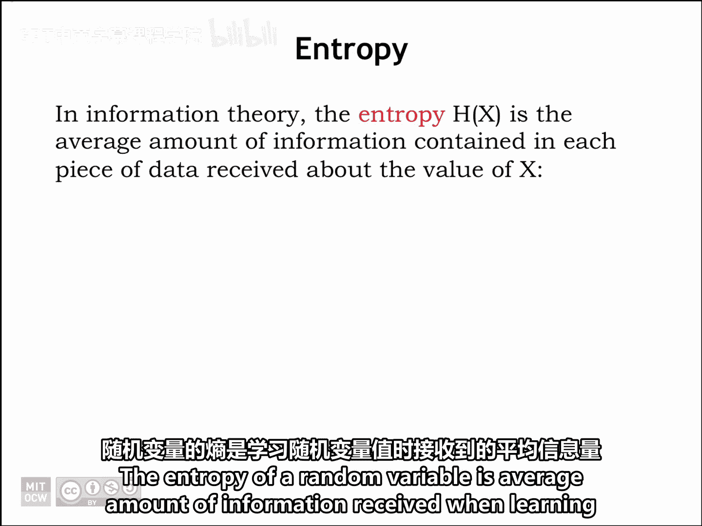

## 熵的定义与计算

上一节我们讨论了信息量的概念。本节中，我们来看看如何计算一个随机变量的平均信息量，即信息熵。

熵的数学定义如下：

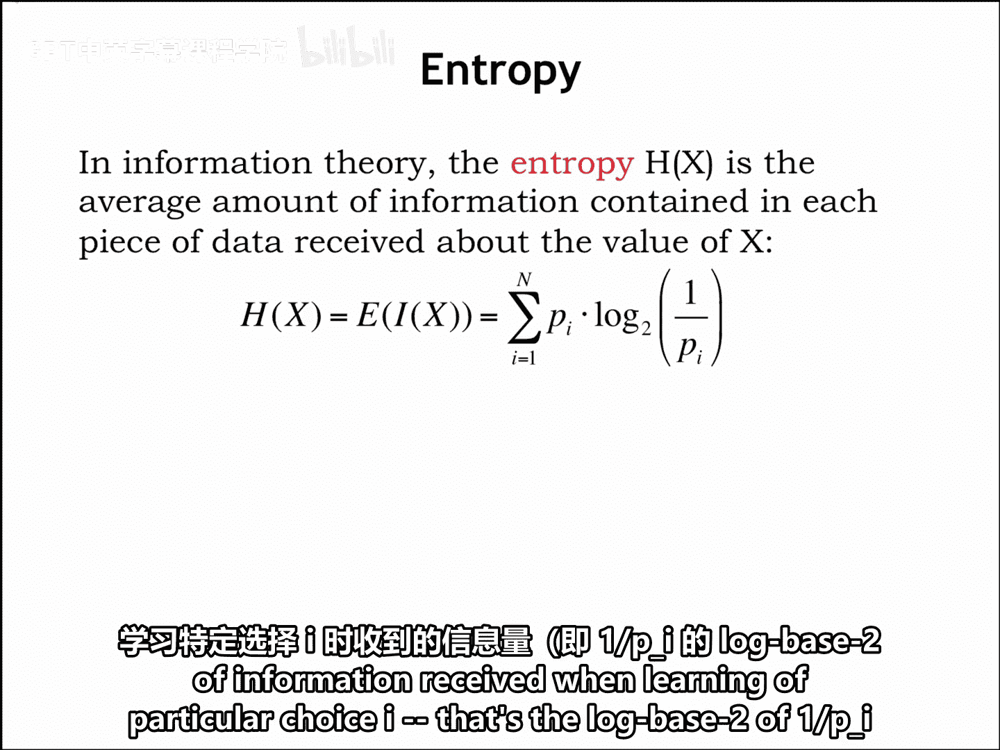

**公式：**
\[
H(X) = E[I(X)] = \sum_{i} p_i \cdot \log_2\left(\frac{1}{p_i}\right)
\]

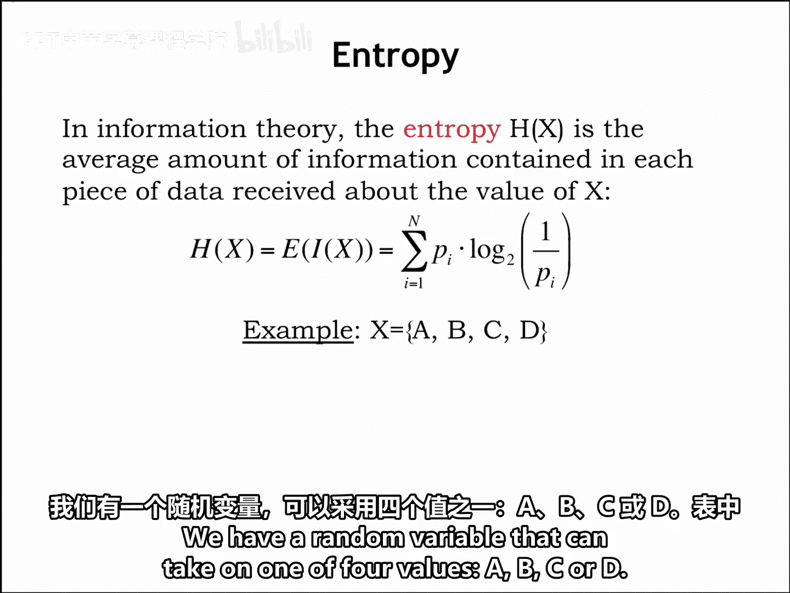

其中：
*   `H(X)` 表示随机变量 `X` 的熵。
*   大写字母 `E` 表示数学期望，即平均值。
*   `p_i` 是随机变量取第 `i` 个值的概率。
*   `log_2(1/p_i)` 是得知该值时所获得的信息量。

计算方法是：将每个可能结果的信息量，乘以其发生的概率，然后将所有结果加权求和。

## 熵的计算示例

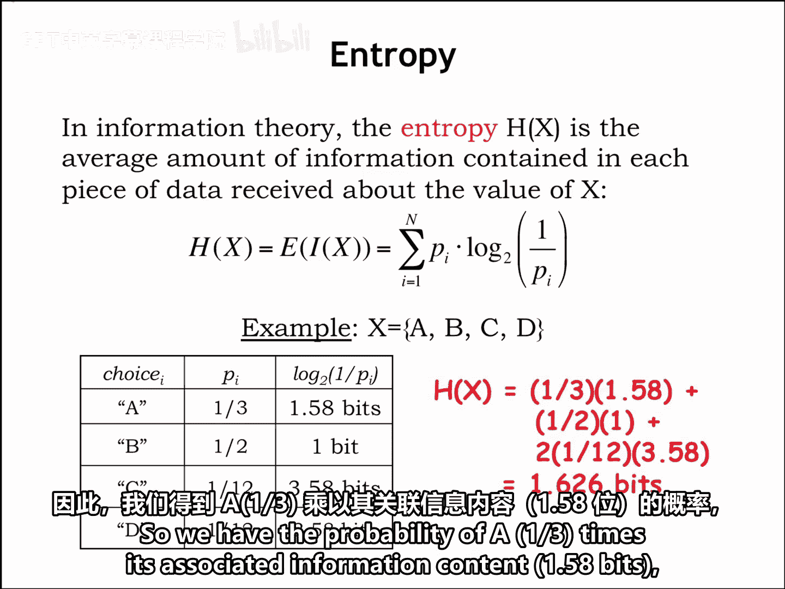

为了更清楚地理解，我们来看一个具体的例子。

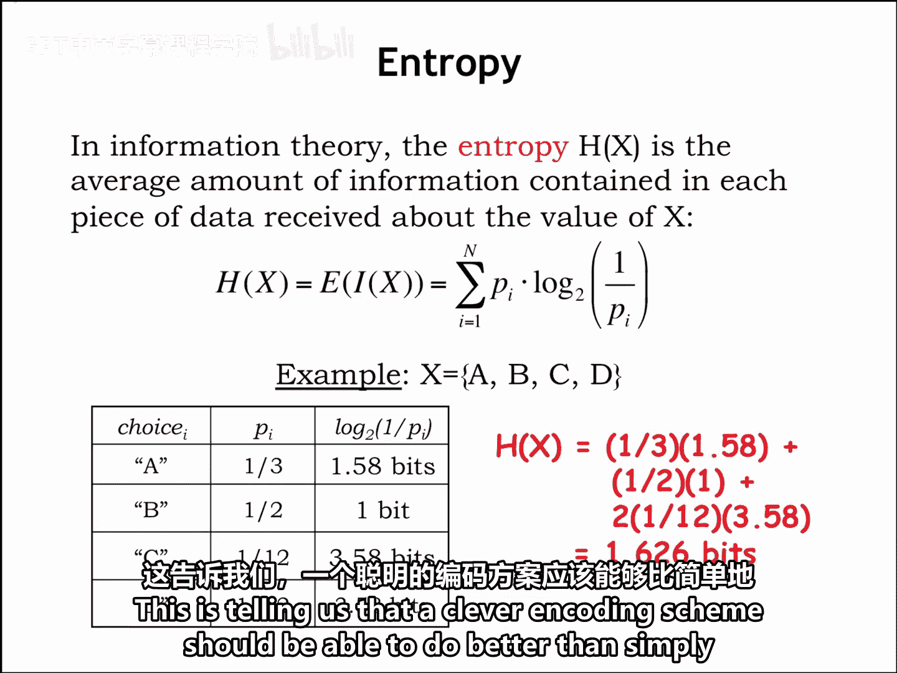

假设有一个随机变量，它可以取四个值：A, B, C 或 D。其概率分布及相关信息量如下表所示：

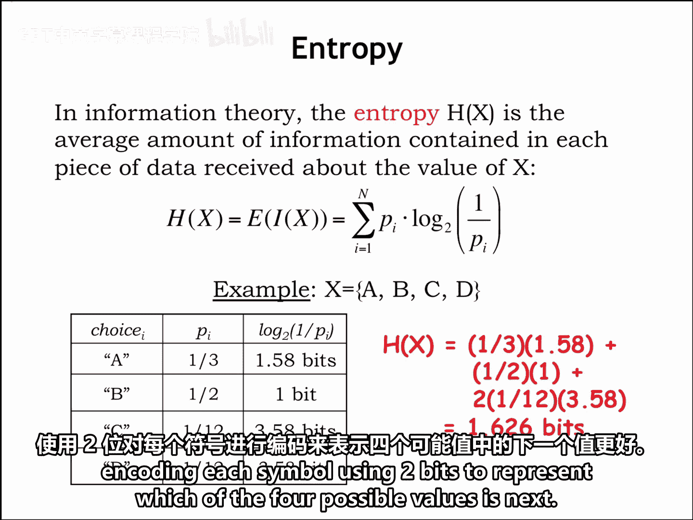

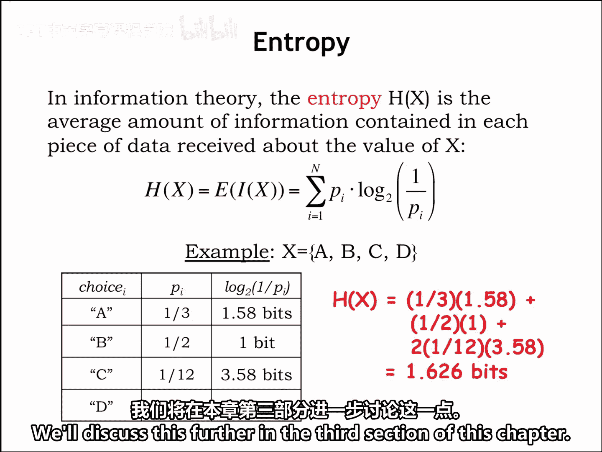

| 符号 | 概率 (p_i) | 信息量 (log₂(1/p_i)) |
| :--- | :--- | :--- |
| A | 1/3 | ≈ 1.58 bits |
| B | 1/3 | ≈ 1.58 bits |
| C | 1/6 | ≈ 2.58 bits |
| D | 1/6 | ≈ 2.58 bits |

以下是计算该随机变量熵的步骤：

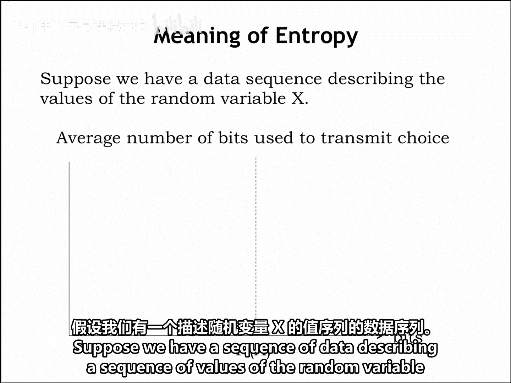

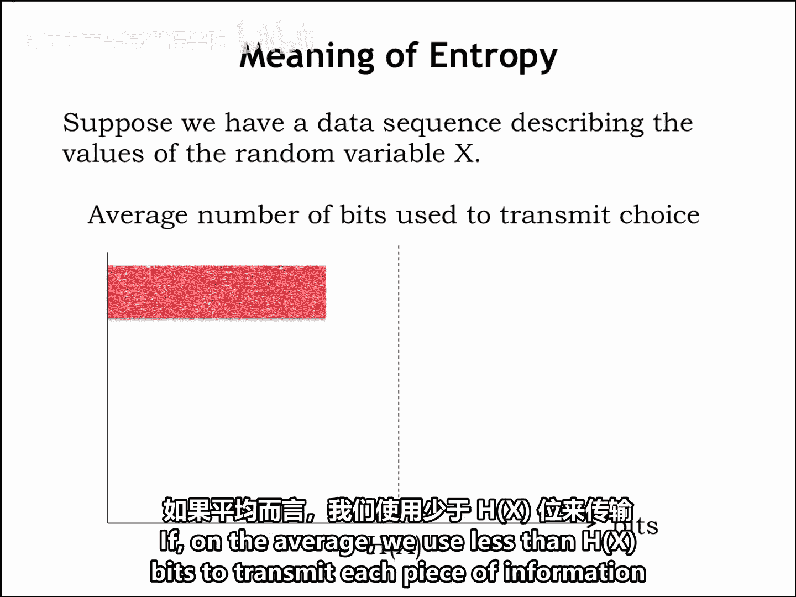

**计算过程：**
\[
H(X) = \left(\frac{1}{3} \times 1.58\right) + \left(\frac{1}{3} \times 1.58\right) + \left(\frac{1}{6} \times 2.58\right) + \left(\frac{1}{6} \times 2.58\right) \approx 1.626 \text{ bits}
\]

计算结果表明，该随机变量的熵约为 1.626 比特。这个数字告诉我们，一个聪明的编码方案应该能做得比简单地用 2 比特（因为 2²=4）来编码每个符号更好。这留给我们一个思考：如何设计这样的编码？我们将在本章的第三部分进一步讨论。

## 熵的意义与解释

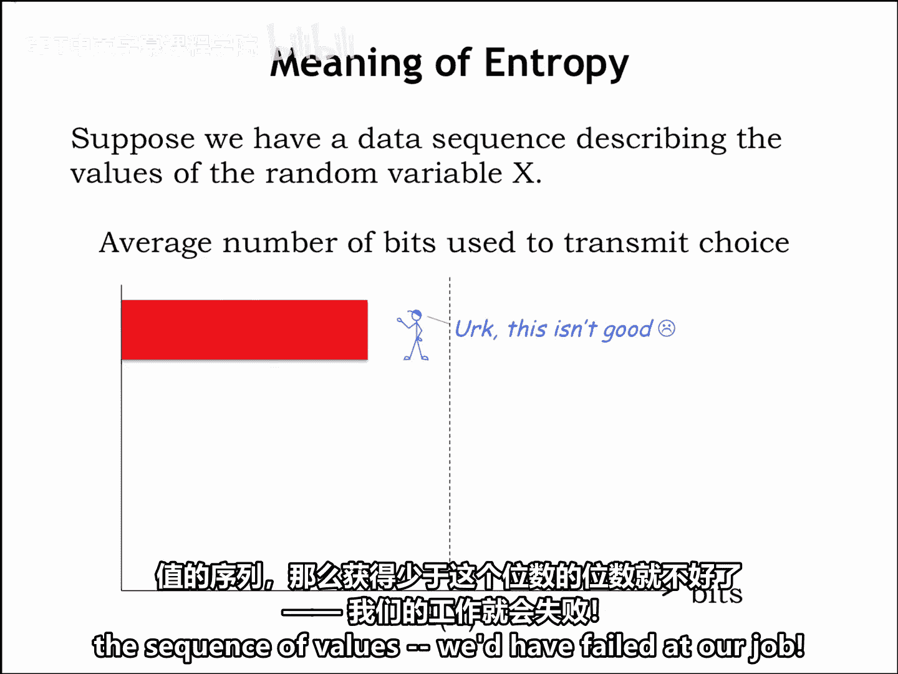

那么，熵究竟告诉了我们什么？假设我们有一段数据，它描述了一系列随机变量 `X` 的值。

以下是基于平均比特使用量与熵 `H(X)` 的关系得出的三种情况：

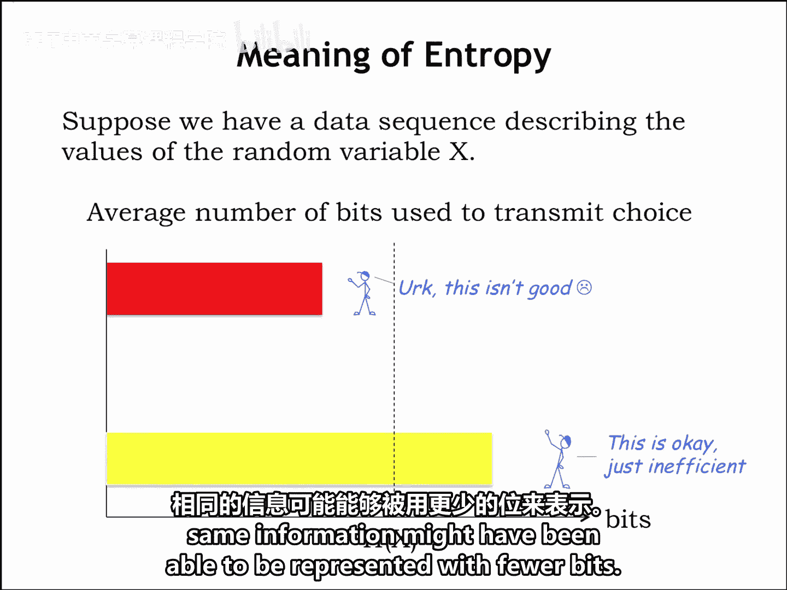

*   **平均使用比特数 < H(X)**：如果我们平均使用少于 `H(X)` 比特来传输序列中的每个信息，那么我们发送的信息量不足以消除关于数值的不确定性。换句话说，熵是我们需要传输的比特数的**下限**。如果目标是明确无误地描述数值序列，那么使用少于这个数量的比特意味着任务失败。
*   **平均使用比特数 > H(X)**：另一方面，如果我们平均使用多于 `H(X)` 比特来描述数值序列，那么我们就没有最有效地利用资源，因为同样的信息本可以用更少的比特来表示。
*   **平均使用比特数 = H(X)**：最后，如果我们平均恰好使用 `H(X)` 比特，那么我们就得到了完美的编码。然而，完美总是一个艰难的目标，因此大多数时候，我们只能满足于接近这个值。

在本节最后的练习中，请尝试计算不同场景下的熵，以加深理解。

## 总结

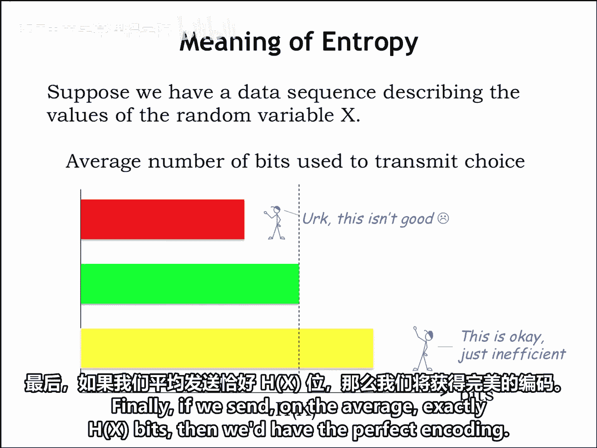

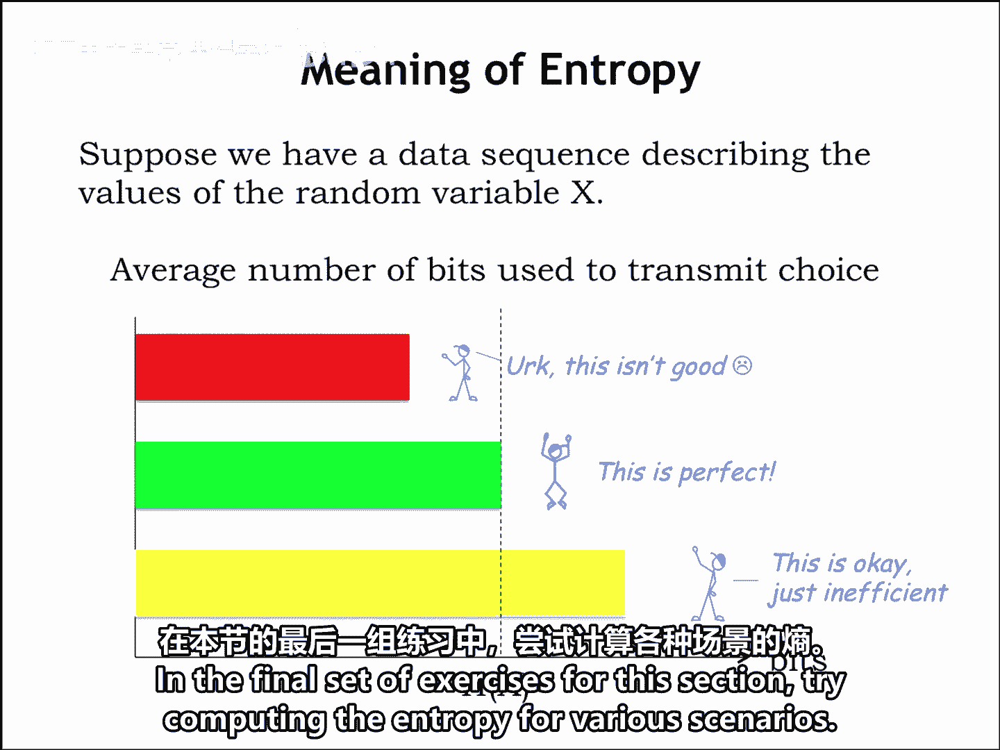

本节课中，我们一起学习了信息熵的核心概念。我们了解到熵定义了一个随机变量所包含的平均信息量，其计算公式为概率加权信息量的总和。更重要的是，熵为无损编码的效率设定了一个理论下限：任何编码方案平均使用的比特数都无法低于熵值。理解这一点，是我们在后续课程中设计高效电路编码方案的基石。