# 004：1.2.4 编码 📝

在本节课中，我们将要学习如何将数据编码为由0和1组成的序列，即比特串。编码是比特串与待编码数据集合成员之间的一种明确映射关系。

接下来，我们把注意力转向将数据编码为0和1的序列，即比特串。

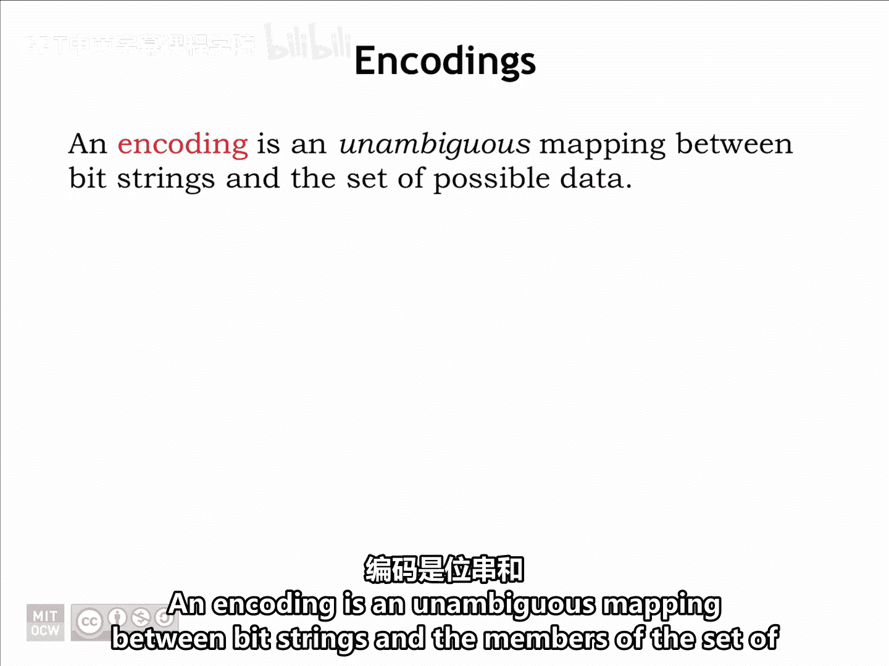

编码是比特串与待编码数据集合成员之间的一种明确映射。例如，我们有一个包含四个符号的集合S：A、B、C和D。

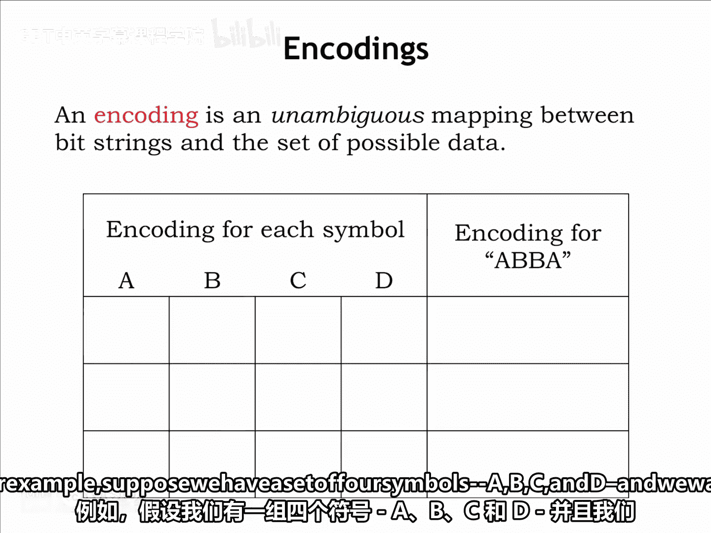

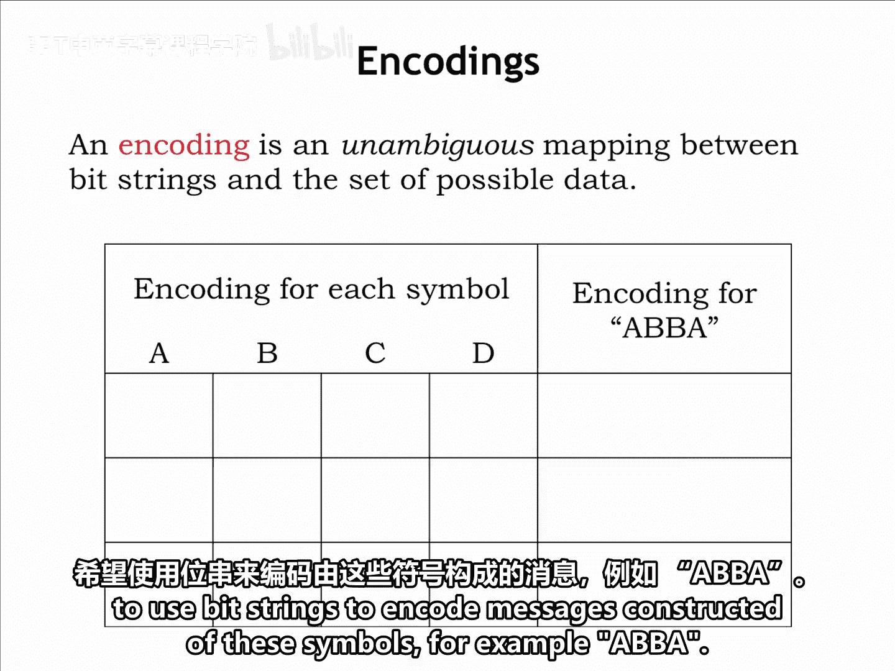

我们希望使用比特串来编码由这些符号构成的消息，例如“ABBA”。

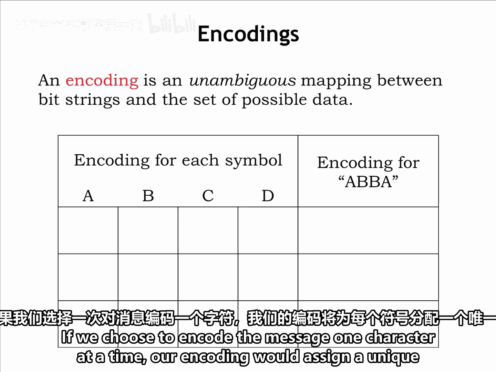

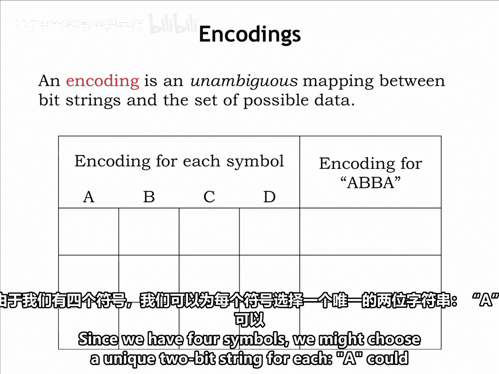

## 固定长度编码

如果我们选择一次编码一个字符，我们的编码将为每个符号分配一个唯一的比特串。由于我们有四个符号，我们可以为每个符号选择一个唯一的2位比特串。

以下是可能的编码方案：
*   A 编码为 `00`
*   B 编码为 `01`
*   C 编码为 `10`
*   D 编码为 `11`

这被称为**固定长度编码**，因为用于表示符号的比特串都具有相同的长度。消息“ABBA”的编码将是 `00-01-01-00`。

我们可以反向运行这个过程。给定一个比特串和编码表，我们可以查找比特串中的下几位，使用编码表来确定它们代表的符号：`00` 解码为 A，`01` 解码为 B，依此类推。

## 可变长度编码

我们也可以使用不同长度的比特串来编码符号，这被称为**可变长度编码**。

以下是可变长度编码的一个例子：
*   A 编码为 `01`
*   B 编码为 `1`
*   C 编码为 `000`
*   D 编码为 `001`

“ABBA”将被编码为 `01-1-1-01`。我们将看到，精心构建的可变长度编码对于高效编码符号出现概率不同的消息非常有用。

## 编码的无歧义性

我们必须确保编码是无歧义的。假设我们决定这样编码：
*   A 编码为 `0`
*   B 编码为 `1`
*   C 编码为 `10`
*   D 编码为 `11`

消息“ABBA”的编码将是 `0-1-1-0`。看起来不错，因为这个编码比前两种编码都短。

现在，让我们尝试解码这个比特串。使用编码表，我们不幸地得到了几种解码结果：当然是“ABBA”，但也可能是“AA”或“ABC”，这取决于我们如何对位进行分组。这个编码方案失败了，因为消息无法被明确地解释。

## 使用二叉树表示编码

幸运的是，我们可以用一个二叉树来表示一个无歧义的编码。具体做法是：用0和1标记从每个树节点出发的分支，并将要编码的符号作为树的叶子节点放置。

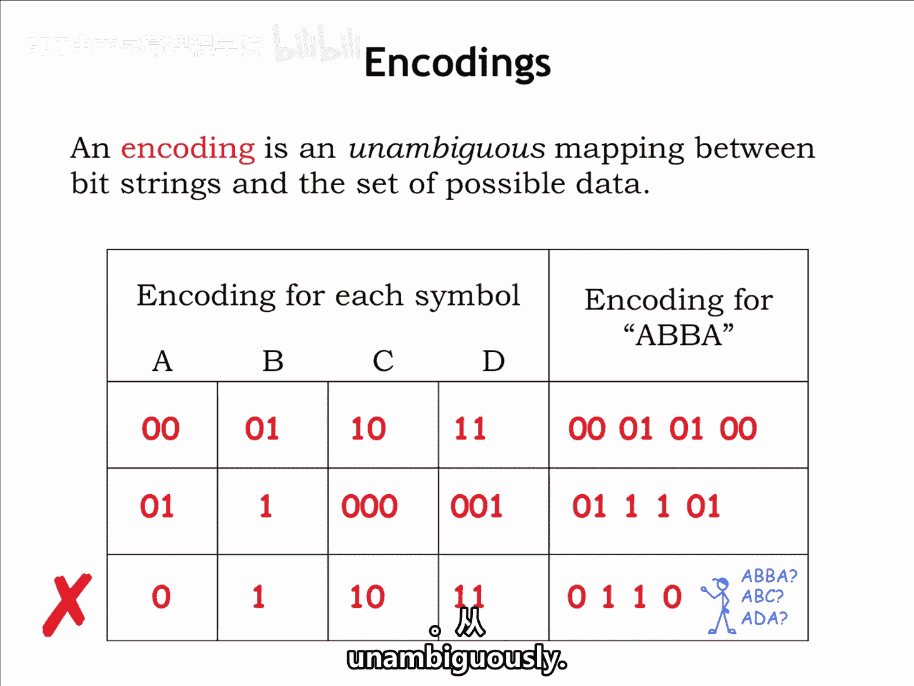

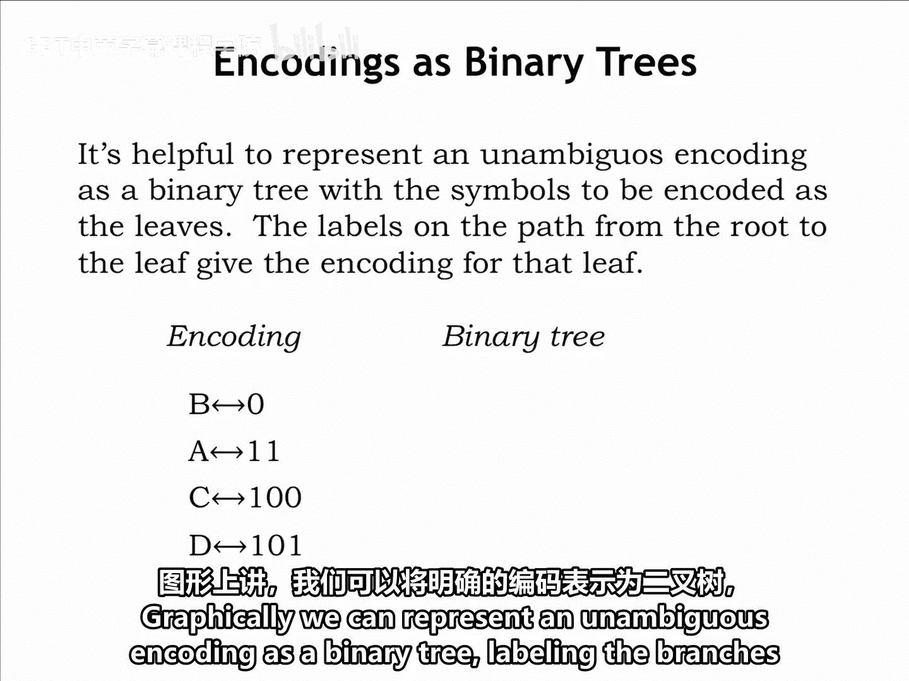

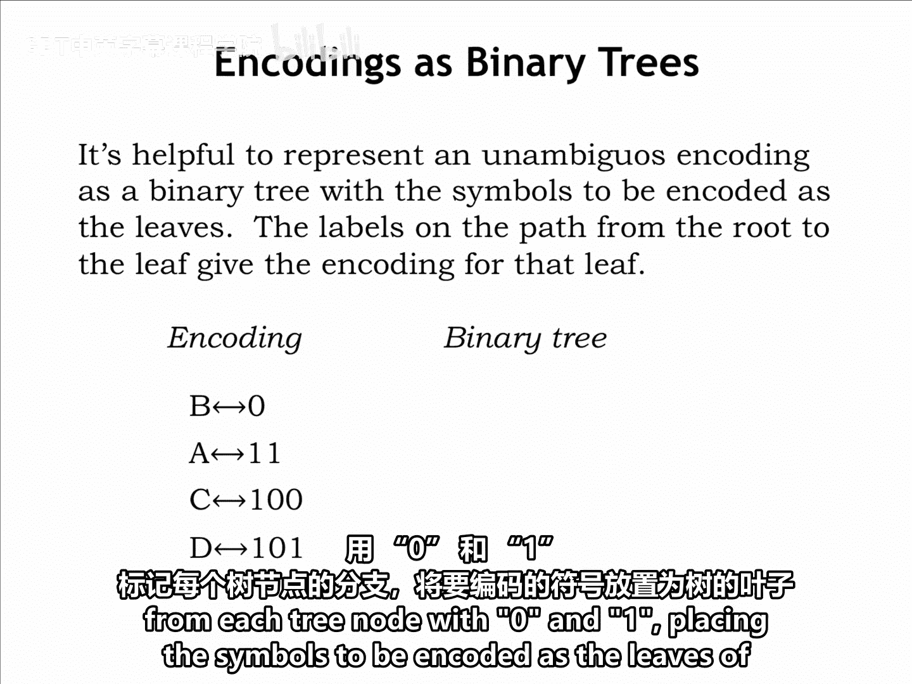

如果你为一个提议的编码构建了二叉树，并且发现没有符号标记在内部节点上，且每个叶子节点上恰好只有一个符号，那么你的编码就是可行的。

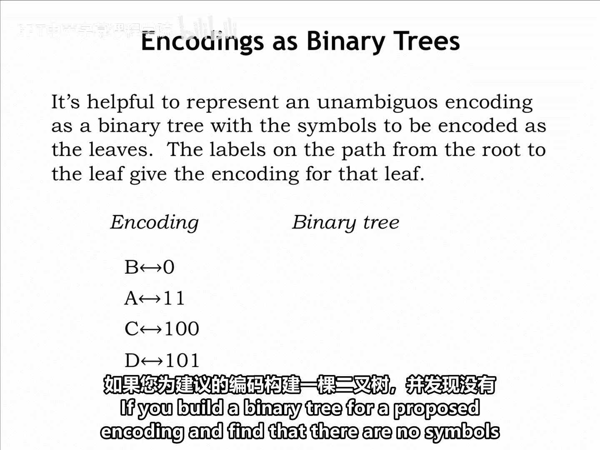
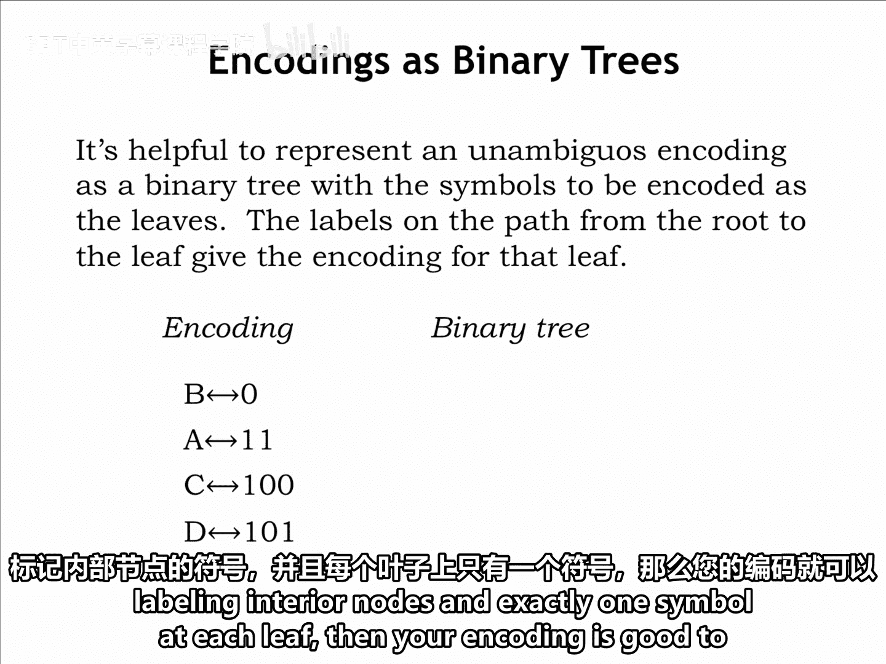

## 解码过程示例

例如，考虑左侧所示的编码。绘制相应的二叉树只需要一秒钟。符号B沿着标记为0的弧，距离树根的距离为1。A距离为2，C和D距离为3。

如果我们收到一个编码消息，例如 `0-1-1-1-1`，我们可以使用编码的连续位来识别从树根到叶子的路径，一步一步进行，直到到达一个叶子节点。

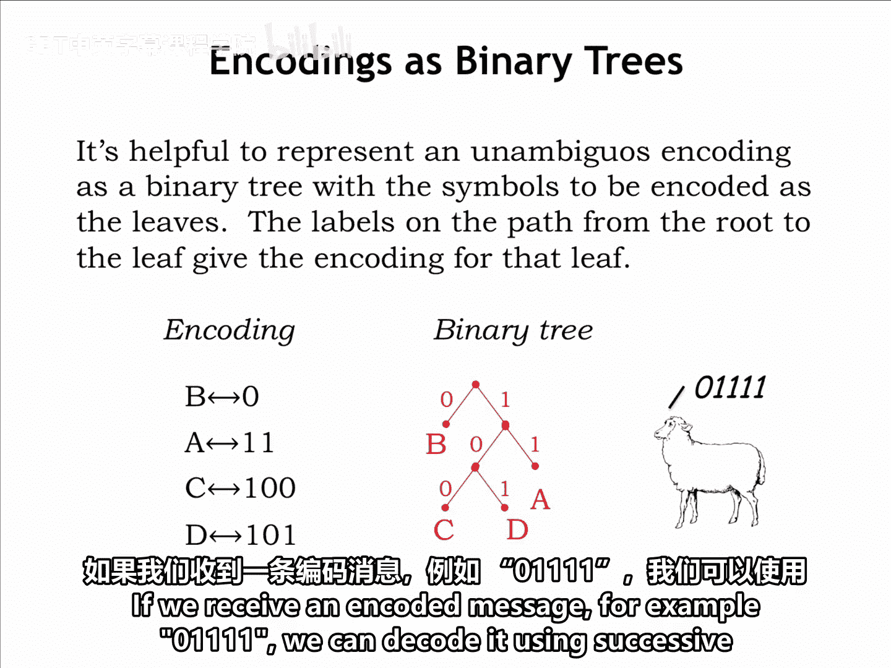
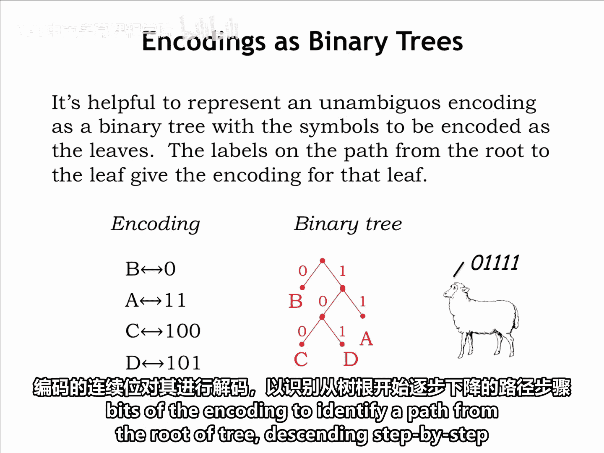

然后重复这个过程，再次从根开始，直到编码消息中的所有位都被消耗完。

所以，消息中的第一个位 `0` 将我们从根带到叶子B，这是我们解码出的第一个符号。接下来的 `1-1` 将我们带到A，再下一个 `1-1` 得到第二个A。

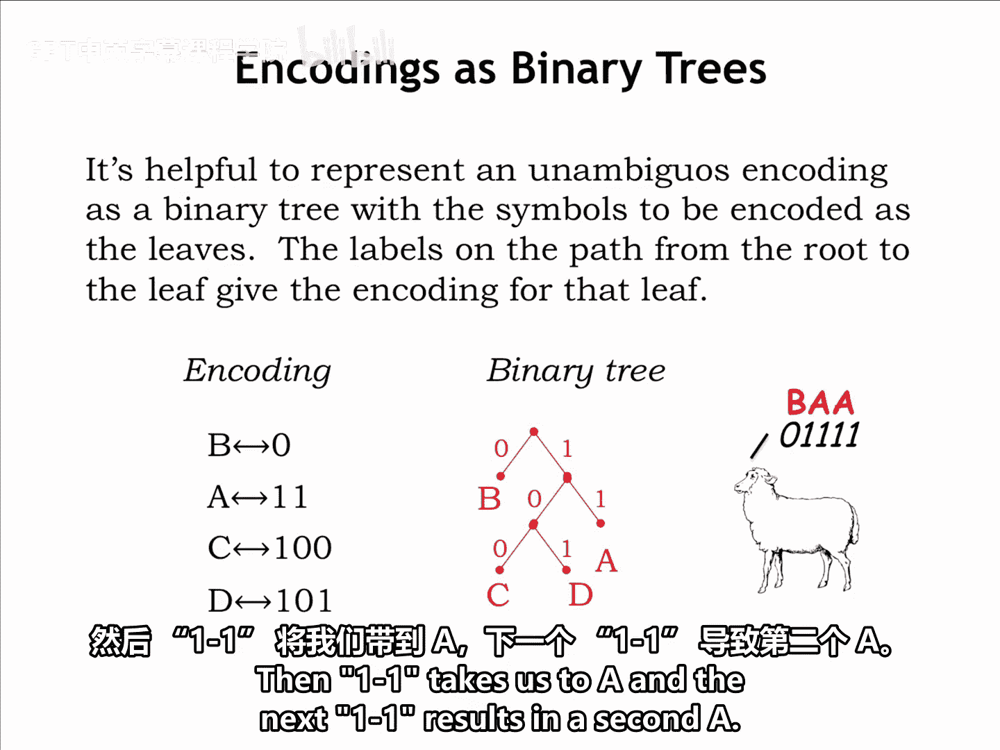

最终的解码消息“BAA”并非完全出乎意料，至少对于一只美国羊来说是这样。

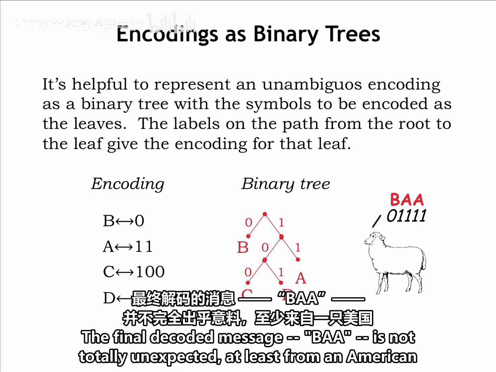

## 总结

本节课中我们一起学习了数据编码的基本概念。我们了解了**固定长度编码**和**可变长度编码**的区别，并认识到编码必须是无歧义的，以确保消息能被正确解码。我们学习了如何使用**二叉树**来直观地表示和验证一个编码方案的无歧义性，并通过示例演示了编码和解码的过程。理解这些原理是后续学习更复杂编码方案（如哈夫曼编码）的基础。