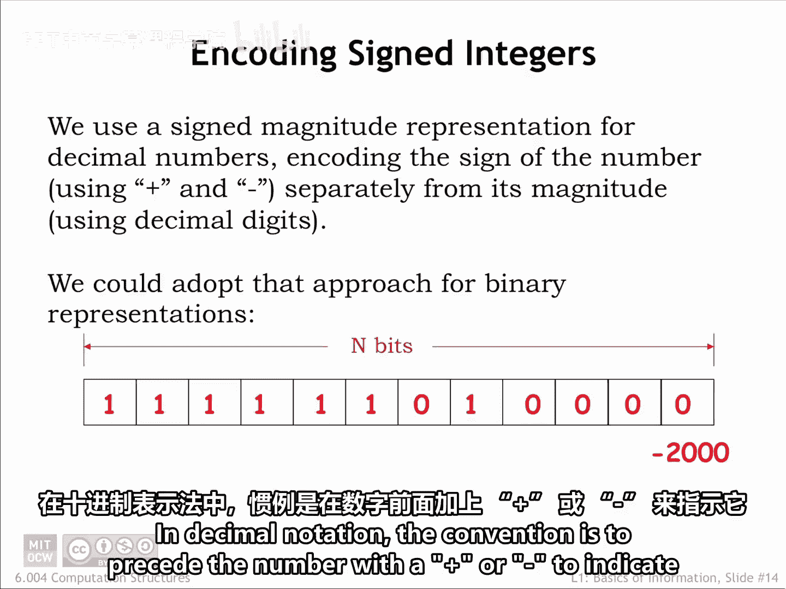
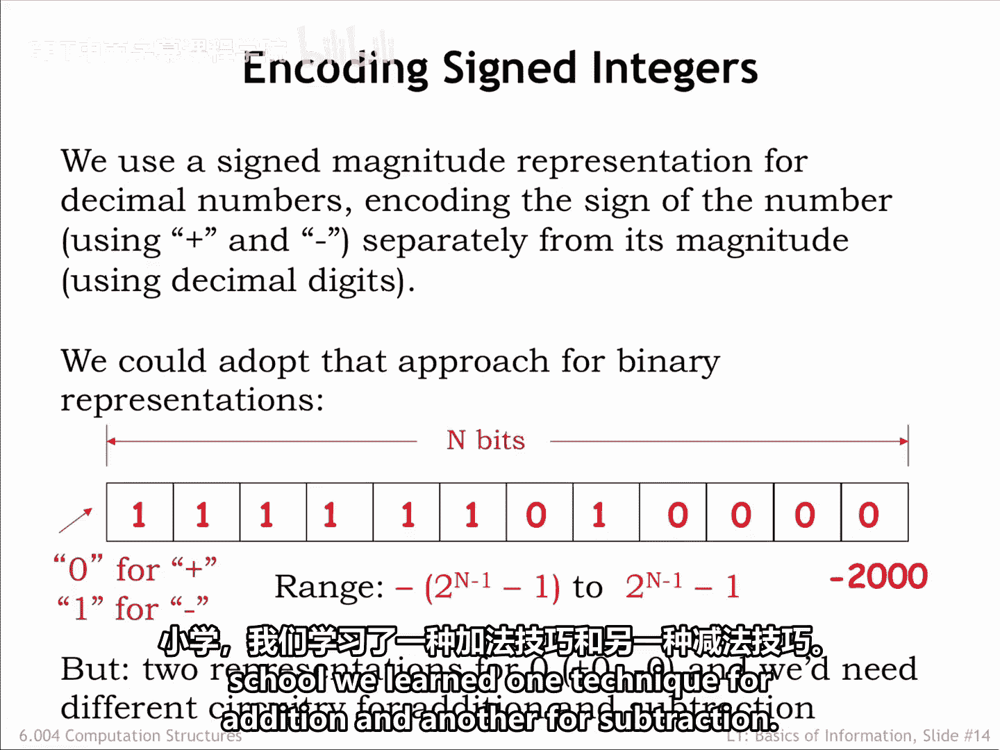
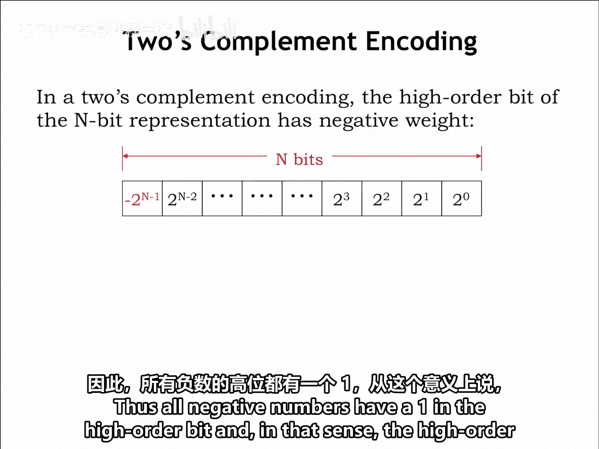
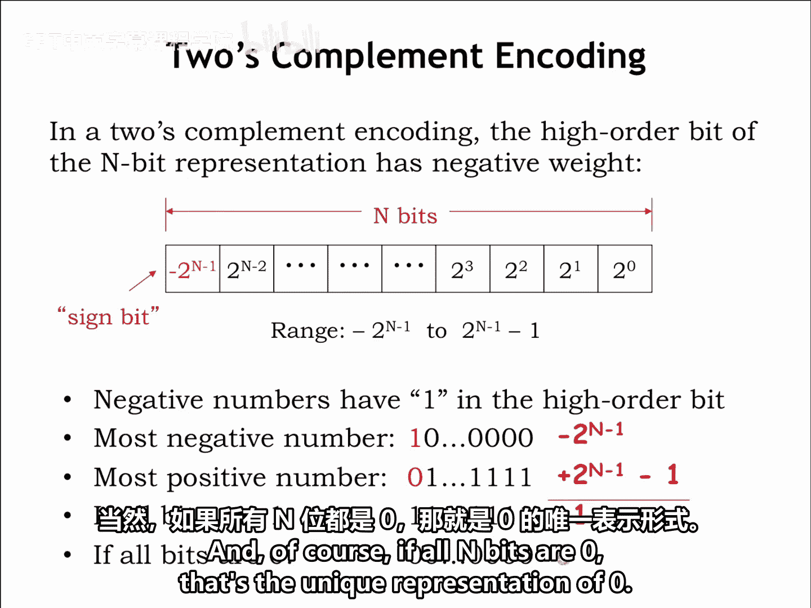
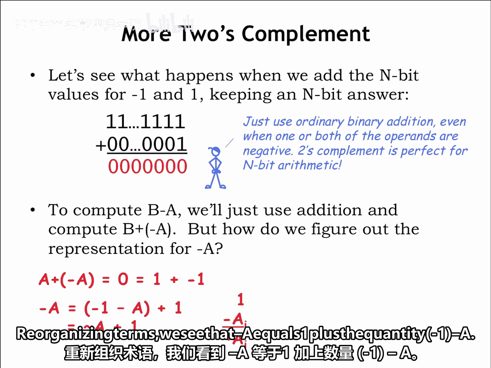
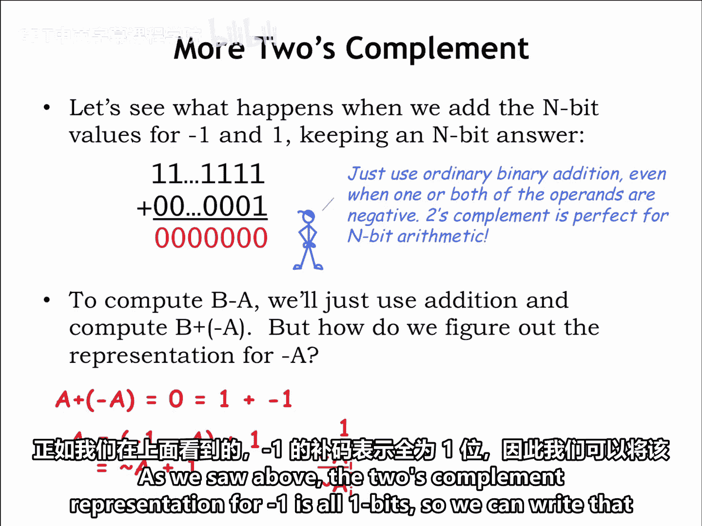
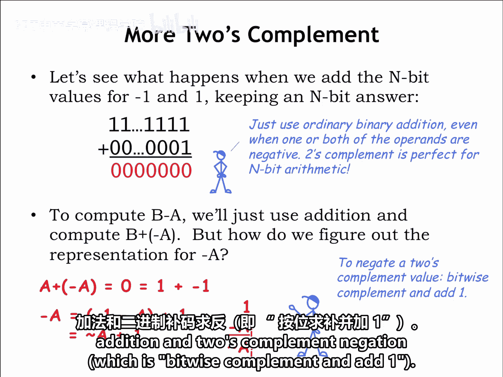

# 006：有符号整数与二进制补码 🧮

在本节课中，我们将学习如何表示有符号整数，特别是二进制补码表示法。这是一种在现代数字系统中广泛使用的、能够简化算术电路设计的编码方式。

## 概述

我们的最终挑战是弄清楚如何表示有符号整数。例如，数字 -2000 应该如何表示？在十进制记数法中，惯例是在数字前加上加号或减号来表示其正负，通常省略正数的加号以简化记法。

## 符号-数值表示法

我们可以采用一种类似的记法，称为**符号-数值表示法**。在二进制中，通过在二进制串的前端分配一个单独的位来表示符号，例如用 0 表示正数，用 1 表示负数。

因此，-2000 的符号-数值表示将是一个初始的 1（表示负数），后跟之前两页幻灯片中描述的 2000 的表示。

然而，使用符号-数值表示法存在一些复杂之处。0 有两种可能的二进制表示：+0 和 -0。这使得编码效率略有降低。但更重要的是，执行符号-数值数加法的电路与执行减法的电路是不同的。当然，我们在小学就习惯了这一点，我们学习了一种加法技巧和另一种减法技巧。

## 二进制补码表示法

为了保持电路简单，大多数现代数字系统使用**二进制补码**来表示有符号数。

在这种表示法中，一个 n 位二进制补码数的最高位具有负权重，如图所示。因此，所有负数在最高位都是 1。从这个意义上说，最高位充当了符号位。如果它是 1，则表示的数字是负数。

## 数值范围

最负的 n 位数在最高位有一个 1，表示值 **-2^(n-1)**。最正的 n 位数在具有负权重的最高位是 0，在所有具有正权重的位上是 1，表示值 **2^(n-1) - 1**。这给出了可能的取值范围。

例如，在 8 位二进制补码表示中，最负的数是 -2^7，即 -128；最正的数是 2^7 - 1，即 127。

如果所有 n 位都是 1，可以将其视为最负数与最正数之和。换句话说，**-2^(n-1) + (2^(n-1) - 1) = -1**。当然，如果所有 n 位都是 0，那就是 0 的唯一表示。

## 二进制补码的运算

让我们看看当我们将 -1 和 1 的 n 位值相加，并保留 n 位结果时会发生什么。

在最右边的列，1 + 1 是 0，进位 1。在第二列，进位的 1 加上 1 再加上 0 是 0，进位 1，依此类推。结果是全零，即 0 的表示，完美。请注意，我们只使用了普通的二进制加法，即使其中一个或两个操作数是负数。

二进制补码非常适合 n 位算术。要计算 B - A，我们可以直接使用加法来计算 **B + (-A)**。

所以现在我们只需要知道如何根据 A 的二进制补码表示来求 -A 的二进制补码表示。

我们知道 **A + (-A) = 0**，并且使用上面的例子，我们可以将 0 重写为 1 + (-1)。重组项后，我们看到 **-A = 1 + (-1 - A)**。

## 求补运算

如上所述，-1 的二进制补码表示是全 1 位，因此我们可以将该减法写为：全 1 减去 A 的各个位（a₀, a₁, ..., aₙ₋₁）。

如果特定位 aᵢ 是 0，那么 1 - aᵢ 是 1。如果 aᵢ 是 1，那么 1 - aᵢ 是 0。因此，在每一列中，结果都是 aᵢ 的按位取反，我们使用 C 语言的按位取反运算符 `~` 来表示。

所以我们看到 **-A = ~A + 1**。就是这样。

## 练习

为了练习你的二进制补码技能，请尝试以下练习。你需要记住的就是如何进行二进制加法以及二进制补码取反（即按位取反再加一）。

---

## 总结

本节课中，我们一起学习了有符号整数的表示方法。我们首先了解了符号-数值表示法及其缺点，然后重点学习了**二进制补码表示法**。我们明白了其最高位具有负权重，定义了数值范围，并学习了其核心运算规则：使用普通二进制加法进行加减法，以及通过 **`-A = ~A + 1`** 来求一个数的相反数。这种表示法因其电路设计的简洁性而成为现代计算机系统的标准。