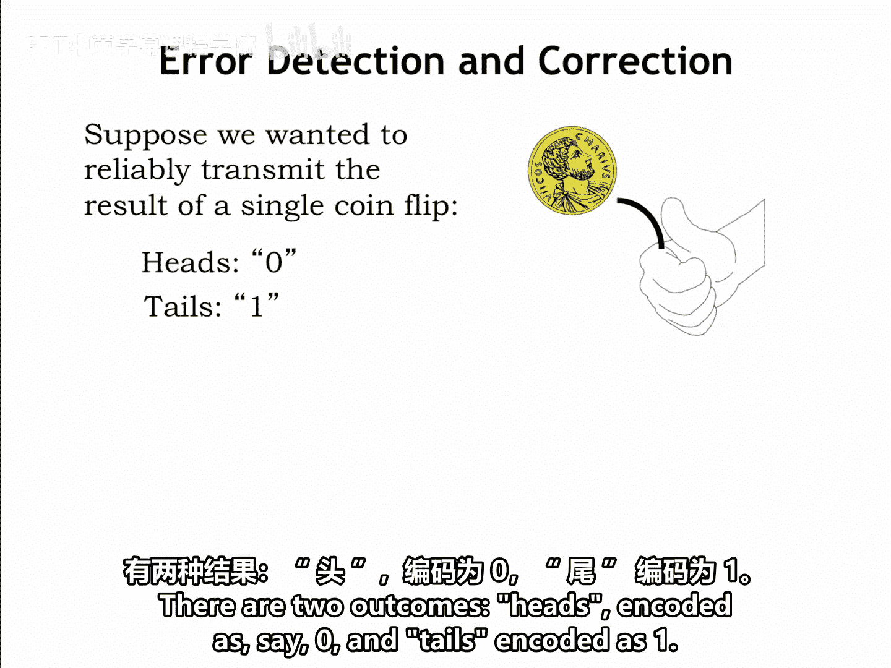
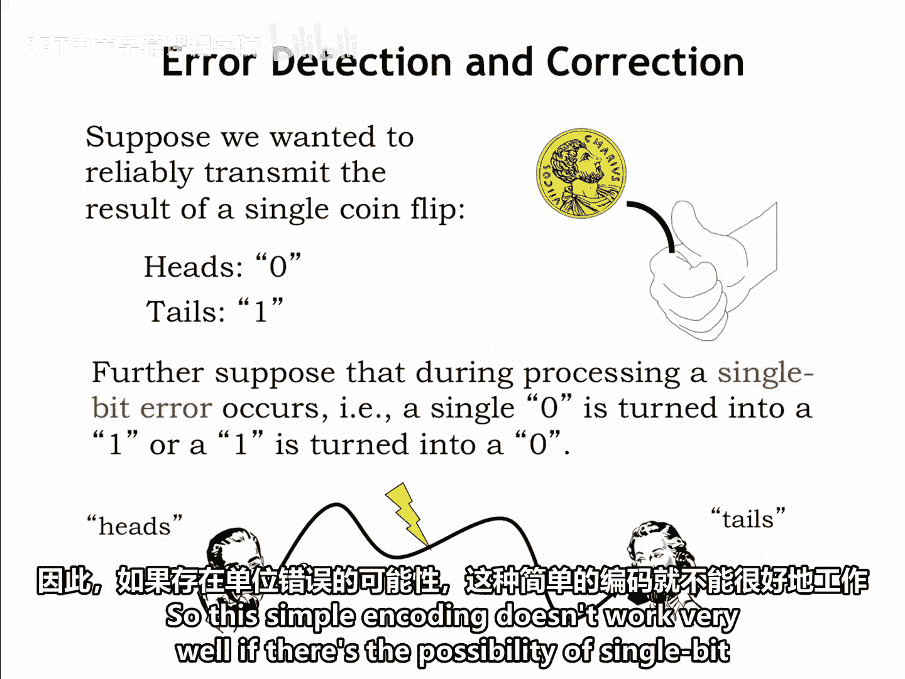
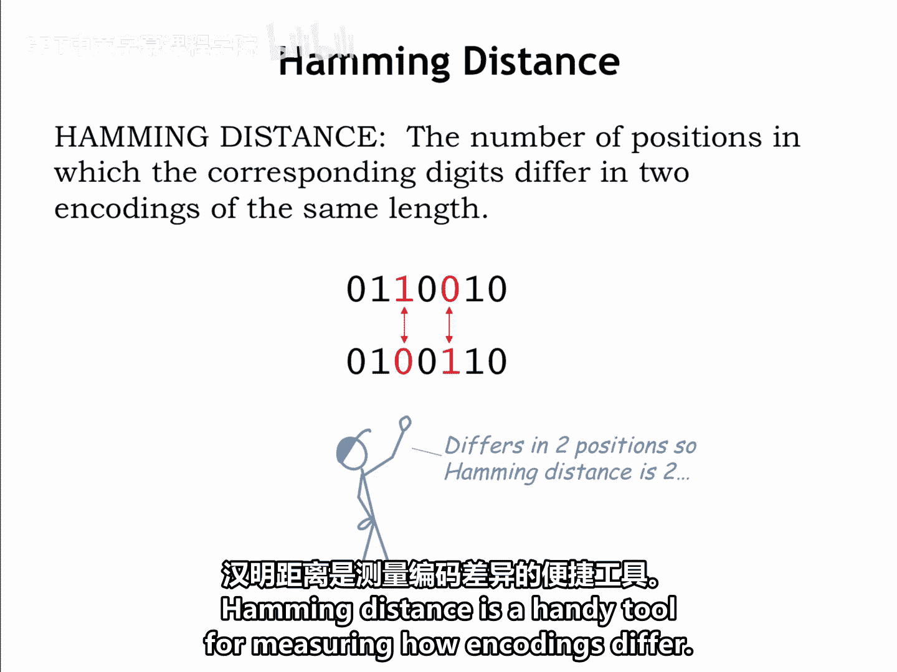
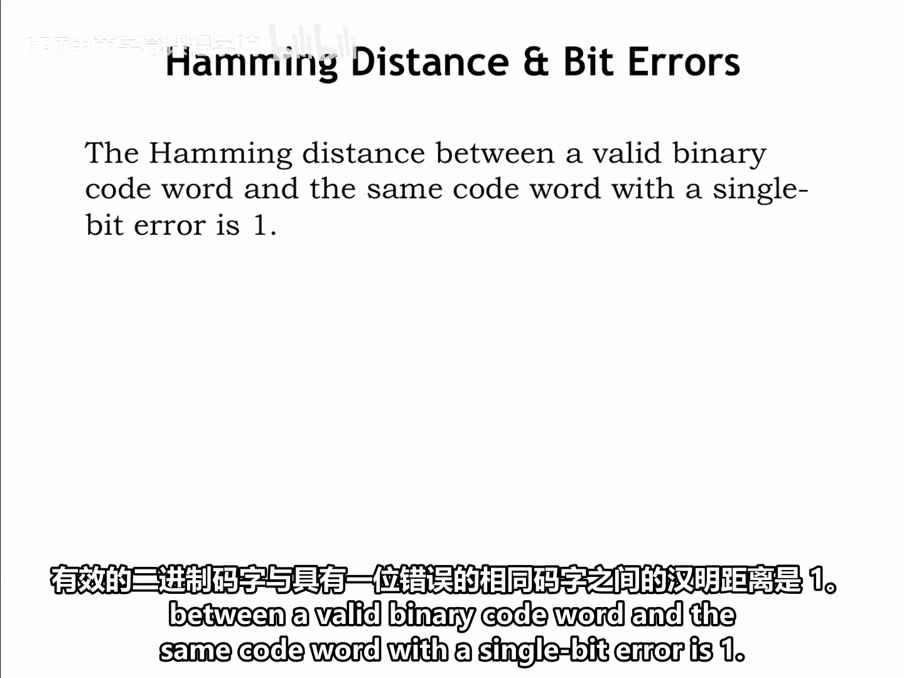
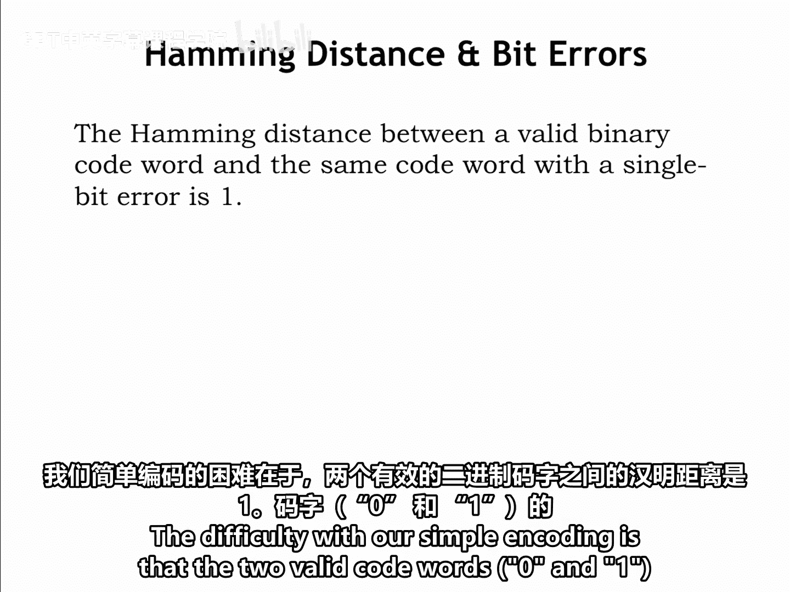
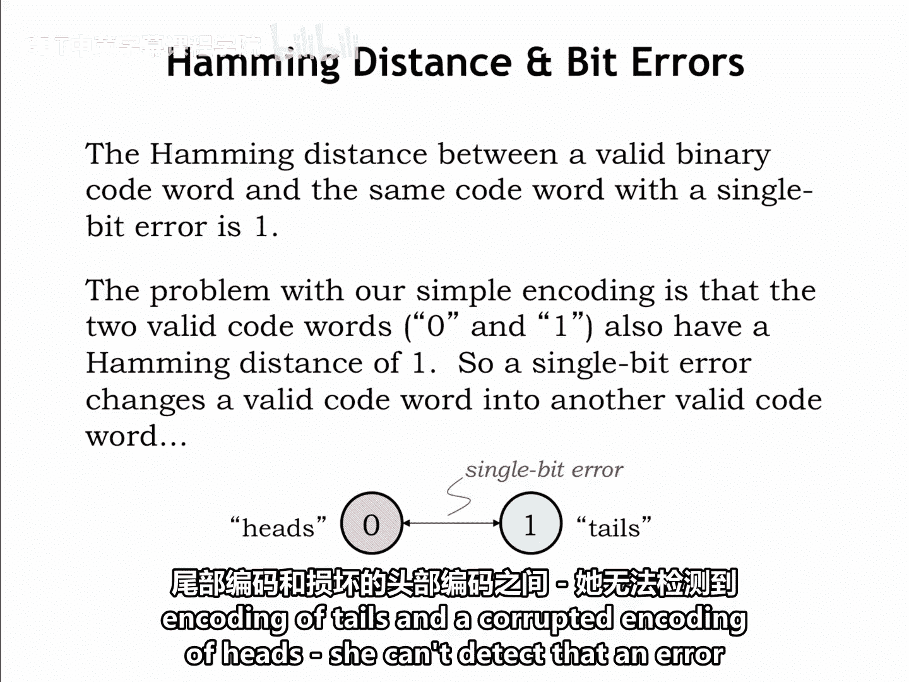
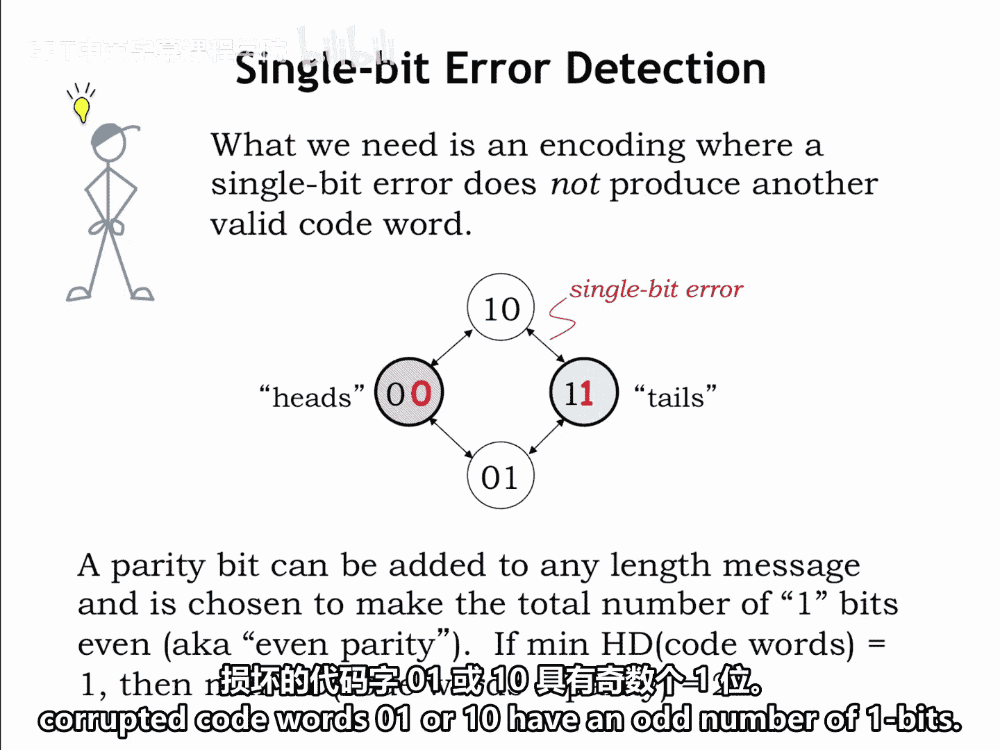
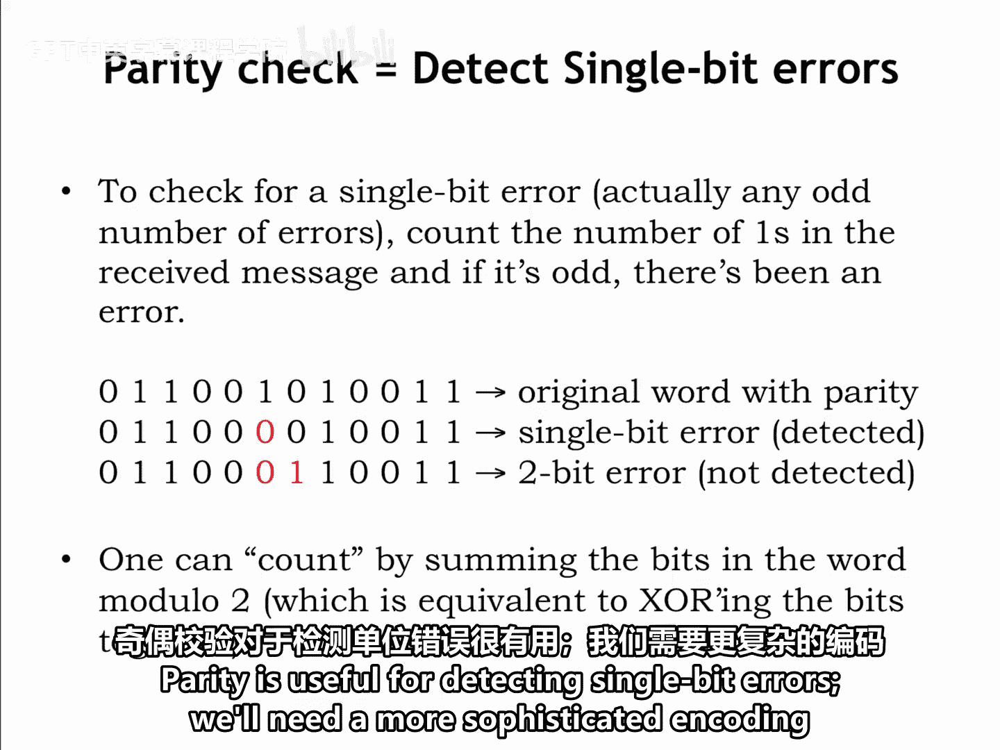
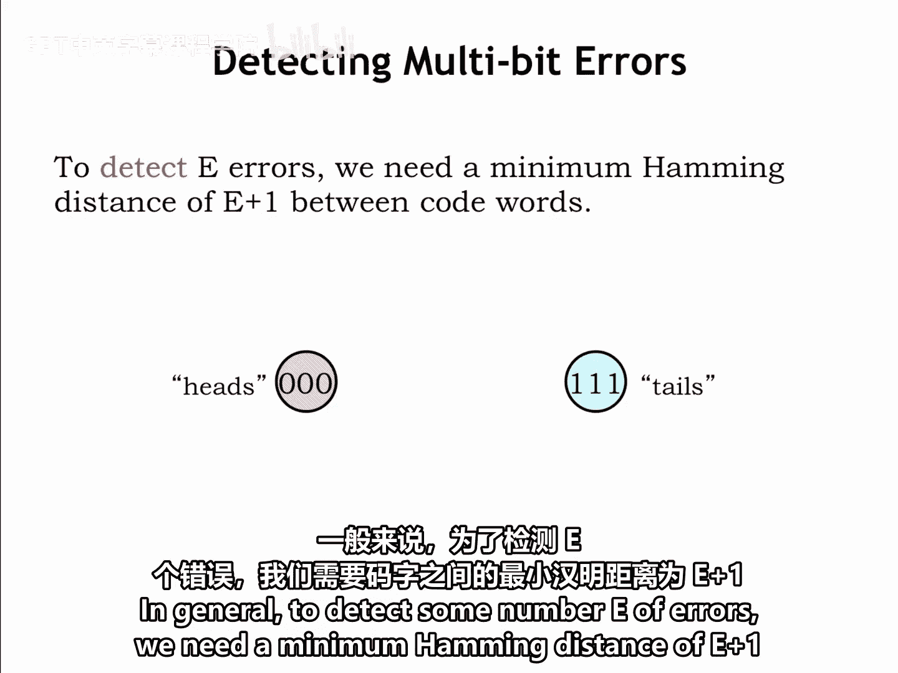
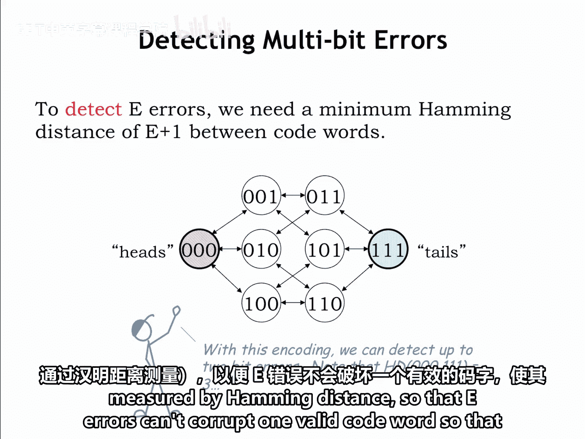

# 数字系统与计算机架构：1.2.10：错误检测与纠正 🔍

在本节课中，我们将要学习当数据在编码和传输过程中发生错误时，如何检测并纠正这些错误。我们将从简单的单比特错误开始，逐步引入汉明距离和奇偶校验等核心概念，并探讨如何设计编码方案以应对不同程度的错误。

---

现在，让我们思考一下，如果发生错误，并且我们编码数据中的一个或多个比特被破坏，会发生什么情况。我们将重点关注单比特错误，但所讨论的大部分内容可以推广到多比特错误。

例如，考虑对某个不可预测事件的结果进行编码。例如，抛掷一枚公平的硬币。有两种结果，正面编码为0，反面编码为1。

现在，假设在处理过程中发生了一些错误。例如，数据在从鲍勃传输给爱丽丝的过程中被破坏。鲍勃本意是发送消息“正面”，但传输过程中0被破坏变成了1。因此爱丽丝收到了1，并将其解释为“反面”。

所以，如果存在单比特错误的可能性，这种简单的编码方式效果不佳。

为了帮助讨论，我们将引入**汉明距离**的概念，其定义为两个相同长度的编码中，对应数字不同的位置数量。

例如，这里有两个七比特编码，它们在第三和第五个位置上不同，因此这两个编码之间的汉明距离是2。

如果有人告诉我们两个编码的汉明距离是零，那么这两个编码是相同的。汉明距离是衡量编码差异的便捷工具。

这如何帮助我们思考单比特错误？一个单比特错误恰好改变编码中的一个比特，因此一个有效的二进制码字与发生单比特错误的同一码字之间的汉明距离是1。

我们简单编码的困难在于，两个有效码字0和1之间的汉明距离也是1，因此一个单比特错误会将一个有效码字变成另一个有效码字。

我们将用图形方式展示这一点，使用箭头表示两个编码相差一个比特。换句话说，编码之间的汉明距离是1。

这里的真正问题是，当爱丽丝收到1时，她无法区分这是未损坏的“反面”编码，还是损坏的“正面”编码。她无法检测到错误已经发生。让我们找出解决她问题的方法。

关键在于想出一组有效码字，使得单比特错误不会产生另一个有效码字。我们需要的是至少相差两个比特的码字。换句话说，我们希望任意两个码字之间的最小汉明距离至少为2。

如果我们有一组最小汉明距离为1的码字，我们可以通过为每个原始码字添加一个**奇偶校验位**来生成我们想要的集合。

有偶校验和奇校验。使用偶校验时，选择额外的奇偶校验位，使得新码字中1比特的总数为偶数。

例如，我们最初对“正面”的编码是0，添加一个偶校验位得到00。对我们最初“反面”的编码添加一个偶校验位得到11。

码字之间的最小汉明距离从1增加到了2。这有什么帮助？

考虑发生单比特错误时的情况：00会被破坏为01或10。这两者都不是有效码字。啊哈，我们可以检测到发生了单比特错误。类似地，11的单比特错误也会被检测到。

请注意，有效码字00和11都有偶数个1比特，但损坏的码字01或10有奇数个1比特。我们说损坏的码字具有**奇偶性错误**。

执行奇偶校验很容易。只需计算码字中1的数量。如果是偶数，则未发生单比特错误。如果是奇数，则发生了单比特错误。我们将在后续章节中看到，可以使用布尔函数**异或**来执行奇偶校验。

请注意，如果发生偶数个比特错误，奇偶校验将无法帮助我们，因为损坏的码字将具有偶数个1比特，因此看起来是正常的。

奇偶校验对于检测单比特错误很有用，但需要更复杂的编码来检测更多错误。

一般来说，为了检测E个错误，我们需要码字之间的最小汉明距离为 **E + 1**。

我们可以在下面的图表中看到这一点，该图显示了错误如何破坏有效码字000和111，它们之间的汉明距离为3。理论上，这意味着我们应该能够检测到最多2个比特错误。

每个箭头代表一个单比特错误，从图中我们可以看到，从000或111出发，沿着任何长度为2的路径，都无法到达另一个有效码字。换句话说，假设我们从000或111开始，我们可以检测到最多2个错误的发生。

基本上，我们的错误检测方案依赖于选择汉明距离足够远的码字，使得E个错误无法将一个有效码字破坏成看起来像另一个有效码字的样子。

---

本节课中我们一起学习了错误检测的基本原理。我们引入了汉明距离作为衡量编码差异的工具，并解释了如何通过添加奇偶校验位来增加码字间的最小距离，从而检测单比特错误。我们还了解到，为了检测E个错误，需要的最小汉明距离为 **E + 1**。这些概念是构建更健壮的错误检测与纠正系统的基础。