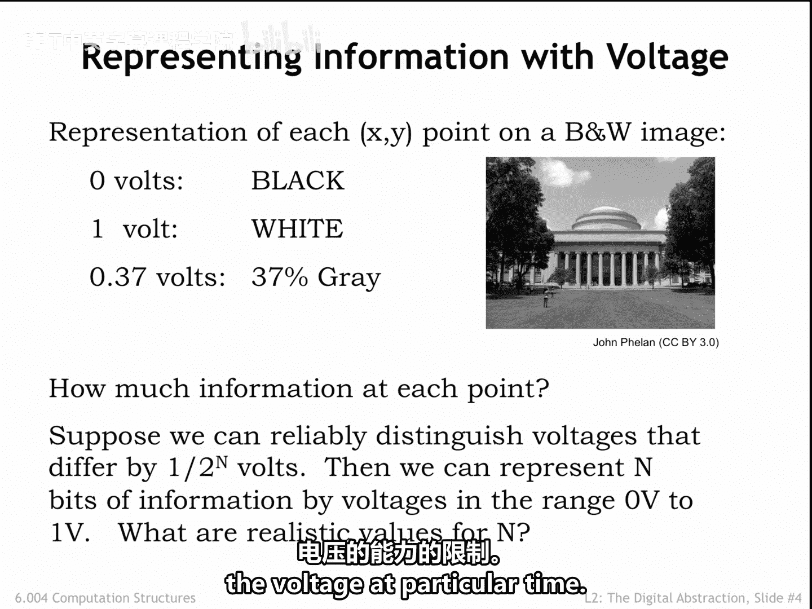
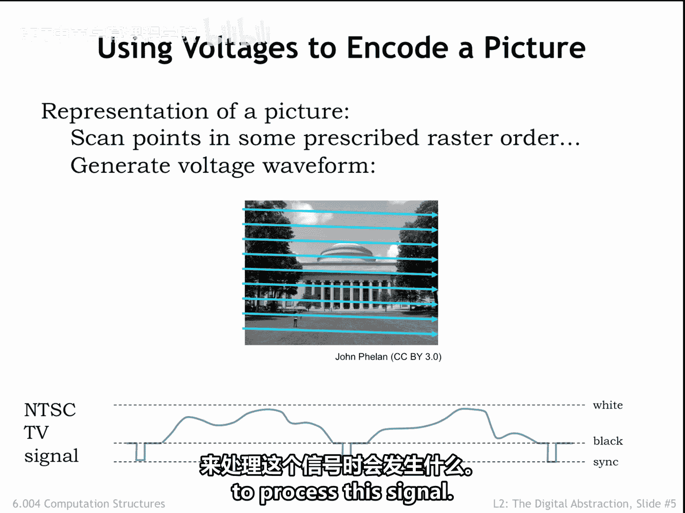
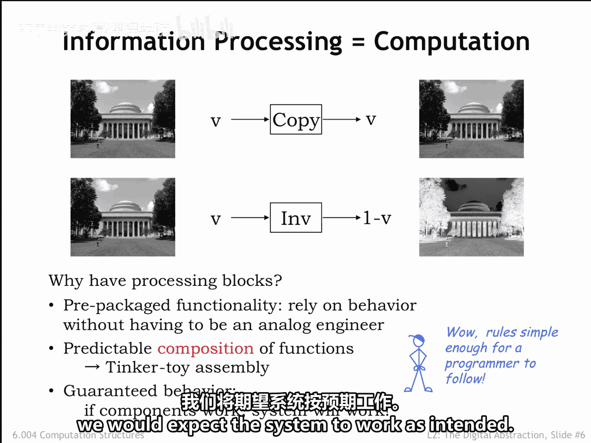
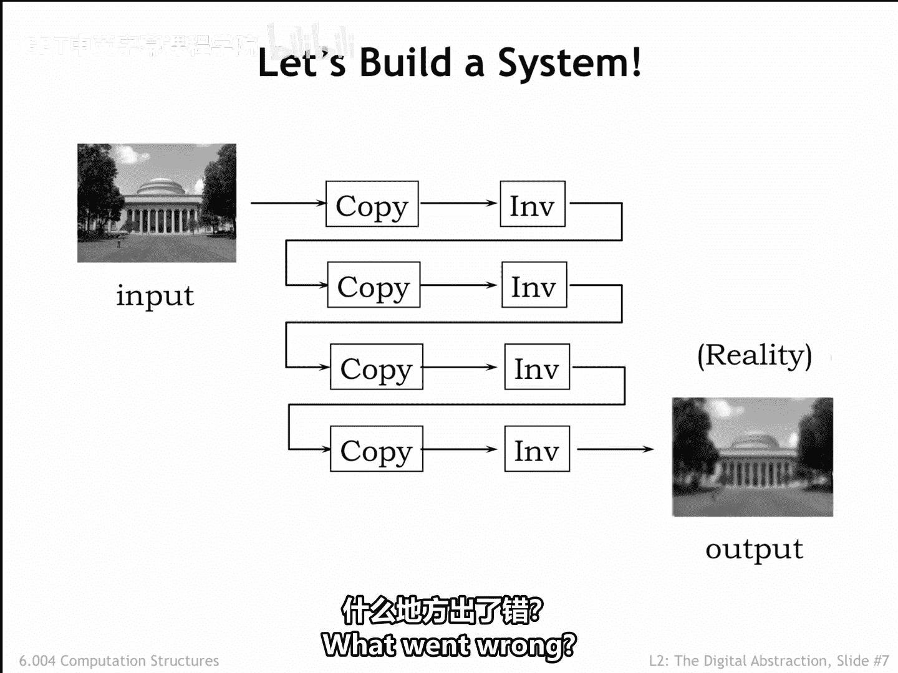
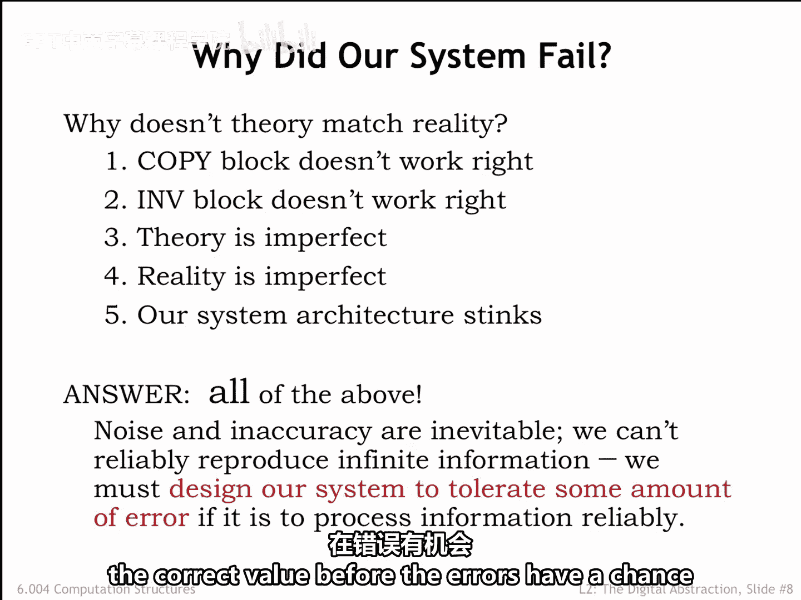

# 018：2.2.2 模拟信号 📡

在本节课中，我们将要学习如何使用电压来表示信息，特别是黑白图像中的信息。我们将探讨模拟信号表示的基本原理、其在实际系统中的局限性，以及为什么我们需要一种更可靠的信息处理方式。

---

考虑使用电压来表示黑白图像信息的问题。

图像中的每个 (X, Y) 点都有一个关联的强度。黑色是最弱的强度，白色是最强的强度。一个基于电压的明显表示方法是将强度编码为电压，例如，0伏代表黑色，1伏代表白色，中间强度则用介于两者之间的电压表示。

首先，图像中每个点包含多少信息？

答案取决于我们区分强度（或电压）的能力。如果我们能区分任意微小的差异，那么图像中的每个点都可能包含无限量的信息。但作为工程师，我们怀疑我们能够检测到的差异存在一个下限。

为了表示与 N 位二进制数相同的信息量，我们需要能够在 0 伏到 1 伏的范围内区分总共 **2^N** 个不同的电压。例如，当 N=2 时，我们需要能够区分四种可能的电压：0伏、1/3伏、2/3伏和1伏。这似乎并不困难。

理论上，N 可以任意大。但在实践中，如果我们想要达到百万分之一伏甚至十亿分之一伏的测量精度，这将极具挑战性，甚至几乎不可能。不仅设备会变得非常昂贵，测量耗时，而且热噪声等现象也会干扰我们在特定时刻对瞬时电压的定义。

因此，我们使用电压编码信息的能力，显然会受到我们可靠且快速地区分特定时刻电压的能力的限制。

---

上一节我们讨论了用电压表示图像信息的理论，本节中我们来看看如何将整幅图像转换为一个随时间变化的电压序列。

为了完成表示整幅图像的项目，我们将按照某种预定的光栅顺序（从左到右，从上到下）扫描图像，并将强度转换为电压。通过这种方式，我们可以将图像转换为一个随时间变化的电压序列。

这就是早期电视机的工作原理。图像被编码为一个在代表黑色和白色的电压之间变化的电压波形。实际上，电压范围被扩展，以允许信号指定水平扫描的结束和一幅图像的结束，即所谓的同步信号。我们称之为**连续波形**，表示它在特定时间点可以取指定范围内的任何值。

现在，让我们看看当我们尝试构建一个系统来处理这个信号时会发生什么。

---

我们使用两个简单的处理模块来创建一个系统。**复制模块**在其输出端重现其输入端的任何电压。复制模块的输出看起来与原始图像相同。**反相模块**在输入电压为 V 时，产生一个 **1 - V** 的电压。换句话说，白色被转换为黑色，反之亦然。图像通过反相模块后，我们得到输入图像的负片。

为什么要使用处理模块？使用预封装模块是构建大型电路的常用方法。我们可以通过将一个模块连接到另一个模块来组装系统，并在无需理解每个模块内部细节的情况下，推理出最终系统的行为。模块提供的预封装功能使其易于使用，无需成为模拟电路专家。

此外，我们期望能够在构建不同系统时以不同配置连接模块，并能够根据每个模块的行为预测每个系统的行为。这将允许我们像搭积木一样，通过将一个模块连接到另一个模块来简单地构建系统。即使是不懂电路细节的程序员，也可以期望构建出执行特定处理任务的系统。整个理念的核心在于**可预测行为的保证**。如果组件正常工作，并且我们按照连接模块的规则进行连接，我们期望系统能按预期工作。

---

所以，让我们用复制和反相模块构建一个系统。下图是一个使用多个这两种模块实例的图像处理系统。我们期望输出图像看起来是什么样子？理论上，复制模块不会改变图像，而反相模块的数量是偶数个，因此输出图像应该与输入图像完全相同。

但在现实中，输出图像并非输入的完美副本，它略显模糊。强度略有偏差，并且看起来强度的急剧变化被平滑了，产生了原始图像的模糊再现。哪里出了问题？

---

为什么理论与现实不符？也许复制和反相模块不能正确工作。从它们不完全遵守其行为的数学描述这个意义上说，这几乎肯定是正确的。微小的制造差异和不同的环境条件会导致每个复制模块实例在输入 V 伏时，输出不是 V 伏，而是 **V + ε** 伏，其中 ε 代表处理过程中引入的误差量。反相模块也是如此。

困难在于，在我们这种强度的连续值表示中，**V + ε** 本身就是一个完全正确的输出值，只是它不对应于 V 伏的输入。换句话说，我们无法区分一个轻微损坏的信号和一个对应于略微不同图像的完全有效信号。

更重要的是，这也是真正致命的问题：**误差会随着编码图像通过由复制和反相模块组成的系统而累积**。系统越大，累积的处理误差就越大。这似乎不太理想。如果我们不得不规定在编码信息上可以执行多少次计算，然后结果才会因损坏过多而无法使用，这至少会非常尴尬。

如果你认为这意味着我们用来描述系统操作的理论是不完美的，那么你是正确的。我们确实需要一个非常复杂的理论来捕捉输出信号可能偏离其预期值的所有可能方式。那些具有数学思维的人可能会抱怨现实是不完美的。但这有点过了。现实就是现实。作为工程师，我们需要构建能够在现实世界中可靠运行的系统。

因此，真正的问题可能在于我们如何选择设计系统。事实上，以上所有情况都是真实的：噪声和不精确是不可避免的。我们无法可靠地再现无限的信息。如果我们的系统要可靠地处理信息，我们必须设计它能够容忍一定量的误差。基本上，我们需要找到一种方法，来**注意到处理步骤引入了误差，并在误差有机会累积之前恢复正确的值**。

如何做到这一点，将是我们下一个主题的内容。

---

本节课中，我们一起学习了如何使用模拟电压信号表示图像信息。我们探讨了模拟表示的无限信息潜力及其在实际中受到测量精度和噪声限制的现实。通过构建一个简单的图像处理系统，我们发现了模拟信号处理中误差累积的根本问题，这引出了对更可靠信息表示和处理方法的需求。下一节，我们将探讨解决这一问题的关键思路。