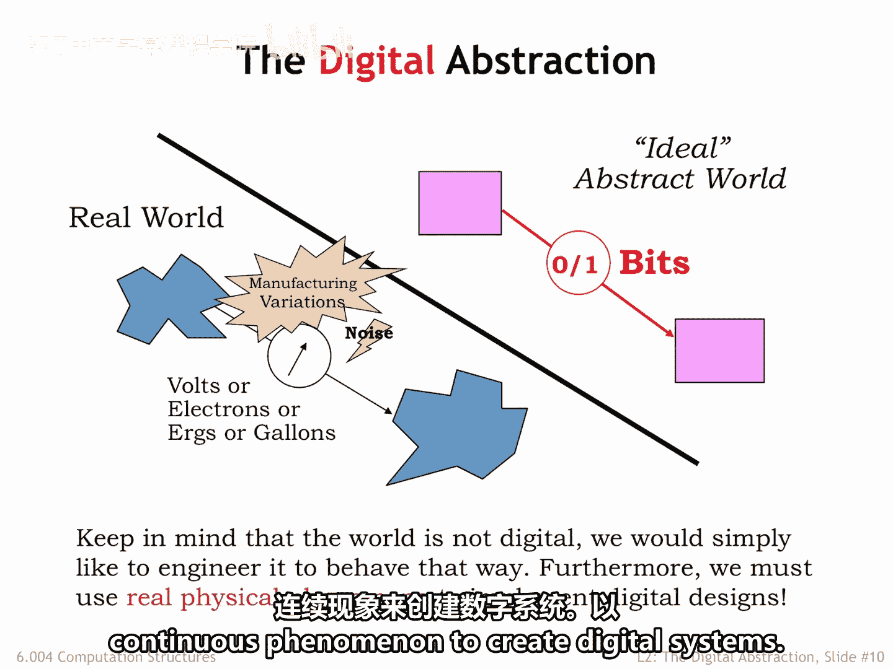
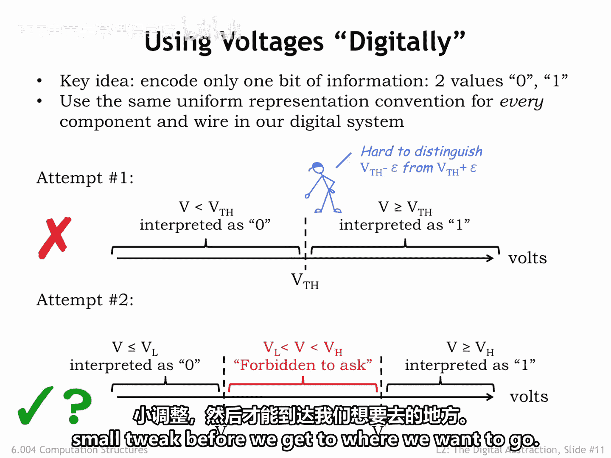

# 019：使用电压进行数字表示 📊

在本节课中，我们将学习如何利用连续的电压世界来表示离散的数字信息，这是构建数字系统的核心工程思想。我们将探讨几种电压表示方案，并最终找到一个既实用又可靠的解决方案。

## 数字抽象的概念

为了解决我们的工程问题，我们将引入所谓的“数字抽象”。

关键思路是利用连续的电压世界来表示一个小的、有限的数值集合。在我们的案例中，就是两个二进制值：**0** 和 **1**。

需要记住的是，世界本身并非天生就是数字化的。我们只是希望通过工程手段，让它表现得像数字世界一样，即利用连续的物理现象来实现数字设计。

## 从连续到离散的挑战

作为一个简短的补充，需要提及的是，存在一些物理现象本质上是数字化的。换句话说，它们被观察到具有几个量子化的值之一。例如，电子的自旋。

这对经典物理学家来说是一个意外，他们曾认为物理量的测量是连续的。量子理论的发展，用于描述某些原子粒子所经历的有限自由度，彻底改变了经典物理学的世界。我们现在才开始研究如何将量子物理学应用于计算，并且在构建量子计算机方面有了一些有趣的进展报告。

但对于本课程，我们将专注于如何利用经典的连续现象来创建数字系统。

## 第一次尝试：单一阈值方案

使用电压进行数字表示的关键思想是建立一个信号约定，每次只编码一位信息。换句话说，两个值（0或1）中的任何一个，都将使用我们数字系统中每个组件和导线的统一表示方式。

我们将通过三次尝试来得出一个能解决所有问题的电压表示方案。

我们的第一次尝试是显而易见的方案：简单地将电压范围划分为两个子范围，一个范围代表0，另一个代表1。

选取某个阈值电压 **V_TH** 将范围一分为二。

当电压 **v** 小于阈值电压时，我们将其视为代表比特值 **0**。

当电压 **v** 大于或等于阈值电压时，它将代表比特值 **1**。

这种表示法为所有可能的电压分配了一个数字值。

这个定义的问题部分在于难以解释接近阈值的电压。

给定一个特定电压的数值，很容易应用规则并得出相应的数字值。但是，随着电压越来越接近阈值，准确确定正确的数值会变得更加耗时且昂贵。所涉及的电路必须由精密元件制成，并在精确控制的物理环境中运行。考虑到我们想要构建的系统所处的多种环境以及适中的成本预期，这很难实现。

因此，尽管这个定义具有吸引人的数学简洁性，但在实际应用上是不可行的。这个方案得到了一个大大的红色叉号。

## 第二次尝试：引入禁止区

在第二次尝试中，我们将引入两个阈值电压：**V_L** 和 **V_H**。

电压小于或等于 **V_L** 将被解释为 **0**，电压大于或等于 **V_H** 将被解释为 **1**。

**V_L** 和 **V_H** 之间的电压范围被称为“禁止区”，在这个区域内，我们被禁止要求数字系统有任何特定的行为。

一个特定的系统可以将禁止区内的电压解释为 **0** 或 **1**，甚至不需要在其解释上保持一致。事实上，系统甚至不需要对这个范围内的电压产生任何解释。

这有什么帮助呢？现在，我们可以构建一个快速且不那么精确的电压到比特转换器，例如，使用一个高增益运算放大器和一个位于禁止区某处的参考电压，来判断给定电压是高于还是低于阈值电压。

这个参考电压不需要超级精确，因此可以用低成本、精度为10%的电阻构建的分压器来生成。参考电压可能会随着工作温度变化或电源电压变化等而略有改变。我们只需要保证转换器对于低于 **V_L** 或高于 **V_H** 的电压有正确的行为。

这种表示法非常有前景，目前我们暂且给它一个绿色的对勾。经过更多讨论后，在我们达到目标之前，还需要再做一个小小的调整。

## 总结

本节课中，我们一起学习了“数字抽象”的核心思想，即如何利用连续的电压来表示离散的二进制值。我们分析了使用单一阈值的简单方案在实际中的缺陷，并引入了带有“禁止区”的双阈值方案，该方案通过放宽对中间电压的精确要求，为构建低成本、高可靠性的数字系统提供了可行的工程路径。