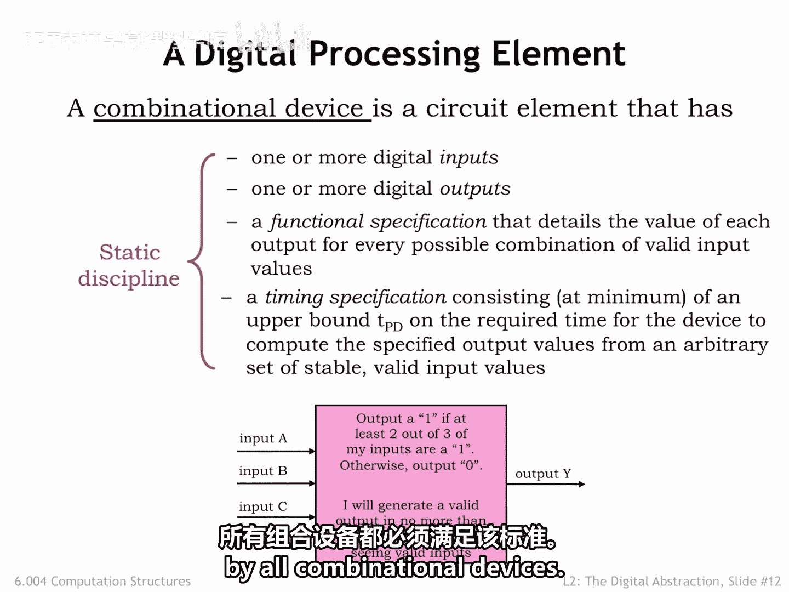
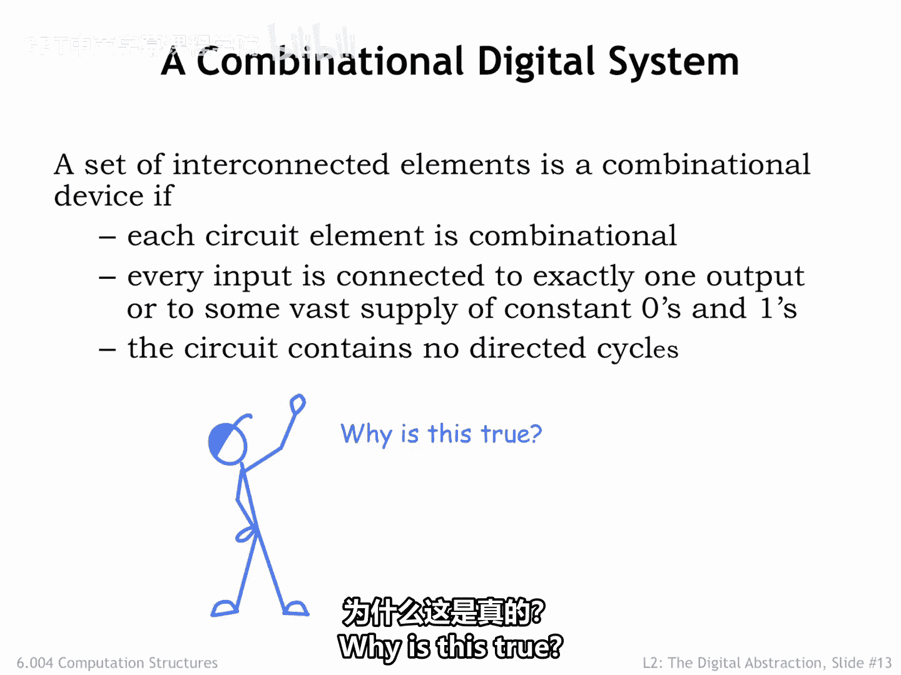
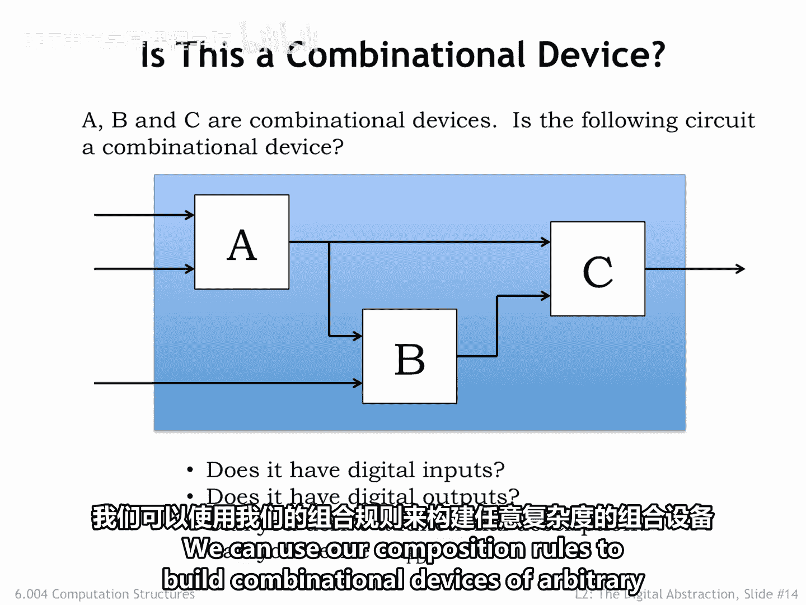

# 020：组合逻辑器件 🧩

在本节课中，我们将学习组合逻辑器件的精确定义，以及如何通过组合规则将多个小型组合器件连接起来，构建出更大、更复杂的数字系统。

---

## 组合逻辑器件的定义

上一节我们讨论了数字信号，现在我们可以定义什么是数字处理元件。

我们说一个器件是**组合逻辑器件**，当且仅当它满足以下四个标准：

1.  **数字输入**：器件使用我们的信号约定，将低于 **`ViL`** 的输入电压解释为数字值 **0**，将高于 **`ViH`** 的输入电压解释为数字值 **1**。
2.  **数字输出**：器件通过产生小于等于 **`VL`** 的电压来输出 **0**，通过产生大于等于 **`VH`** 的电压来输出 **1**。
3.  **功能规范**：器件必须有一个详细的功能规范，说明对于输入数字值的每一种可能组合，每个输出对应的值。
4.  **时序规范**：器件必须有一个时序规范，告诉我们器件的输出反映其输入值变化需要多长时间。至少必须指定一个称为 **`TPD`**（传播延迟）的上限时间。

我们将这四个标准统称为**静态规范**，所有组合逻辑器件都必须满足它。

---

## 组合规则

为了用组合逻辑元件构建更大的组合系统，我们需要遵循以下组合规则：

以下是构建组合系统时必须遵守的三条核心规则：

1.  **每个系统组件本身必须是组合逻辑器件**。
2.  **每个组件的每个输入**必须连接到：系统输入、或另一个器件的**恰好一个**输出、或代表值 **0** 或值 **1** 的恒定电压。
3.  **互连的组件不能包含任何有向环**。换句话说，从系统输入到输出的任何路径中，一个特定的组件最多被访问一次。

我们的主张是：使用这些组合规则构建的系统本身也将是组合逻辑器件。我们可以用组合逻辑组件构建任意大小的组合逻辑器件，并且可以预期它仍然遵守静态规范。

---

## 为什么组合规则有效？

为了理解为什么这个主张成立，让我们考虑一个由组合逻辑器件 A、B 和 C 构建的系统。我们将通过证明整个系统确实遵守静态规范，来证明它本身是组合逻辑的。

1.  **系统有数字输入吗？** 是的。系统的输入是某些组件器件的输入。由于组件是组合逻辑的，因此具有数字输入，所以整个系统继承了其组件的属性，也具有数字输入。
2.  **系统有数字输出吗？** 是的。同理，系统的所有输出都连接到某个组件，而组件是组合逻辑的，因此输出是数字的。
3.  **我们能推导出系统的功能规范吗？** 是的。我们可以通过组件模块逐步传播当前输入值的信息。由于电路中没有环路，我们可以根据电路拓扑确定的顺序，通过评估组合组件的行为来确定每个内部信号的值。
4.  **我们能推导出系统的传播延迟 `TPD` 吗？** 是的。由于没有环路，我们可以枚举从系统输入到系统输出的所有有限长度路径。然后，我们可以通过累加路径上各组件的 `TPD` 来计算特定路径的 `TPD`。整个系统的 `TPD` 将是所有可能输入到输出路径中 `TPD` 的最大值，即最长路径的 `TPD`。

因此，整个系统确实遵守静态规范，它本身就是一个组合逻辑器件。这非常巧妙，意味着我们可以使用组合规则构建任意复杂度的组合逻辑器件。

---

## 总结

本节课中，我们一起学习了组合逻辑器件的精确定义，它必须满足**数字输入、数字输出、功能规范和时序规范**这四项静态规范。我们还学习了构建更大组合系统的三条**组合规则**，并通过逻辑推导证明了遵循这些规则构建的系统本身也是组合逻辑器件，从而确保了数字系统设计的可靠性和可扩展性。