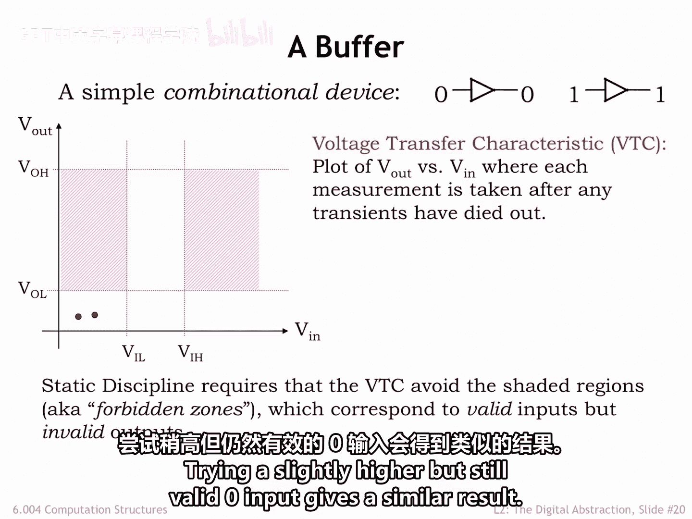
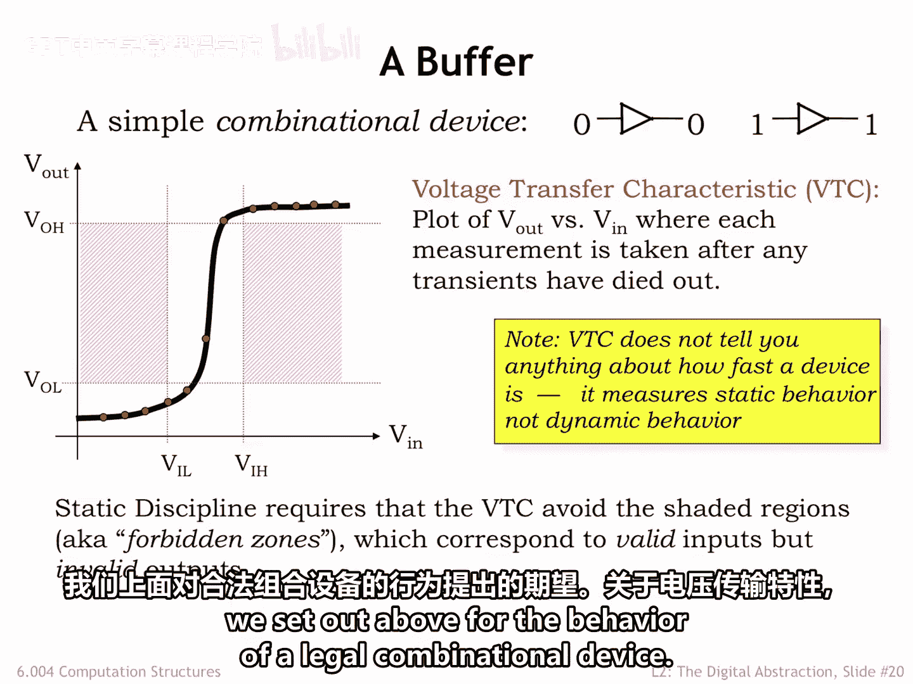
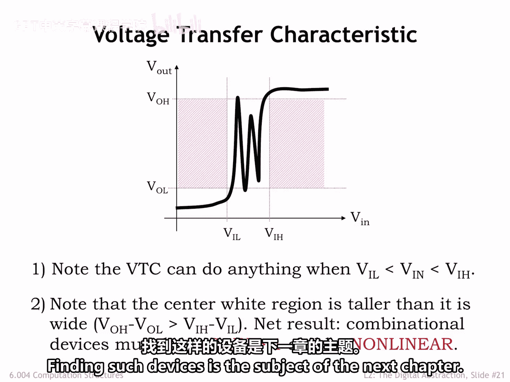

# 数字系统与计算机架构：P1：2.2.6 电压传输特性 📈

在本节课中，我们将学习如何通过测量一个简单的组合器件——缓冲器——来理解其电压传输特性。我们将探讨静态纪律如何约束其行为，并了解为什么构建组合逻辑电路需要非线性器件。

---

让我们使用一个最简单的组合器件——缓冲器——来进行一些测量。

缓冲器有一个输入和一个输出。在经过一个很小的传播延迟后，其输出将驱动为与输入相同的数字值。

这个缓冲器遵守静态纪律。这是组合器件的核心要求。

它使用了一个修订后的信号规范，该规范包含了低噪声容限和高噪声容限。

测量将通过将输入电压设置为从零伏到电源电压的一系列值来完成。

在将输入电压设置为特定值后，我们会等待输出电压稳定下来。换句话说，我们会等待缓冲器的传播延迟。

我们将结果绘制在一张图表上，横轴为输入电压，纵轴为测得的输出电压。得到的曲线被称为缓冲器的电压传输特性。

为了方便起见，我们在两个坐标轴上标记了信号阈值。

在开始绘制点之前，请注意，静态纪律约束了任何组合器件的电压传输特性必须呈现的样子。

如果我们等待器件的传播延迟，那么当输入电压是有效的数字值时，测得的输出电压也必须是一个有效的数字值。有效输入，有效输出。

我们可以用图表上的阴影禁止区域来图形化地展示这一点。这些区域中的点对应着有效的数字输入电压，但却是无效的数字输出电压。因此，对于一个合法的组合器件，其电压传输特性上的点都不会落在这两个区域内。

好的，回到我们的缓冲器。

将输入电压设置为低于低输入阈值 **V_IL** 的值，会产生一个低于 **V_OL** 的输出电压，正如预期的那样。数字零输入产生数字零输出。

尝试一个稍高但仍有效的零输入，会得到类似的结果。

请注意，这些测量并没有告诉我们任何关于缓冲器速度的信息。它们只是测量器件的静态行为，而不是动态行为。

如果我们继续进行所有额外的测量，就会得到缓冲器的电压传输特性，如图中黑色曲线所示。

请注意，该曲线没有穿过阴影区域，符合我们上面设定的合法组合器件行为的预期。

关于电压传输特性，有两个有趣的观察结果。

让我们更仔细地观察图表中心的白色区域，该区域对应输入电压在 **V_IL** 到 **VIH** 的范围内。

首先，请注意这些输入电压处于我们信号规范的禁止区内，因此组合器件可以产生任何它想要的输出电压，并且仍然遵守静态纪律，因为静态纪律只约束器件在有效输入下的行为。

其次，请注意由四个电压阈值限定的中心白色区域，其高度大于宽度。这是因为我们的信号规范具有正的噪声容限。所以，**V_OH - V_OL** 严格大于 **VIH - V_IL**。

任何穿过此区域的电压传输特性曲线，其某部分的斜率绝对值必须大于1。

在电压传输特性曲线斜率绝对值大于1的点上，请注意输入电压的微小变化会导致输出电压发生更大的变化。这就是斜率绝对值大于1的含义。

在电气术语中，我们会说该器件的增益大于1或小于-1，其中我们将增益定义为给定输入电压变化下的输出电压变化。

如果我们考虑用组合元件构建更大的电路，任何输出都可能连接到其他输入。这意味着横轴的范围 **V_in** 必须与纵轴的范围 **V_out** 相同。换句话说，电压传输特性图必须是正方形的，并且电压传输特性曲线必须位于这个正方形内。

为了适应正方形的边界，电压传输特性曲线必须在某处改变斜率，因为我们从上面知道，必须存在斜率绝对值大于1的区域，并且它不可能在整个输入范围内都大于1。

在其工作范围内表现出增益变化的器件被称为非线性器件。

综上所述，这些观察告诉我们，不能仅使用线性器件（如电阻、电容和电感）来构建组合器件。我们需要增益大于1的非线性器件。

寻找这样的器件是下一章的主题。

---

本节课中，我们一起学习了如何通过测量缓冲器来绘制和理解电压传输特性。我们明确了静态纪律对组合器件输入输出关系的约束，并认识到构建可靠的数字电路需要具有增益的非线性器件，因为线性器件无法满足信号规范中关于噪声容限和电压摆幅的要求。