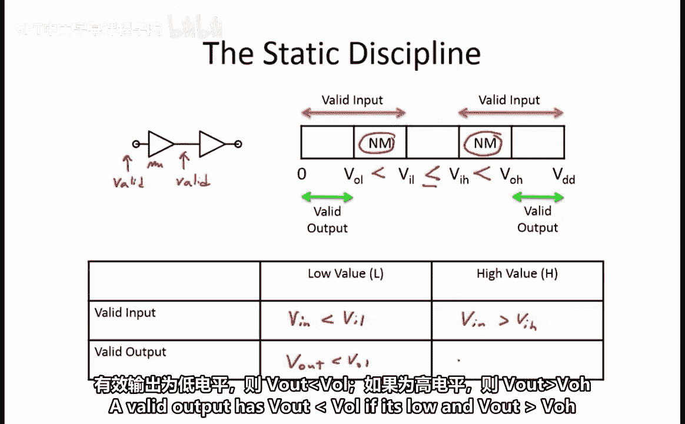
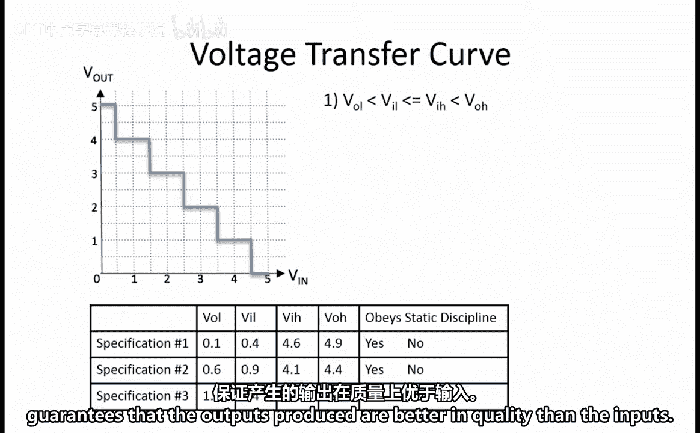
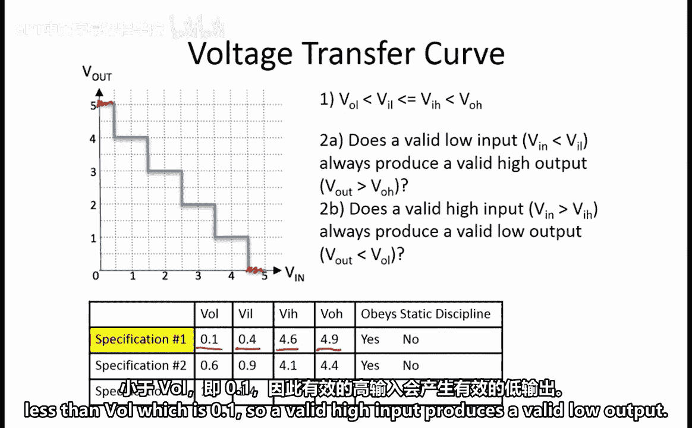
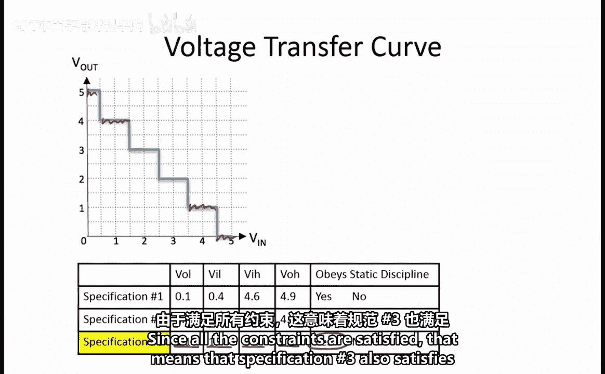

# 024：2.2.8 静态约束实例分析

在本节课中，我们将学习如何判断一个电路的电压规格是否满足“静态约束”。静态约束是确保数字电路能够可靠级联工作的关键规则。

## 静态约束的核心要求

为了满足静态约束，一个电路产生的输出信号质量必须优于可接受的输入信号质量。这确保了当多个门电路（例如，一个缓冲器后接另一个缓冲器）级联时，即使前一级门电路引入了少量噪声，后一级门的输入也始终是有效的。

更具体地说，要满足静态约束，必须满足以下条件：
*   一个有效的低电平输出必须比有效的低电平输入“更低”。即：**`V_OL < V_IL`**。
*   一个有效的高电平输出必须比有效的高电平输入“更高”。即：**`V_OH > V_IH`**。

综合起来，我们得到：**`V_OL < V_IL <= V_IH < V_OH`**。另一种理解方式是观察有效输入的范围（橙色和绿色箭头所示），它比有效输出的范围更宽。图中还显示了噪声容限，它对应着有效输入但非有效输出的区域。

## 有效输入与输出的定义

正如之前所述：
*   一个有效输入要么是低电平（`V_in < V_IL`），要么是高电平（`V_in > V_IH`）。
*   一个有效输出要么是低电平（`V_out < V_OL`），要么是高电平（`V_out > V_OH`）。

## 问题：判断规格是否满足静态约束

在这个问题中，我们希望判断规格1、2和3（它们都提供0.3伏的噪声容限）在给定的电压传输曲线下是否满足静态约束。

对于每个规格，我们需要检查以下两个约束条件：
1.  是否满足 **`V_OL < V_IL <= V_IH < V_OH`**？满足此约束保证了输出信号的质量优于输入。
2.  一个有效输入是否总是产生一个有效输出？由于此曲线显示了一个反相功能，这具体转化为：
    *   A. 一个有效的低输入（`V_in < V_IL`）是否总是产生一个有效的高输出（`V_out > V_OH`）？
    *   B. 一个有效的高输入（`V_in > V_IH`）是否总是产生一个有效的低输出（`V_out < V_OL`）？

如果所有约束都满足，则该规格遵守静态约束；否则，不遵守。

对于所有三个规格，我们都可以看到确实满足 **`V_OL < V_IL <= V_IH < V_OH`**。因此，第一个约束对三个规格都成立。

现在，让我们检查第二个约束。

### 规格一分析
*   如果 `V_in < V_IL` (即 0.4V)，则 `V_out = 5V`，它大于 `V_OH` (4.9V)。因此，有效的低输入产生了有效的高输出。
*   如果 `V_in > V_IH` (即 4.6V)，则 `V_out = 0V`，它小于 `V_OL` (0.1V)。因此，有效的高输入产生了有效的低输出。

由于所有约束都满足，**规格一满足静态约束**。

### 规格二分析
*   如果 `V_in < 0.9V`，则 `V_out >= 4V`，它并不大于 `V_OH` (4.4V)。因此，有效的低输入**未能**产生有效的高输出。

所以，**规格二不满足静态约束**。

### 规格三分析
*   如果 `V_in < 1.4V`，则 `V_out >= 4V`，在这种情况下它大于 `V_OH` (3.9V)。因此，约束的第一部分成立。
*   现在检查有效高输入的情况：如果 `V_in > 3.6V`，则 `V_out <= 1V`，它小于 `V_OL` (1.1V)。因此，约束的这一部分也成立。

由于所有约束都满足，这意味着**规格三也满足静态约束**。

## 总结

本节课中，我们一起学习了静态约束的具体应用。我们通过分析三个具体规格的实例，掌握了判断电路是否满足静态约束的两步法：首先检查电压阈值是否满足 **`V_OL < V_IL <= V_IH < V_OH`** 的关系，然后验证在给定的电压传输曲线下，所有有效输入是否都能产生对应的有效输出。只有同时满足这两个条件，电路才能可靠地级联工作。