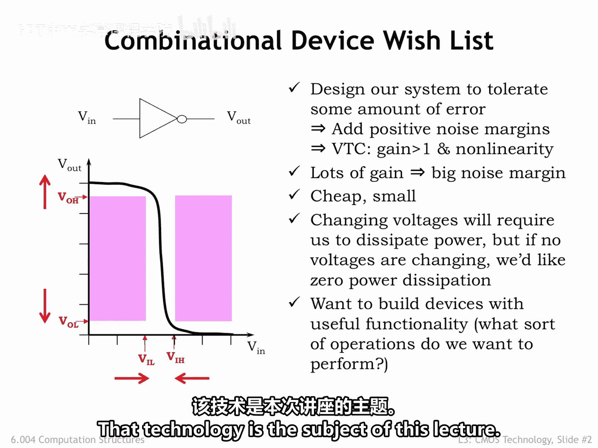
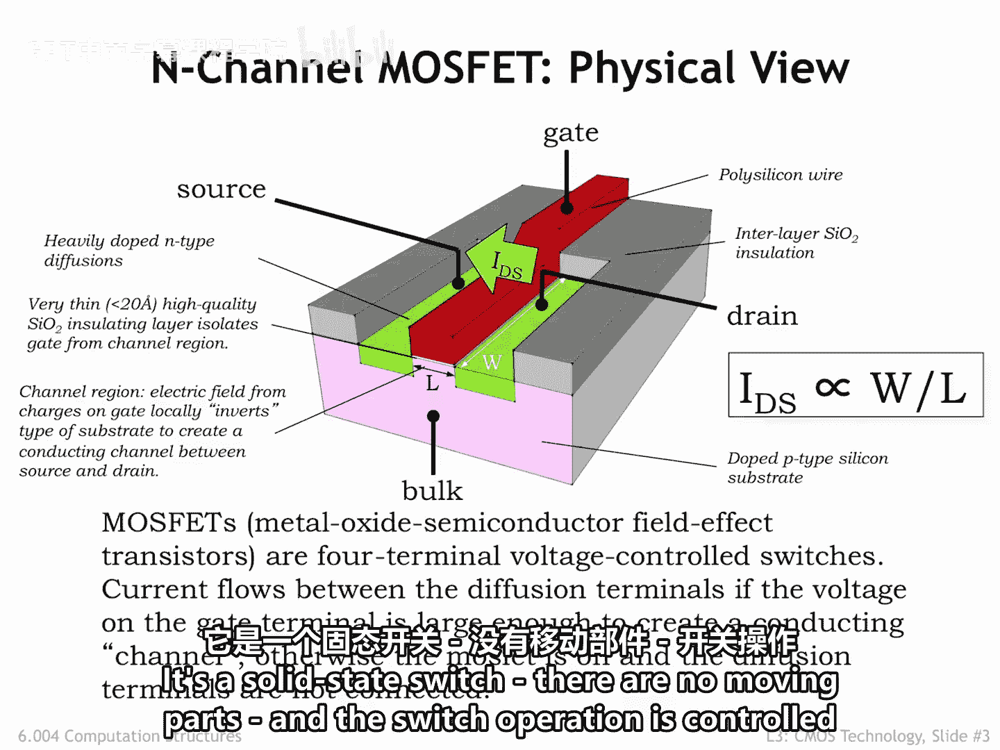

# 025：3.2.1 MOSFET物理结构 🔬

在本节课中，我们将学习组合逻辑器件的理想特性，并深入探讨一种能实现这些特性的关键技术——金属氧化物半导体场效应晶体管（MOSFET）的物理结构。

上一节我们介绍了组合逻辑器件的电压传输特性。本节中，我们来看看实现这些特性所需的具体电路技术。

## 组合逻辑器件的理想特性回顾

首先，让我们回顾一下对组合逻辑器件特性的期望清单。

在之前的课程中，我们努力开发了一种基于电压的信息表示方法，这种方法能够在信息流经处理元件系统时容忍一定程度的误差。

我们指定了四个信号阈值：
*   **VOL** 和 **VOH** 分别设定了组合器件输出端用于表示逻辑0和逻辑1的电压上限和下限。
*   **VIL** 和 **VIH** 则用于类似地解释组合器件输入端的电压。

我们规定 **VOL** 必须严格小于 **VIL**，并将这两个低电平阈值之间的差值称为**低电平噪声容限**。这是指可以添加到输出信号中，但仍能在任何连接的输入端被正确解读的噪声量。

出于同样的原因，我们规定 **VIH** 必须严格小于 **VOH**。

当我们查看电压传输特性（VTC）时，我们看到了包含噪声容限的影响。VTC是组合器件输出电压（V_out）相对于输入电压（V_in）的曲线图。

由于组合器件在稳态下，必须在给定有效输入电压时产生有效的输出电压，我们可以在VTC中识别出**禁止区域**。这些区域对应有效的输入电压，但标识出无效的输出电压范围。一个合法的组合器件的VTC不能有任何点落入这些区域。

由四个阈值电压界定的中心区域，其宽度小于高度。因此，任何合法的VTC都必须有一个增益大于1的区域，并且整个VTC必须是非线性的。这里展示的VTC是一个作为反相器的组合器件的特性。

如果我们有幸使用一种提供高增益、且输出电压接近地电位和电源电压的电路技术，我们就可以将VOL和VOH向外推向电源轨，同时将VIL和VIH向内推，从而带来增加噪声容限的好结果——这总是一件好事。

回想第2讲的开头，我们的数字系统将需要数十亿个器件，因此每个器件都必须非常便宜且小巧。在当今的移动世界中，系统能够依靠电池长时间运行，这意味着我们希望系统的功耗尽可能低。当然，处理信息必然需要改变系统内的电压，这会消耗一定的功率。但如果系统空闲且内部电压没有变化，我们希望系统的功耗为零。最后，我们希望实现具有有用功能的系统，因此需要开发我们想要执行的逻辑运算的目录。

非常了不起的是，有一种电路技术将让我们的愿望成真。这项技术就是本讲的主题。

## 核心器件：MOSFET

我们讨论的主角是金属氧化物半导体场效应晶体管，简称MOSFET。

下图是一个MOSFET的3D剖面图，它由复杂的电气材料夹层构成，是集成电路的一部分。之所以称为集成电路，是因为其中的各个器件是在一系列制造步骤中全部批量制造的。

在现代工艺中，图中所示模块的边长仅为几十纳米。这大约是人类一根细头发丝厚度的十分之一。这个尺寸非常小，以至于无法使用普通光学显微镜观察，因为其分辨率受限于可见光的波长（400至750纳米）。多年来，工程师们能够大约每24个月将器件尺寸缩小一半，这一观察结果被称为**摩尔定律**，以英特尔创始人之一戈登·摩尔的名字命名，他于1965年首次指出了这一趋势。

每次尺寸缩小50%，就使得集成电路制造商能够在相同面积上制造出四倍于以前的器件。正如我们将看到的，器件本身也会变得更快。

1975年的集成电路可能只有2500个器件。今天，我们能够制造包含20到30亿个器件的IC。

以下是图中内容的快速导览：
*   构建IC的基底是一片薄的硅晶体晶圆，其中添加了杂质以使其导电。在本例中，杂质是像硼这样的受主原子。我们将这种掺杂硅表征为**P型半导体**。
*   IC将包括一个与P型基底的电接触点，称为**体端**，以便在需要时控制其电压。
*   为了在导电材料之间提供电绝缘，我们使用一层**二氧化硅**。通常，绝缘层的厚度并不特别重要，除非它用于隔离晶体管的栅极（图中红色部分）与基底。该区域的绝缘层非常薄，以便栅极导体上的电荷产生的电场能够轻易地影响基底。
*   晶体管的**栅极端**是一个导体。在本例中是**多晶硅**。栅极、薄氧化层绝缘层和P型基底形成了一个电容器，改变栅极上的电压将导致栅极正下方的P型基底发生电学变化。
*   在早期的制造工艺中，栅极端由金属制成，术语“金属氧化物半导体”（MOS）指的就是这种特定结构。
*   栅极端就位后，像磷这样的施主原子被注入到栅极两侧的两个矩形区域的P型基底中。这将那些区域改变为**N型半导体**，成为MOSFET的另外两个终端，称为**源极**和**漏极**。

请注意，源极和漏极在物理上是相同的，它们通过器件工作期间所扮演的角色来区分。正如我们将在下一张幻灯片中看到的，MOSFET的功能是一个电压控制开关，连接器件的源极和漏极端。当开关导通时，电流将从漏极流向源极，流经作为栅极电容器第二极板形成的导电沟道。

## MOSFET的关键参数

MOSFET有两个关键尺寸：
*   其**长度 L**，测量电流从漏极流向源极必须跨越的距离。
*   其**宽度 W**，决定了可用于传导电流的沟道量。

流过开关的电流（称为 **I_DS**）与沟道宽度与其长度的比值成正比。

通常，IC设计者使长度尽可能短。当新闻报道提到14纳米工艺时，14纳米指的是允许的最小沟道长度值。设计者选择沟道宽度来设定所需的电流量。如果I_DS很大，源极和漏极节点上的电压转换将很快，代价是器件物理尺寸更大。

以下是MOSFET特性的总结：
*   MOSFET有四个电极端：**体端、栅极、源极和漏极**。
*   器件的两个尺寸由设计者控制：**沟道长度**（通常选择尽可能小）和**沟道宽度**（选择以将电流设定为所需值）。
*   它是一个**固态开关**，没有活动部件，开关操作由四个端子的相对电压决定的电场控制。

本节课中我们一起学习了组合逻辑器件的理想特性，并详细介绍了MOSFET的物理结构、制造工艺及其关键尺寸参数。MOSFET作为一种电压控制的固态开关，是实现现代数字系统高集成度、低功耗和高性能目标的核心基础元件。