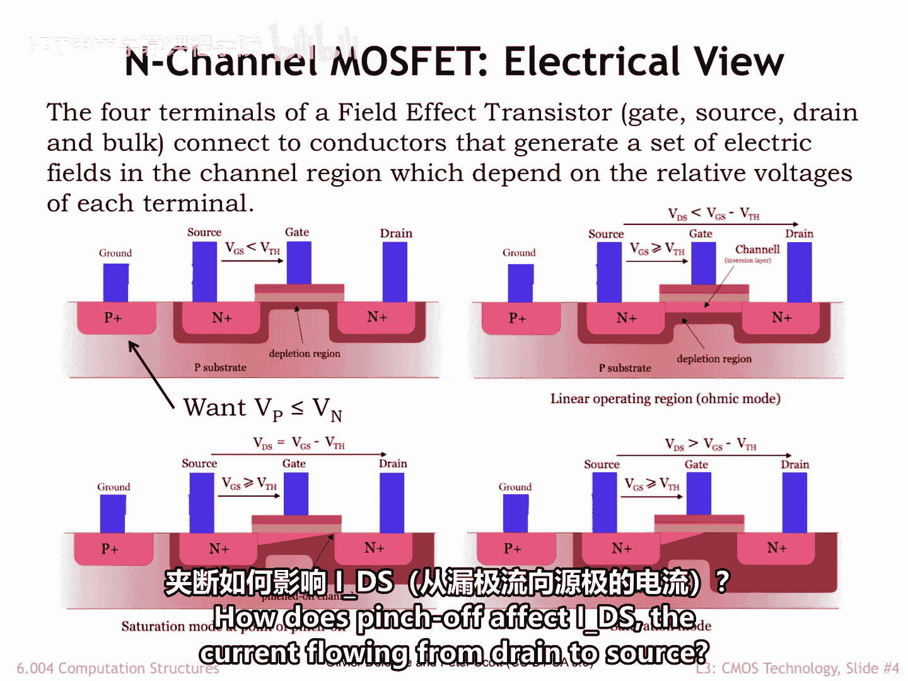
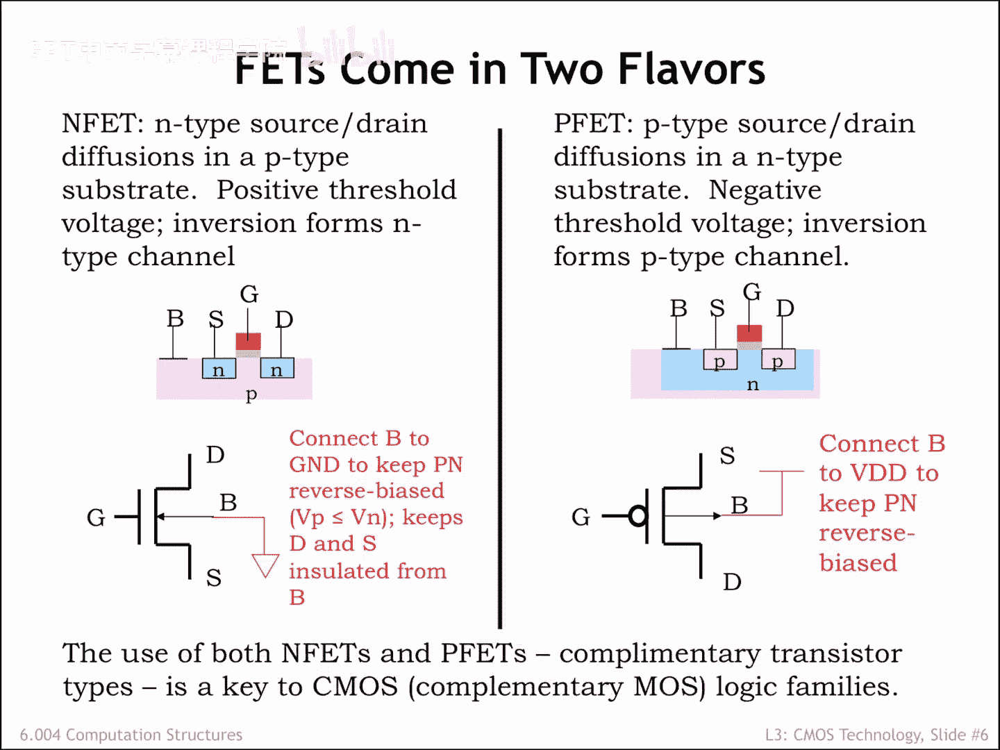

# 026：电气视角

在本节课程中，我们将学习金属氧化物半导体场效应晶体管（MOSFET）的电气工作原理。我们将了解其四个端子的电压如何控制开关的导通与关断，并学习如何解读其电流-电压特性曲线。

## 概述

上一节我们从物理结构的角度认识了MOSFET。本节中，我们将从电气视角来分析MOSFET，理解其作为电压控制开关的具体行为。我们将重点关注其阈值电压、导通条件以及电流-电压特性。

## 电气工作原理

MOSFET的操作由其四个端子的电压决定。

首先，我们标记栅极两侧的两个扩散区端子。按照惯例，我们将电位较高的扩散区端子称为**漏极**，电位较低的称为**源极**。在这种标记下，如果有电流流过MOSFET开关，电流将从漏极流向源极。

MOSFET在制造时被设计为具有一个特定的**阈值电压VTH**，它决定了开关从关断（开路）状态转变为导通（闭合）状态的时刻。对于图中所示的N沟道MOSFET，在现代工艺中，VTH大约为0.5伏特。

图中左侧的P+端子是连接到P型衬底的。为了使MOSFET正常工作，衬底的电压必须始终小于或等于源极和漏极的电压。后续会有关于如何连接此端子的具体规则。

MOSFET由栅极电压Vg与源极电压Vs之间的差值控制，我们称之为**Vgs**（即Vg - Vs）。

### 关断状态（Vgs < VTH）

当Vgs小于MOSFET的阈值电压时，开关处于开路或非导通状态。换句话说，源极和漏极之间没有电气连接。

当N型和P型材料物理接触时，在它们的结处会形成一个**耗尽区**（图中深红色区域）。这是一个载流子从结处迁移走的衬底区域。耗尽区充当了衬底与源/漏极之间的绝缘层。当源/漏极相对于衬底的电压增大时，这个绝缘层的宽度会增加。如图所示，这个绝缘层填充了源极和漏极端子之间的衬底区域，使它们保持电气隔离。

### 导通状态（Vgs > VTH）

随着Vgs增大，正电荷在栅极导体上积累并产生电场，吸引衬底原子中的电子。当电场强度达到阈值电压VTH时，电场足够强，能将衬底电子从价带拉到导带。这些新获得移动能力的电子会向栅极导体移动，聚集在作为栅极电容器绝缘体的薄氧化物下方。

当积累足够多的电子时，该区域的类型就从P型转变为N型。现在，一个N型材料的**沟道**在源极和漏极端子之间形成了一条导电通路。这层N型材料被称为**反型层**，因为它的类型已从原始的P型材料反转。

此时，MOSFET开关闭合或导通。电流将从漏极流向源极，其大小与**Vds**（漏极和源极端子之间的电压差）成正比。此时，导电的反型层就像一个遵循欧姆定律的电阻，因此**Ids = Vds / R**，其中R是沟道的有效电阻。

这个过程是可逆的。如果Vgs下降到阈值电压以下，衬底电子会落回价带，反型层消失，开关不再导通。

### 大Vds情况（Vds > Vgs）

当Vds大于Vgs时（如底部图所示），情况会变得更复杂。大的Vds改变了沟道中电场的几何形状，导致反型层在靠近漏极的沟道末端被**夹断**。但在大Vds下，电子会隧穿通过夹断点，到达仍然存在于源极端子附近的导电反型层。

为了了解夹断如何影响从漏极流向源极的电流Ids，让我们看看下一张幻灯片上的Ids曲线图。

## 电流-电压特性曲线分析

这张图包含大量信息，我们来解读一下。

每条曲线都是在特定Vgs值下，Ids随Vds变化的函数图。

首先，请注意当Vgs小于或等于阈值电压时，Ids为0。前六条曲线都重叠绘制在X轴上。

一旦Vgs超过阈值电压，Ids变为非零，并随着Vgs的增加而增加。这很合理：Vgs越大，被吸引到栅极电容器下极板的衬底电子就越多，反型层就越厚，从而允许通过更大的电流。

当Vds小于Vgs时，我们看到MOSFET表现得像一个遵循欧姆定律的电阻。这体现在曲线左侧的线性部分。曲线线性部分的斜率基本上与导电MOSFET沟道的电阻成反比。随着Vgs增加导致沟道变厚，电流增大，直线斜率变得更陡，表明沟道电阻变小。

但是，当Vds变得大于Vgs时，沟道在漏极端被夹断。正如我们在Ids曲线右侧所看到的，电流不再随Vds的增加而增加。相反，Ids近似恒定，曲线变成一条水平线。我们说MOSFET达到了**饱和**，此时Ids达到了某个最大值。

请注意，Ids曲线的饱和部分并非完全平坦，随着Vds增大，Ids会继续轻微增加。这种效应称为**沟道长度调制**，反映了沟道夹断的增加与更大Vds引起的电流增加并不完全匹配的事实。

## N沟道与P沟道MOSFET

到目前为止，我们讨论的都是如图左所示、在P型衬底中具有N型源漏扩散区的MOSFET。这被称为**N沟道MOSFET**，因为形成的反型层是N型半导体。N沟道MOSFET的电路符号如图所示，四个端子按此方式排列。在我们的MOSFET电路中，我们会将MOSFET的**体端**连接到地，这将确保P型衬底的电压始终小于或等于源漏扩散区的电压。

我们也可以通过翻转所有材料类型来构建MOSFET，即在N型衬底中创建P型源漏扩散区。这被称为**P沟道MOSFET**，它同样表现为一个电压控制开关，只是所有电压极性都相反。正如我们将看到的，导致N沟道开关导通的控 制电压会导致P沟道开关关断，反之亦然。

使用两种类型的MOSFET将为我们提供行为互补的开关。因此，对于同时使用两种类型MOSFET的电路，我们称之为**互补金属氧化物半导体**，简称**CMOS**。

## 总结

本节课中，我们一起学习了MOSFET的电气视角。我们了解到MOSFET是一个由栅源电压Vgs控制的开关：当Vgs低于阈值电压VTH时，开关关断；当Vgs高于VTH时，开关导通，形成反型层沟道。我们还分析了其电流-电压特性曲线，区分了线性区（电阻特性）和饱和区（恒流特性）。最后，我们介绍了N沟道和P沟道MOSFET的区别，以及它们将如何以互补的方式用于构建CMOS电路。

现在我们已经有了两种类型的电压控制开关，我们接下来的任务是弄清楚如何使用它们来构建用于处理以电压编码的信息的有用电路。