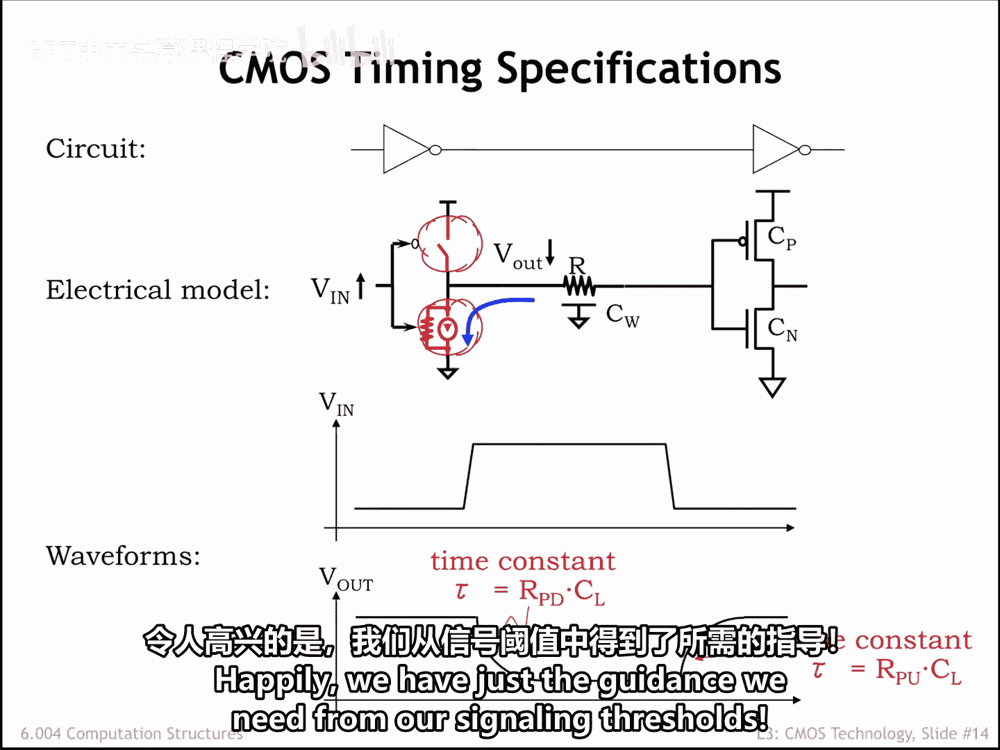
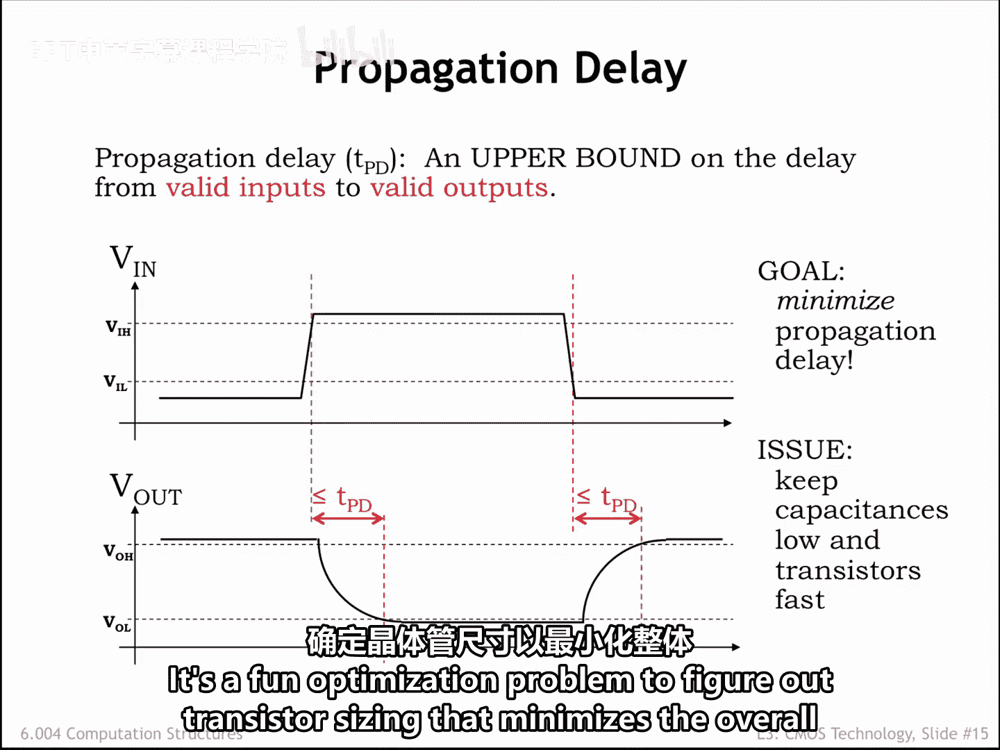
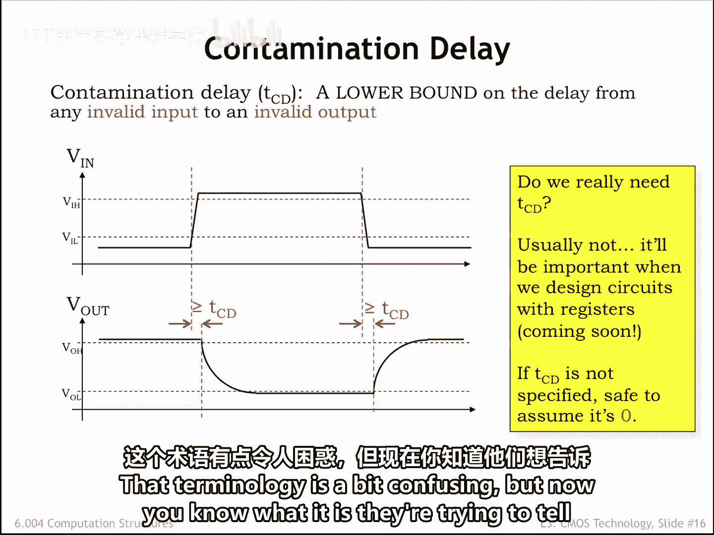
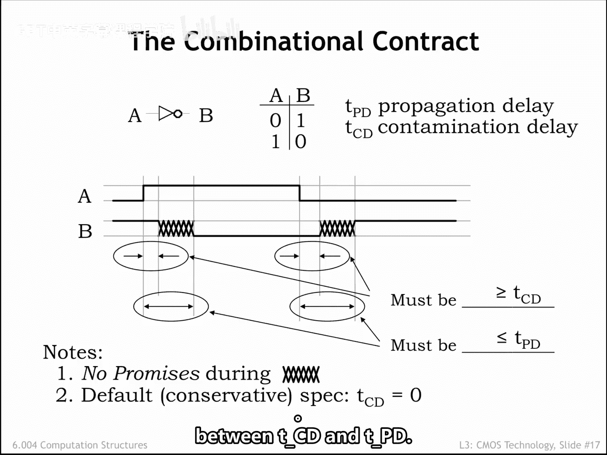
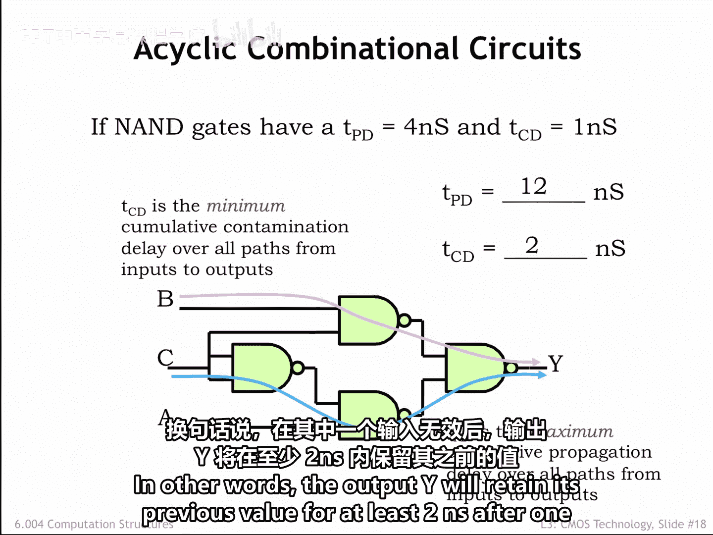

# 030：3.2.6 CMOS时序分析 ⏱️

在本节课程中，我们将学习如何分析和定义CMOS逻辑门的时序特性。我们将理解传播延迟和污染延迟这两个核心概念，并学习如何计算复杂组合电路的总体延迟。

---

上一节我们介绍了如何使用CMOS构建组合逻辑。本节中，我们来看看如何描述这些逻辑门的时序特性。

这里是一个由两个CMOS反相器串联组成的简单电路，我们将用它来理解如何描述左侧反相器的时序。

建立一个关于输入电压VN变化的电气模型会很有帮助。当VN从数字0跳变为数字1时，上拉PFET开关关闭，下拉NFET开关导通，将左侧反相器的输出节点连接到地。

该节点的电气模型包括连接左右反相器的物理导线的分布电阻和电容，以及右侧反相器中MOSFET栅极的电容。

当输出节点连接到地时，该电容上的电荷将通过导线的电阻和NFET下拉开关导通沟道的电阻流向地连接。最终，导线上的电压将达到地电位，即零伏特。

VN的下降沿转换过程非常相似，会导致输出节点充电至VDD。

现在让我们看看电压随时间变化的波形。

顶部的图显示了VN的一个上升沿和随后的一个下降沿转换。我们看到输出波形具有电容器通过电阻放电或充电时电压的典型指数形状。该指数由其相关的RC时间常数表征，其中R是导线和MOSFET沟道的总电阻，C是导线和MOSFET栅极端子的总电容。

由于输入和输出的转换都不是瞬时的，我们需要选择如何测量反相器的传播延迟。幸运的是，我们的信令阈值正好提供了所需的指导。

组合逻辑门的传播延迟被定义为从有效输入到有效输出的延迟的上限。有效输入电压由VIL和VIH信令阈值定义，有效输出电压由VOL和VOH信令阈值定义。我们已在波形图上标出了这些阈值。

为了测量与VN上升沿相关的延迟，首先确定输入变为有效数字1的时间，即VN越过VIH阈值的时间。接下来，确定输出变为有效数字0的时间，即Vout越过VOL阈值的时间。这两个时间点之间的间隔就是这组特定输入和输出转换的延迟。

我们可以通过相同的过程来测量与输入下降沿相关的延迟。首先，确定VN越过VIL阈值的时间。然后找到Vout越过VOH阈值的时间。得到的间隔就是我们想要测量的延迟。

由于传播延迟TPD是任何输入转换相关延迟的上限，我们将选择一个大于或等于我们刚刚测量值的TPD值。当制造商为门电路选择TPD规格时，必须考虑制造差异、不同环境条件（如温度和电源电压）的影响等。它应该选择一个TPD，该TPD将是其客户在实际器件上可能进行的任何延迟测量的上限。

从设计者的角度来看，我们可以依赖大型数字系统中每个组件的这个上限，并用它来计算系统的TPD，而无需重复制造商的所有测量。

如果我们的目标是最小化系统的传播延迟，那么我们希望尽可能减小电容和电阻。这里存在一个有趣的权衡。为了使MOSFET开关的有效电阻更小，我们会增加其宽度。但这会增加开关栅极端子的额外电容，从而减慢连接到栅极的输入节点上的转换速度。找出能最小化整体传播延迟的晶体管尺寸是一个有趣的优化问题。

虽然静态规范并不严格要求，但定义另一个称为污染延迟的时序规格将很有用。它衡量的是在门的输入开始变化并变为无效之后，门的先前输出保持有效的时间长度。从技术上讲，污染延迟是从无效输入到无效输出的延迟的下限。

我们将像测量传播延迟一样进行延迟测量。在输入上升沿转换中，延迟从输入不再是有效数字0时开始，即VN越过VIL阈值时。延迟在输出变为无效时结束，即Vout越过VOH阈值时。我们可以对输入下降沿转换进行类似的延迟测量。

由于污染延迟TCD是任何输入转换相关延迟的下限，我们将选择一个小于或等于我们刚刚测量值的TCD值。

我们真的需要污染延迟规格吗？通常不需要。如果未指定，设计者应假设组合器件的TCD为零。换句话说，一个保守的假设是输出在输入变为无效的同时也变为无效。

顺便说一下，制造商经常使用术语“最小传播延迟”来指代器件的污染延迟。这个术语有点令人困惑，但现在你知道他们想告诉你什么了。

以下是组合逻辑时序规格的快速总结。这些规格告诉我们输出波形（在此示例中标记为B）变化的时序如何与输入波形（标记为A）变化的时序相关。

组合器件可能在输入转换后的某个时间间隔内保留其先前的输出值。器件的污染延迟是对该间隔最小尺寸的保证。换句话说，TCD是旧输出值保持有效的时间长度的下限。如注释2所述，一个保守的假设是器件的污染延迟为零，这意味着器件的输出可能在输入转换后立即改变。因此，TCD为我们提供了B何时开始变化的信息。

同样，了解在输入转换后B何时保证完成变化会很有帮助。换句话说，我们需要等待多长时间，输入的变化才能反映在输出的更新值上？这就是TPD告诉我们的，因为它是输入转换后B变为有效和稳定所需时间的上限。

如注释1所指出的，一般来说，在从输入转换开始测量的TCD之后和TPD之前的时间间隔内，无法保证输出的行为。在该间隔内，B输出多次改变，甚至在该间隔的任何部分具有非数字电压，都是合法的。正如我们将在本章最后一个视频中看到的，我们将能够为组合电路的一个子类提供关于B在此间隔内行为的更多见解。但一般来说，设计者不应假设B在TCD和TPD之间的间隔内的值。

我们如何根据组件的时序规格计算更大组合电路的传播延迟和污染延迟？

我们的示例是一个由四个与非门组成的电路，其中每个与非门的TPD为4纳秒，TCD为1纳秒。

为了找到较大电路的传播延迟，我们需要找到从节点A、B或C上的输入转换到输出Y上有效且稳定的值之间的最大延迟。为此，考虑从某个输入到Y的每条可能路径，并通过累加路径上组件的TPD来计算路径延迟。选择最大的路径作为整个电路的TPD。在我们的示例中，最大延迟是一条包含三个与非门的路径，其累积传播延迟为12纳秒。换句话说，保证输出Y在A、B或C发生转换后的12纳秒内稳定且有效。

为了找到较大电路的污染延迟，我们再次研究从输入到输出的所有路径，但这次我们寻找从无效输入到无效输出的最短路径。因此，我们累加每条路径上组件的TCD，并选择最小的路径延迟作为整个电路的TCD。在我们的示例中，最小延迟是一条包含两个与非门的路径，其累积污染延迟为2纳秒。换句话说，在某个输入变为无效后，输出Y将至少保持其先前值2纳秒。

---

本节课中我们一起学习了CMOS逻辑门的时序分析。我们定义了传播延迟（TPD）作为输出变为有效所需时间的上限，以及污染延迟（TCD）作为旧输出值在输入变化后保持有效时间的下限。我们还学习了如何通过累加路径上各器件的延迟来计算复杂组合电路的总体TPD和TCD。理解这些时序参数对于设计和分析高速数字系统至关重要。