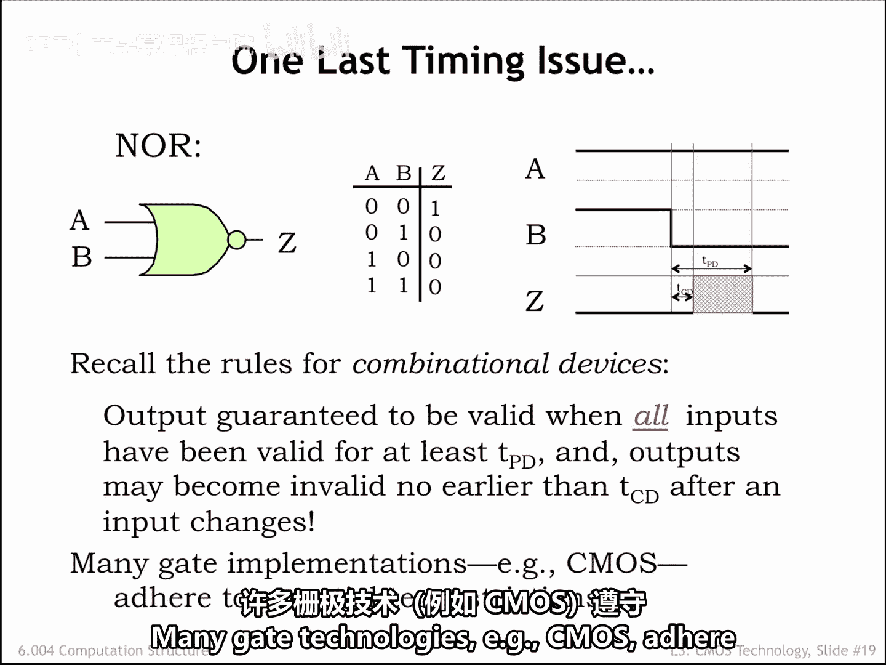

# 数字系统与计算机架构：P1：3.2.7 宽容门电路

在本节中，我们将探讨CMOS逻辑门输出信号变化的时序特性，并引入一个重要的概念——宽容门电路。我们将了解其工作原理、与传统门电路的区别，以及它在数字系统中的意义。

## 概述

上一节我们介绍了门电路的传播延迟和污染延迟。本节中，我们来看看一种特殊的门电路行为——宽容性。我们将分析CMOS与非门的具体工作方式，理解为何在某些输入条件下，其他输入的信号变化不会影响输出的有效性和稳定性。

## 非CMOS与非门的时序分析

首先，考虑一个实现“或非”功能的非CMOS组合逻辑器件的行为。

观察波形图，初始时输入A和B均为0，输出Z为1，这与真值表的规定一致。现在，输入B发生从0到1的跳变，输出Z最终将通过从1到0的跳变来反映这个变化。

正如我们在上一个视频中学到的，Z跳变的时序由或非门的污染延迟和传播延迟决定。

需要注意的是，在输入跳变后的TCD到TPD时间间隔内，我们无法确定输出Z的值。我们在波形图上用红色阴影区域来标示这个区间。

## 不同初始条件下的行为

现在，考虑另一种初始设置：A和B均为1，相应地输出Z为0。

检查真值表可知，如果A为1，则无论B的值是什么，输出Z都将是0。

那么，当B发生从1到0的跳变时会发生什么？在跳变之前，Z为0，我们预期在B跳变后的TPD时间后，Z仍为0。但一般来说，在TCD到TPD的时间间隔内，我们不能对Z的值做任何假设。

Z在该区间内可能出现任何行为，而这个器件仍然是一个合法的组合逻辑器件。许多门电路技术，例如CMOS，遵循着更严格的限制。

## CMOS或非门的内部机制

让我们详细看一下当两个输入均为数字1时，CMOS或非门实现中的开关配置情况。

高栅极电压将开启两个N型开关（如红色箭头所示），并关闭两个P型开关（如红色X所示）。由于上拉电路不导通，而下拉电路导通，输出Z连接到地，即数字0输出的电压。

现在，当输入B从1跳变到0时会发生什么？

由B控制的开关改变了它们的配置。P型开关现在开启，而N型开关现在关闭。但总体而言，上拉电路仍然不导通，并且仍然存在一条从Z到地的下拉路径。

因此，虽然过去有两条从Z到地的路径，而现在只有一条，但Z始终连接到地，其值在整个B跳变过程中保持有效和稳定。

对于CMOS或非门，当一个输入为数字1时，输出将不受另一个输入跳变的影响。

## 定义宽容组合逻辑器件

一个宽容的组合逻辑器件就是表现出这种行为的器件，即当任何足以确定输出值的输入组合已经有效至少TPD时间时，保证输出是有效的。

当某些输入处于触发这种宽容行为的配置时，其他输入的跳变将不会影响输出值的有效性。令人高兴的是，大多数CMOS逻辑门实现天生就是宽容的。

我们可以扩展真值表表示法来指示宽容行为，在某些行中使用“x”表示输入值，以表明在确定正确输出值时该输入值是无关的。

一个宽容或非门的真值表指出了两种这样的情况：当A为1时，B的值无关；当B为1时，A的值无关。

无关输入上的跳变不会触发通常与输入跳变相关的TCD和TPD输出时序。

## 宽容性的重要性

宽容性何时重要？在构建存储组件时，我们将需要宽容的组件，这是我们将在后面几章中涉及的主题。

你已经准备好尝试构建一些自己的CMOS门电路了。可以看看作业中的第一个实验练习，我相信你会觉得它很有趣。

## 总结

本节课中，我们一起学习了宽容门电路的概念。我们了解到，在CMOS门电路中，当某些输入处于特定状态（如或非门中任一输入为1）时，输出值已被确定，且不受其他输入跳变的影响，从而保证了输出的稳定性和有效性。这种特性通过扩展的真值表（使用“x”表示无关项）来描述，并且对于构建可靠的数字系统（尤其是存储部件）至关重要。