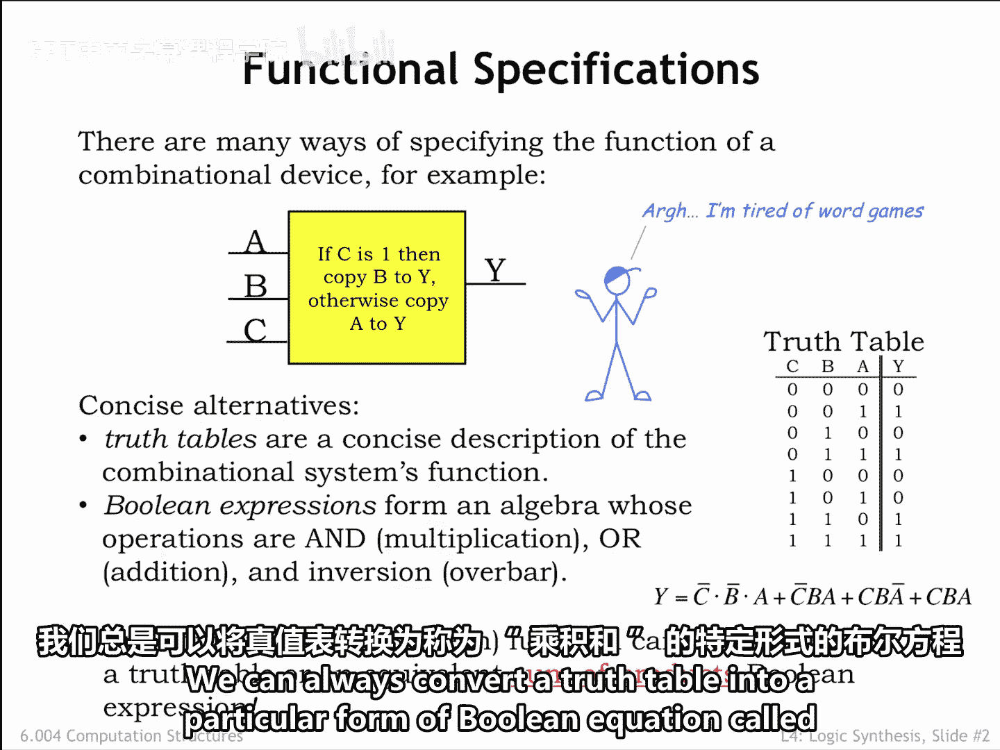
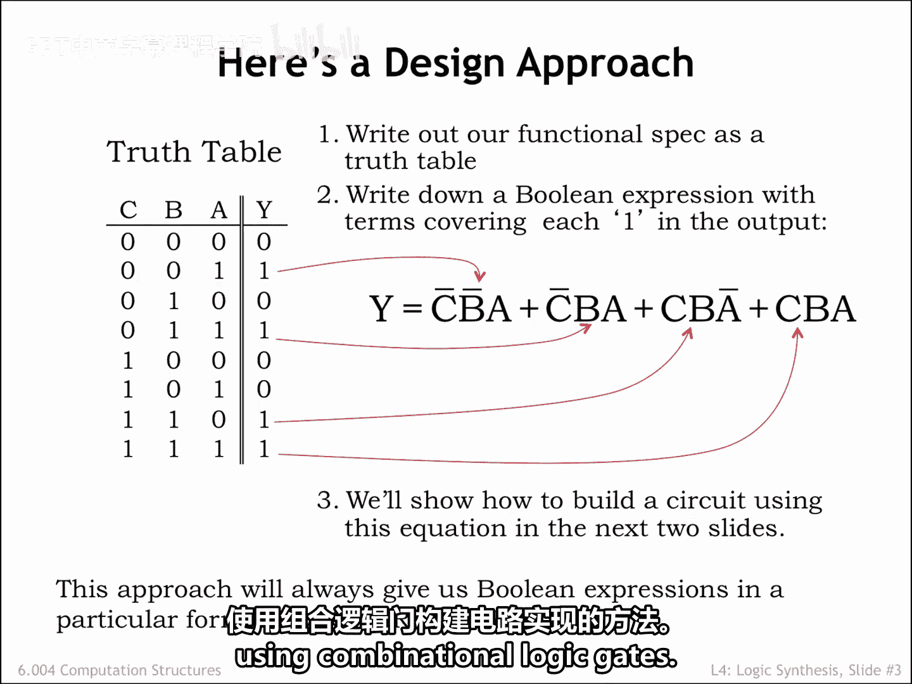
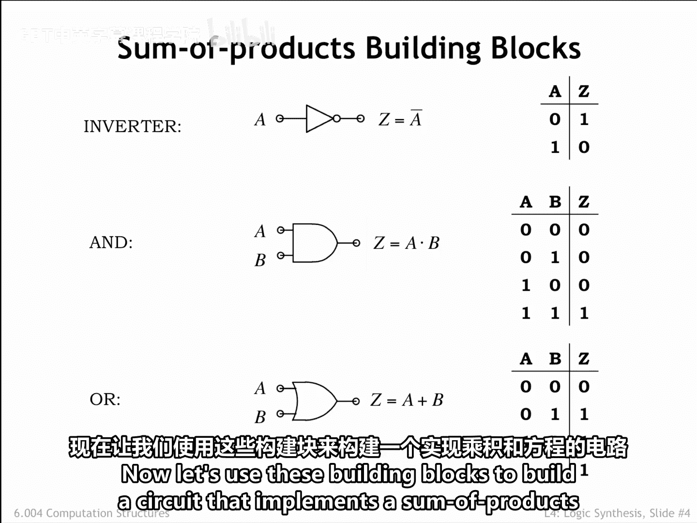
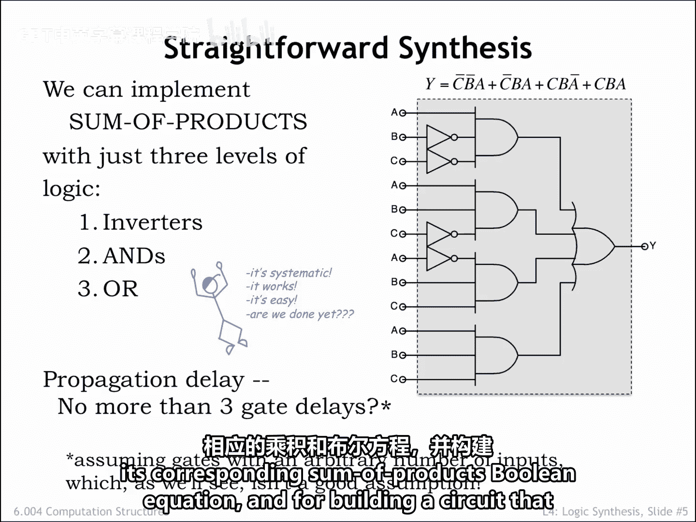

# 034：组合逻辑电路设计入门 🧠

在本节课中，我们将学习创建组合逻辑电路的各种技术，以实现特定的功能规范。功能规范是我们用来创建电路组合逻辑抽象静态规则的一部分。

## 功能规范：自然语言 📝

一种方法是使用自然语言来描述设备的操作。这种方法有其优缺点。其优点是，自然语言能以惊人的简洁形式传达复杂的概念，并且它是一种我们大多数人都知道如何阅读和理解的符号。但除非措辞非常谨慎，否则可能会因词语的多重解释或描述不完整而引入歧义。通常并不总是能明显看出是否处理了所有可能性。

## 功能规范：真值表 📊

有一些很好的替代方案可以解决上述缺点。真值表是一种直接的表格表示法，它为数字输入的每种可能组合指定输出值。

如果一个设备有 `n` 个数字输入，其真值表将有 `2^n` 行。在下面展示的例子中，设备有三个输入，每个输入的值可以是 `0` 或 `1`。

三个输入值的组合有 `2 × 2 × 2 = 2^3`，即八种，因此真值表有八行。系统地枚举这八种组合很简单，这使得在构建规范时很容易确保没有遗漏任何组合。并且由于输出值是明确指定的，因此没有误解所需功能的空间。

真值表对于输入和输出数量较少的设备来说是绝佳的选择。遗憾的是，当设备有许多输入时，它们并不真正实用。例如，如果我们要描述一个将两个 32 位数字相加的电路的功能，总共将有 64 个输入，真值表将有 `2^64` 行。这并不实用。如果我们每秒为一行输入正确的输出值，填满这个表格将需要 5840 亿年。

## 功能规范：布尔方程 ➕

另一种规范是使用布尔方程来描述如何使用布尔代数从输入值计算输出值。我们使用的运算是逻辑运算 **与**、**或** 和 **异或**，每个运算接受两个布尔操作数；以及 **非**，它接受一个布尔操作数。

使用描述这些逻辑运算的真值表，按照方程中列出的操作序列，从特定的输入值组合计算输出值是很直接的。

让我简单说一下布尔方程中使用的符号。输入值由输入的名称表示，在此示例中为 `A`、`B` 或 `C`。数字输入值 `0` 等价于布尔值 `false`。数字输入值 `1` 等价于布尔值 `true`。

布尔运算 **非** 通过在布尔表达式上方画一条水平线来表示。在此示例中，等号后的第一个符号是上方有一条线的 `C`，表示在用于计算表达式其余部分之前，应反转 `C` 的值。

布尔运算 **与** 使用标准数学符号中的乘法运算表示。有时我们会使用显式的乘法运算符，通常写作两个布尔表达式之间的点，如示例方程的第一项所示。有时 **与** 运算符是隐式的，如示例方程其余三项所示。

布尔运算 **或** 由加法运算表示，始终显示为加号。

当设备有许多输入时，布尔方程很有用，并且正如我们将看到的，很容易将布尔方程转换为电路原理图。

真值表和布尔方程是可以互换的。如果我们为每个输出都有一个布尔方程，我们可以通过评估布尔方程来填充真值表某一行的输出列，使用该行特定的输入值组合。例如，要确定真值表第一行中 `Y` 的值，我们将用布尔值 `false` 替换方程中的符号 `A`、`B` 和 `C`，然后使用布尔代数计算结果。

我们也可以反向操作。我们总是可以将真值表转换为一种特定形式的布尔方程，称为 **积之和**。让我们看看如何操作。

## 从真值表到积之和方程 🔄

首先查看真值表并回答问题：`Y` 何时具有值 `1`，或者用布尔代数的语言来说，`Y` 何时为 `true`？`Y` 在输入对应于真值表的第 2 行、或第 4 行、或第 7 行、或第 8 行时为 `true`。总共有四种输入组合使 `Y` 为 `true`。

因此，相应的布尔方程是四个项的 **或**，其中每个项是一个布尔表达式，该表达式对特定的输入组合求值为 `true`。

真值表的第 2 行对应于 `C=0`、`B=0` 和 `A=1`。相应的布尔表达式是 `¬C ∧ ¬B ∧ A`，这个表达式当且仅当 `C` 为 `0`、`B` 为 `0` 且 `A` 为 `1` 时求值为 `true`。第 4 行对应的布尔表达式是 `¬C ∧ B ∧ A`。第 7 行和第 8 行依此类推。

这种方法总是会给我们一个 **积之和** 形式的表达式。“和”指的是 **或** 运算，“积”指的是 **与** 运算组。在这个例子中，我们有四个乘积项的和。

我们的下一步是使用布尔表达式作为使用组合逻辑门构建电路实现的配方。

## 组合逻辑门库 🧱

作为电路设计者，我们将使用一个组合逻辑门库，这个库要么由集成电路制造商提供，要么是我们自己使用 NFET 和 PFET 开关设计的 CMOS 门。

最简单的门之一是 **反相器**，其原理图符号如下所示。输出线上的小圆圈表示反相，这是原理图中常用的约定。从其真值表可以看出，反相器实现了布尔 **非** 功能。

**与门** 当且仅当 `A` 输入为 `1` 且 `B` 输入为 `1` 时输出 `1`，因此得名 **与**。库中通常包括具有三个输入、四个输入等的 **与门**，当且仅当其所有输入都为 `1` 时，它们才产生 `1` 输出。

**或门** 如果 `A` 输入为 `1` 或 `B` 输入为 `1`，则输出 `1`，因此得名 **或**。同样，库中通常包括具有三个输入、四个输入等的 **或门**，当至少有一个输入为 `1` 时，它们产生 `1` 输出。

这些是 **与门** 和 **或门** 的标准原理图符号。请注意，**与门** 符号的输入侧是直的，而 **或门** 符号是弯曲的。稍加练习，你会发现很容易记住哪个原理图符号是哪个。

现在，让我们使用这些构建块来构建一个实现积之和方程的电路。

## 构建积之和电路 ⚙️

电路的结构完全遵循布尔方程的结构。我们使用反相器来执行必要的布尔 **非** 运算。在积之和方程中，反相器对特定的输入值（本例中为 `A`、`B` 和 `C`）进行操作。为了使这个原理图易于阅读，我们为方程中的四个 **非** 操作分别使用了单独的反相器。但在实际中，我们可能会将 `C` 输入反相一次以产生一个 `¬C` 信号，然后在需要 `¬C` 值时使用该信号。

四个乘积项中的每一个都是使用一个三输入 **与门** 构建的。然后使用一个四输入 **或门** 将这些乘积项 **或** 在一起。最终的电路有一层反相器、一层 **与门** 和一个最终的 **或门**。

在下一节中，我们将讨论如何使用输入较少的库组件来构建具有多个输入的 **与门** 和 **或门**。

积之和电路的传播延迟看起来相当短。从输入到输出的最长路径包括一个反相器、一个 **与门** 和一个 **或门**。我们真的能在传播延迟为三个门延迟的电路中实现任何布尔方程吗？实际上不能，因为构建具有多个输入的 **与门** 和 **或门** 将需要额外的组件层，这会增加传播延迟。我们将在下一节中学习这一点。

好消息是，我们现在有了将真值表转换为其对应的积之和布尔方程，并构建实现该方程的电路的直接技术。

---

本节课中，我们一起学习了组合逻辑电路设计的入门知识。我们探讨了使用自然语言、真值表和布尔方程作为功能规范的方法，并重点掌握了将真值表转换为积之和布尔方程，进而使用基本逻辑门（反相器、与门、或门）构建对应电路的具体流程。这为理解和实现更复杂的数字逻辑功能奠定了基础。