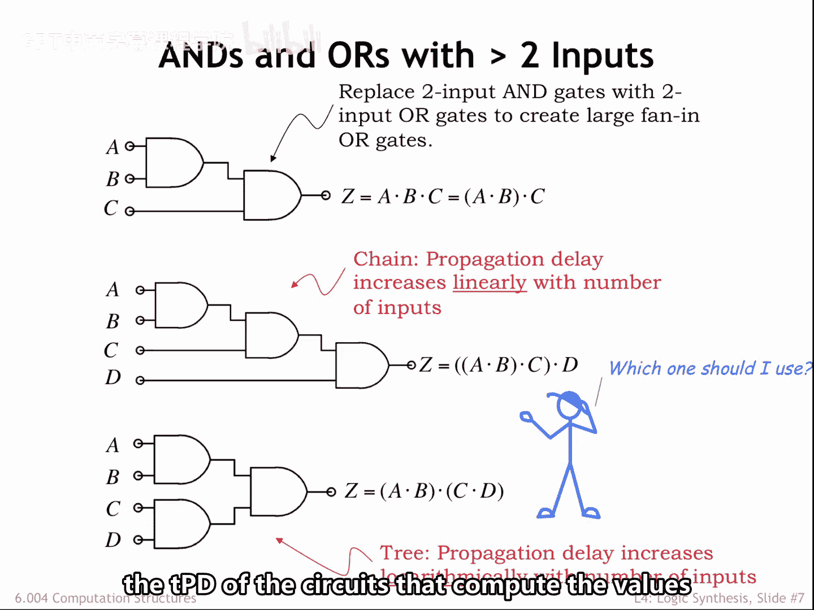
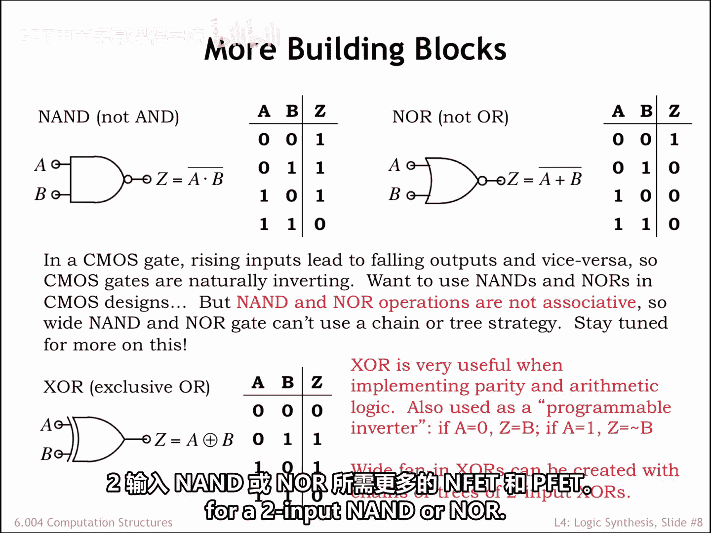
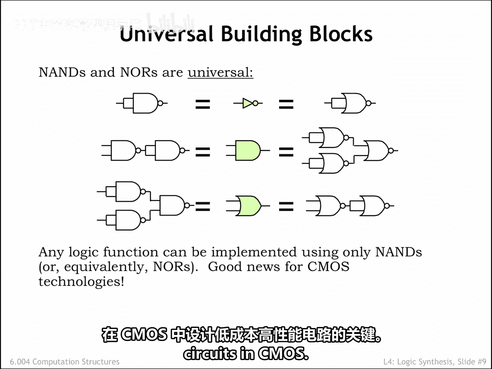

# 数字系统与计算机架构：P1：4.2.2 实用逻辑门

在本节课程中，我们将学习如何构建具有多个输入的逻辑门，并探讨不同电路结构（链式与树状）在成本和性能上的权衡。我们还将介绍“与非门”和“或非门”作为通用门的重要性，以及它们在CMOS电路设计中的优势。

上一节我们介绍了逻辑门的基本概念，本节中我们来看看如何构建具有多个输入的“与门”和“或门”。这在利用“积之和”方程作为模板创建电路实现时是必需的。

假设我们的门库中只有双输入门，我们需要研究如何使用这些双输入门作为构建模块来搭建更宽的门电路。我们将以创建三输入和四输入门为例，但所使用的方法可以推广到构建任意所需宽度的“与门”和“或门”。

## 构建多输入门的方法

这里展示的方法依赖于“与”运算符的结合律。这意味着我们可以通过以任何方便的顺序进行成对的“与”运算来完成一个N路“与”操作。“或”和“异或”运算同样具有结合律，因此相同的方法也适用于从对应的双输入门设计宽“或”电路和宽“异或”电路。只需将下图中的双输入“与门”替换为双输入“或门”或双输入“异或门”即可。

让我们从设计一个计算三个输入A、B和C的“与”的电路开始。在如下所示的电路中，我们首先计算A与B，然后将结果与C进行“与”运算。

使用相同的策略，我们可以用三个双输入“与门”构建一个四输入“与门”。本质上，我们正在构建一个“与门”链，它使用N-1个双输入“与门”来实现一个N路“与”操作。

我们也可以用不同的方式关联这四个输入，并行计算A与B以及C与D，然后使用第三个“与门”合并这两个结果。使用这种方法，我们正在构建一个“与门”树。

## 链式与树状：哪种方法更优？

首先，我们必须明确“更优”的含义。在设计电路时，我们关心成本（取决于组件数量）和性能（我们用电路的传播延迟来表征）。

两种策略需要相同数量的组件，因为两种情况下成对“与”运算的总数是相同的。因此在考虑成本时，两者打平。

现在考虑传播延迟。中间的链式电路的传播延迟是3个门延迟，并且我们可以看到，一个N输入链的传播延迟将是N-1个门延迟。链式电路的传播延迟随输入数量线性增长。

底部的树状电路的传播延迟是2个门延迟，小于链式电路。树状电路的传播延迟随输入数量对数增长，具体来说，使用双输入门构建的树状电路的传播延迟增长为log₂(N)。当N很大时，树状电路的传播延迟可以显著优于链式电路。

传播延迟是从输入到输出的最坏情况延迟的上限，并且假设所有输入同时到达，它是一个很好的性能衡量指标。但在大型电路中，A、B、C和D可能根据生成每个信号的电路的传播延迟在不同时间到达。

假设输入D比其他输入晚很多到达。如果我们使用树状电路来计算所有四个输入的“与”，计算Z的额外延迟是在D到达后的2个门延迟。然而，如果我们使用链式电路，计算Z的额外延迟可能只有1个门延迟。

这个故事的寓意是：除非我们知道计算输入信号值的电路的传播延迟，否则很难知道一个子电路（例如这里所示的四输入“与门”）的哪种实现会产生最小的整体传播延迟。

## 与非门和或非门的优势

在设计CMOS电路时，单个门本质上是反相的，因此为了获得最佳性能，我们想使用这里所示的“与非门”和“或非门”，而不是“与门”和“或门”。“与非门”和“或非门”可以实现为单个CMOS门，涉及一个上拉电路和一个下拉电路。而“与门”和“或门”在其实现中需要两个CMOS门，例如，一个“与非门”后接一个反相器。我们将在下一节讨论如何使用“与非门”构建“积之和”电路。

请注意，“与非”和“或非”操作不具有结合律。A、B、C的“与非”不等于C与（A和B的“与非”）的“与非”。因此，我们不能通过构建双输入“与非门”的树来构建具有多个输入的“与非门”。我们也会在下一节讨论这一点。

## 异或门及其应用

我们多次提到了“异或”操作，有时称为Xor。这个逻辑函数在构建用于算术或奇偶校验计算的电路时非常有用。正如你将在Lab 2中看到的，实现一个双输入“异或门”将比实现一个双输入“与非门”或“或非门”需要多得多的NFET和PFET。

## 通用门：与非门和或非门

我们知道，我们可以为任何真值表提出一个“积之和”表达式，从而使用反相器、“与门”和“或门”构建电路实现。事实证明，我们可以仅使用双输入“与非门”构建具有相同功能的电路，我们说双输入“与非门”是一个通用门。这里我们展示了如何仅使用双输入“与非门”来实现“积之和”的构建模块。稍后我们将展示一个仅使用“与非门”的更直接的“积之和”实现，但这些小原理图是一个概念证明，表明仅使用“与非门”的等效电路是存在的。

如下这些小原理图所示，双输入“或非门”也是通用的。反相逻辑需要一点时间来适应，但它是设计低成本、高性能CMOS电路的关键。

---

本节课中我们一起学习了如何从双输入门构建多输入逻辑门，比较了链式和树状结构的性能差异，认识了“与非门”和“或非门”在CMOS设计中的核心优势及其作为通用门的能力，并了解了“异或门”的特殊用途。这些知识是理解和设计更复杂数字电路的基础。