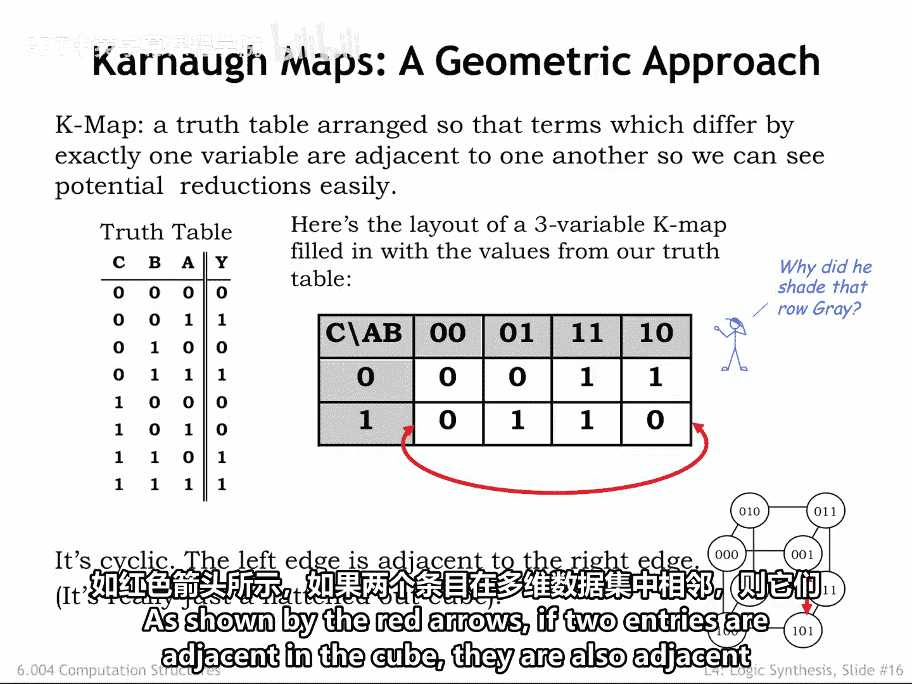
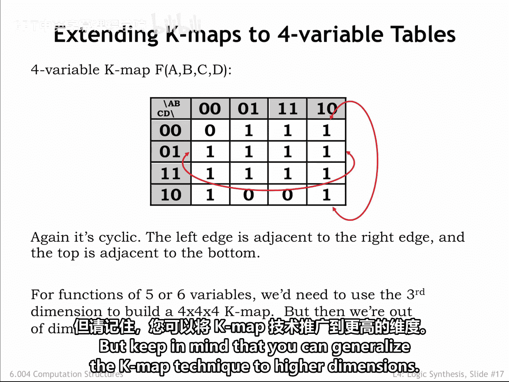
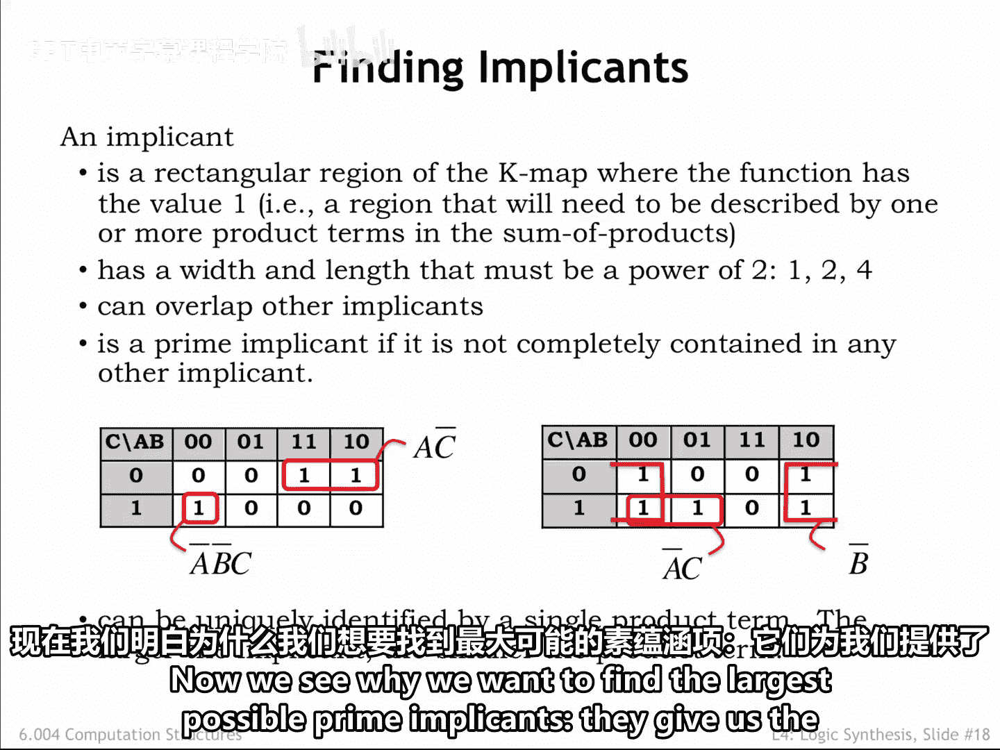
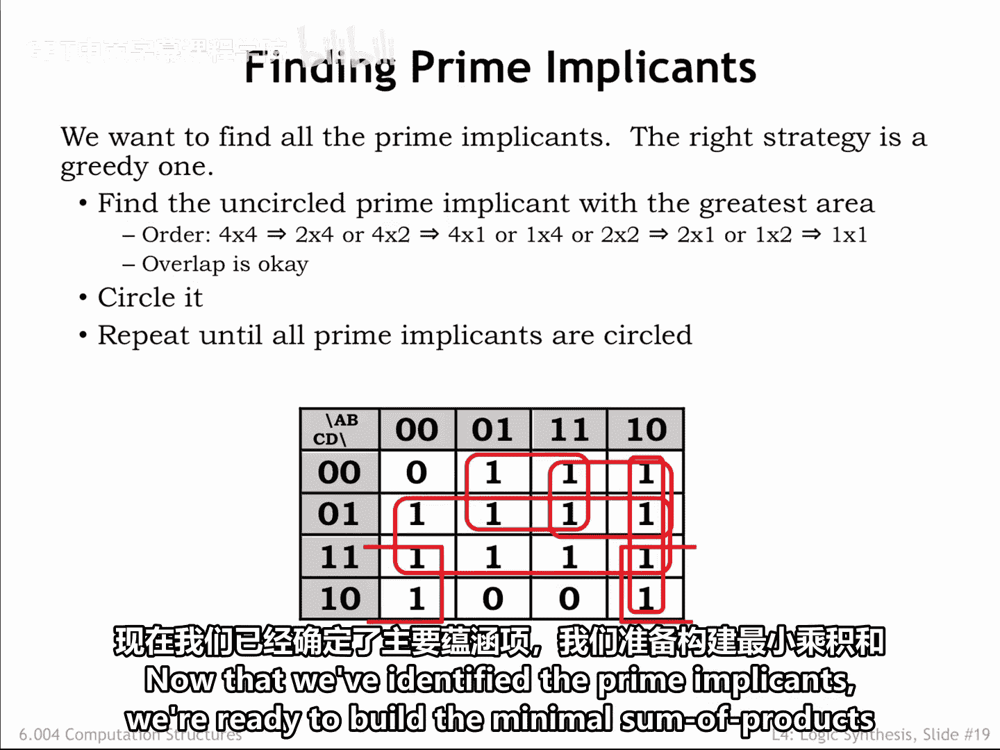
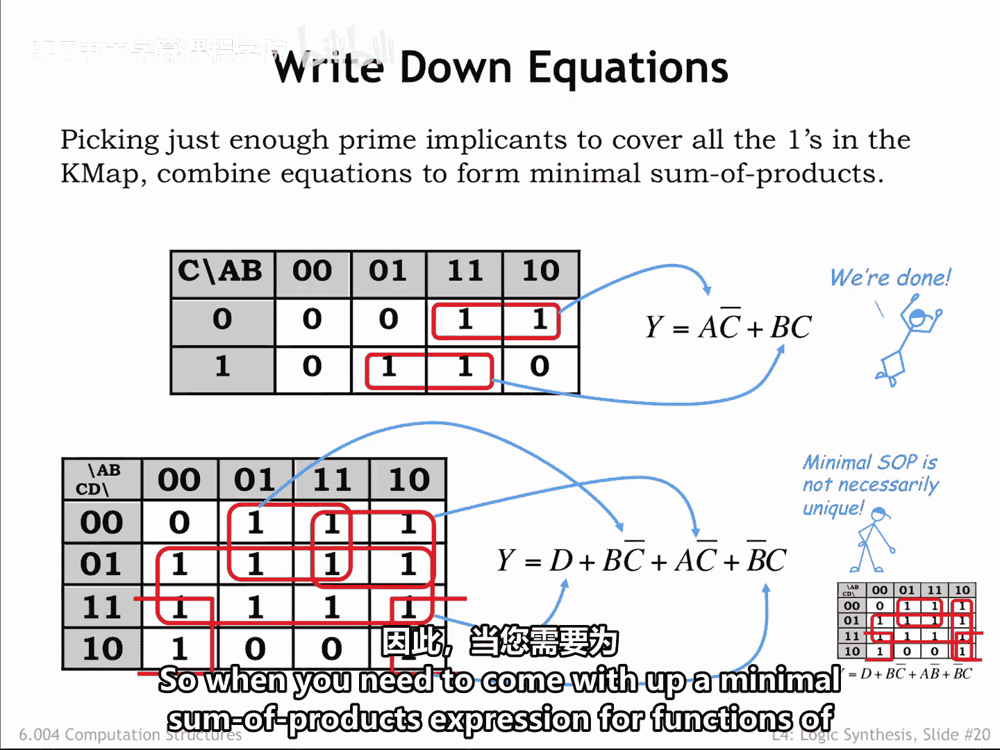
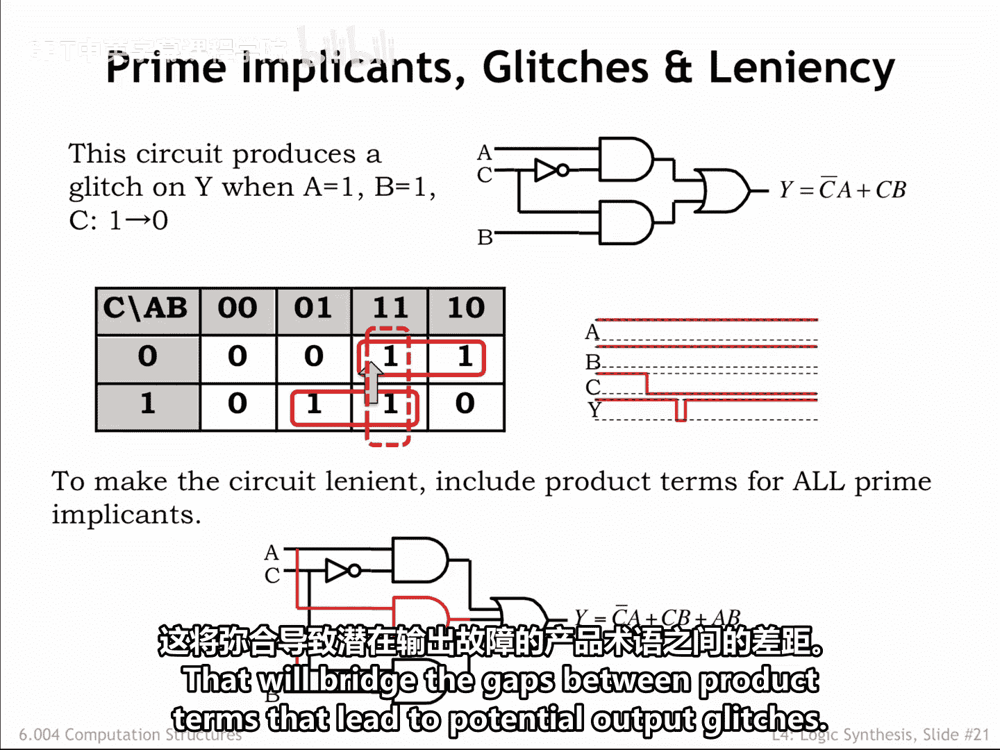

# 038：4.2.5 卡诺图

在本节课中，我们将学习一种称为卡诺图的图形化工具，它可以帮助我们更直观地找到逻辑函数的最小积之和表达式。我们将了解卡诺图的结构、如何识别蕴含项，以及如何利用它来化简布尔表达式。

## 卡诺图的结构与原理

上一节我们介绍了使用布尔代数恒等式来化简积之和表达式。本节中我们来看看一种更直观的图形化方法——卡诺图。

当尝试使用化简恒等式来最小化积之和表达式时，我们的目标是找到两个可以合并为一个更小乘积项的乘积项，从而消除无关变量。当这两个乘积项来自真值表的相邻行时，这很容易做到。

例如，观察这个真值表的最后两行。由于在这两种情况下输出y都是1，这两行都将出现在该函数的积之和表达式中。当C和B都为1时，很容易发现A是无关变量。因此，真值表的最后两行可以用单个乘积项 `B AND C` 来表示。

如果我们重新组织真值表，使适当的乘积项位于相邻行，那么发现这些合并机会就会更容易。这就是我们在右边的卡诺图中所做的。

卡诺图将真值表组织成一个二维表格，其行和列用输入变量的可能值来标记。在这个卡诺图中，第一行包含c为0时的条目，第二行包含c为1时的条目。同样，第一列包含A为0且B为0时的条目，依此类推。

卡诺图中的条目与真值表中的条目完全相同，只是格式不同。请注意，列的排列顺序是一种特殊的序列，不同于通常的二进制计数序列。这种序列称为格雷码，相邻标签的位恰好有一位不同。换句话说，对于任意两个相邻的列，要么A标签的值改变了，要么B标签的值改变了。从这个意义上说，最左列和最右列也是相邻的。我们将表格写成一个二维矩阵，但你应该把它想象成一个左右边缘相连的圆柱体。

为了帮助你可视化哪些条目是相邻的，立方体的边缘显示了哪些三位输入值仅相差一位。如红色箭头所示，如果两个条目在立方体中是相邻的，那么它们在表格中也是相邻的。

## 扩展到更多变量

我们可以轻松地将卡诺图符号扩展到具有四个输入变量的函数的真值表，如图所示。我们对行和列都使用了格雷码序列。和之前一样，最左列和最右列是相邻的，顶行和底行也是相邻的。同样，当我们移动到相邻的列或行时，四个输入标签中只有一个会发生变化。

要为六个变量的函数构建卡诺图，我们需要一个4x4x4的值矩阵。这在二维页面上很难绘制，并且很难判断三维矩阵中的哪些单元格是相邻的。对于超过六个变量，我们需要额外的维度。这是计算机可以处理的事情，但对于我们这些生活在三维空间中的人来说很难。实际上，卡诺图对于最多四个变量效果很好，我们将坚持这一点。但请记住，你可以将卡诺图技术推广到更高的维度。

## 蕴含项与质蕴含项

那么为什么要讨论卡诺图呢？因为卡诺图中包含1的相邻条目模式，将揭示在我们的积之和表达式中使用更简单乘积项的机会。

让我们引入蕴含项的概念，这是卡诺图中一个矩形区域的奇特名称，该区域内的条目都是1。请记住，当一个条目是1时，我们希望积之和表达式对于该特定的输入值组合求值为真。我们要求蕴含项的宽度和长度是2的幂；换句话说，该区域应有一行、两行或四行，以及一列、两列或四列。蕴含项之间可以重叠。如果一个蕴含项没有完全包含在任何其他蕴含项中，我们称其为质蕴含项。

我们最终最小化积和表达式中的每个乘积项，都将与卡诺图中的某个质蕴含项相关。

让我们看看这些规则在实践中如何使用这两个示例卡诺图。当我们识别质蕴含项时，会用红色圆圈圈出它们。

从左侧的卡诺图开始，第一个蕴含项包含那个单独的、不与其他任何包含1的单元格相邻的单元格。第二个质蕴含项是卡诺图右上角的一对相邻的1。这个蕴含项有一行两列，符合我们对蕴含项维度的约束。

在右侧的卡诺图中寻找质蕴含项有点棘手。回想一下，最左列和最右列是相邻的，我们可以发现一个2x2的质蕴含项。请注意，这个质蕴含项包含许多更小的1x2、2x1和1x1蕴含项，但它们都不是质蕴含项，因为它们完全包含在这个2x2蕴含项中。很容易想围绕剩下的那个1画一个1x1的蕴含项，但实际上我们希望找到包含这个特定单元格的最大蕴含项。在这种情况下，就是这里显示的1x2质蕴含项。

为什么我们希望找到尽可能大的质蕴含项？我们稍后会回答这个问题。

每个蕴含项都可以用一个乘积项唯一标识，这是一个布尔表达式，对于蕴含项内的每个单元格求值为真，对于所有其他单元格求值为假。正如我们在本章开头对真值表行所做的那样，我们可以使用行和列标签来帮助我们构建正确的乘积项。

我们圈出的第一个蕴含项对应于乘积项 `NOT A AND NOT B AND C`。这是一个当A为0、B为0且C为1时求值为真的表达式。

右上角的1x2蕴含项呢？我们不希望包含在蕴含项内移动时会变化的输入变量。在这种情况下，保持恒定的两个输入值是c（值为0）和A（值为1），因此对应的乘积项是 `A AND NOT C`。

以下是右侧卡诺图中两个质蕴含项的乘积项。请注意，质蕴含项越大，乘积项越小。这是有道理的，因为当我们在一个大的蕴含项内移动时，在整个蕴含项中保持恒定的输入数量更少。现在我们明白为什么我们希望找到尽可能大的质蕴含项了——它们能给我们最小的乘积项。

## 实践：寻找质蕴含项

让我们尝试另一个例子。请记住，我们正在寻找尽可能大的质蕴含项。一个好的方法是找到一些未被圈出的1，然后确定可以找到的包含该单元格的最大蕴含项。

有一个2x4的蕴含项覆盖了表格的中间两行。查看顶行的1，我们可以识别出包含这些单元格的2x2蕴含项。有一个4x1的蕴含项覆盖了右列，剩下表格左下角那个孤零零的1。寻找相邻的1并记住表格是循环的，我们可以找到一个包含这最后一个未被圈出1的2x2蕴含项。

请注意，我们总是在寻找尽可能大的蕴含项，但要受限于每个维度必须是1、2或4的约束。正是这些最大的蕴含项将成为质蕴含项。现在我们已经识别出了质蕴含项，准备构建最小积之和表达式。

## 构建最小表达式

以下是两个示例卡诺图，其中我们只显示了覆盖图中所有1所需的质蕴含项。这意味着，例如，在四变量图中，我们没有包括覆盖右列的4x1蕴含项。那个蕴含项是一个质蕴含项，因为它没有完全被任何其他蕴含项包含，但覆盖表中所有1并不需要它。

查看顶部的表格，我们将通过包含每个所示蕴含项的乘积项来组装最小积之和表达式。顶部的蕴含项对应的乘积项是 `A AND NOT C`。底部的蕴含项对应的乘积项是 `B AND C`。这样就完成了。

为什么得到的方程是最小的？如果存在某种进一步的化简可以产生更小的乘积项，那将意味着在卡诺图中存在一个可以圈出的更大的质蕴含项。

查看底部的表格，我们可以逐项组装积之和表达式。有四个质蕴含项，所以表达式中有四个乘积项。这样就完成了。

在卡诺图中寻找质蕴含项比摆弄布尔代数恒等式更快且更不容易出错。请注意，最小积之和表达式不一定是唯一的。如果我们在构建覆盖时使用了不同的质蕴含项组合，我们就会得到一个不同的积之和表达式。当然，这两个表达式在对于任何特定输入值组合产生相同y值的意义上是等价的。毕竟，它们是从同一个真值表构建的。并且这两个表达式将具有相同数量的操作。

因此，当你需要为最多四个变量的函数找出最小积之和表达式时，卡诺图是首选方法。

## 应用：消除毛刺

我们也可以使用卡诺图来帮助我们从输出信号中消除毛刺。在本章早些时候，我们看到了这个电路，并观察到当A为1且B为1时，C上从1到0的转换可能会在Y输出上产生一个毛刺，因为底部的乘积项关闭而顶部的乘积项开启。

这种情况显示在卡诺图上的黄色箭头处，我们正在从11列的底行单元格转换到顶行单元格。很容易看出，我们正在离开一个蕴含项并移动到另一个蕴含项。正是这两个蕴含项之间的间隙导致了Y上潜在的毛刺。

事实证明，存在一个覆盖此转换所涉及单元格的质蕴含项，如红色虚线轮廓所示。我们在构建原始的积之和实现时没有包含它，因为其他两个乘积项提供了必要的功能。但如果我们在积之和中包含该蕴含项作为第三个乘积项，Y输出上就不会发生毛刺。

要使一个实现具有容错性，只需在积之和表达式中包含所有能弥合导致潜在输出毛刺的乘积项之间间隙的质蕴含项。

## 总结

本节课中我们一起学习了卡诺图，这是一种用于化简布尔表达式的强大图形工具。我们了解了如何构建卡诺图，如何识别蕴含项和质蕴含项，以及如何利用它们来推导最小积之和表达式。我们还看到了卡诺图在识别和消除组合电路中的静态冒险（毛刺）方面的应用。对于处理最多四个变量的逻辑函数，卡诺图提供了一种比代数化简更直观、更系统的方法。