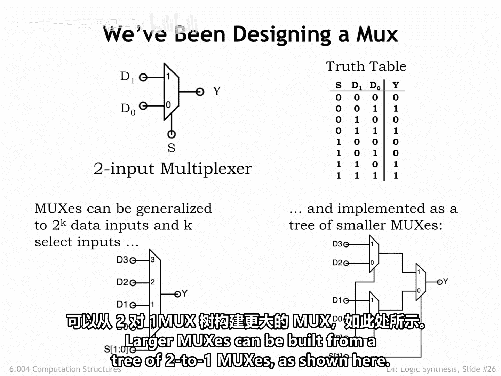
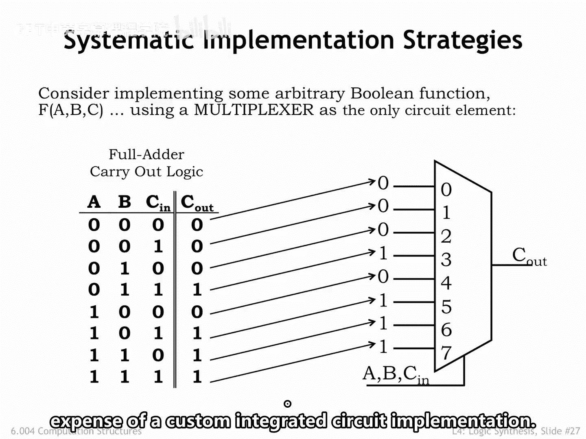
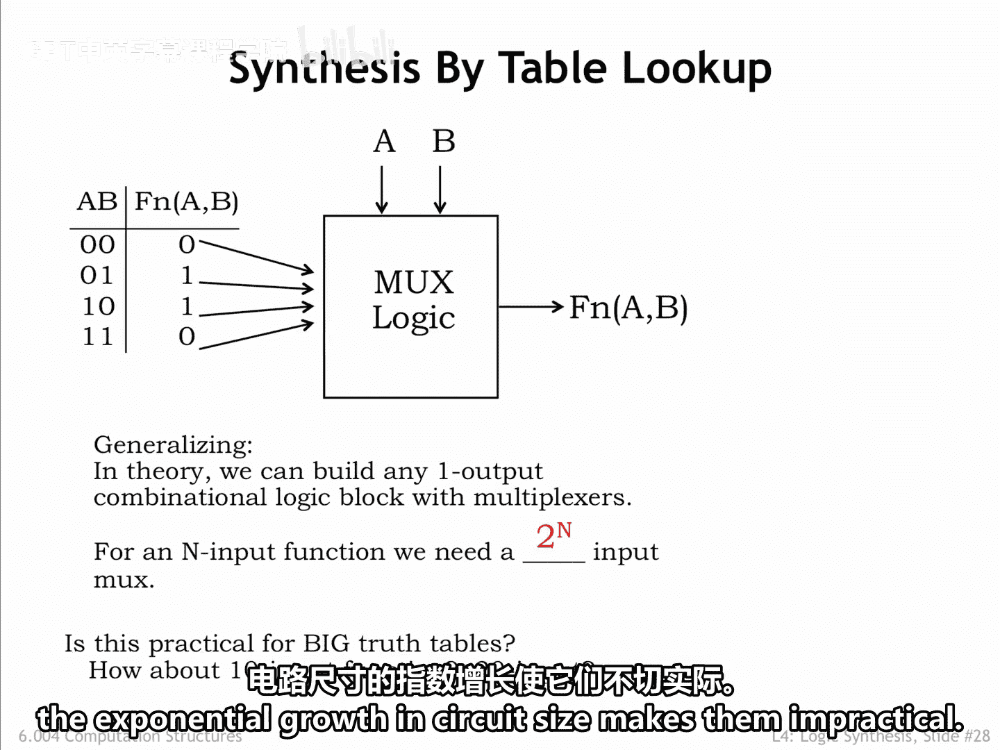
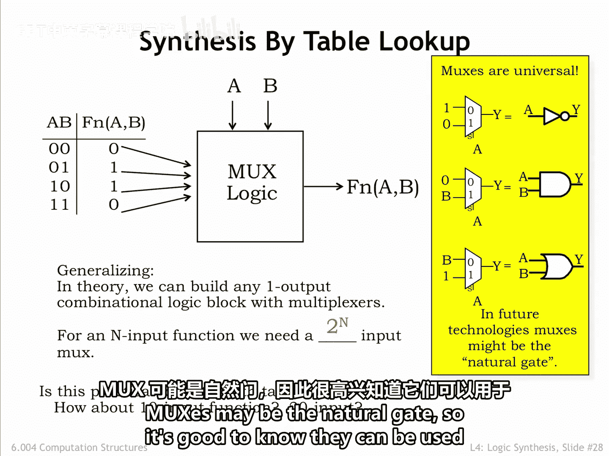
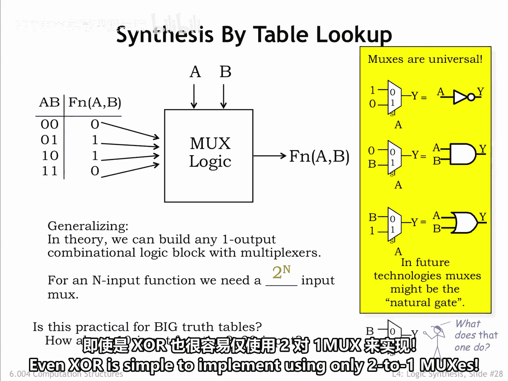

数字系统与计算机架构P1：4.2.6：多路复用器 🚦

在本节课中，我们将要学习一种非常重要的组合逻辑器件——多路复用器。我们将了解它的工作原理、如何构建不同规模的复用器，以及它在实现逻辑函数和可编程逻辑中的关键作用。

---

我们之前用作示例的真值表描述了一种非常有用的组合器件，称为 **2选1多路复用器**。

多路复用器（简称Mux）会从其两个输入值中选择一个作为输出值。当图中标记为 **S** 的选择输入为 **0** 时，数据输入 **D0** 的值成为输出 **Y** 的值。当 **S** 为 **1** 时，数据输入 **D1** 的值被选为输出 **Y** 的值。

多路复用器有多种规模，这取决于选择输入的数量。一个具有 **K** 个选择输入的复用器，将在 **2^K** 个数据输入的值中进行选择。例如，下图展示了一个 **4选1** 复用器，它有四个数据输入和两个选择输入。

更大的复用器可以由多个2选1复用器以树状结构构建而成，如下图所示。

---

上一节我们介绍了多路复用器的基本结构，本节中我们来看看为什么多路复用器如此有趣。一个答案是，它们为实现逻辑函数提供了一种非常优雅且通用的方法。

考虑右侧所示的 **8选1** 复用器。三个输入 **A**、**B** 和 **C** 被用作该复用器的三个选择信号。我们可以将这三个输入看作一个3位二进制数。例如，当它们全为 **0** 时，复用器将选择数据输入 **0**；当它们全为 **1** 时，复用器将选择数据输入 **7**，依此类推。

这如何使实现真值表中所示的逻辑函数变得容易呢？我们只需将复用器的数据输入端连接到真值表输出列中所示的常数值。**A**、**B** 和 **C** 输入端的值将导致复用器选择数据输入端上相应的常数值，作为 **C_out** 输出的值。

如果之后我们更改了真值表，我们无需重新设计复杂的“与或”电路，只需更改数据输入端的常数值即可。我们可以将复用器视为一个 **查表设备**，在此例中，它可以被重新编程以实现任何3输入的逻辑方程。

这种电路可用于创建各种形式的 **可编程逻辑**，其中集成电路的功能不是在制造时确定的，而是在用户稍后执行的编程步骤中设置的。现代可编程逻辑电路可以被编程以替代数百万个逻辑门，这对于在投入定制集成电路实现的高昂成本之前，对数字系统进行原型设计非常方便。

---

因此，具有 **N** 个选择线的复用器，实际上可以替代具有 **N** 个输入的逻辑电路。这样的复用器将拥有 **2^N** 个数据输入。这对于 **N** 值在5或6以内的情况非常有用。但对于输入更多的函数，电路规模的指数级增长会使其变得不切实际。

---

毫不奇怪，多路复用器是 **通用** 的，如下图所示，这些基于复用器的实现可以构建“与或”基本模块。有推测认为，在分子尺度的逻辑技术中，复用器可能是天然的“门”，因此了解它们可以用来实现任何逻辑函数是很有益的。

---

即使是 **异或** 门，也可以仅用两个2选1复用器简单地实现。

---

本节课中我们一起学习了多路复用器。我们了解了其作为数据选择器的基本功能，如何通过树状结构构建更大规模的复用器，以及它作为通用逻辑模块和可编程逻辑核心部件的强大能力。多路复用器是数字系统中连接数据与控制的关键桥梁。