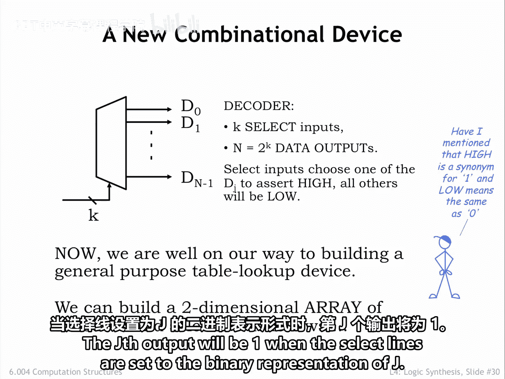
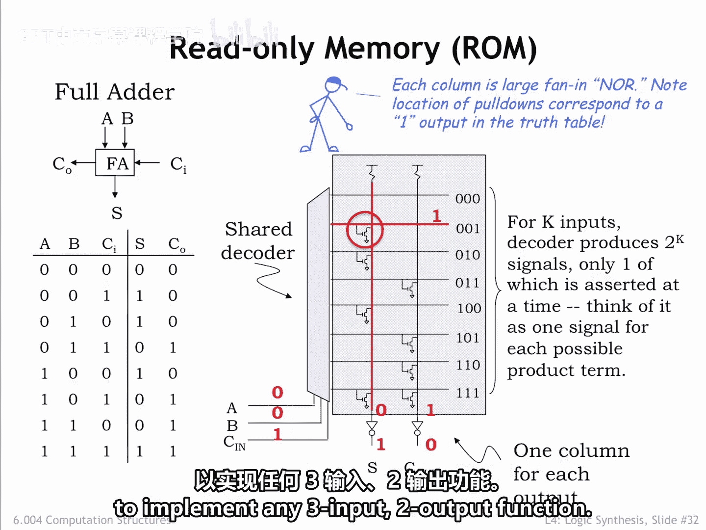
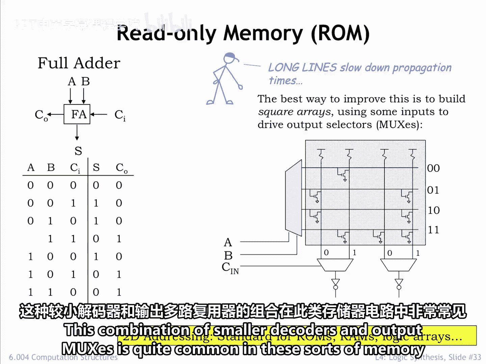
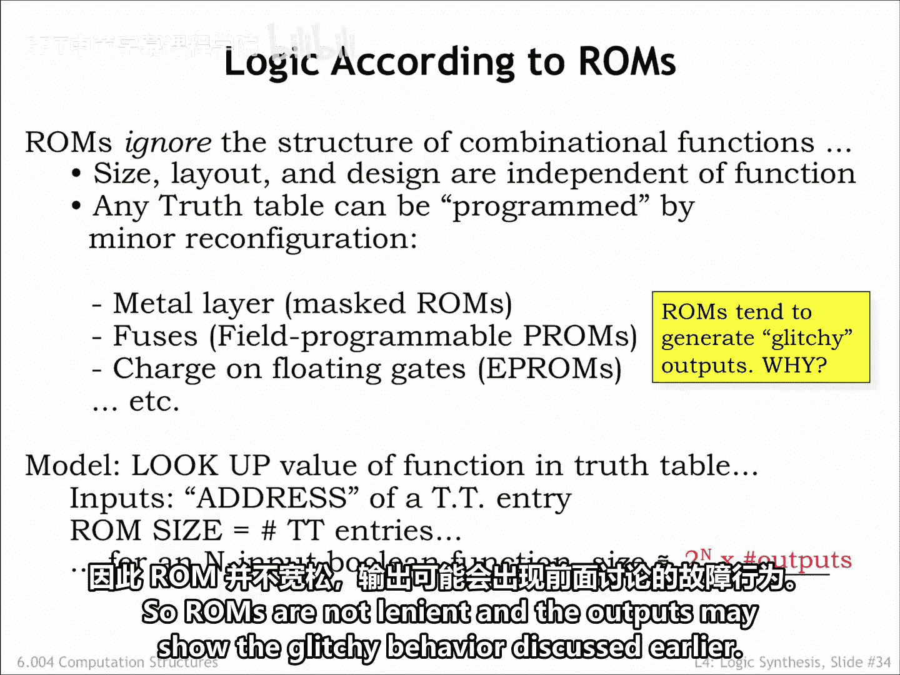
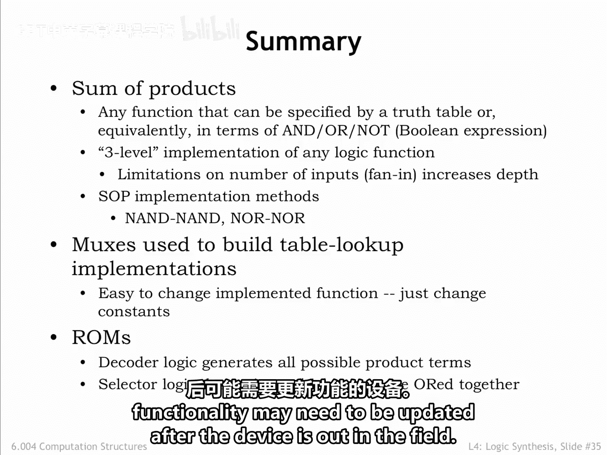

# 040：4.2.7 只读存储器 📖

在本节课中，我们将要学习一种使用只读存储器来实现逻辑功能的最终策略。这种策略在需要从同一组输入生成多个不同输出时非常有用，我们将在后续课程中学习有限状态机时经常遇到这种情况。

上一节我们介绍了多路复用器，它适用于实现只有一个输出列的真值表。本节中我们来看看只读存储器，它则擅长实现具有多个输出列的真值表。

## 解码器：ROM的核心组件

只读存储器的一个关键组件是解码器。解码器有 **K** 个选择输入和 **2^K** 个数据输出。在任何给定时间，只有一个数据输出会是 **1**（高电平），具体是哪一个则由选择输入的值决定。

以下是解码器的工作原理：
*   当选择线设置为 **J** 的二进制表示时，第 **J** 个输出将为 **1**。

## ROM的实现原理

这里展示了一个用于实现左侧所示双输出真值表的只读存储器电路。这个特定的双输出器件是一个全加器，是加法电路中的基本构建模块。

该电路的三个输入 **A**、**B** 和 **C** 连接到一个 **3-8 解码器** 的选择线上。解码器的八个输出在原理图中水平排列，每个输出都标明了使其为高电平的输入值组合。

解码器的输出控制着一个由 **NFET** 下拉开关组成的矩阵。该矩阵为真值表的每个输出都设有一个垂直列。每个开关将一个特定的垂直列连接到地，当开关导通时，会强制该列输出为低电平。列电路的设计使得如果没有下拉开关强制其值为 **0**，则其输出值将为 **1**。每个垂直列上的值经过反相后，产生最终的输出值。

那么，我们如何使用所有这些电路来实现真值表描述的功能呢？

对于任何特定的输入值组合，解码器中恰好有一个输出为高电平，所有其他输出为低电平。可以将解码器输出视为指示了输入值选择了真值表的哪一行。由高电平解码器输出控制的所有下拉开关都将被打开，强制它们所连接的垂直列变为低电平。

例如，如果输入是 **001**，则标记为 **001** 的解码器输出将为高电平。这将打开连接到 **S** 垂直列的下拉开关，强制 **S** 列变为低电平。**C_out** 垂直列没有被下拉，因此它将保持高电平。经过输出反相器后，**S** 将为 **1**，**C_out** 将为 **0**，这正是期望的输出值。

通过改变下拉开关的位置，这个只读存储器可以被编程以实现任何三输入、双输出的函数。

## 处理多输入ROM

对于具有许多输入的只读存储器，解码器会有很多输出，开关矩阵中的垂直列可能会变得很长且速度变慢。我们可以稍微重新配置电路，让一部分输入控制解码器，而其他输入则用于在多个更短、更快的垂直列中进行选择。这种较小解码器和输出多路复用器的组合在这类存储电路中非常常见。

## ROM的特性与权衡

只读存储器（简称 **ROM**）是一种实现策略，它忽略了待实现特定表达式的结构。ROM 的尺寸和整体布局仅由输入和输出的数量决定。通常，开关矩阵会完全填充，所有可能的开关位置都放置了一个 **NFET** 下拉开关。一个独立的物理或电气编程操作决定了哪些开关实际由解码器线路控制，其他开关则被配置为永久关闭状态。

如果 ROM 有 **n** 个输入和 **m** 个输出，那么开关矩阵将恰好有 **2^n** 行和 **m** 个输出列，与真值表的大小完全对应。

当 ROM 的输入发生变化时，各个解码器输出会关闭和开启，但时间上略有不同。随着解码器线路的切换，输出值可能会变化几次，直到下拉开关的最终配置稳定下来。因此，ROM 不是宽容的，其输出可能会出现之前讨论过的毛刺行为。

## 总结

本节课中我们一起学习了各种可用于实现逻辑功能的电路。

**积之和** 方法非常适合用反相逻辑来实现。每个电路都是为实现特定功能而定制的，因此可以做得既快速又小巧。当需要高性能或生产数百万个设备时，设计和制造此类电路的费用是值得的。

**多路复用器** 和 **ROM** 电路实现则基本独立于要实现的特定功能，其功能由一个单独的编程步骤决定，该步骤可以在设备制造完成后进行。它们特别适用于原型设计、小批量生产或功能在设备投入使用后可能需要更新的场景。