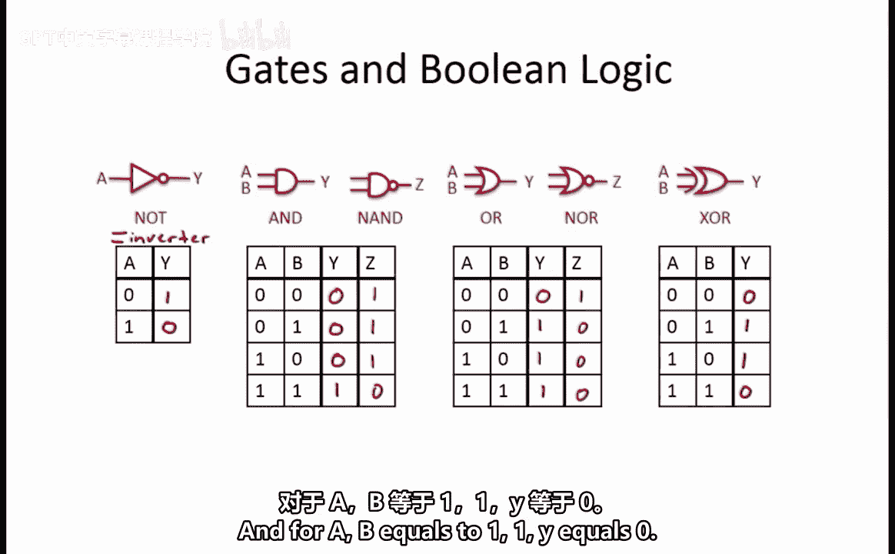
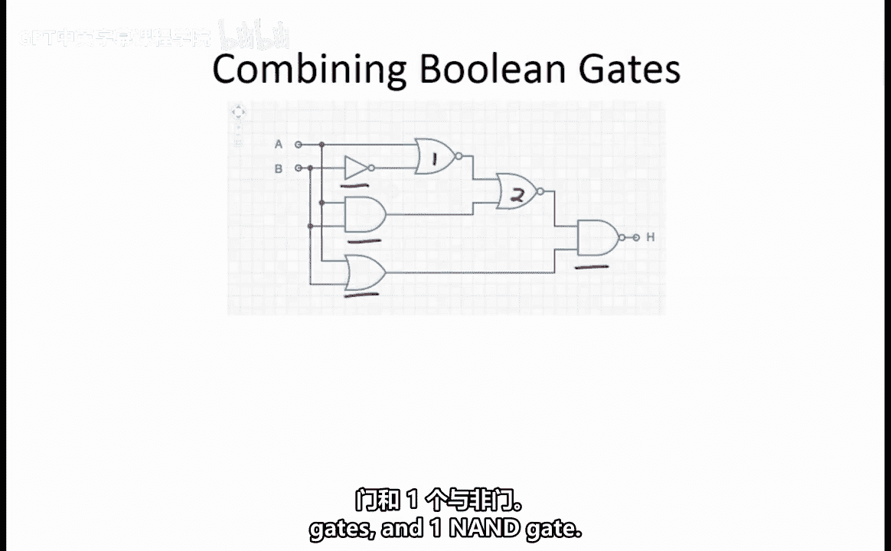
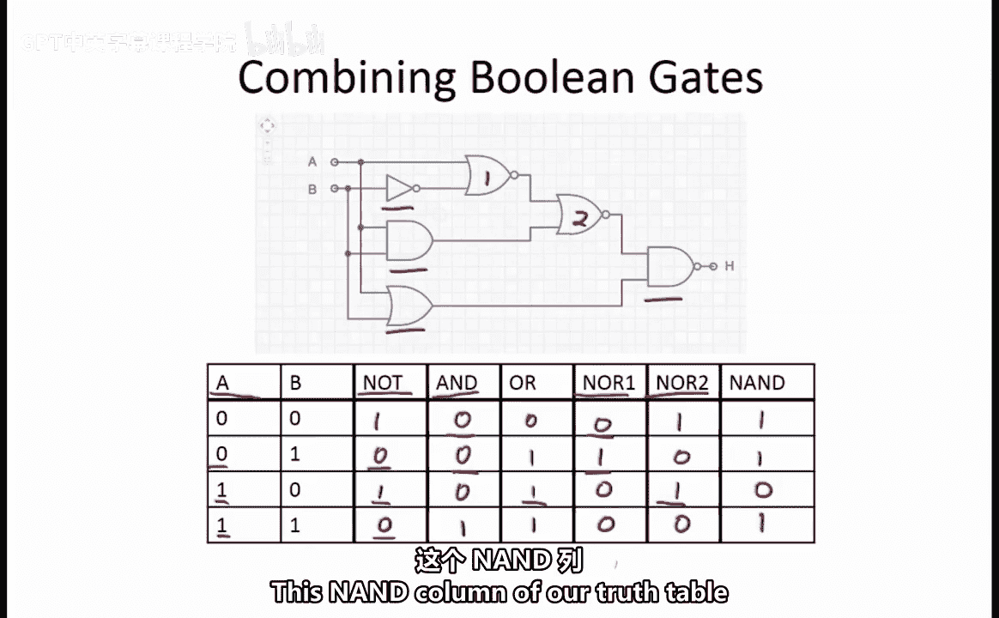
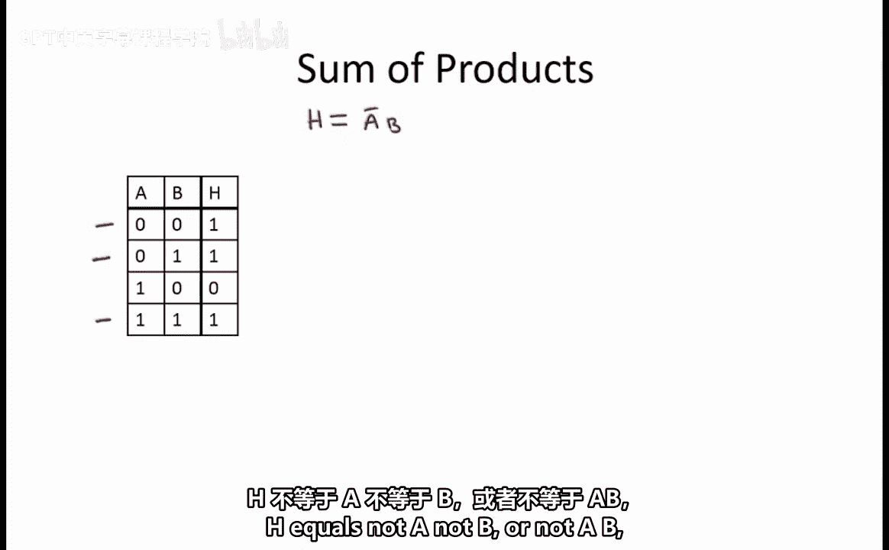
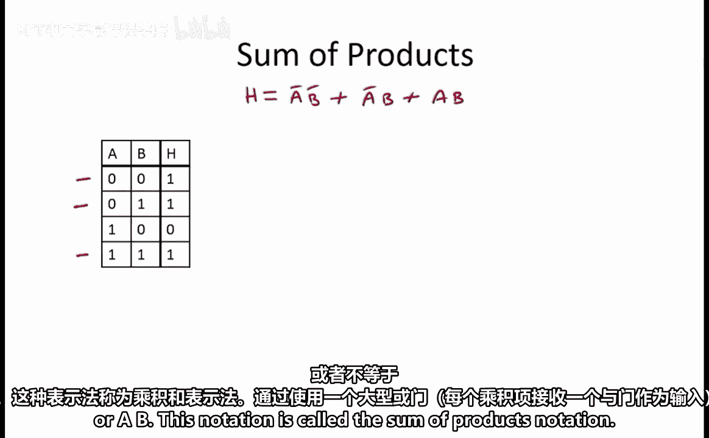
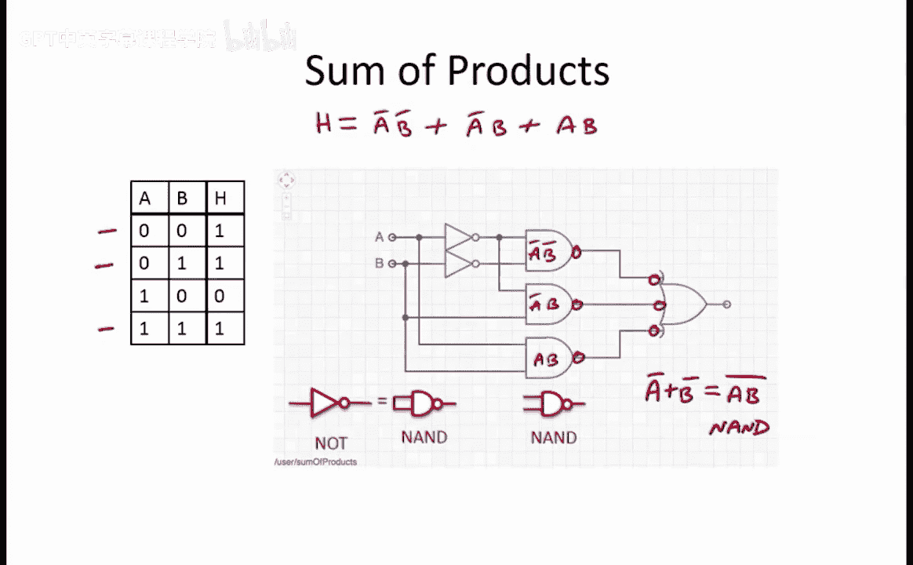

# 数字系统与计算机架构：P1：4.2.8 实例解析：门电路与布尔逻辑 🔌

在本节课中，我们将学习布尔门电路的基本概念，并通过一个具体实例，学习如何分析由多个逻辑门组成的复杂电路的功能。

---

## 概述

直接使用晶体管构建所有逻辑功能较为复杂。因此，我们引入一个更高级的抽象概念——**布尔门**，它代表了晶体管门电路。每个门被赋予一个符号，可用于组合多个逻辑门的原理图。

为了理解任意逻辑门组合所实现的功能，我们将首先回顾基本门电路及其定义逻辑的真值表。

---

## 基本逻辑门回顾

以下是几种基本的逻辑门及其功能定义。

### 非门（Inverter）

非门是一个单输入、单输出的门电路。其输出是输入的逻辑反相。
*   当输入 `A = 0` 时，输出 `Y = 1`。
*   当输入 `A = 1` 时，输出 `Y = 0`。

### 与门（AND Gate）和或门（OR Gate）

**与门**要求其所有输入都为真（1），输出才为真（1）。其真值表如下：
*   输入 `AB = 00`，输出 `Y = 0`
*   输入 `AB = 01`，输出 `Y = 0`
*   输入 `AB = 10`，输出 `Y = 0`
*   输入 `AB = 11`，输出 `Y = 1`

**或门**要求其至少有一个输入为真（1），输出即为真（1）。其真值表如下：
*   输入 `AB = 00`，输出 `Y = 0`
*   输入 `AB = 01`，输出 `Y = 1`
*   输入 `AB = 10`，输出 `Y = 1`
*   输入 `AB = 11`，输出 `Y = 1`



### 与非门（NAND Gate）和或非门（NOR Gate）

与非门和或非门分别是与门和或门的反相输出。
我们倾向于使用与非门和或非门，因为它们是反相逻辑门，可以用单个CMOS晶体管实现，而与门和或门则不能。

### 异或门（Exclusive OR, XOR）

异或门在其两个输入中**恰好有一个**为1时，输出为1，否则输出为0。其真值表如下：
*   输入 `AB = 00`，输出 `Y = 0`
*   输入 `AB = 01`，输出 `Y = 1`
*   输入 `AB = 10`，输出 `Y = 1`
*   输入 `AB = 11`，输出 `Y = 0`



---

## 组合逻辑电路分析实例

上一节我们回顾了基本门电路，本节中我们来看一个由多个门组合而成的电路实例，并学习如何逐步分析其功能。

一个布尔门的输出可以作为另一个布尔门的输入，因此多个门可以用来生成更复杂的函数。例如，下图是一个由两个输入（A和B）和六个门（一个非门、一个与门、一个或门、两个或非门和一个与非门）组成的电路。


为了弄清楚这个门组合的输出是什么，我们可以逐步分析电路。

### 逐步推导真值表

首先，我们枚举输入A和B的所有可能组合（00, 01, 10, 11）。

1.  **非门输出**：非门的输出是B的补码，记为 `B'`。
2.  **与门和或门输出**：与门和或门直接使用A和B作为输入。根据其定义，我们可以直接填写这两列。
3.  **第一个或非门输出**：它的输入是A和 `B'`。我们遍历每种输入组合来确定该门的输出。
    *   输入 `A, B' = 0, 1`，输出为 `0`
    *   输入 `A, B' = 0, 0`，输出为 `1`
    *   输入 `A, B' = 1, 1`，输出为 `0`
    *   输入 `A, B' = 1, 0`，输出为 `0`
4.  **第二个或非门输出**：它的输入是第一个或非门的输出和与门的输出。同样，我们遍历每种输入组合来确定输出。
    *   当两个输入都是 `0` 时，输出为 `1`
    *   当一个输入是 `0`，另一个是 `1` 时，输出为 `0`
5.  **最终输出（与非门）**：最后，我们将第二个或非门的输出和或门的输出作为与非门的输入，生成电路的最终输出H。
    *   当两个输入都是 `1` 时，输出为 `0`
    *   其他情况下，输出为 `1`

通过以上步骤，我们得到了完整的真值表：




### 用布尔表达式表示功能

现在我们已经评估出对于每种A和B的组合，输出H等于什么。我们可以将电路表示为一个输入为A和B、输出为H的单一真值表。

此时，我们可以将函数H表示为所有使H等于1的情况的组合。这发生在以下三种情况：
1.  A和B都等于0
2.  A等于0且B等于1
3.  A和B都等于1

这可以用以下布尔逻辑表达式表示：
```
H = (A' * B') + (A' * B) + (A * B)
```
这种表示法称为**积之和**形式。





---

## 电路的等效实现

任何积之和表达式都可以转换为仅使用非门、与门和或门的简单门级表示。具体方法是使用一个大型的或门，其每个输入连接一个与门（每个与门对应一个乘积项），并根据需要使用非门对输入取反。


关于这个门组合，一个有趣的现象是它可以很容易地转换为一个完全由**与非门**组成的电路。

### 转换为全与非门电路

转换方法基于以下原理：
1.  将一个门的输出反相两次，会得到原始输出。这意味着我们可以在每个与门输出和或门输入之间添加两个反相器。
2.  我们可以将这些反相器画成代表反相操作的“气泡”：一个气泡在与门的输出端，另一个气泡在或门的输入端。
3.  我们知道，一个与门后接一个反相器，就是一个与非门。
4.  我们知道，一个反相器等效于一个将两个输入连接在一起的与非门。
5.  此外，利用德摩根定律，我们知道 `(A' + B')` 等价于 `(A * B)'`。这意味着气泡后接的或门也可以被一个与非门替代。

通过以上步骤，我们得到了一个功能等效、但完全由与非门组成的电路表示。



### 通用门的概念

使用与非门实现电路的优势在于，与非门是反相逻辑，每个门都可以用单个CMOS晶体管实现。

所有函数都可以表示为与非门的组合，因此**与非门被认为是通用门**。或非门也是通用的，可以用来表示任何函数。

进一步说，任何可以用来实现其他所有函数的电路也被认为是通用的。要确定一个门G是否是通用的，需要检查是否可以通过简单地使用一个或多个G的副本，以及低电平和高电平常量输入，将G转换为与非门或或非门。

---

## 总结

本节课中我们一起学习了：
1.  回顾了非门、与门、或门、与非门、或非门和异或门等基本逻辑门及其真值表。
2.  通过一个具体实例，学习了如何逐步分析由多个逻辑门组成的组合电路，并推导出其完整的真值表和布尔表达式（积之和形式）。
3.  探讨了如何将基于与门和或门的电路转换为完全由与非门构成的等效电路，并理解了与非门作为“通用门”的重要性。


掌握这些分析方法是理解和设计更复杂数字逻辑系统的基础。