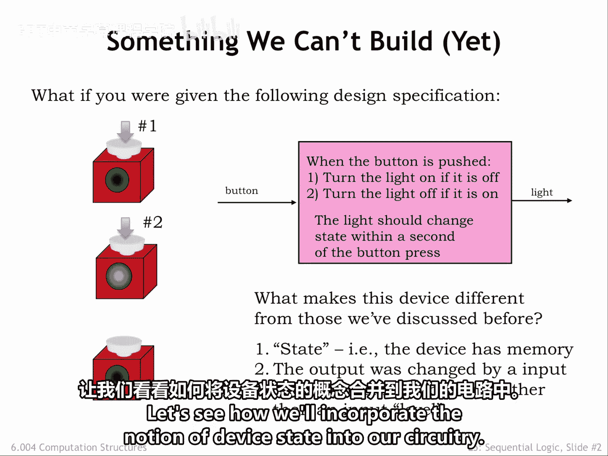
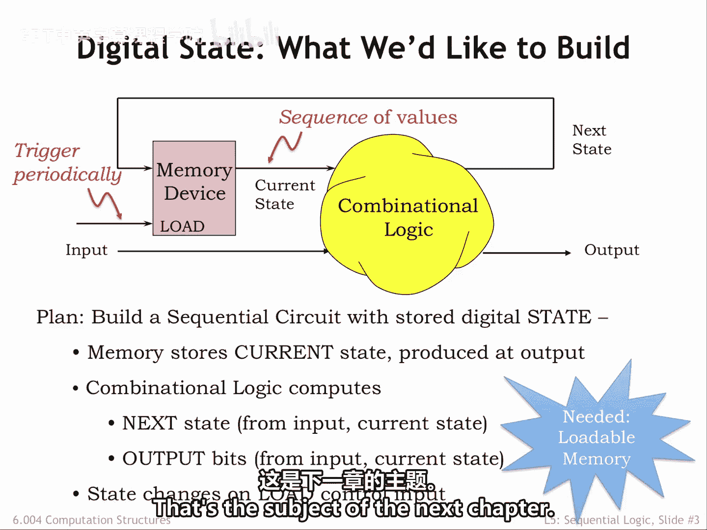
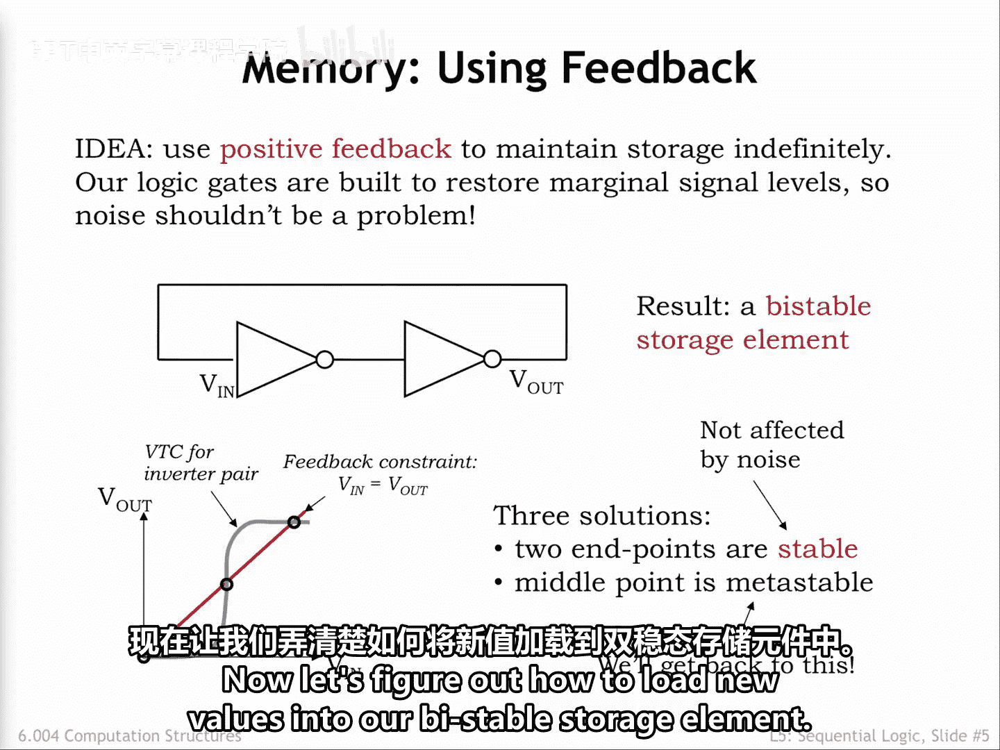

# 数字系统与计算机架构：P1：数字状态 🧠

在本节课中，我们将学习数字系统中的“状态”概念。我们将了解为什么组合逻辑电路无法实现某些功能，并探索如何通过引入存储元件来构建具有记忆能力的电路，即“时序逻辑”电路。

## 从组合逻辑到状态记忆

上一节我们介绍了如何根据功能规格构建组合逻辑电路，其输出值仅取决于输入的当前值。

但这里有一个简单的设备无法用组合逻辑构建。该设备有一个作为输出的灯和一个作为输入的按钮。如果灯是关的，按下按钮，灯会亮起。如果灯是亮的，按下按钮，灯会熄灭。

这个电路与我们之前讨论的组合电路有何不同？

最大的区别在于，该设备的输出并非其当前输入值的函数。按下按钮时的行为取决于过去发生的事件。奇数次按下会打开灯，偶数次按下会关闭灯。该设备记住了上一次按下是奇数次还是偶数次，以便在下一次按钮按下时根据规格做出反应。

能够记住其输入历史的设备被称为具有“状态”。

第二个区别更为微妙。按钮的按下标记了一个时间点的事件。我们谈论的是按下前的状态（灯亮）和按下后的状态（灯灭）。我们感兴趣的是按钮从“未按下”到“按下”的转变，而不是按钮当前是否被按下。

设备的内部状态使其即使在接收相同输入时也能产生不同的输出。组合设备无法表现出这种行为，因为其输出仅取决于输入的当前值。

接下来，我们看看如何将设备状态的概念融入我们的电路设计中。

## 时序逻辑：引入存储元件

我们将引入一个新的抽象概念——存储元件，用于存储我们想要构建的数字系统的当前状态。

存储元件存储一个或多个比特，用于编码系统的当前状态。这些比特作为数字值出现在存储元件的输出端（图中标记为“当前状态”的导线）。当前状态与当前输入值一起，作为组合逻辑块的输入，该逻辑块产生两组输出。

一组输出是设备的下一个状态，使用与当前状态相同数量的比特进行编码。另一组输出是作为数字系统输出的信号。

组合逻辑的功能规格（可能是真值表或一组布尔方程）规定了下一个状态和系统输出如何与当前状态和当前输入相关联。

存储元件有两个输入：一个指示何时用下一个状态替换当前状态的“加载”控制信号，以及一个指定下一个状态应该是什么的数据输入。

我们的计划是定期触发加载控制，从而为当前状态产生一系列值。序列中的每个状态都由前一个状态以及触发加载时的输入决定。

包含组合逻辑和存储元件的电路被称为“时序逻辑”。

存储元件具有以比特为单位的特定容量。如果存储元件存储K比特，由于设备状态使用K比特内存进行编码，因此可能状态数量的上限为 **2^K**。

因此，我们需要弄清楚如何构建一个可以不时加载新值的存储元件。这是本章的主题。我们还需要一种系统的方法来设计时序逻辑，以实现期望的动作序列，这将是下一章的主题。

## 存储技术：从电容到双稳态元件

我们一直用电压表示比特，因此可能会考虑使用电容器来存储特定电压。

电容器是一个被动的双端器件。两个端子连接到由绝缘体隔开的两个平行导电板。向电容器的一个板添加电荷Q会在两个板端子之间产生电压差V。Q和V通过电容器的电容C相关：**Q = C * V**。

当我们通过将板端子连接到较高电压来向电容器添加电荷时，这称为给电容器充电；当我们通过将板端子连接到较低电压来取走电荷时，这称为给电容器放电。

以下是基于电容器的存储设备可能的工作方式。电容器的一个端子连接到某个稳定的参考电压。我们使用一个NFET开关将电容器的另一个板连接到一根称为“位线”的导线。NFET开关的栅极连接到一根称为“字线”的导线。

要将一个比特信息写入我们的存储设备，首先将位线驱动到所需的电压（即数字0或数字1）。然后将字线设置为高电平，打开NFET开关。电容器将充电或放电，直到其电压与位线相同。此时，将字线设置为低电平，关闭NFET开关，从而将电荷隔离在电容器的内部板上。

在理想情况下，电荷将无限期地保留在电容器的板上。在之后的某个时间访问存储的信息时，我们首先将位线充电到某个中间电压。然后将字线设置为高电平，打开NFET开关，将位线上的电荷与电容器的电荷连接起来。位线和电容器之间的电荷共享会对位线上的电荷及其电压产生微小影响。

如果电容器存储的是数字1（因此处于较高电压），电荷将从电容器流入位线，提高位线的电压。如果电容器存储的是数字0（因此处于较低电压），电荷将从位线流入电容器，降低位线的电压。位线电压的变化取决于位线电容与存储电容的比值，但存储电容通常非常小。

一个非常灵敏的放大器（称为“读出放大器”）用于检测这种微小变化，并产生一个合法的数字电压作为从存储单元读取的值。

读写操作需要一整套操作序列以及精心设计的模拟电子电路。好消息是，单个存储电容器非常小。在现代集成电路中，我们可以在相对便宜的芯片上容纳数十亿比特的存储，这种芯片称为“动态随机存取存储器”，简称DRAM。DRAM的每比特存储成本非常低。

坏消息是，读写所需的复杂操作序列需要一些时间，因此访问时间相对较慢。并且我们必须担心在外部电噪声的影响下，如何仔细维持存储电容器上的电荷。

更糟糕的消息是，NFET开关并不完美。即使在其正式关闭时，开关上也会有微量的泄漏电流。随着时间的推移，这种泄漏电流会对存储电荷产生明显影响。因此，我们必须在泄漏损坏存储信息之前，通过读取和重写存储值来定期刷新存储器。在当前技术下，这大约需要每10毫秒进行一次。

也许我们可以通过设计一个利用反馈来持续刷新存储信息的电路，来规避电容存储的缺点。

## 双稳态存储元件：利用反馈

这是一个使用组合反相器以正反馈环路连接的电路。如果我们将其中一个反相器的输入设置为数字0，它将在其输出端产生数字1。第二个反相器随后在其输出端产生数字0，该输出又连接回原始输入。这是一个稳定的系统，只要电路连接到电源和地，即使存在噪声，这些数字值也将保持不变。当然，如果我们翻转两条导线上的数字值，系统也是稳定的。

其结果是一个具有两种稳定配置的系统，称为“双稳态存储元件”。

下图是电压传输特性图，显示了两个反相器系统的V_out和V_in之间的关系。将系统输出连接到其输入的效果由添加的约束条件 **V_in = V_out** 表示。然后，我们可以通过图形方式求解同时满足两个约束条件的V_in和V_out值。

两条曲线相交处有三个可能的解。VTC两端两个交点处的点是稳定的，这意味着V_in的微小变化（例如由电噪声引起）对V_out没有影响。因此，尽管存在微小扰动，系统仍将返回其稳定状态。

中间的相交点是我们所说的“亚稳态”。理论上，系统可以永远保持在这个特定的V_in和V_out电压上。但最小的扰动将导致电压快速转换到其中一个稳定解。

由于我们计划使用这个双稳态存储元件作为我们的存储组件，我们需要弄清楚如何避免系统进入这种亚稳态。更多内容将在下一章讨论。

现在，让我们弄清楚如何将新值加载到我们的双稳态存储元件中。

---

本节课中我们一起学习了数字状态的核心概念。我们了解到，组合逻辑缺乏记忆过去输入的能力，因此无法实现依赖于历史状态的功能。通过引入存储元件来保存“状态”，我们构建了时序逻辑电路。我们探讨了使用电容器存储信息的DRAM技术及其优缺点，并介绍了利用正反馈实现稳定存储的双稳态元件原理，为后续学习如何加载和控制状态奠定了基础。