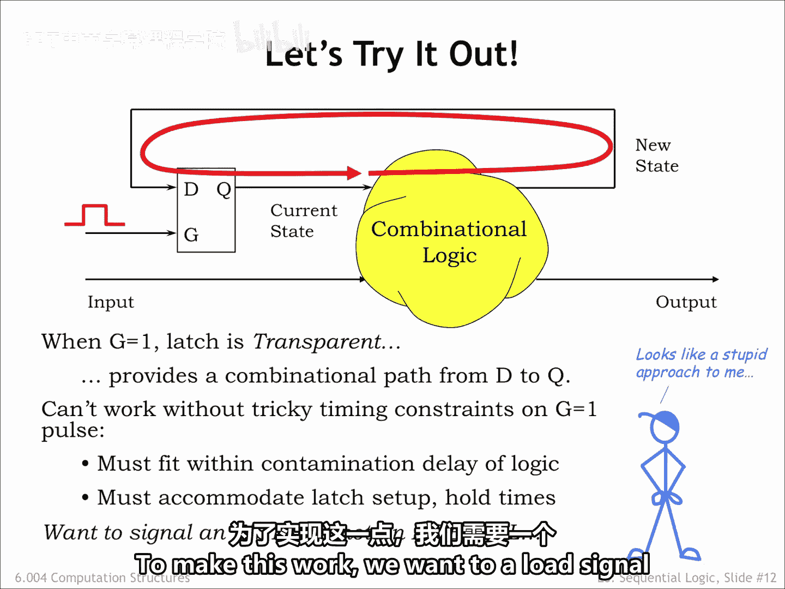
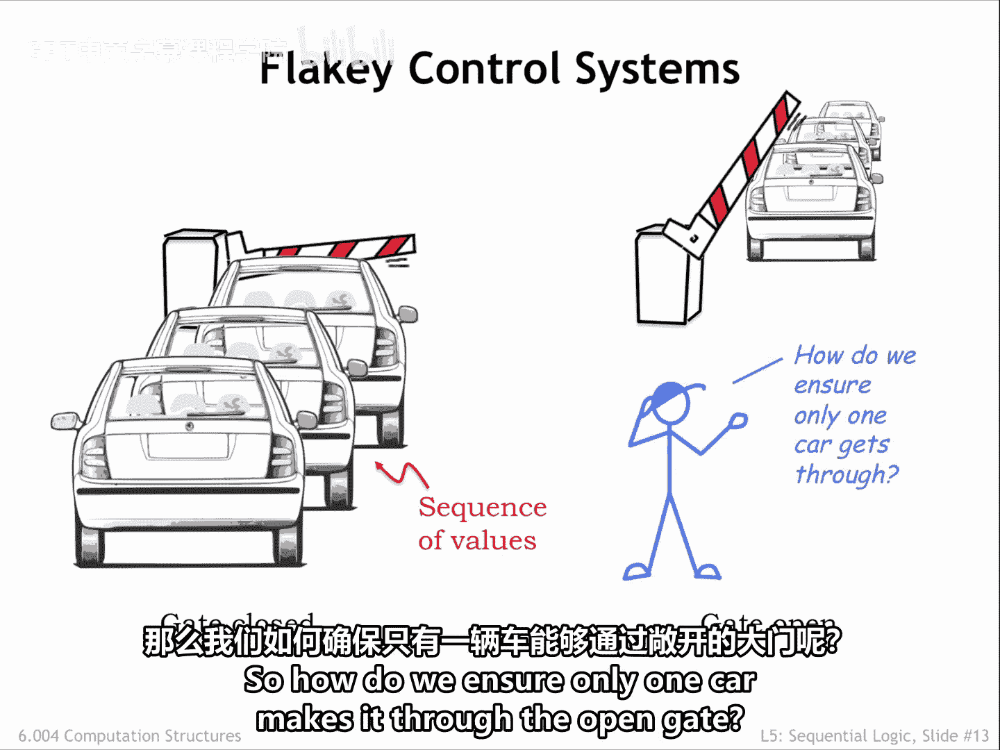
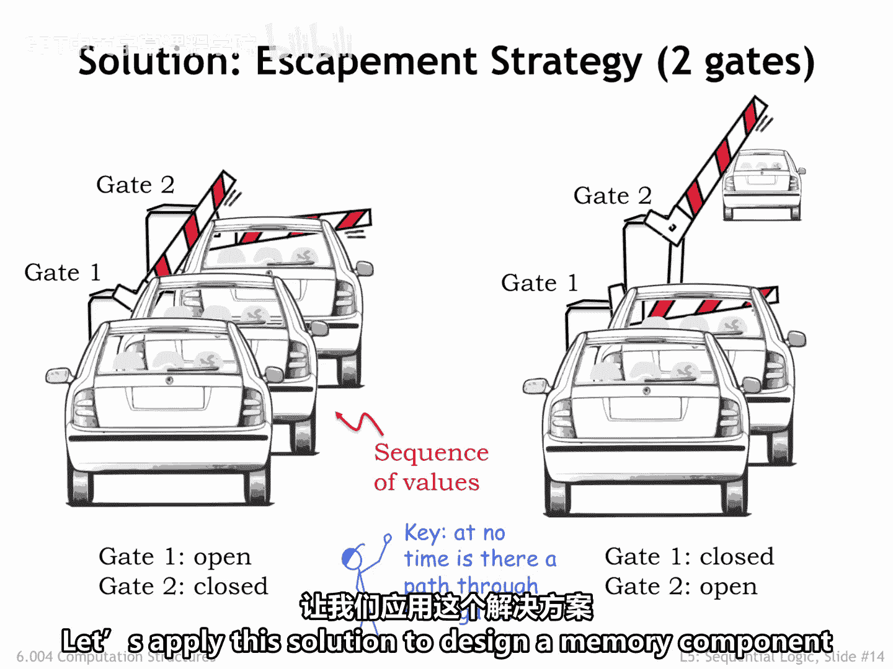
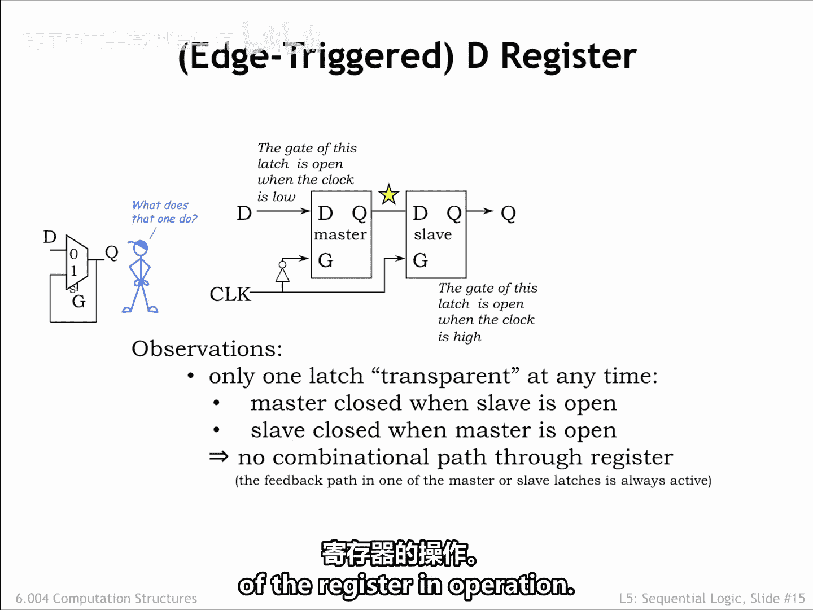

# 047：5.2.3 D寄存器

在本节课中，我们将学习如何设计一个更可靠的存储元件——D寄存器，以解决在时序逻辑系统中使用简单锁存器时可能出现的时序问题。

上一节我们讨论了使用锁存器作为存储元件时，由于门控信号开启时间过长而可能产生的信号环路问题。本节中，我们来看看如何通过一种巧妙的双门结构来解决这个问题。

## 锁存器的问题与双门方案

让我们尝试使用锁存器作为时序逻辑系统中的存储元件。为了将新状态的编码加载到锁存器中，我们需要将锁存器的门控输入设置为高电平以打开它，让新值传播到代表当前状态的锁存器Q输出端。这个更新后的值会通过组合逻辑传播，从而更新新状态信息。

但是，如果门控信号保持高电平的时间过长，我们就在系统中创建了一个环路。当信息在环路中反复传播时，新状态值开始快速变化，我们加载新状态到锁存器的计划就会出错。

因此，为了使系统正常工作，我们需要精确控制门控信号G为高电平的时间间隔。这个间隔必须足够长以满足动态约束的要求，但又必须足够短，以便在新状态信息有机会绕环路传播一圈之前，锁存器能够再次关闭。这种对时序的精确要求在实际中很难保证，因为信号的确切时序几乎无法保证。我们只有信号转换时间的上下限，而没有精确间隔的保证。我们真正需要的，是一个标记时间点而非时间间隔的加载信号。

以下是一个类比，帮助我们理解正在发生的情况以及我们可以采取的措施。

想象一排汽车在收费站闸门前等待。汽车序列代表了我们时序逻辑中的状态序列，而带闸门的收费站则代表了锁存器。最初，闸门关闭，汽车耐心等待通过收费站。当闸门打开时，第一辆车驶出收费站。但你可以看到，关闭闸门的时机将非常棘手。它必须打开足够长的时间让第一辆车通过，但又不能太长，以免其他车辆也通过。这正是我们在时序逻辑中使用锁存器作为存储元件时所面临的问题。

那么，如何确保只有一辆车通过闸门呢？

一种解决方案是使用两道闸门。计划如下：最初，闸门1打开，允许恰好一辆车进入收费站，同时闸门2关闭。然后在某个特定时间点，我们关闭闸门1，同时打开闸门2。这让收费站里的那辆车得以继续前进，但阻止了任何其他车辆通过。我们可以重复这个两步过程，每次处理一辆车。关键在于，任何时候都不存在同时穿过两道闸门的路径。这与机械钟表中的擒纵机构是相同的原理。擒纵机构确保连接到发条的齿轮一次只前进一个齿，防止发条使齿轮疯狂旋转，导致一天的时间瞬间流逝。

如果我们观察收费站的输出，会看到一辆车在闸门2打开的那个时间点之后不久出现。下一辆车将在闸门2下一次打开之后不久出现，依此类推。车辆通过收费站的速率由闸门2打开的间隔时间决定。

## D寄存器的结构与原理

让我们应用这个解决方案来为时序逻辑设计一个存储元件。

借鉴双闸门收费站的设计思路，我们将使用两个背靠背的锁存器设计一个新元件，称为D寄存器。D寄存器的加载信号通常被称为寄存器的时钟，但寄存器的D输入和Q输出所扮演的角色与锁存器中的相同。首先，我们将描述D寄存器的内部结构，然后描述它的功能，并详细研究其工作原理。

D输入连接到我们称为主锁存器的部分，而Q输出连接到从锁存器。请注意，时钟信号在连接到主锁存器的门控输入之前被反相了。因此，当主锁存器打开时，从锁存器关闭，反之亦然。这实现了我们在上一张幻灯片中看到的擒纵行为：任何时候都不存在从寄存器D输入到寄存器Q输出的有效路径。

时钟信号上的反相器引入的延迟可能会引起我们的担忧。当时钟信号发生从0到1的上升沿转换时，是否可能存在一个短暂的间隔，使两个锁存器的门控信号同时为高？因为反相器输出从1转换到0之前会有一个小的延迟。实际上，反相器并非必需。我们来看一个稍有不同的锁存器示意图，其中当G为低电平时锁存器打开，当G为高电平时关闭。这正是我们主锁存器所需要的。顺便提一下，你有时会听到寄存器被称为触发器，这是因为锁存器中正反馈环路的双稳态特性。

这就是D寄存器的内部结构。在下一节中，我们将逐步了解寄存器的工作原理。

## D寄存器的工作步骤

以下是D寄存器在一个时钟周期内的工作步骤：

1.  **时钟为低电平（加载阶段）**：当时钟信号为低电平时，主锁存器的门控输入为高电平（经过反相后），因此主锁存器**关闭**，其输出保持稳定。同时，从锁存器的门控输入直接为低电平，因此从锁存器**打开**。此时，从锁存器的输出Q反映了之前存储在寄存器中的值，并对外部电路可见。D输入端的新数据可以进入主锁存器，但由于主锁存器关闭，数据被阻挡在其输入端，不会影响当前输出Q。

2.  **时钟上升沿（捕获时刻）**：当时钟信号从低电平跳变到高电平的瞬间，这是一个关键的时间点。主锁存器的门控输入变为低电平（反相后），因此主锁存器**打开**，D输入端的数据被快速捕获并传送到主锁存器的输出端。与此同时，从锁存器的门控输入变为高电平，因此从锁存器**关闭**，将其输出Q与主锁存器刚刚变化的新输出隔离开来。这个短暂的过渡期由电路设计保证两个锁存器不会同时导通。

3.  **时钟为高电平（保持阶段）**：当时钟信号稳定在高电平时，主锁存器保持打开，但其输出已经稳定为在上升沿捕获的D值。从锁存器保持关闭，因此寄存器的输出Q保持不变，仍然是上升沿之前的值。此时，即使D输入端的数据发生变化，也不会影响输出Q，因为从锁存器是关闭的，且主锁存器的输出已经锁定。

4.  **时钟下降沿（传输时刻）**：当时钟信号从高电平跳变回低电平时，主锁存器再次关闭，锁定当前D值。从锁存器则打开，将主锁存器中锁定的新值传输到输出端Q。此时，外部电路看到输出Q更新为在之前上升沿捕获的D值。

这个过程可以总结为：在时钟上升沿，D寄存器**捕获**输入D的当前值；在时钟下降沿（或下一个上升沿，取决于设计），它将捕获的值**传输**到输出Q。这种“捕获-传输”机制，通过主从锁存器的交替开关实现，确保了在一个时钟周期内，输入的变化不会直接导致输出的不稳定变化，从而避免了时序竞争问题。寄存器的输出Q只在每个时钟边沿（通常是上升沿）之后更新一次，其值等于上一个时钟边沿时D输入端的数据。这可以用一个简单的时序行为来描述：
`Q(t+1) = D(t)`，其中t代表第t个时钟边沿。

## 总结

本节课中我们一起学习了D寄存器的设计原理。我们首先指出了简单锁存器在时序逻辑中作为存储元件时，因门控信号时序难以精确控制而可能产生信号环路的问题。接着，通过收费站和擒纵机构的类比，我们引入了使用两个锁存器背靠背工作的双门解决方案。最后，我们详细剖析了D寄存器的内部结构，它由一个主锁存器和一个从锁存器构成，通过反相的时钟信号控制，实现了输入数据的稳定捕获与传输。D寄存器在时钟上升沿采样输入D，并在之后将值稳定输出到Q，从而为时序逻辑电路提供了可靠且易于管理的存储功能。