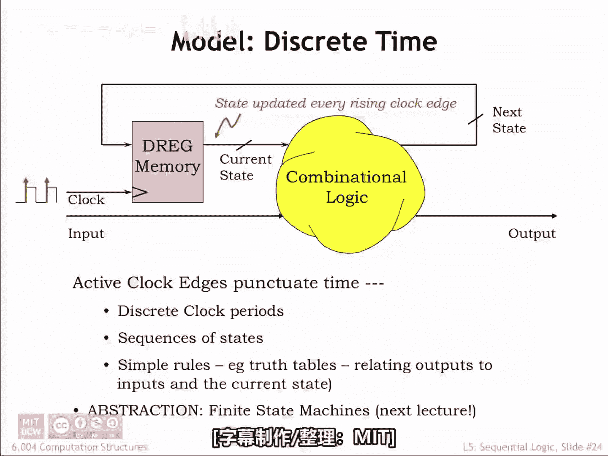
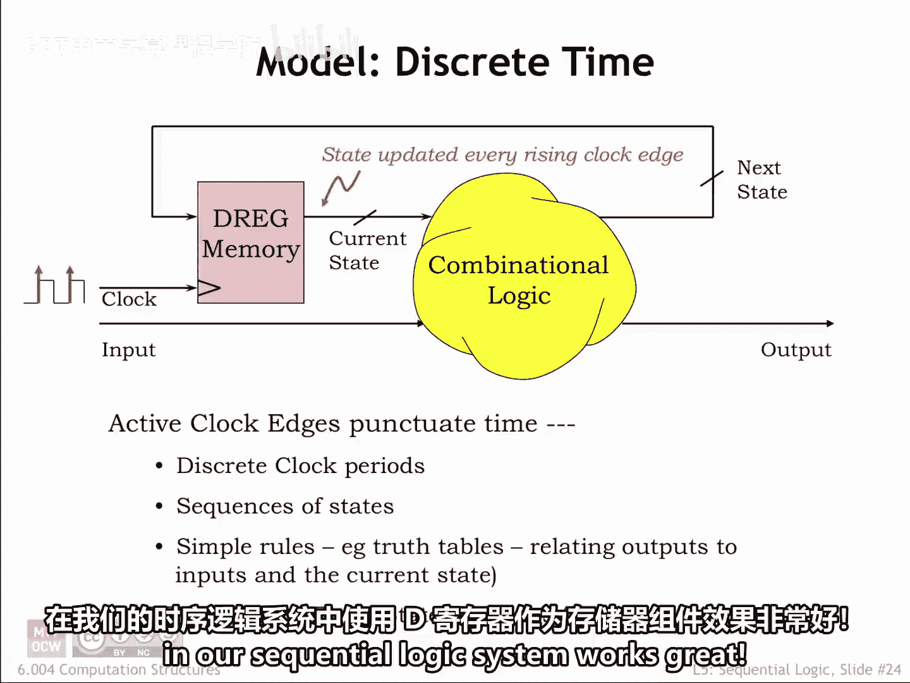
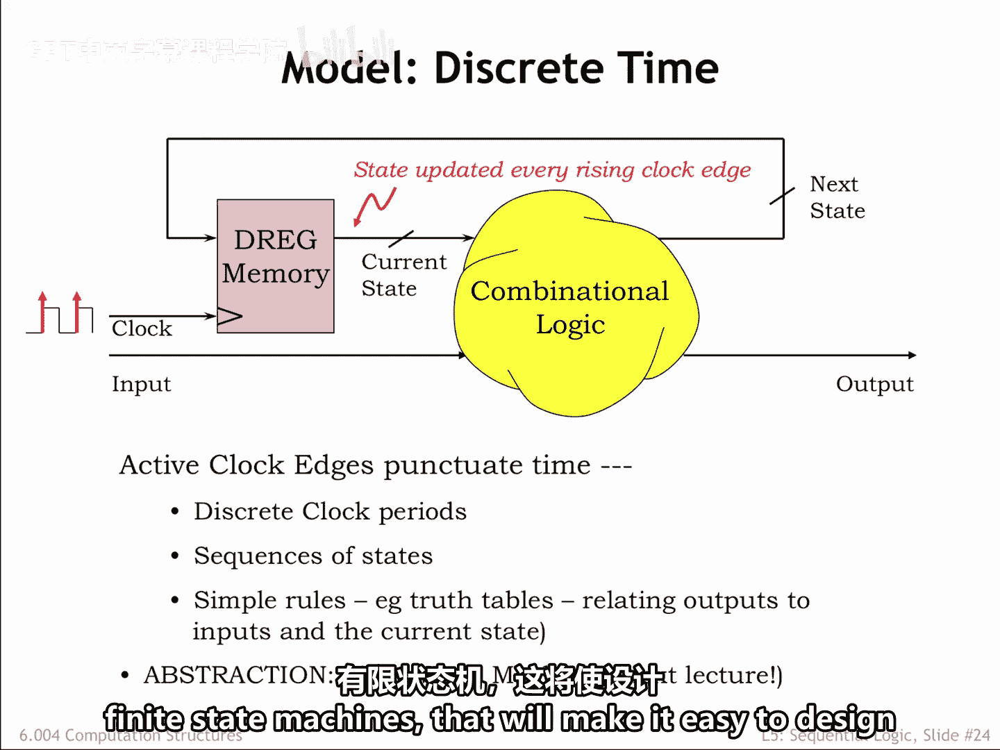
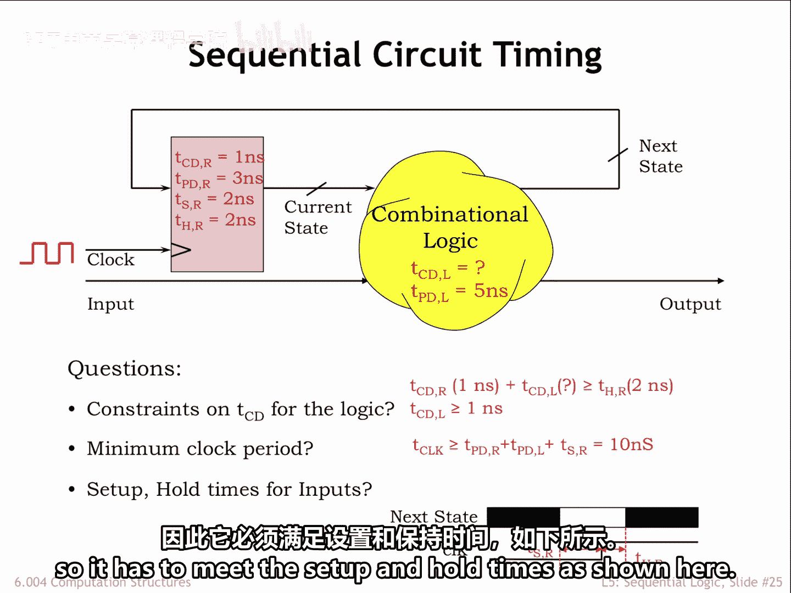
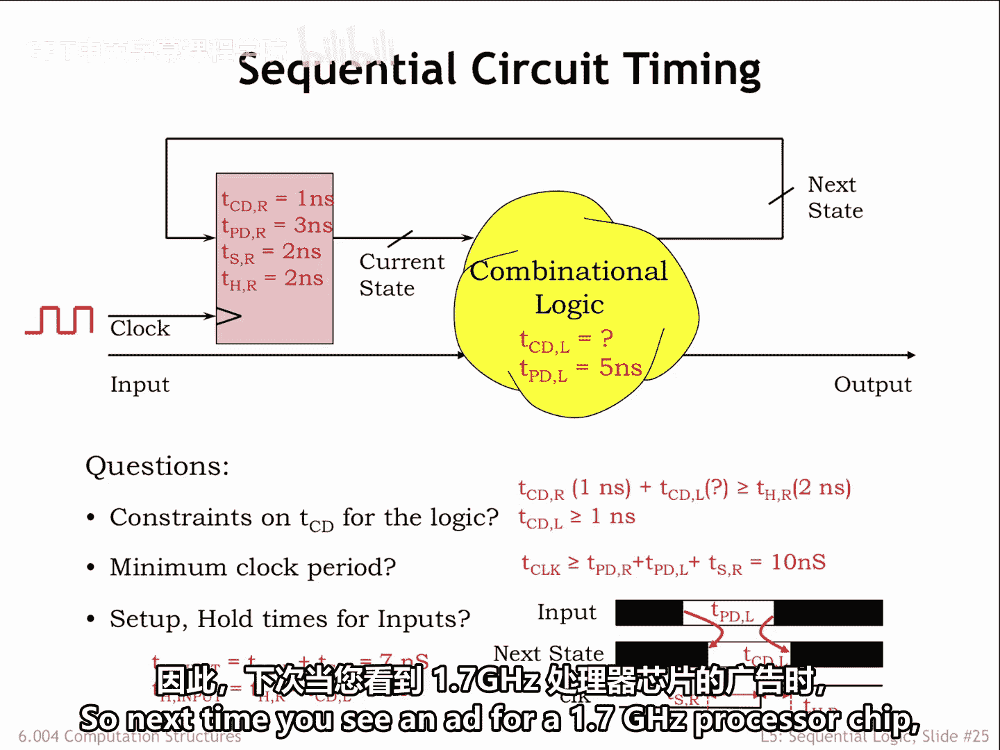

# 050：5.2.6 时序分析示例 ⏱️

在本节中，我们将学习如何对一个时序逻辑系统进行时序分析。我们将应用之前学到的时序约束不等式，通过一个具体示例来计算关键参数，如最小时钟周期和输入信号的建立与保持时间要求。

---

## 使用D寄存器作为存储元件

在时序逻辑系统中，使用D寄存器作为存储元件效果很好。在每个时钟的上升沿，寄存器会加载新的状态值。这个新状态值将在寄存器输出端呈现，并在当前时钟周期的剩余时间内作为“当前状态”使用。

组合逻辑电路利用这个“当前状态”和输入信号的值，来计算“下一个状态”以及输出信号的值。一系列时钟上升沿和输入信号的变化，将产生一系列的状态变化，进而产生一系列的输出。

在下一章，我们将引入一个新的抽象概念——有限状态机，它将使设计时序逻辑系统变得更加容易。

---

## 时序分析示例

现在，让我们利用已学的时序分析技术，来分析这里展示的时序逻辑系统。寄存器和组合逻辑的时序规格参数如图所示。

以下是需要回答的问题。

### 组合逻辑的污染延迟要求

组合逻辑的污染延迟并未指定。为了使系统正常工作，它必须满足什么条件？

我们知道，根据动态准则，**寄存器污染延迟**与**逻辑污染延迟**之和必须大于或等于**寄存器的保持时间**。用公式表示即：

**t_cd(reg) + t_cd(logic) ≥ t_hold(reg)**

使用已知参数并进行简单计算可知，逻辑电路的污染延迟必须至少为 **1纳秒**。

### 最小时钟周期计算

第二个时序不等式告诉我们，时钟周期 **T_clock** 必须大于**寄存器传播延迟**、**逻辑传播延迟**与**寄存器建立时间**三者之和。用公式表示即：

**T_clock > t_pd(reg) + t_pd(logic) + t_setup(reg)**

代入已知参数值，我们计算出最小时钟周期为 **10纳秒**。

### 输入信号的时序约束

接下来，我们需要确定输入信号相对于时钟上升沿的时序约束。为此，我们需要借助时序图进行分析。

“下一个状态”信号是寄存器的输入，因此它必须满足寄存器指定的建立时间和保持时间，如图所示。

---

## 输入信号约束推导

现在，我们引入输入信号。它的跳变时序如何影响“下一个状态”信号的时序呢？

**输入信号的建立时间**很容易计算。它等于**逻辑电路的传播延迟**加上**寄存器的建立时间**。我们之前计算过，这个值是 **7纳秒**。

换句话说，如果输入信号在时钟上升沿到来之前至少稳定 **7纳秒**，那么“下一个状态”信号就能在时钟上升沿到来之前至少稳定 **2纳秒**，从而满足寄存器指定的建立时间要求。

**输入信号的保持时间**计算如下：它等于**寄存器的保持时间**减去**逻辑电路的污染延迟**。我们计算得出这个值为 **1纳秒**。

换句话说，如果输入信号在时钟上升沿到来之后至少保持稳定 **1纳秒**，那么“下一个状态”信号就能在时钟上升沿之后额外保持稳定 **1纳秒**，总共达到 **2纳秒** 的稳定时间，从而满足寄存器指定的保持时间要求。

---

## 总结

本节完成了我们对时序逻辑的初步介绍。几乎所有的数字系统都是时序逻辑系统，因此都必须遵守动态准则所施加的时序约束。

所以，下次当你看到一款1.7GHz处理器芯片的广告时，你就会明白这个“1.7”是从何而来的了——它正是由这些基本的时序参数和约束所决定的。