# 数字系统与计算机架构P1：6.004：5.2.7 实例分析1 🔧

在本节课中，我们将学习如何设计一个可靠的锁存器。我们将分析一个使用多路复用器实现锁存器的方案，并评估三种不同的电路设计，判断它们是否可靠、高效。

锁存器是一种能够存储一位二进制数据的电路。其核心功能是：当控制信号允许时，它可以加载新的数据值；当控制信号禁止时，它将保持原有的数据值不变。

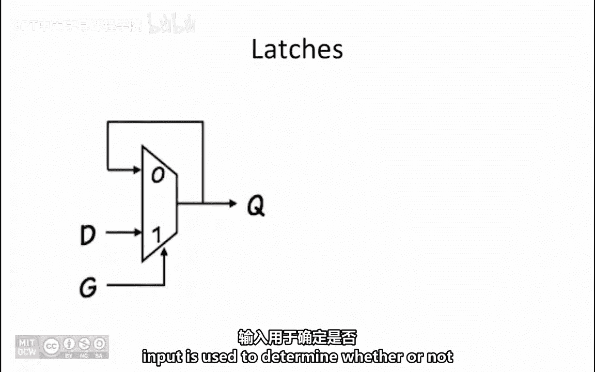

## 锁存器的工作原理

锁存器可以使用一个多路复用器来设计。其中，控制信号 **G** 用于决定是否将新的数据值 **D** 加载到锁存器的输出 **Q** 中。

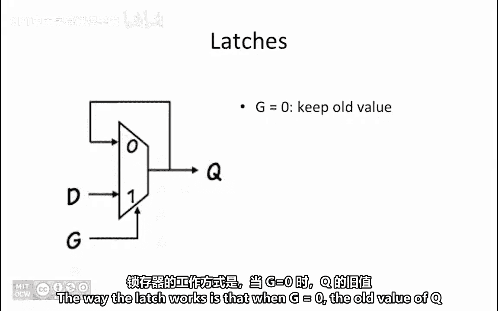

当 **G = 0** 时，多路复用器选择将 **Q** 的旧值反馈回输入端，因此输出 **Q** 保持其原有值不变。

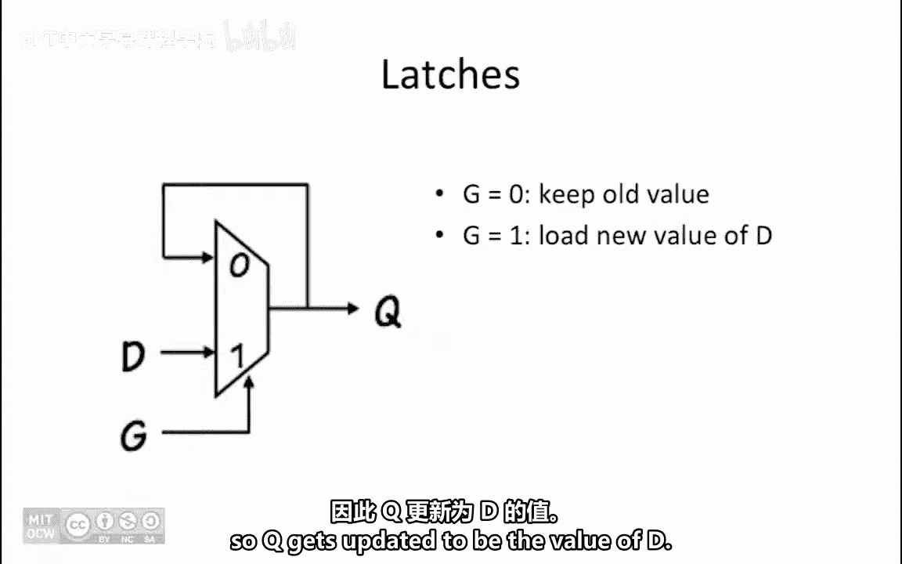

当 **G = 1** 时，多路复用器选择数据输入 **D** 作为其输入，因此输出 **Q** 被更新为 **D** 的值。

描述该锁存器操作的逻辑函数是：
**Q = (¬G ∧ Q) ∨ (G ∧ D)**

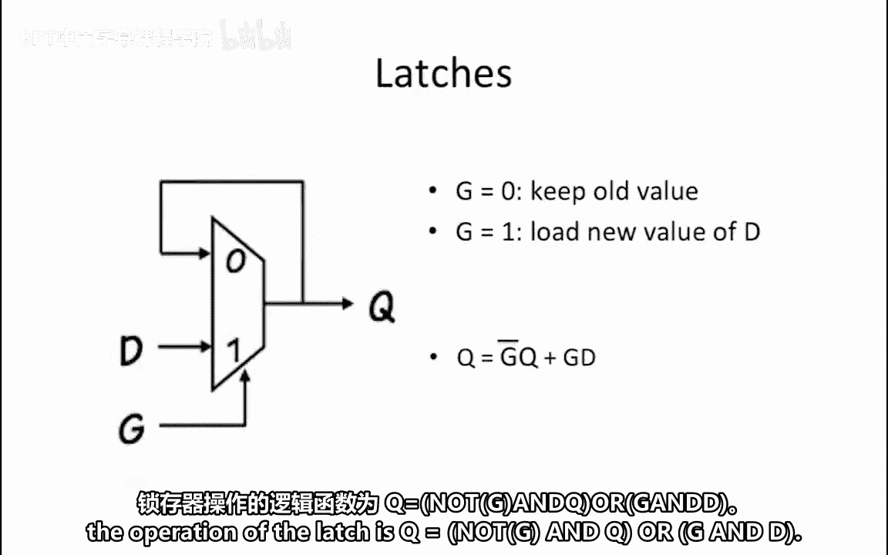

我们的目标是仅使用与门、或门和非门来构建这个锁存器。

## 设计方案评估

我们获得了三种锁存器的设计方案。对于每一种方案，我们需要判断它是“坏的”、“好的”还是“臃肿的”。
*   **坏的**：意味着锁存器无法可靠工作。
*   **好的**：意味着锁存器能够可靠工作。
*   **臃肿的**：意味着锁存器能够工作，但使用了比必要数量更多的门电路。

接下来，让我们逐一分析这些方案。

### 方案A分析

以下是方案A的电路图。

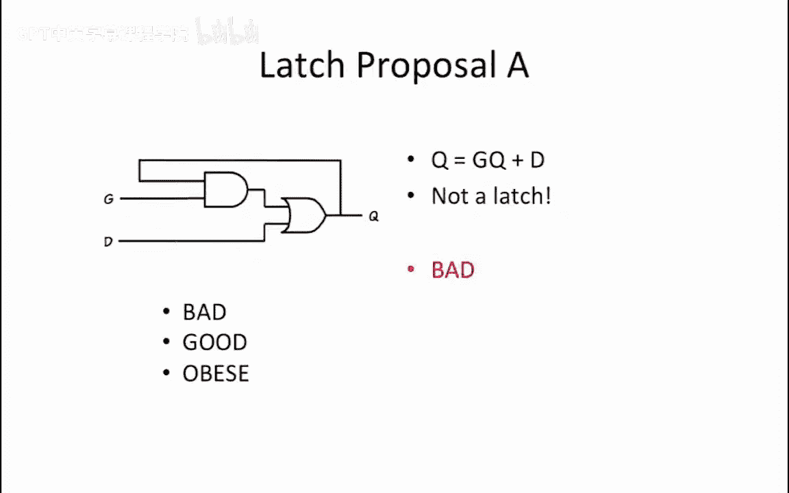

仔细观察这个电路，我们发现它实现的逻辑函数是：
**Q = (G ∧ Q) ∨ D**

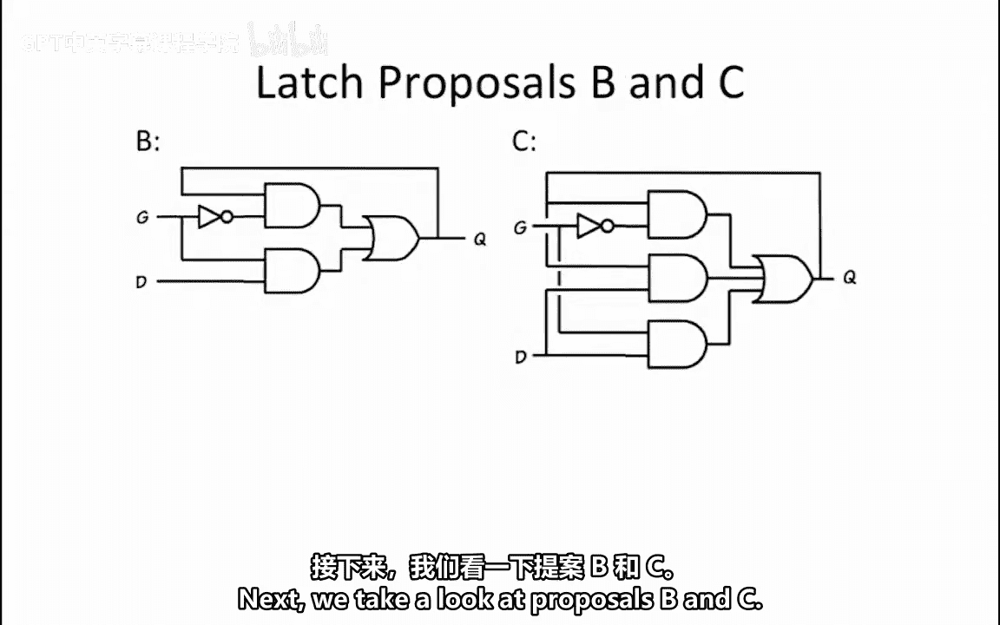

这并非我们之前指定的锁存器正确逻辑方程。因此，这个设计是**坏的**。

### 方案B与方案C分析

上一节我们分析了有缺陷的方案A，本节中我们来看看方案B和方案C。

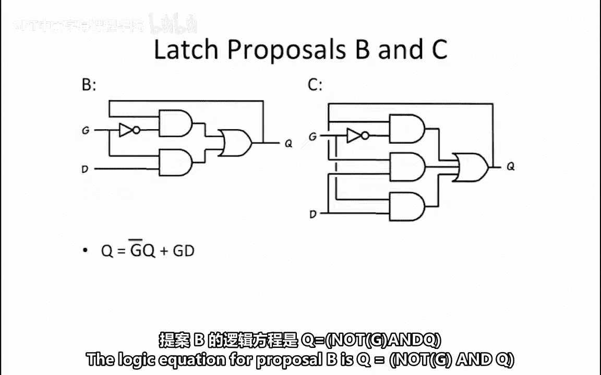

方案B的逻辑方程是：
**Q = (¬G ∧ Q) ∨ (G ∧ D)**

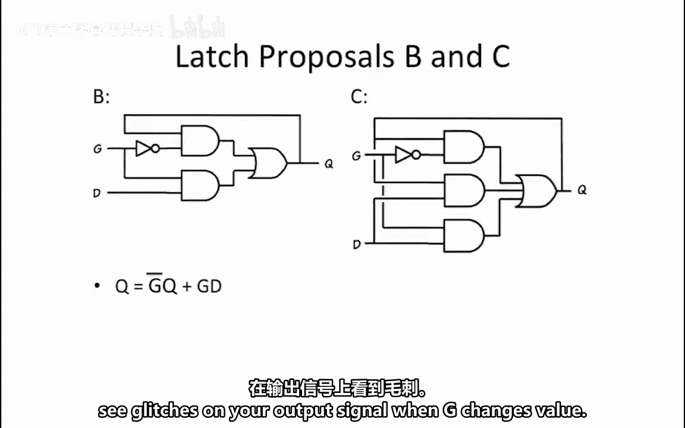

这恰好与我们为锁存器指定的逻辑方程相同。然而，这个实现方式**不是宽容的**，因为它无法保证当控制信号 **G** 的值发生变化时，输出信号 **Q** 上不会出现毛刺（短暂的错误信号）。

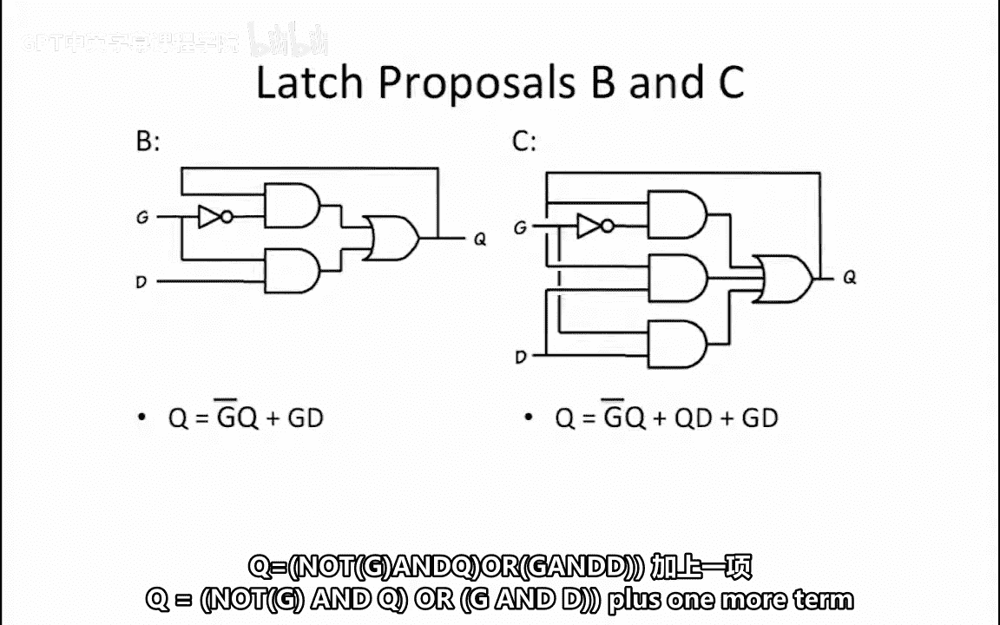

方案C则包含了相同的逻辑函数 **Q = (¬G ∧ Q) ∨ (G ∧ D)**，但额外增加了一个项：**Q ∨ D**。

如果你为这两个逻辑函数分别创建卡诺图，你会发现 **Q ∨ D** 这一项是冗余的，因为它没有在卡诺图中增加任何新的“1”单元。

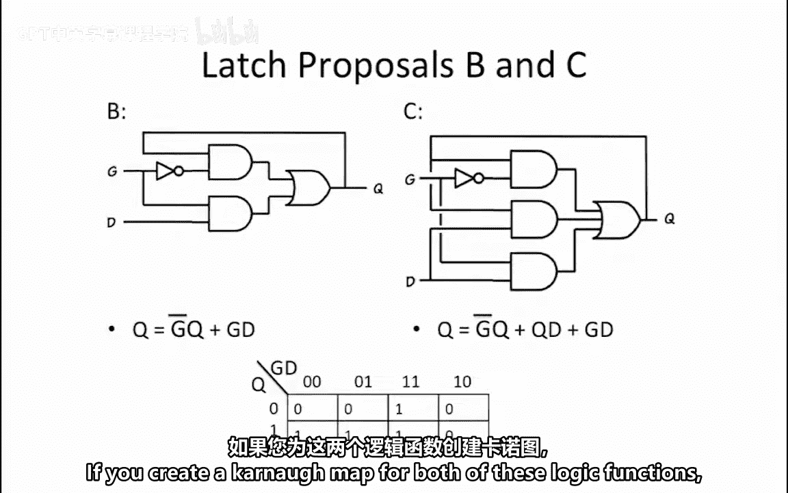
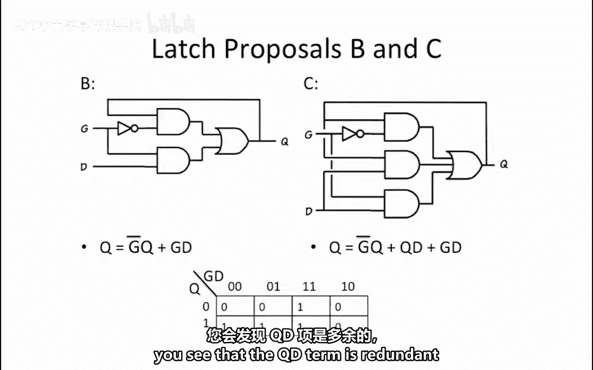
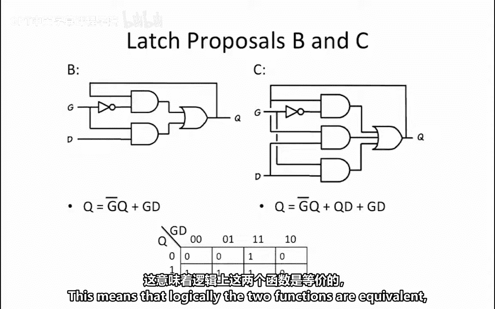
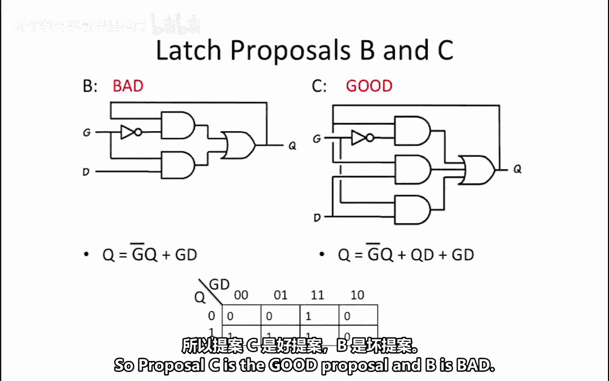

这意味着从逻辑功能上看，两个函数是等价的。但额外项的效果是使电路的实现变得**宽容**，从而消除了输出毛刺。因此，方案C是**好的**，而方案B是**坏的**。

## 总结

本节课中我们一起学习了可靠锁存器的设计。我们首先回顾了使用多路复用器实现锁存器的基本原理和逻辑方程 **Q = (¬G ∧ Q) ∨ (G ∧ D)**。然后，我们分析了三个具体的设计方案：方案A因逻辑方程错误而被判定为“坏的”；方案B虽然逻辑正确，但因非宽容设计可能导致毛刺而被判定为“坏的”；方案C通过增加冗余的逻辑项实现了宽容设计，从而被判定为“好的”。这个实例强调了在数字电路设计中，逻辑正确性、可靠性和电路优化都是需要综合考虑的重要因素。