# 数字系统与计算机架构：P1：时序约束分析实例 🧮

在本节中，我们将学习如何分析时序逻辑电路中的时序约束。我们将通过一个具体实例，计算寄存器保持时间、时钟周期以及外部输入信号的建立与保持时间要求。

我们被给定一个通用的状态机框图，它包含两个状态位。同时，我们还获得了组合逻辑和状态寄存器的时序参数。

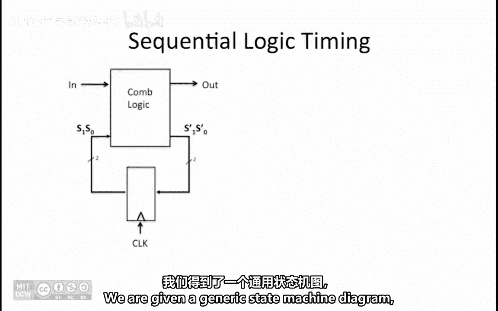

利用这些数据，我们需要确定满足所有时序规范时，寄存器保持时间（T_hold）的最大允许值。

## 确定最大保持时间 ⏱️

为了满足寄存器的保持时间要求，在时钟沿之后，寄存器的输入必须在T_hold时间内保持稳定。

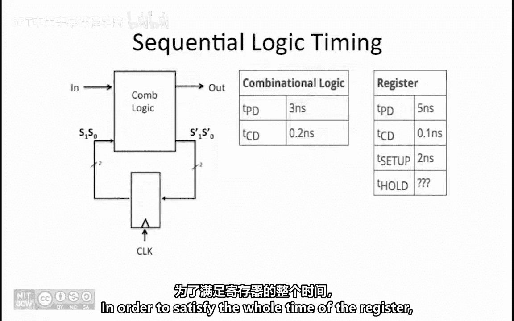

新变化传播到寄存器输入端的最快路径，是通过计算到达该输入的最短路径上所有污染延迟（T_CD）的总和来确定的。

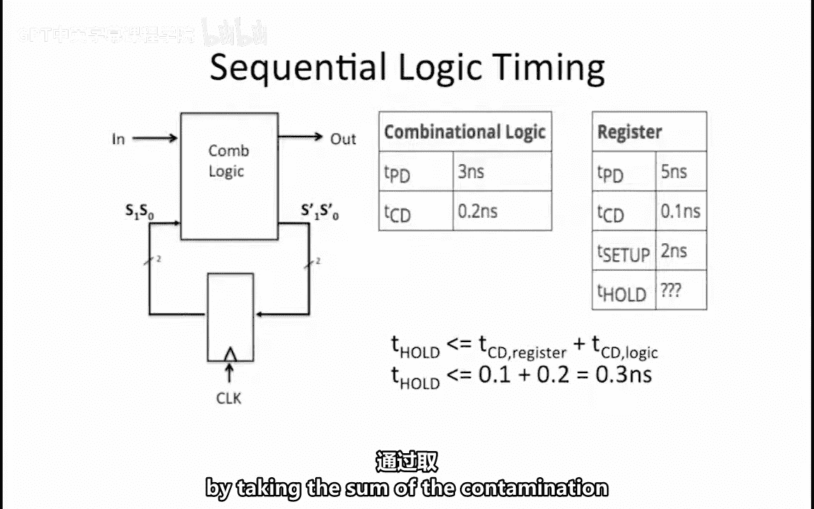
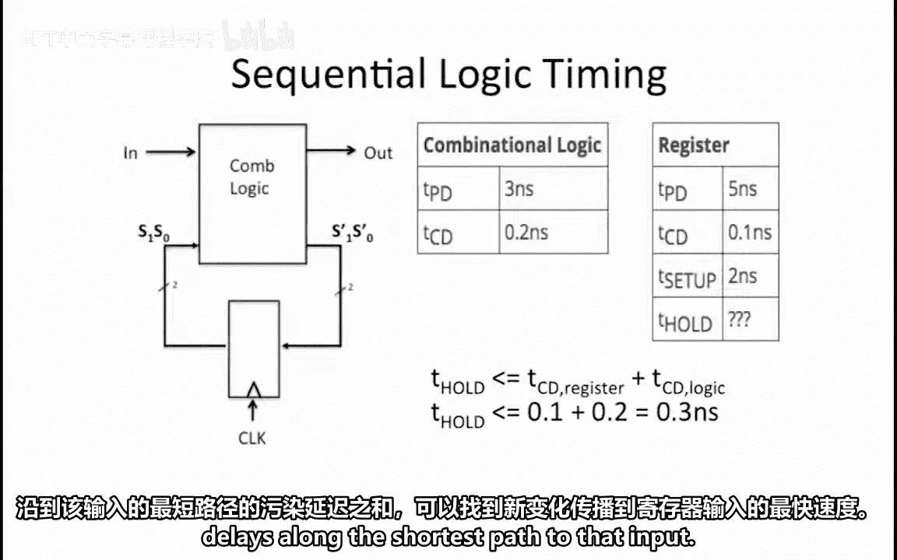

这个总和是寄存器的T_CD加上逻辑的T_CD。因此，寄存器的T_hold必须小于或等于这个总和。

**公式**：`T_hold(register) ≤ T_CD(register) + T_CD(logic)`

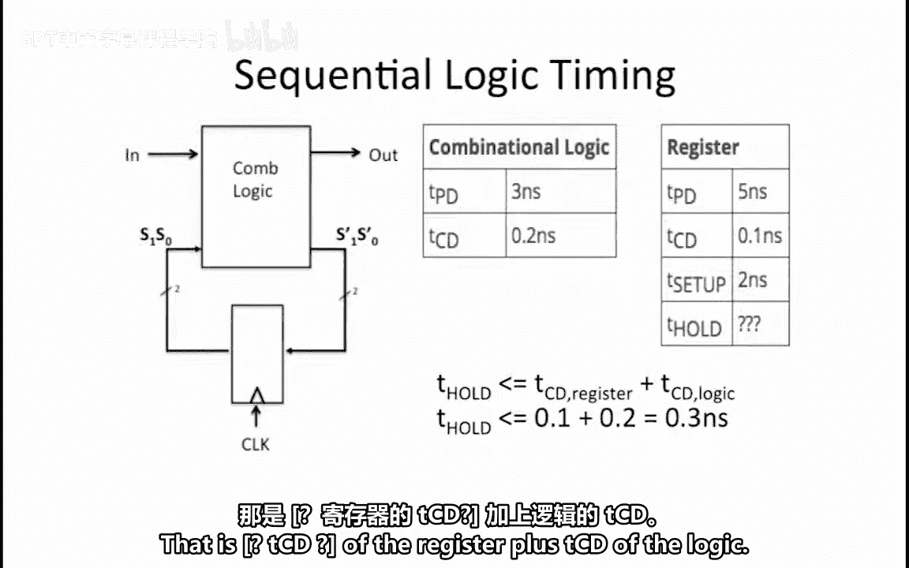

代入给定的污染延迟值，我们得到：
`T_hold ≤ 0.1 ns + 0.2 ns = 0.3 ns`

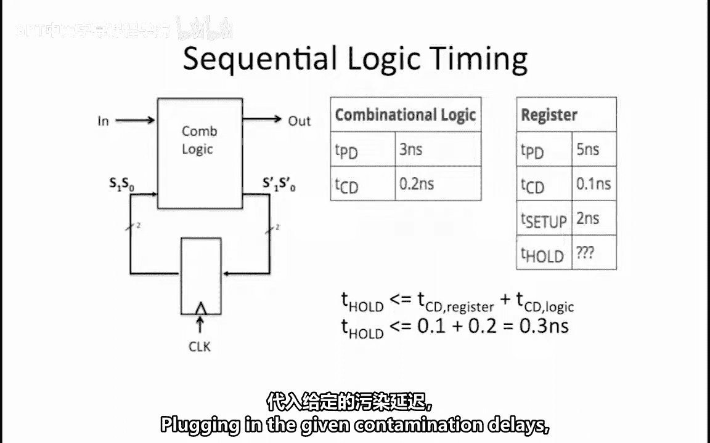

因此，寄存器保持时间的最大允许值为 **0.3 纳秒**。

上一节我们计算了保持时间的约束，接下来我们看看如何确定最小的时钟周期。

## 确定最小时钟周期 ⏰

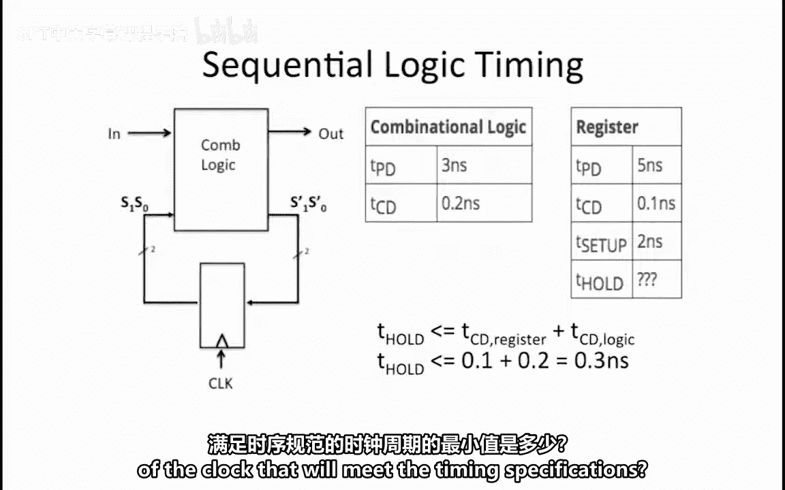

时钟周期必须足够长，以确保数据能在下一个时钟周期开始前，穿过整个电路并稳定下来，满足寄存器的建立时间（T_setup）要求。

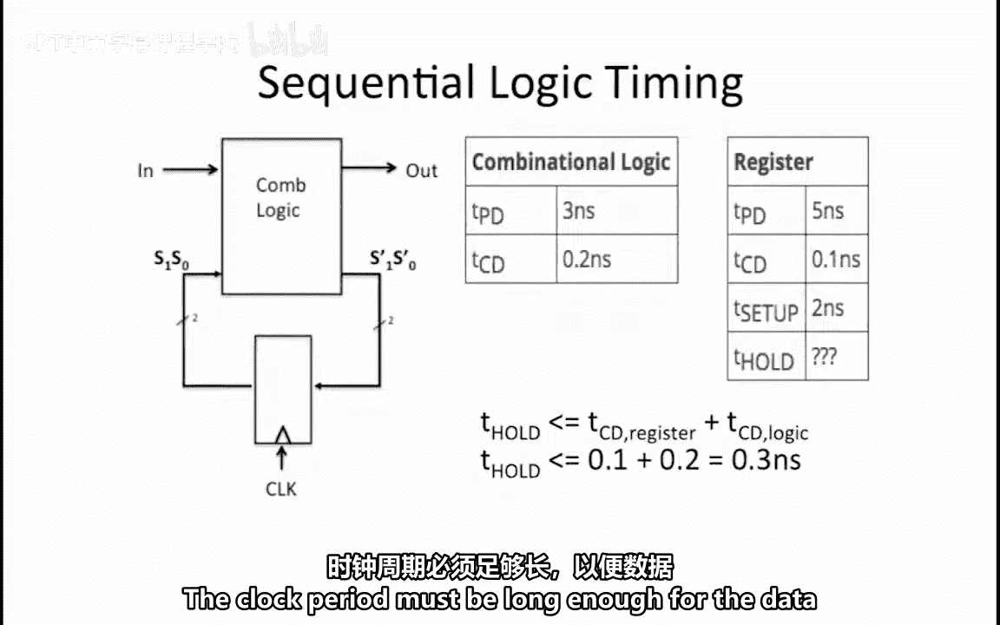
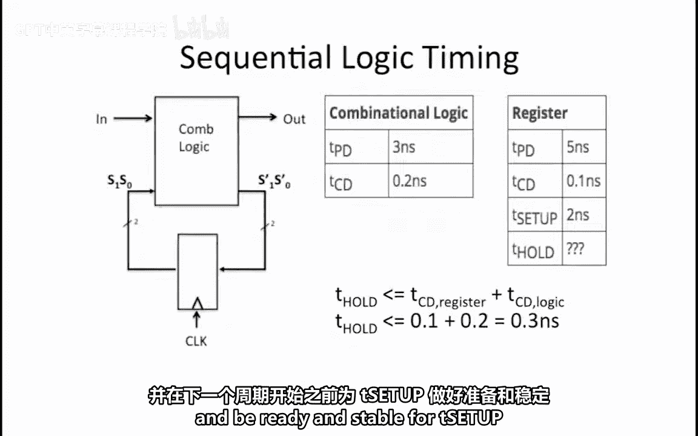

在这个电路中，数据需要穿过寄存器和组合逻辑。因此，对时钟周期的约束是：T_clock必须大于或等于寄存器的传播延迟（T_PD）、逻辑的传播延迟以及寄存器的建立时间三者之和。

**公式**：`T_clock ≥ T_PD(register) + T_PD(logic) + T_setup(register)`

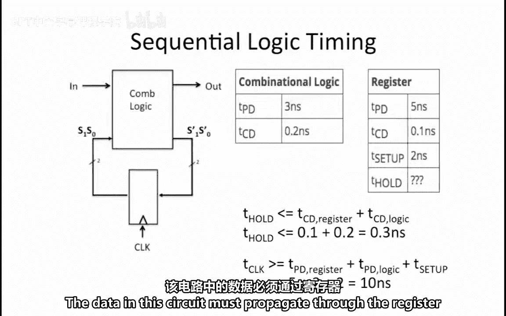
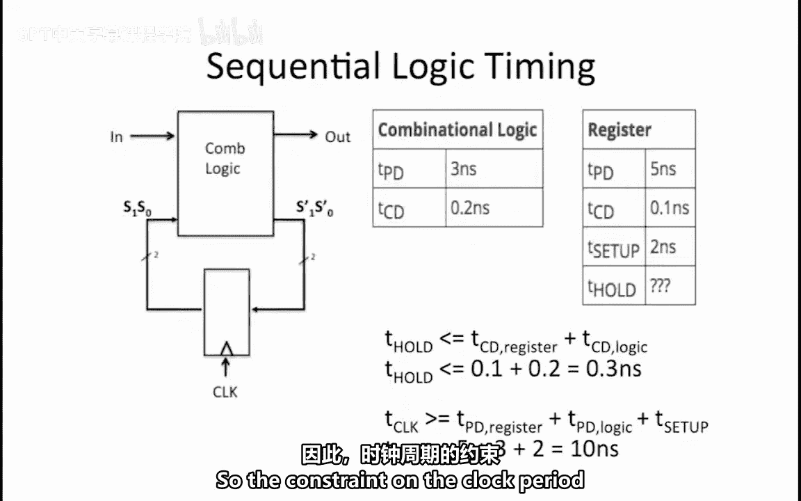
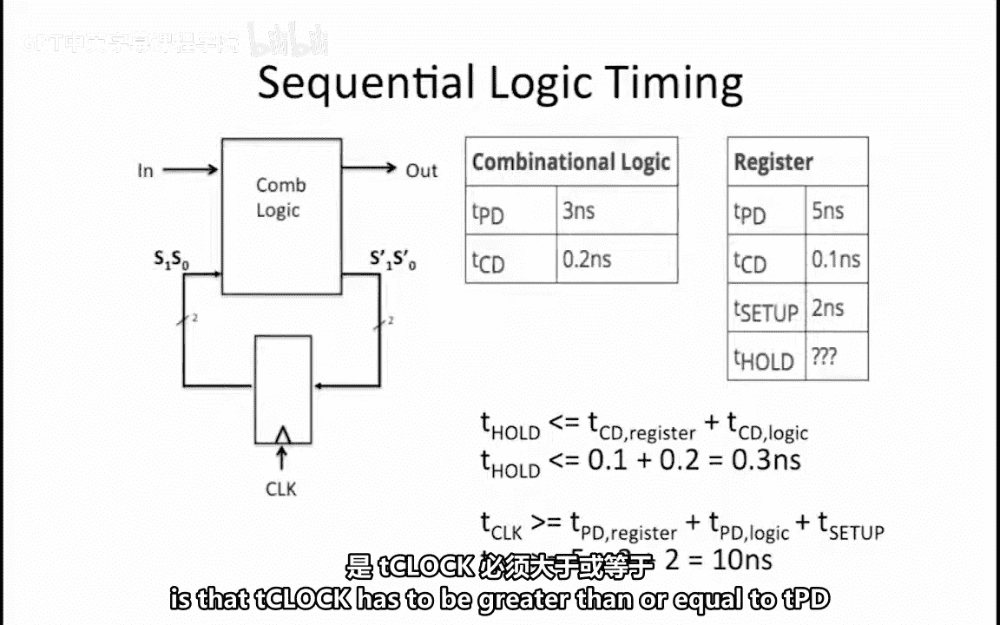

代入给定的时序参数：
`T_clock ≥ 5 ns + 3 ns + 2 ns = 10 ns`

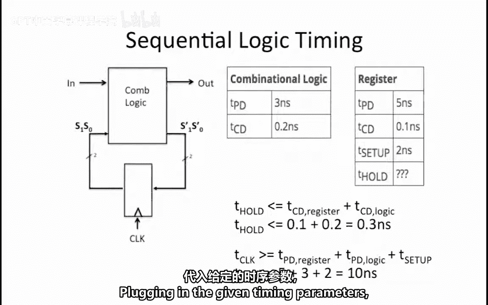
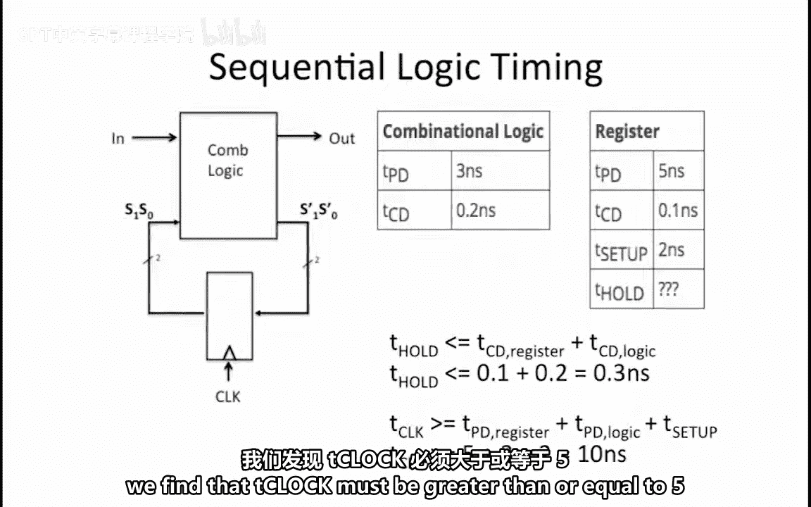

因此，满足时序规范的最小时钟周期为 **10 纳秒**。

了解了系统内部的时序要求后，我们接下来需要确定外部输入信号“in”相对于时钟有效沿的建立和保持时间规范。

## 确定外部输入的时序要求 🔌

我们希望确定输入信号“in”相对于时钟有效沿的最小建立时间（T_setup）和保持时间（T_hold）规范，以确保整个系统能满足必要的时序要求。

输入信号“in”必须在时钟上升沿之前足够长的时间内保持稳定有效，以便其能通过组合逻辑传播，并准时到达寄存器以满足其建立时间。

因此，“in”的建立时间必须大于或等于逻辑的传播延迟加上寄存器的建立时间。

**公式**：`T_setup(in) ≥ T_PD(logic) + T_setup(register)`

计算得出：`T_setup(in) ≥ 3 ns + 2 ns = 5 ns`

一旦输入信号“in”变为无效，寄存器的输入将在逻辑的污染延迟（T_CD）之后变为无效。

“in”必须保持有效足够长的时间，以确保寄存器的输入不会在寄存器的保持时间结束之前就变得无效。

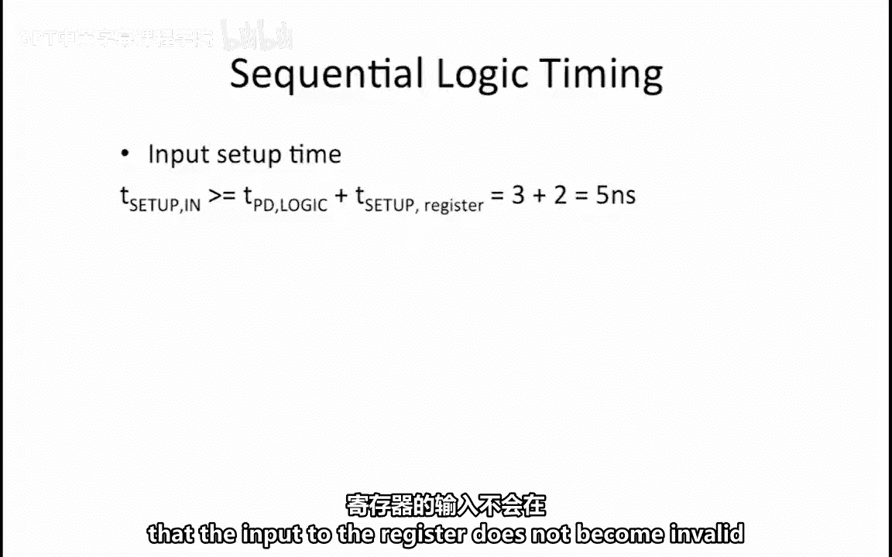

因此，“in”的保持时间加上逻辑的污染延迟，必须大于或等于寄存器的保持时间。

**公式**：`T_hold(in) + T_CD(logic) ≥ T_hold(register)`

这可以改写为：“in”的保持时间必须大于或等于寄存器的保持时间减去逻辑的污染延迟。

计算得出：`T_hold(in) ≥ 0.3 ns - 0.2 ns = 0.1 ns`

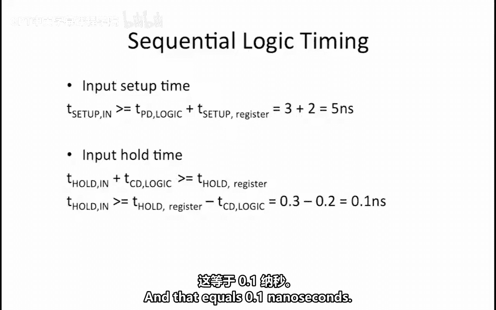

以下是外部输入“in”的时序要求总结：
*   **最小建立时间（T_setup）**：5 纳秒。输入信号必须在时钟上升沿之前至少 5 纳秒保持稳定。
*   **最小保持时间（T_hold）**：0.1 纳秒。输入信号必须在时钟上升沿之后至少保持 0.1 纳秒不变。

## 总结 📝

本节课中，我们一起学习了如何分析一个时序逻辑电路的时序约束。我们通过一个具体实例，逐步推导并计算出了：
1.  寄存器保持时间的最大允许值（0.3 ns）。
2.  系统能够正常工作的最小时钟周期（10 ns）。
3.  外部输入信号所需满足的最小建立时间（5 ns）和保持时间（0.1 ns）。

理解这些时序约束对于设计稳定可靠的数字系统至关重要。