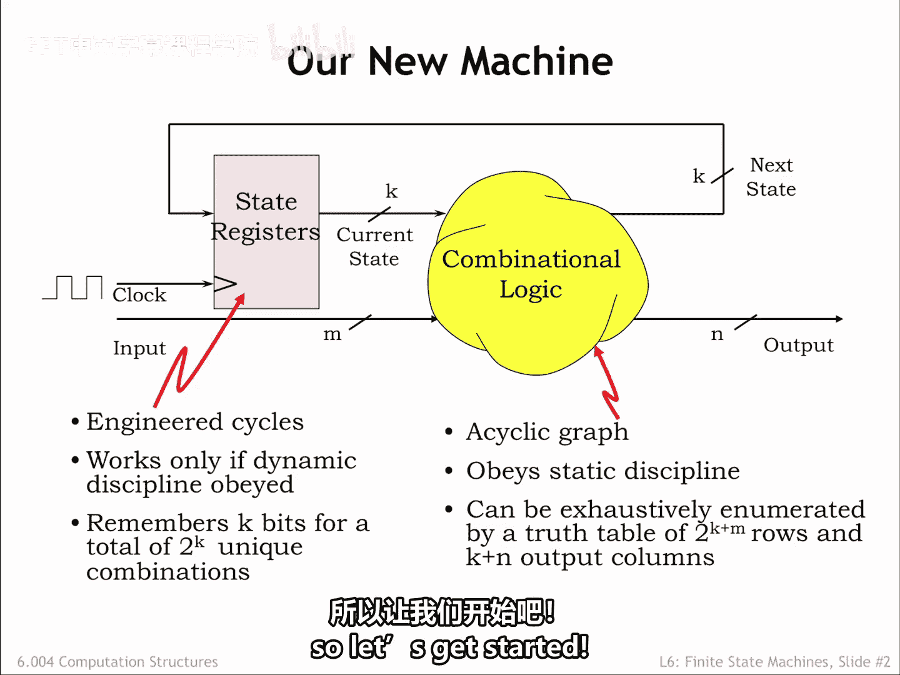
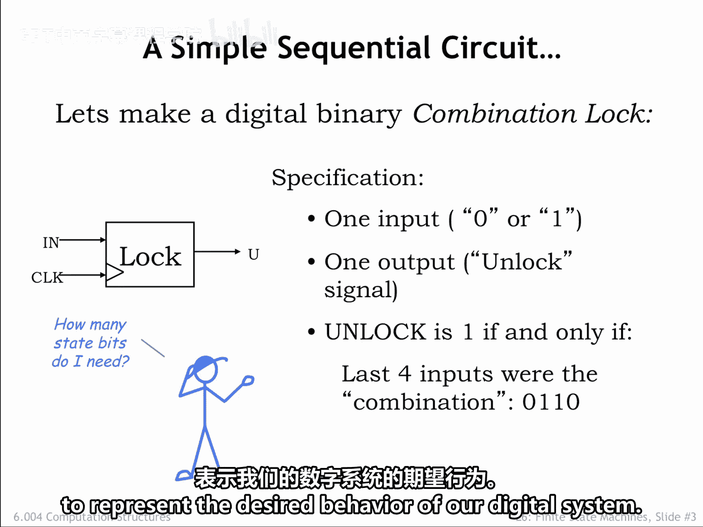
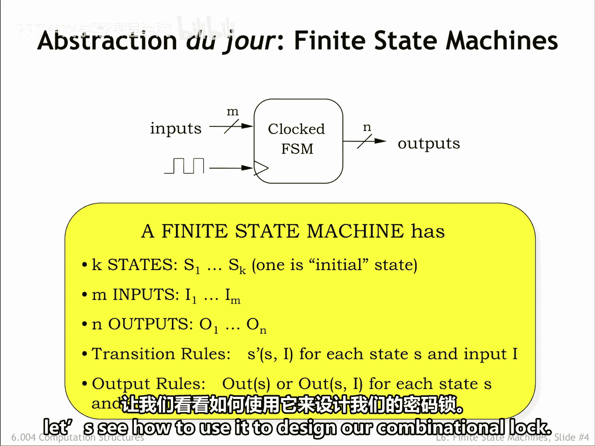

# 数字系统与计算机架构P1 6.004 2017：6.2.1：有限状态机 🧠

在本节课中，我们将要学习有限状态机（FSM）这一核心概念。FSM是一种用于描述和设计时序逻辑系统的抽象模型，它能够清晰地定义系统如何根据当前状态和输入来决定下一个状态和输出。我们将通过一个简单的“数字密码锁”例子来理解FSM的设计过程。

---

在上一章中，我们介绍了时序逻辑，它包含了组合逻辑和存储元件。

组合逻辑是一个由遵循静态规则的元件构成的无环图。静态规则保证，如果我们提供有效且稳定的输入，那么在最后一个输入跳变之后的特定时间间隔内，我们将得到有效且稳定的数字输出。同时，还存在一个功能规范，它告诉我们对于每一种可能的输入值组合，其对应的输出值是什么。

在这个图示中，有 K+M 个输入和 K+N 个输出。因此，组合逻辑的真值表将有 **2^(K+M)** 行和 **K+N** 个输出列。

状态寄存器的任务是记住时序逻辑的当前状态。状态被编码为 K 个比特，这允许我们表示 **2^K** 个唯一的状态。需要记住的是，状态以一种恰当的方式捕获了输入序列的相关历史信息，即先前输入值对时序逻辑操作的影响是通过存储的状态比特来体现的。

通常，状态寄存器的加载输入由一个周期性信号的上升沿触发，该信号用组合逻辑计算出的新状态来更新存储的状态。

作为设计者，我们有几个任务。首先，我们必须确定，针对预期的输入序列，需要生成什么样的输出序列。实际上，一个特定的输入可能会产生一长串输出值，在处理输入序列的逐步过程中，输出可能保持不变，而FSM通过更新其内部状态来记住相关信息。然后，我们必须为逻辑开发功能规范，使其能计算出正确的输出和下一个状态值。最后，我们需要为时序逻辑系统设计出实际的电路图。所有这些任务都相当有趣，让我们开始吧。

---

作为一个时序系统的例子，让我们来制作一个数字密码锁。

这个锁有一个单比特的输入信号，用户通过它输入一个比特序列作为密码。它有一个输出信号 `Unlock`，当且仅当输入了正确的密码时，该信号为 1。在这个例子中，我们希望当最后四个输入值是序列 **0, 1, 1, 0** 时，断言 `Unlock`（即，将 `Unlock` 设置为 1）。

这里有一个好问题：我们需要多少个状态比特？我们必须记住最后四个输入比特吗？那样的话我们需要四个状态比特。或者，我们是否可以记住更少的信息，仍然能完成工作？我们不需要最后四个输入的完整历史记录，我们只需要知道最近的输入是否代表了部分输入的正确密码的一部分。换句话说，如果输入序列不代表正确的密码，我们不需要精确追踪它是如何不正确的，我们只需要知道它是不正确的。带着这个观察，让我们来弄清楚如何表示我们数字系统的期望行为。

---

我们可以使用一种称为有限状态机（FSM）的新抽象来描述时序系统的行为。FSM抽象的目标是独立于实际实现来描述时序逻辑的输入输出行为。

一个有限状态机有一个周期性的时钟输入。时钟的上升沿将触发从当前状态到下一个状态的转换。FSM有一定数量的状态，其中有一个特定的状态被指定为初始状态或起始状态，当FSM首次启动时即处于此状态。

设计FSM时一个有趣的挑战是确定所需的状态数量，因为状态比特的数量与计算下一个状态和输出所需的内部组合逻辑的复杂性之间通常存在权衡。

FSM有一定数量的输入，用于传递FSM完成其工作所需的所有外部信息。这里同样存在有趣的设计权衡：假设FSM需要100比特的输入信息，我们应该设置100个输入并一次性传递所有信息，还是应该设置一个输入，将信息作为一个100个周期的序列来传递？在许多现实场景中，当时序逻辑比我们试图控制的物理过程快得多时，我们经常会看到使用比特串行输入，信息以序列形式到达，一次1比特。这允许我们使用更少的信号硬件，代价是需要按顺序传输信息所需的时间。

FSM有一定数量的输出来传递时序逻辑计算的结果。关于串行与并行输入的上述评论同样适用于选择信息应如何在输出上编码。

有一组转换规则，指定了如何根据当前状态 **S** 和输入 **I** 来确定下一个状态 **S'**。该规范必须是完整的，枚举出每一种可能的 **S** 和 **I** 组合所对应的 **S'**。最后，还有一个关于如何确定输出值的规范。

如果输出严格是当前状态 **S** 的函数，FSM的设计通常会简单一些。但一般来说，输出可以是 **S** 和当前输入两者的函数。

现在我们已经建立了抽象模型，让我们看看如何使用它来设计我们的数字密码锁。

---

在本节课中，我们一起学习了有限状态机（FSM）的基本概念。我们了解到FSM是一种描述时序逻辑行为的强大抽象工具，它由状态、输入、输出、转换规则和输出规范构成。通过“数字密码锁”的例子，我们初步探讨了如何确定状态、设计状态转换以及权衡硬件复杂度与性能。在接下来的课程中，我们将深入探讨FSM的具体设计和实现。