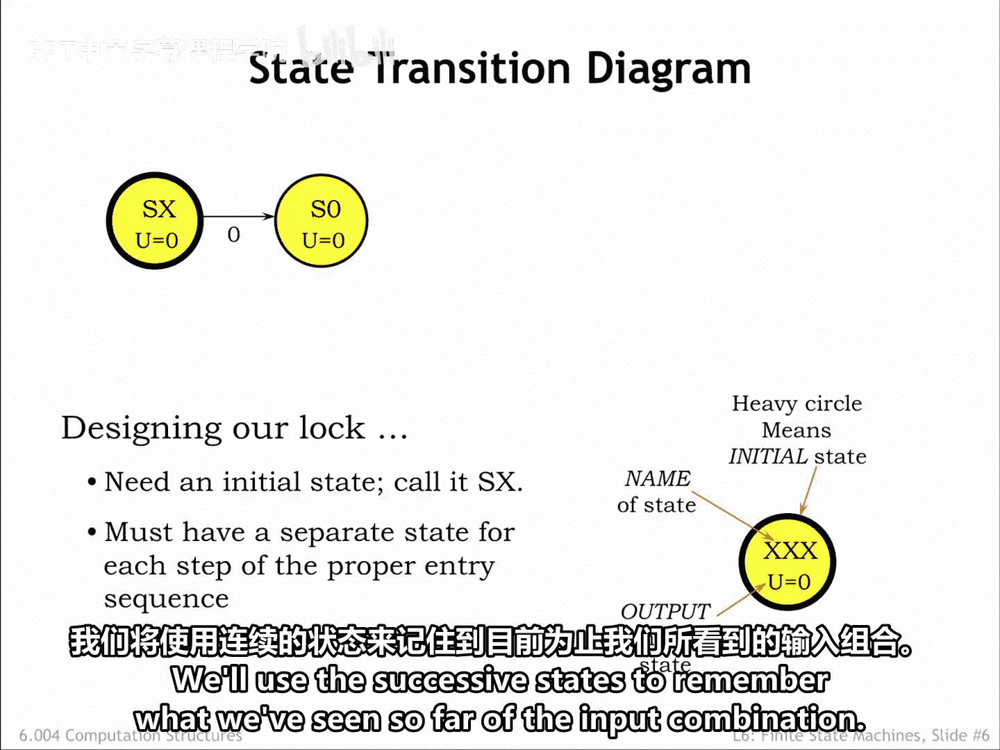
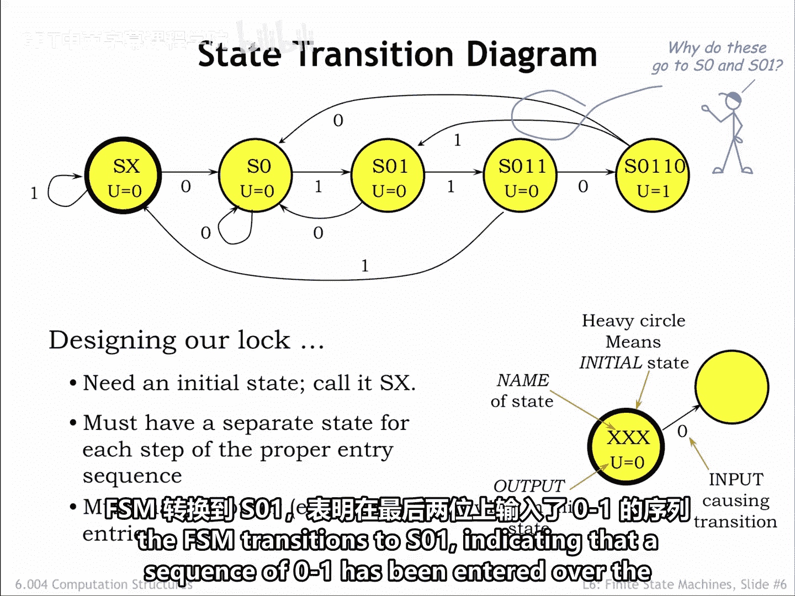
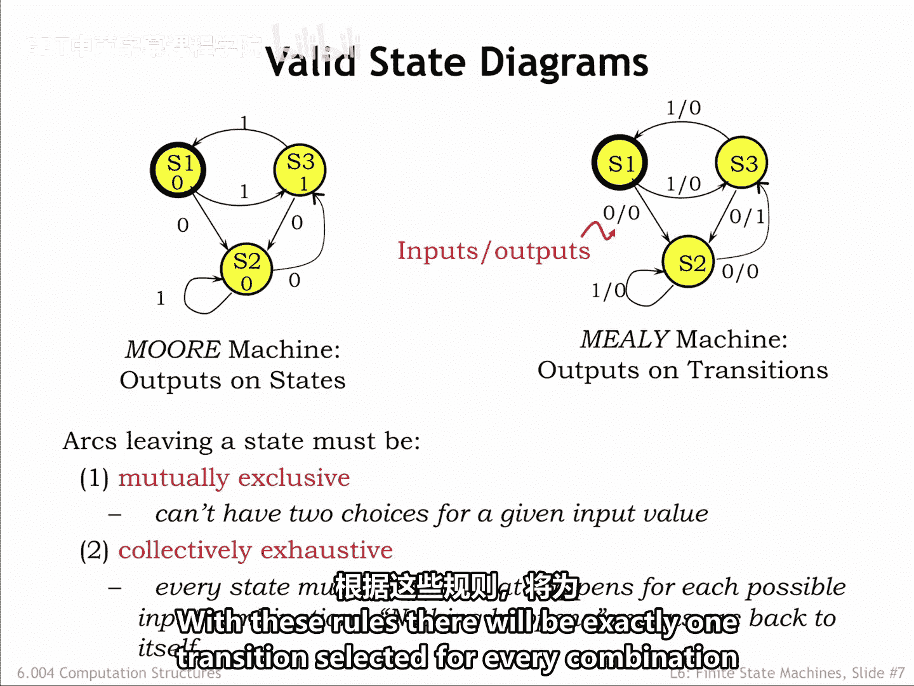
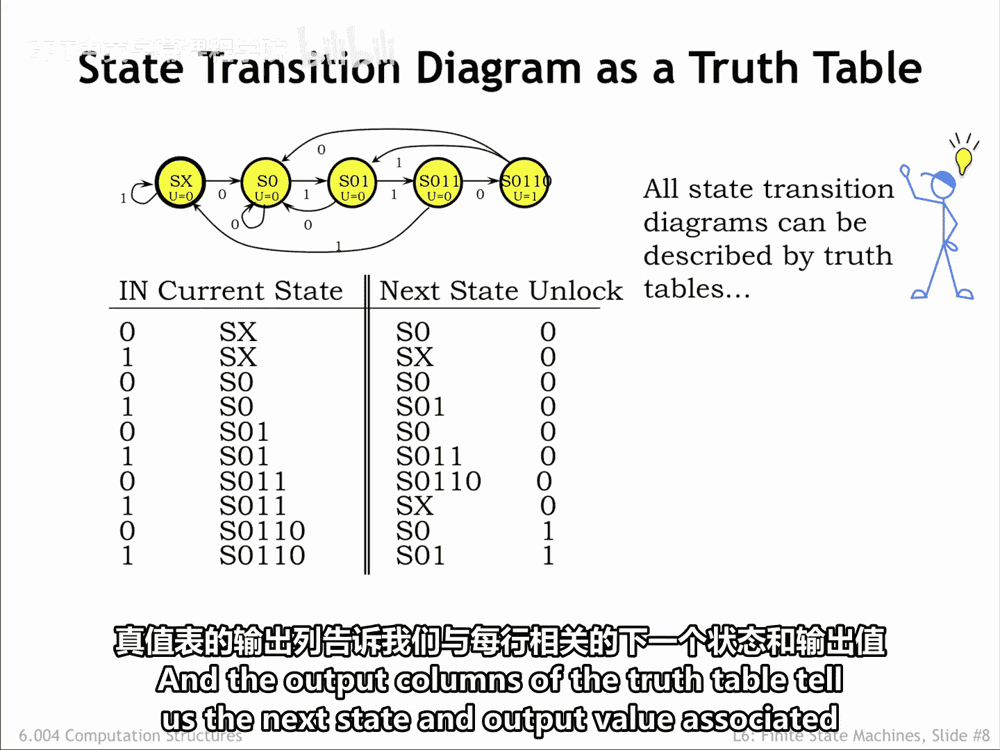
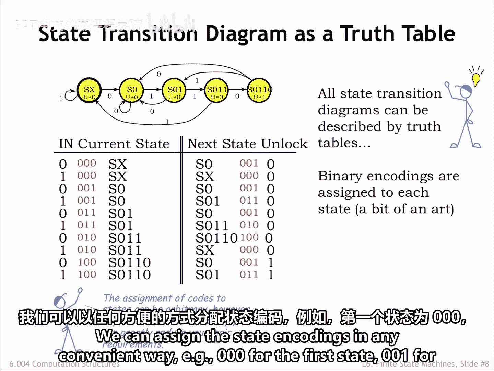
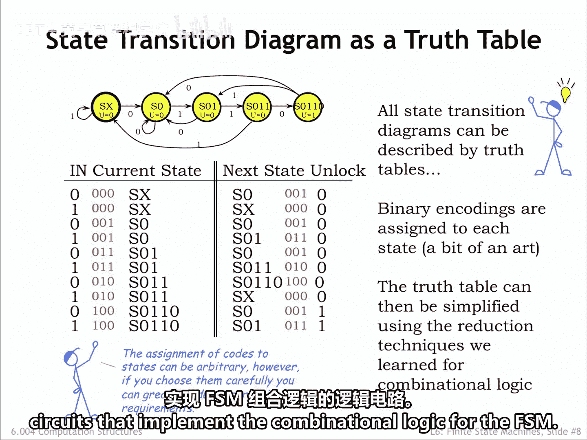
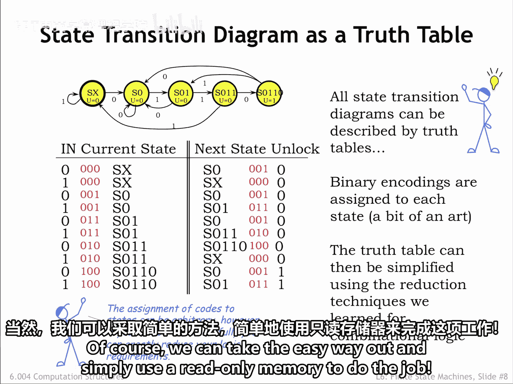
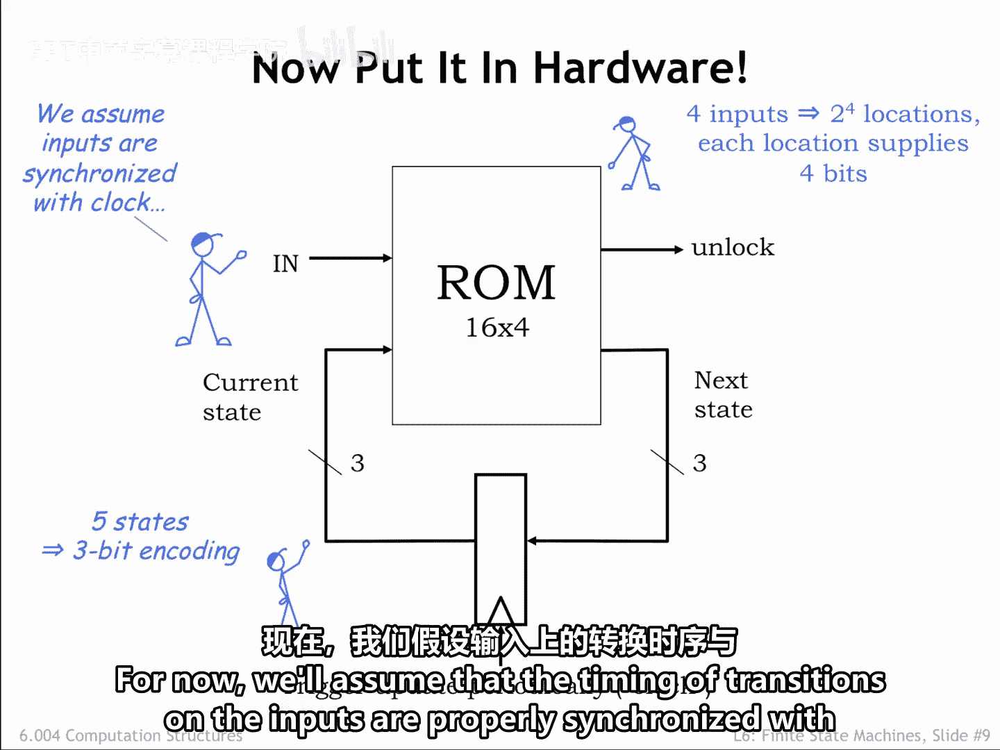
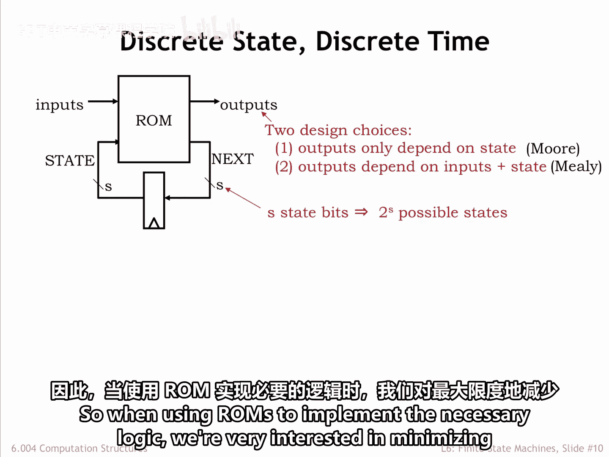
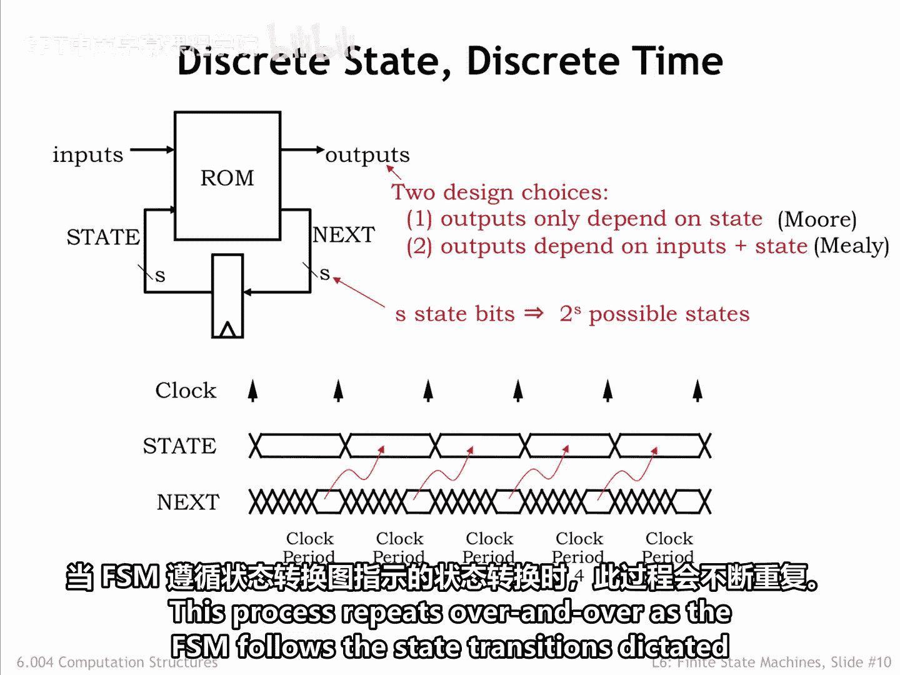

# 054：状态转移图 📊

在本节课中，我们将学习如何使用状态转移图来描述一个有限状态机的操作，特别是针对一个门锁控制器的例子。我们将从基本概念开始，逐步构建完整的图，并探讨其实现方式。

## 概述

状态转移图是描述有限状态机行为的一种图形化工具。它使用圆圈表示状态，箭头表示状态之间的转移，并标注触发转移的输入条件和产生的输出。通过这种方式，我们可以清晰地展示FSM如何根据输入序列改变其内部状态并产生相应的输出。

## 状态转移图的构建

上一节我们介绍了有限状态机的基本概念，本节中我们来看看如何为一个具体的门锁控制器绘制状态转移图。

最初，FSM尚未接收到任何组合密码位，我们称此状态为SX。

在状态转移图中，状态用圆圈表示。每个圆圈暂时用一个符号名称标记，以提醒我们它所代表的历史信息。

对于这个FSM，解锁输出U将是当前状态的函数，因此我们将在圆圈内标明U的值。由于在状态SX中，我们对过去的输入位一无所知，门锁应保持锁定状态，所以U等于0。

我们将用一个加粗边框的圆圈来指示初始状态。

我们将利用状态序列来记住到目前为止看到的输入组合。因此，如果FSM处于状态SX并且接收到输入0，它应该转移到状态S0，以提醒我们已经看到了组合密码0110的第一位。

我们使用箭头来表示状态之间的转移。每个箭头都有一个标签，告诉我们该转移应在何时发生。

所以这个特定的箭头告诉我们，当FSM处于状态SX且下一个输入是0时，FSM应转移到状态S0。转移由FSM时钟输入信号的上升沿触发。

让我们为指定的组合密码的剩余部分添加状态。最右边的状态S0110表示FSM已检测到指定输入序列的时刻，因此在此状态下解锁信号为1。查看状态转移图，我们看到如果FSM从状态SX开始，输入序列0110将使FSM停留在状态S0110。

到目前为止一切顺利。如果输入位不是组合密码中的下一位，FSM应该怎么做？例如，如果FSM处于状态SX且输入位是1。

它仍然没有接收到任何正确的组合密码位，因此下一个状态仍然是SX。

以下是其他状态对应的非正确组合密码输入的转移。

请注意，不正确的组合密码输入不一定使FSM回到状态SX。例如，如果FSM处于状态S0110，最后四个输入位是0110。如果下一个输入是1，那么最后四个输入现在是1101。这不会导致开锁。

但最后两位可能是有效组合序列的前两位。因此，FSM转移到S01，表示在过去两位中已输入了01序列。

## 摩尔机与米利机

我们一直在处理输出是当前状态函数的FSM，这称为摩尔机。在这里，输出写在状态圆圈内部。

如果输出是当前状态和当前输入的函数，则称为米利机。由于转移也是当前状态和当前输入的函数，我们将使用斜杠分隔输入值和输出值，在每个转移箭头上标注适当的输出值。

因此，查看右侧的状态转移图，假设FSM处于状态S3。如果输入是0，则寻找离开S3且标记为0的箭头。斜杠后的值告诉我们输出值，在这种情况下是1。如果输入是1，输出值将是0。

## 状态转移图的规则

有一些简单的规则可以用来检查状态转移图是否格式良好。

从一个特定状态出发的转移必须是互斥的。换句话说，对于每个状态，不能有多个具有相同输入标签的转移。如果FSM要一致地运行，这是有道理的；对于给定的当前状态和输入，关于下一个状态不能有任何歧义。

所谓一致，我们指的是如果FSM在相同的起始状态重新启动并给予相同的输入序列，它应该进行相同的转移。

此外，离开每个状态的转移应该是集体完备的。换句话说，应为每个可能的输入值指定一个转移。如果我们希望FSM对于该特定输入值保持其当前状态，我们需要显示一个从当前状态回到自身的转移。

有了这些规则，对于每个当前状态和输入值的组合，将恰好有一个转移被选中。

## 从图到真值表

状态转移图中的所有信息都可以用表格形式表示为真值表。

真值表的行列出了当前状态和输入的所有可能组合。真值表的输出列告诉我们与每一行相关的下一个状态和输出值。

如果我们用二进制值替换符号状态名称，最终会得到一个真值表，就像我们在第4章中看到的那样。

如果我们的状态转移图中有K个状态，我们将需要 `ceil(log₂(K))` 个状态位，因为状态位不能是分数。在我们的例子中，我们有一个5状态的FSM，所以我们需要3个状态位。

我们可以以任何方便的方式分配状态编码，例如，第一个状态为000，第二个状态为001，依此类推。

但是状态编码的选择会对实现真值表所需的逻辑产生很大影响。找出能产生最简单逻辑的状态编码实际上很有趣。

有了真值表，我们可以使用第4章的技术来设计实现FSM组合逻辑的逻辑电路。

当然，我们可以选择简单的方法，直接使用ROM来完成这项工作。😊

## 使用ROM的实现

在这个电路中，使用只读存储器根据当前状态和输入计算下一个状态和输出。

我们使用3位二进制值对FSM的五个状态进行编码，因此我们有一个3位状态寄存器。带有边沿触发输入的矩形是多位寄存器的示意图简写。

如果图中的电线代表多比特信号，我们会在电线上画一条斜线并标上数字，以指示信号中有多少位。在这个例子中，当前状态和下一个状态都是3位信号。

只读存储器总共有四个输入信号：3个用于当前状态，1个用于输入值。因此，ROM有 `2⁴ = 16` 个位置，对应真值表的16行。

ROM中的每个位置提供真值表特定行的输出值。由于我们有四个输出信号（3个用于下一个状态，1个用于输出值），每个位置提供4位信息。存储器通常用其位置数量和每个位置的位数来标注。

所以我们的存储器是一个 `16 x 4` 的ROM，即16个位置，每个位置4位。当然，为了使状态寄存器正常工作，我们需要确保遵守动态规则。

我们可以使用第5章末尾描述的时序分析技术来检查这一点。目前，我们假设输入上的时序转换与时钟的上升沿正确同步。

## 设计选择与总结

现在，在设计时序逻辑系统的功能时，我们有了FSM抽象可以使用。

以下是使用ROM和多比特状态寄存器的FSM通用电路实现的设计选择总结。

输出位可以严格是当前状态的函数；这样的FSM称为摩尔机。或者，它们可以是当前状态和当前输入的函数，在这种情况下，FSM称为米利机。

我们可以选择状态位的数量。S个状态位将使我们能够编码 `2^S` 个可能的状态。请注意，每增加一个状态位，ROM中的位置数量就会翻倍。因此，当使用ROM来实现必要的逻辑时，我们对最小化状态位的数量非常感兴趣。

我们电路的波形相当简单。时钟的上升沿触发状态寄存器输出的转换。然后ROM进行计算，得出下一个状态，该状态在时钟周期的某个时刻变为有效。这个值将在下一个时钟上升沿被加载到状态寄存器中。

随着FSM遵循状态转移图规定的状态转移，这个过程会一遍又一遍地重复。

## 其他注意事项

还有一些细节需要注意。

启动时，我们需要某种方法将状态寄存器的初始内容设置为初始状态的正确编码。许多设计使用复位信号，将其设置为1以强制进入某个初始状态，然后设置为0以开始执行。我们可以在这里采用这种方法，使用复位信号来选择要加载到状态寄存器中的初始值。

在我们的例子中，我们使用了3位状态编码，这将允许我们实现一个最多有 `2³ = 8` 个状态的FSM。我们只使用了这些编码中的五个，这意味着ROM中有一些位置我们永远不会访问。如果这是一个问题，我们总是可以使用逻辑门来实现必要的组合逻辑，而不是ROM。

假设状态寄存器不知何故被加载了一个未使用的编码。那么，这就像处于我们的状态转移图中未列出的状态。防御此问题的一种方法是设计ROM内容，使未使用的状态始终指向初始状态。理论上，这个问题不应该出现，但有了这个修复，至少它不会导致未知行为。

我们之前提到了寻找最小化组合逻辑的状态编码这个有趣的问题。有计算机辅助设计工具可以帮助我们做到这一点，作为寻找布尔函数最小逻辑实现这一更大问题的一部分。

Mr. Blue向我们展示了构建门锁控制器状态寄存器的另一种方法：使用移位寄存器捕获最后四个输入位，然后简单地查看记录的历史以确定是否与组合密码匹配。这里没有花哨的下一个状态逻辑。

最后，我们仍然需要解决确保输入转换不违反状态寄存器动态规则的问题。我们将在本章最后一节讨论这个问题。

## 总结

本节课中我们一起学习了如何绘制和分析状态转移图，这是描述有限状态机行为的核心工具。我们了解了摩尔机和米利机的区别，探讨了如何将状态转移图转换为真值表，并最终用逻辑电路或ROM实现。我们还讨论了状态编码的重要性以及一些实际实现中的细节问题，如初始化和未使用状态的处理。