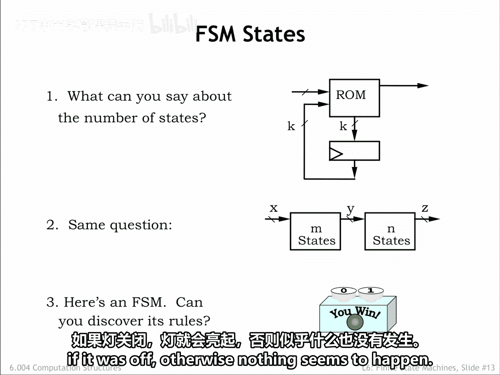
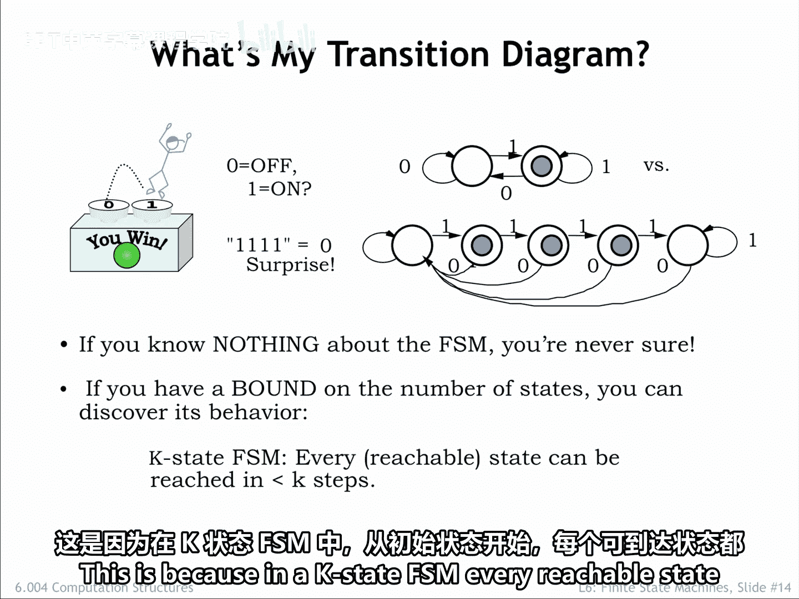
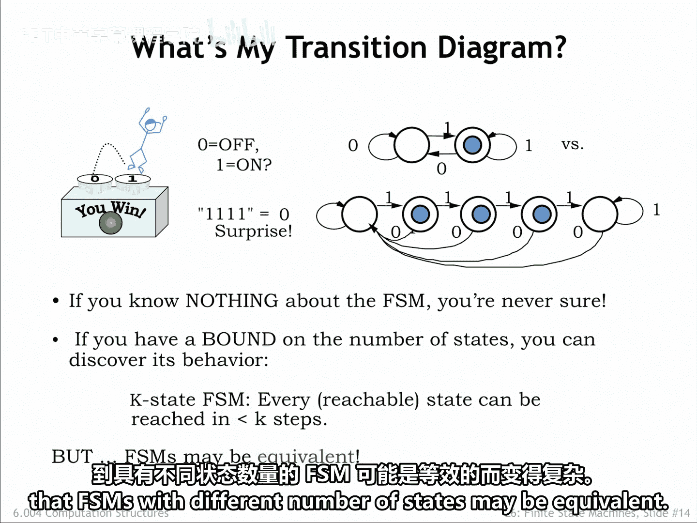
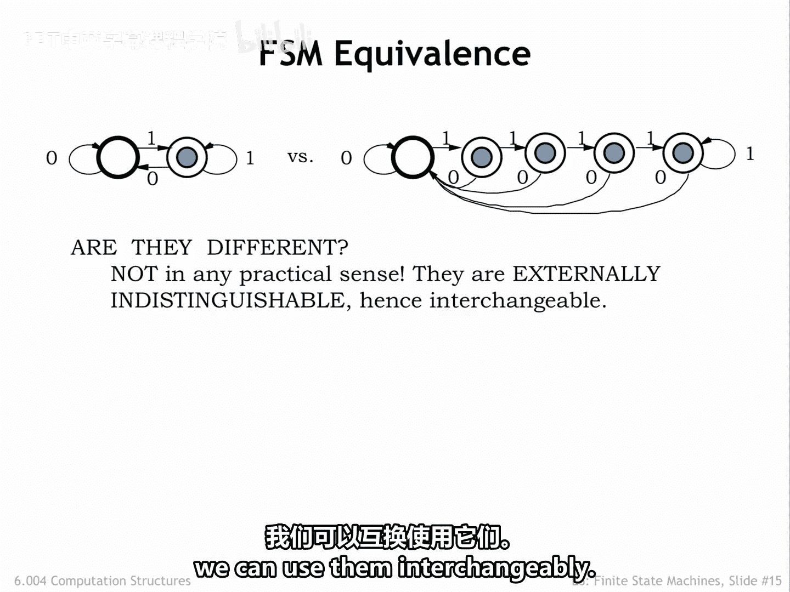
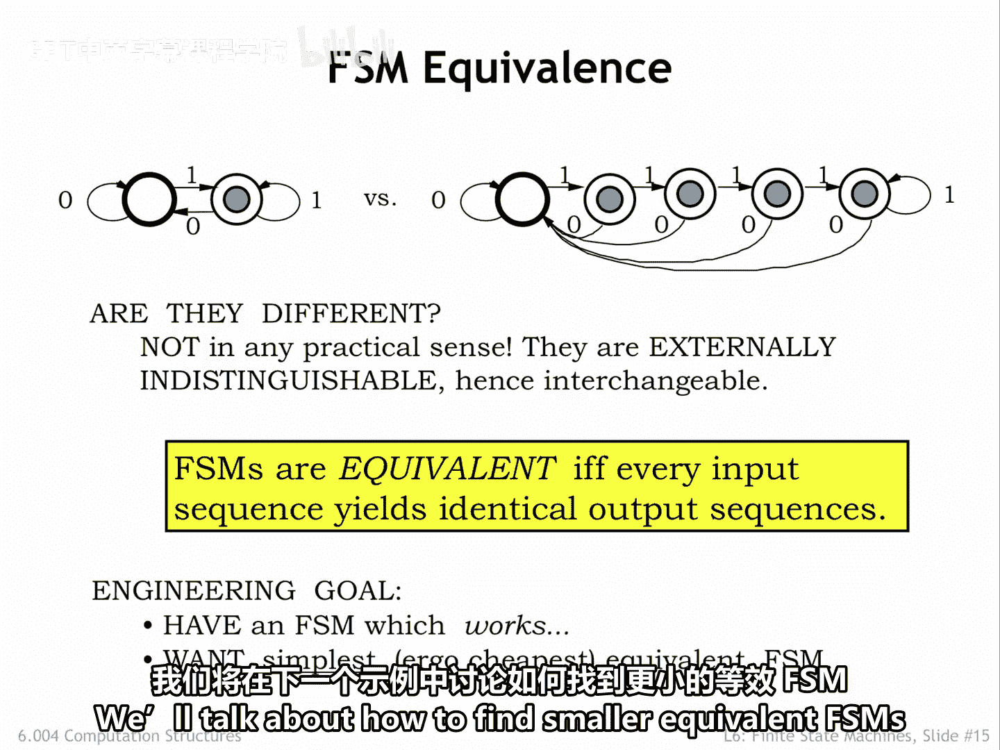

# 055：6.2.3 FSM状态 🧠

在本节课中，我们将要学习有限状态机（FSM）抽象概念中关于状态数量、系统组合以及状态机等价性的核心知识。

## 关于FSM状态的进一步思考

上一节我们介绍了FSM的基本概念，本节中我们来看看关于FSM状态数量的一些推论。

如果一个FSM使用了 **K** 个状态位，那么它的状态转移图中最多可以有多少个状态？我们知道，FSM最多可以有 **2^K** 个状态，因为这是 **K** 位二进制数所能表示的独特组合的数量。

## 组合FSM的状态数量

现在，假设我们将两个FSM串联起来，第一个FSM的输出作为第二个FSM的输入。这个更大的系统本身也是一个FSM。那么它有多少个状态呢？

如果我们不知道这两个组件FSM的具体细节，那么这个更大系统的状态数量上限是 **M × N**。这是因为第一个FSM可能处于其 **M** 个状态中的任何一个，而同时第二个FSM可能处于其 **N** 个状态中的任何一个。需要注意的是，这个答案并不依赖于 **X** 或 **Y**（即每个组件FSM的输入信号数量）。更多的输入信号仅仅意味着状态转移图上的转换标签更长，但并不能告诉我们关于内部状态数量的任何信息。

## 探索未知FSM的行为

最后，这里有一个看似简单实则棘手的问题。我给你一个带有两个输入（标记为0和1）和一个输出（实现为一个灯）的FSM。然后我要求你发现它的状态转移图。你能做到吗？

为了更具体一些，假设你实验了一个小时，按下了各种顺序的按钮。每次按下0按钮，如果灯亮着，它就会熄灭。当你按下1按钮时，如果灯是熄灭的，它就会亮起。否则，似乎什么也不会发生。根据我们的实验，我们可以画出什么样的状态转移图？

考虑以下两个状态转移图。上面的图描述了我们实验中观察到的行为：按0关灯，按1开灯。第二个图似乎做了同样的事情，除非你恰好连续按了四次1按钮。

如果我们不知道FSM中状态数量的上限，我们就永远无法确定我们已经探索了所有可能的行为。但是，如果我们确实有一个上限，比如状态数量上限为 **K**，并且我们可以将FSM重置到其初始状态，那么我们就能发现它的行为。这是因为在一个 **K** 状态的FSM中，从初始状态开始，每个可达状态都可以在少于 **K** 次转换内到达。

因此，如果我们一个接一个地尝试所有可能的 **K** 步输入序列，并且每次试验都从初始状态开始，那么我们就能保证访问到机器中的每一个状态。

## FSM的等价性

我们的答案还因为一个观察而变得复杂：具有不同状态数量的FSM可能是等价的。

这里有两个FSM，一个有2个状态，一个有5个状态。它们不同吗？从任何实际意义上讲，它们并不不同。由于这两个FSM在外部是无法区分的，我们可以互换使用它们。

我们说两个FSM是等价的，当且仅当每个输入序列从两个FSM产生相同的输出序列。因此，作为工程师，如果我们有一个FSM，我们希望找到最简单、从而成本最低的等价FSM。我们将在下一个示例的背景下讨论如何找到更小的等价FSM。

## 总结

本节课中我们一起学习了FSM状态数量的上限（**2^K**），组合FSM的状态数量上限（**M × N**），以及如何通过有限步骤探索未知FSM的行为。我们还了解了FSM等价性的概念，即两个外部行为完全相同的FSM可以互换，而工程师的目标通常是找到状态数最少、最简单的等价实现。