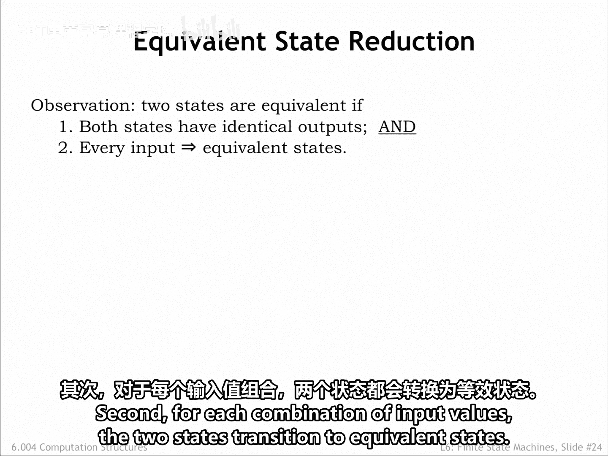
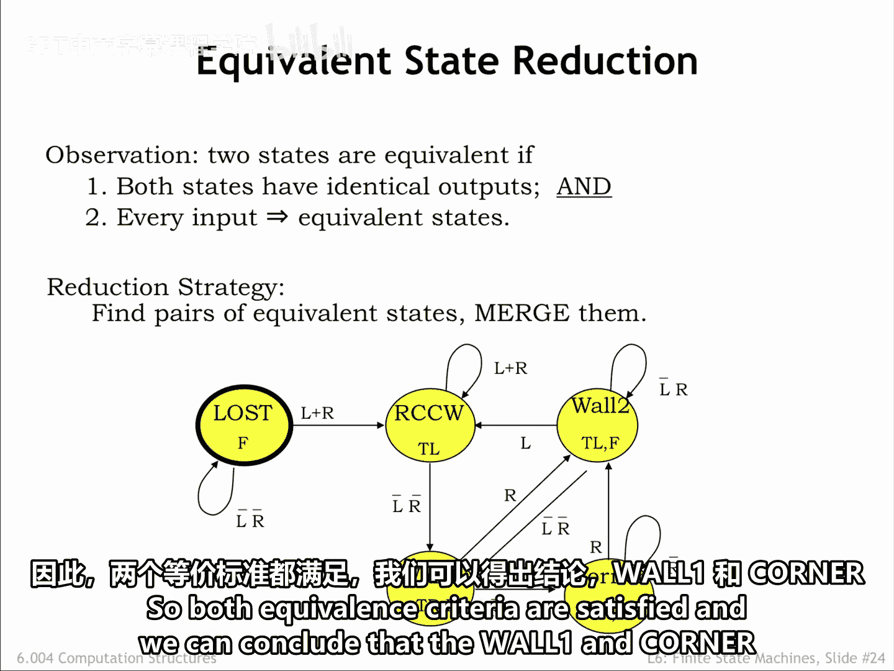
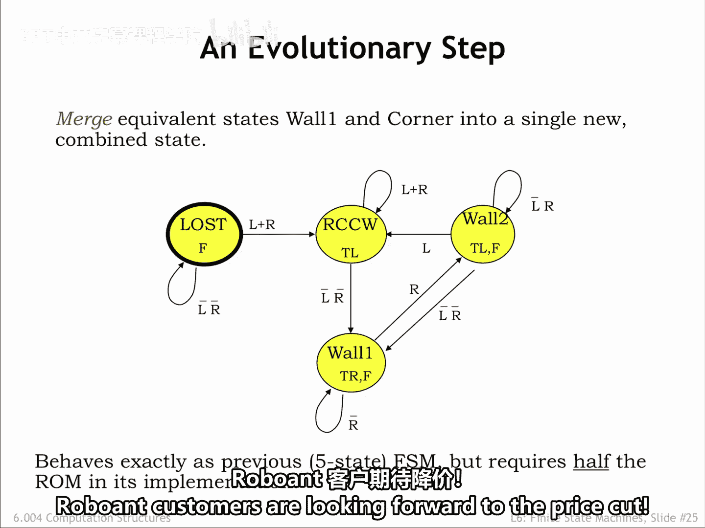
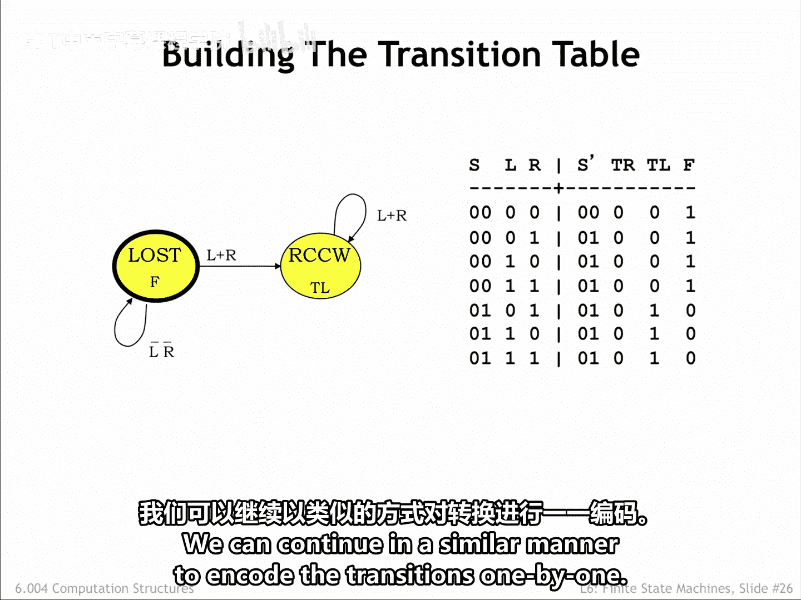
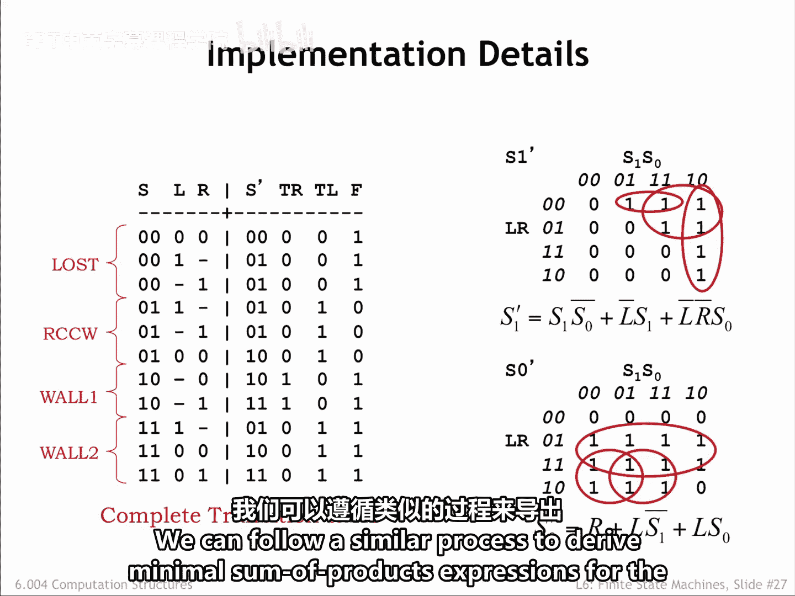
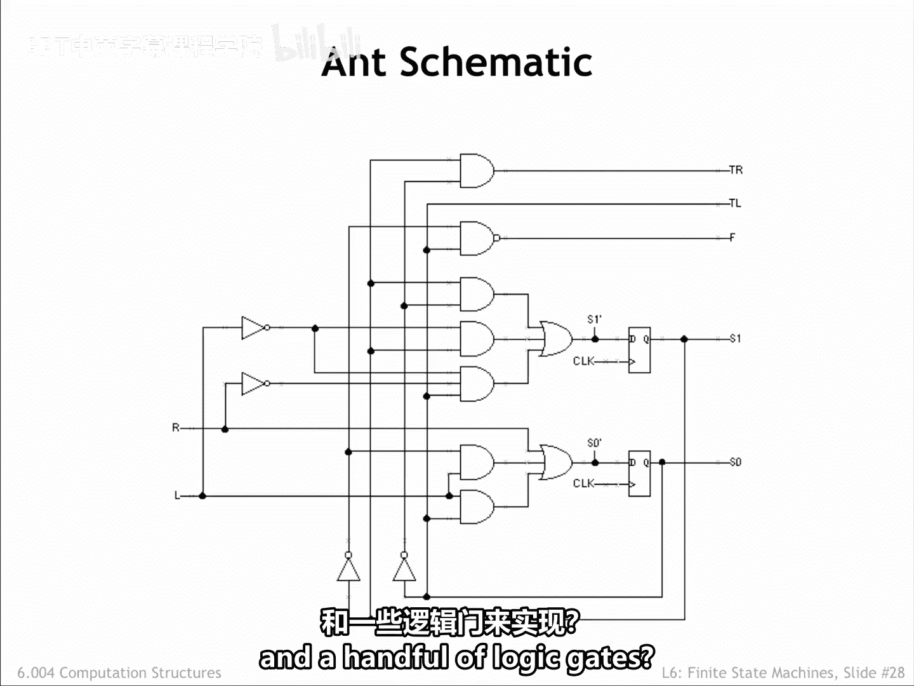
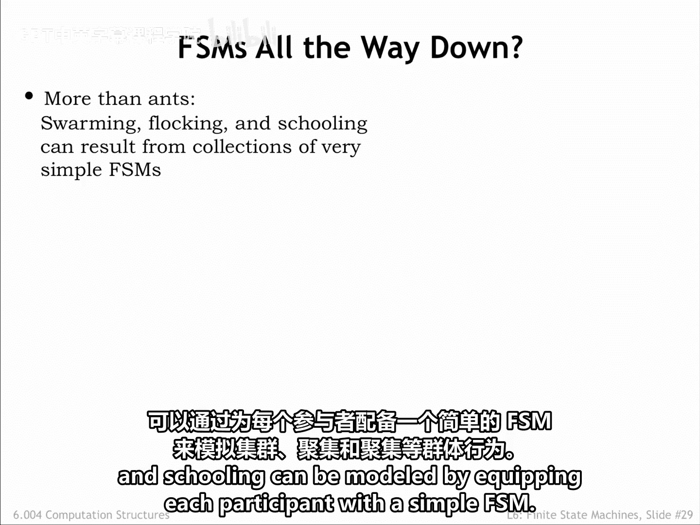
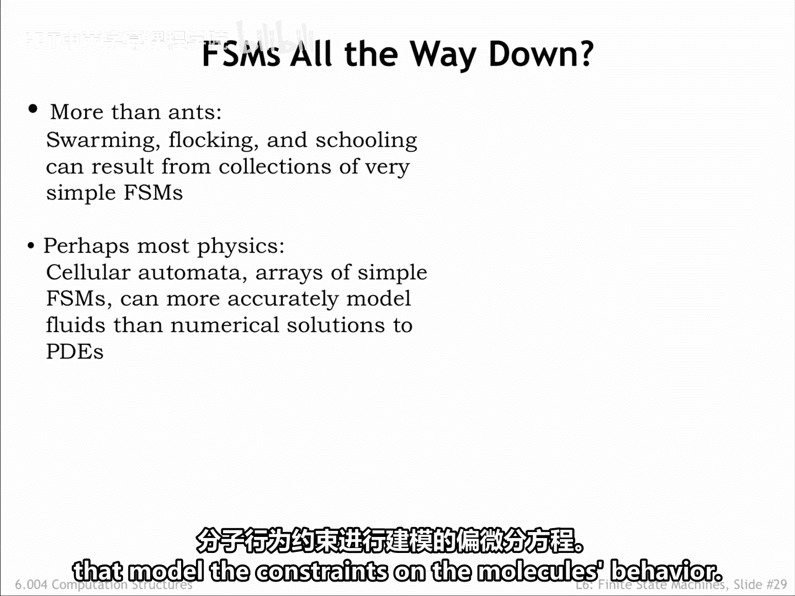
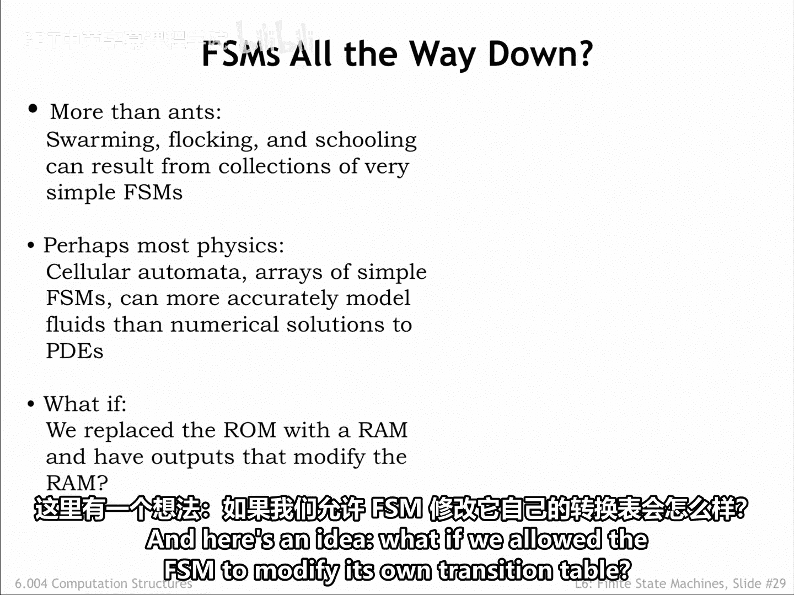
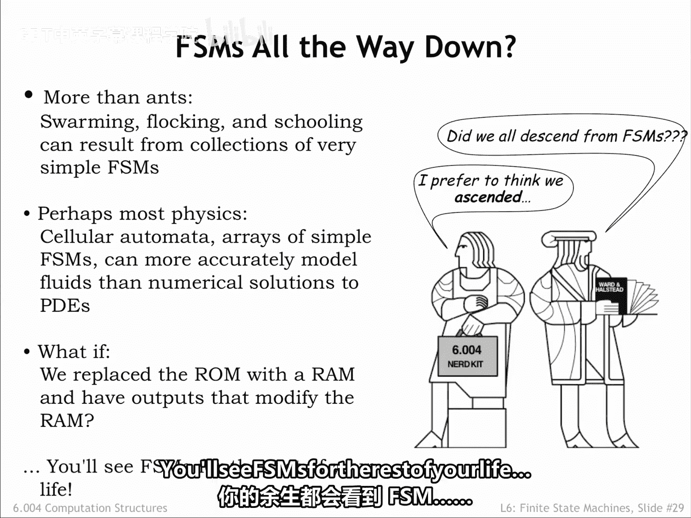

# 057：6.2.5 等价状态与实现 🧠

在本节课中，我们将要学习如何通过寻找和合并等价状态来简化有限状态机，并了解如何使用逻辑门来实现FSM。

## 概述

之前我们讨论了如何寻找具有更少状态的等价FSM。现在，我们将开发一种方法来寻找这样的FSM。其核心思路是寻找两个可以合并为一个状态，且不会以任何外部可区分的方式改变FSM行为的等价状态。

## 等价状态的定义

两个状态被认为是等价的，当且仅当它们满足以下两个标准：

1.  **状态必须具有相同的输出**。这很合理，因为输出对外部可见。如果两个状态的输出值不同，这种差异显然是外部可区分的。
2.  对于**每一种输入值的组合**，这两个状态都必须**转换到等价的状态**。

我们的策略是从原始FSM开始，寻找成对的等价状态，然后合并这些状态。我们将不断重复这个过程，直到找不到更多的等价状态为止。

## 应用实例：蚂蚁FSM

让我们在蚂蚁FSM上尝试这个方法。首先，我们需要找到一对具有相同输出的状态。

实际上，只有一对这样的状态：`wall1` 和 `corner`，它们都断言“右转”和“前进”输出。

接下来，我们假设 `wall1` 和 `corner` 是等价的，并检查对于每种适用的输入值组合，它们是否都转换到等价的状态。

对于这两个状态，所有的转换都只取决于输入 `R` 的值。因此，我们只需要检查两种情况：
*   如果 `R` 是 `0`，两个状态都转换到 `corner`。
*   如果 `R` 是 `1`，两个状态都转换到 `wall2`。

因此，两个等价标准都得到了满足。我们可以得出结论：`wall1` 和 `corner` 状态是等价的，可以合并。

这为我们提供了上图所示的四状态FSM，我们将合并后的单一状态称为 `wall1`。这个更小的等价FSM的行为与之前的五状态FSM完全相同。

五状态机的实现需要三个状态位，而四状态机的实现只需要两个状态位。减少一个状态位是巨大的改进，因为它将所需ROM的尺寸减少了一半。

正如我们通过最小化布尔方程可以实现相当大的硬件节省一样，我们也可以通过合并等价状态在时序逻辑中实现同样的效果。蚂蚁客户们正期待着降价呢！

## 使用逻辑门实现FSM

上一节我们介绍了如何通过合并状态来简化FSM。本节中我们来看看，如果想使用逻辑门（而不是ROM）来实现组合逻辑，我们需要做什么。

首先，我们必须构建真值表，录入状态转换图中的所有转换。

我们从 `lost` 状态开始。如果FSM处于此状态，输出 `F` 应为 `1`。如果两个天线输入都是零，下一个状态也是 `lost`。为 `lost` 状态分配编码 `00`，我们已经在表格的第一行捕获了此信息。

如果任一触角被触碰，FSM应从 `lost` 状态转换到 `rotate counterclockwise` 状态。我们给这个状态分配编码 `01`。有三种 `L` 和 `R` 值的组合与此转换匹配，因此我们在真值表中添加了三行。这样就处理了从 `lost` 状态出发的所有转换。

现在我们可以处理从 `rotate counterclockwise` 状态出发的转换。如果任一触角被触碰，下一个状态再次是 `rotate counterclockwise`。因此，我们识别了匹配的输入值，并将适当的三行添加到转换表中。

我们可以以类似的方式继续，逐个编码所有的转换。

上图是最终的表格，我们使用了“无关项”来减少用于演示的行数。

接下来，我们希望为组合逻辑的每个输出（即两个下一个状态位和三个运动控制输出）推导出布尔方程。

以下是两个下一个状态位的卡诺图。利用我们在第4章学到的KMap技能，我们将为 `S1'` 找到一个质蕴含项的覆盖，并以最小积之和方程的形式写下对应的乘积项。然后对另一个下一个状态位进行同样的操作。

我们可以遵循类似的过程，为运动控制输出推导出最小积之和表达式。

以直接的方式用与门和或门实现每个积之和表达式，我们得到了蚂蚁大脑的如下原理图。很简洁。

谁能想到蚂蚁的跟随行为可以用几个D寄存器和少量逻辑门来实现呢？

## FSM的广泛应用

有许多复杂的行为可以用出人意料的简单FSM来创建。早期，计算机图形学领域的研究者就发现，像集群、鸟群和鱼群这样的群体行为，可以通过为每个参与者配备一个简单的FSM来建模。

所以，下次你看到《指环王》电影中的大规模战斗场景时，可以想象成许多FSM在并行运行。

由组成分子之间的简单相互作用产生的物理行为，有时使用**元胞自动机**（一种相互通信的FSM网络）来建模，比试图求解描述分子行为约束的偏微分方程更容易。

这里还有一个想法：如果我们允许FSM修改它自己的转换表呢？嗯，也许这是一个合理的进化模型。

FSM无处不在。在你的余生中，你都会看到FSM。

## 总结

本节课中我们一起学习了如何定义和寻找有限状态机中的等价状态，并通过合并它们来简化电路设计，从而减少硬件开销。我们还探讨了使用逻辑门（而非ROM）来实现FSM组合逻辑的具体步骤，包括构建真值表和推导最小化布尔方程。最后，我们了解了FSM在模拟复杂行为（如群体行为和物理现象）中的广泛应用。