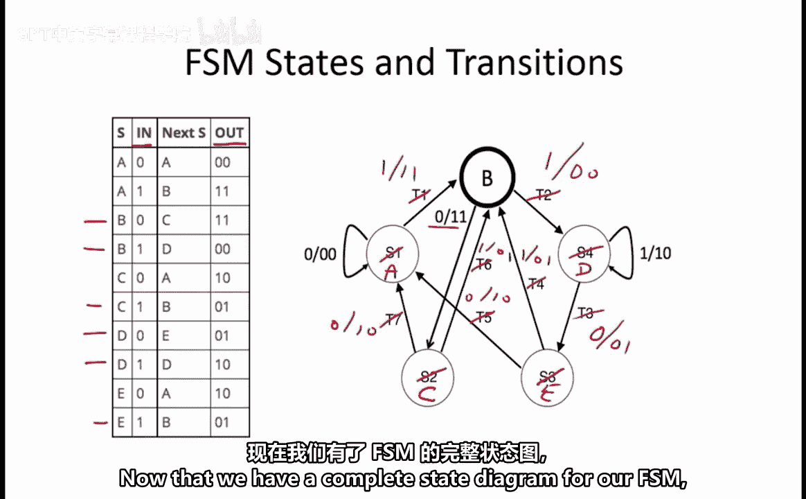
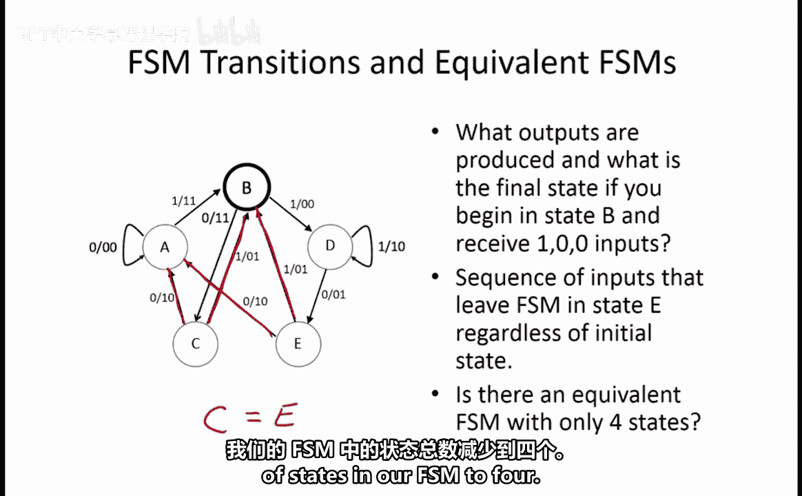

# 059：FSM状态与转移 🧮

在本节课中，我们将通过一个具体的实例，学习如何分析一个有限状态机（FSM）的状态转移图、计算输出序列、寻找通用输入序列，并判断状态是否等价以简化FSM。

## 概述

我们有一个五状态的米利型有限状态机（FSM），它具有一个1位输入 `in` 和一个2位输出 `out`。其初始状态为 `B`。我们将从一个部分填充的状态转移图和一个真值表出发，完成以下任务：
1.  补全状态转移图中缺失的状态和转移标签。
2.  计算给定输入序列下的输出序列。
3.  寻找一个能从任意状态都到达指定状态 `E` 的通用输入序列。
4.  判断是否存在一个等价的、状态数更少的FSM。

## 补全状态转移图

上一节我们介绍了FSM的基本概念，本节中我们来看看如何利用真值表来补全状态转移图。

给定的真值表定义了FSM的行为：对于每个当前状态和输入组合，它指明了下一个状态和输出。我们的起始状态是 `B`。

以下是补全状态转移图的步骤：

我们从起始状态 `B` 开始。根据真值表，当输入 `in = 0` 时，下一个状态是 `C`。由于图中从状态 `B` 出发、输入为 `0` 的转移箭头已经标出，我们可以确定：
*   `S2` 对应的状态就是 `C`。
*   同时，这意味着 `T2` 对应的是输入 `in = 1` 的情况。

根据真值表，从状态 `B` 在 `in = 1` 时，会转移到状态 `D` 并输出 `00`。因此：
*   `S4` 对应的状态是 `D`。
*   `T2` 对应的转移标签是 `1/00`。

现在，我们来看状态 `D`。图中已经标出了 `in = 1` 的转移，所以 `T3` 对应 `in = 0`。查真值表可知，从状态 `D` 在 `in = 0` 时，会转移到状态 `E` 并输出 `01`。因此：
*   `S3` 对应的状态是 `E`。
*   `T3` 对应的转移标签是 `0/01`。

以此类推，我们可以完成整个图的填充。最终结果如下：
*   `S1 = A`, `S2 = C`, `S3 = E`, `S4 = D`
*   `T1 = 1/11`, `T2 = 1/00`, `T3 = 0/01`, `T4 = 1/01`, `T5 = 0/10`, `T6 = 1/01`, `T7 = 0/10`

## 计算输出序列



现在我们已经有了完整的状态转移图，接下来我们计算当FSM从状态 `B` 开始，并接收输入序列 `100` 时，会产生什么输出序列。

以下是状态转移过程：
1.  起始状态为 `B`。输入第一个位 `1`，根据转移 `T2 (1/00)`，FSM转移到状态 `D`，输出 `00`。
2.  当前状态为 `D`。输入第二个位 `0`，根据转移 `T3 (0/01)`，FSM转移到状态 `E`，输出 `01`。
3.  当前状态为 `E`。输入第三个位 `0`，根据转移 `T5 (0/10)`，FSM转移到状态 `A`，输出 `10`。

因此，对于输入序列 `100`，对应的输出序列是 `00 01 10`。

## 寻找通用输入序列

接下来，我们尝试寻找一个输入序列，无论FSM初始处于哪个状态（A, B, C, D, E），在该序列处理完毕后，都能保证FSM最终停留在状态 `E`。

我们需要为每个可能的起始状态，找到一条通往状态 `E` 的路径，并尝试找到一个公共的输入序列。

以下是分析过程：

我们从状态 `A` 开始。观察状态图，从 `A` 到 `E` 的最短路径是输入序列 `110`（`A -> B -> D -> E`）。

对于状态 `B`，序列 `10` 即可到达 `E`（`B -> D -> E`）。但我们需要一个通用序列，所以测试 `110` 是否也适用。对于状态 `B`，`110` 的路径是 `B -> D -> D -> E`（第一个 `1` 进入 `D`，第二个 `1` 使状态保持在 `D`，最后的 `0` 进入 `E`），同样成功。

检查其他状态：
*   **状态 D**: 输入 `110`，路径为 `D -> D -> D -> E`，成功。
*   **状态 E**: 输入 `110`，路径为 `E -> B -> D -> E`，成功。
*   **状态 C**: 输入 `110`，路径为 `C -> B -> D -> E`，成功。

综上所述，**输入序列 `110` 是一个通用序列**，无论初始状态如何，都能使FSM最终进入状态 `E`。

## 状态等价与FSM简化

最后，我们来探讨这个五状态FSM是否可以简化成一个四状态的等价FSM。这涉及到“状态等价”的概念。

在米利型FSM中，如果两个状态对于**所有可能的输入**，都产生**相同的输出**并转移到**相同的下一个状态**，那么这两个状态是等价的，可以合并为一个状态。

让我们检查当前FSM中的状态对。通过对比状态转移表（或观察完整的状态图），我们发现状态 `C` 和状态 `E` 的行为完全一致：
*   当输入 `in = 0` 时，两者都转移到状态 `A`，并输出 `10`。
*   当输入 `in = 1` 时，两者都转移到状态 `B`，并输出 `01`。

用公式化的方式表达，对于任意输入 `i`：
```
NextState(C, i) == NextState(E, i) 且 Output(C, i) == Output(E, i)
```

因此，**状态 `C` 和状态 `E` 是等价的**。我们可以将它们合并为一个状态（例如，称为状态 `CE`）。合并后，所有指向原状态 `C` 或 `E` 的转移，现在都指向新状态 `CE`；从新状态 `CE` 出发的转移，则继承原来 `C` 或 `E` 的转移关系。这样，我们就得到了一个功能完全等价但只有四个状态的FSM。

## 总结



本节课中我们一起学习了有限状态机的综合分析。
1.  我们利用真值表**补全**了状态转移图的缺失信息。
2.  我们通过模拟状态转移过程，**计算**出了给定输入序列对应的输出序列。
3.  我们通过分析从各状态到目标状态的路径，**寻找**到了一个通用的输入序列 `110`，它能从任意初始状态将FSM驱动到指定状态 `E`。
4.  最后，我们应用状态等价的原则，**识别**出状态 `C` 和 `E` 是等价的，从而可以将原五状态FSM**简化**为一个四状态的等价FSM。这个过程体现了优化数字逻辑设计的基本思想。