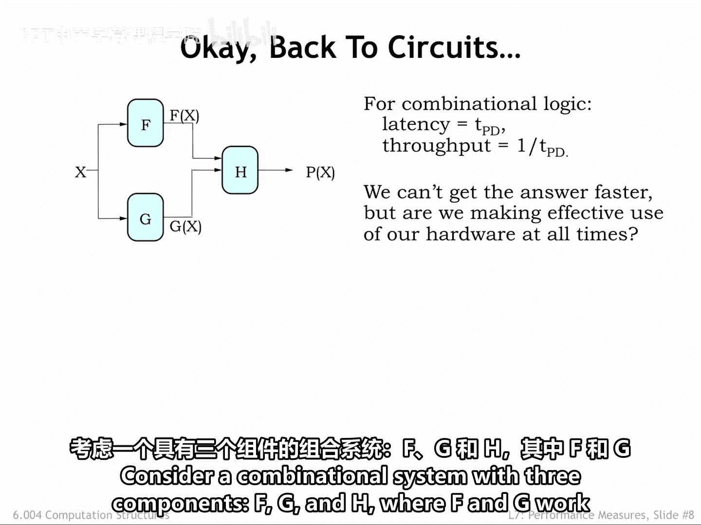
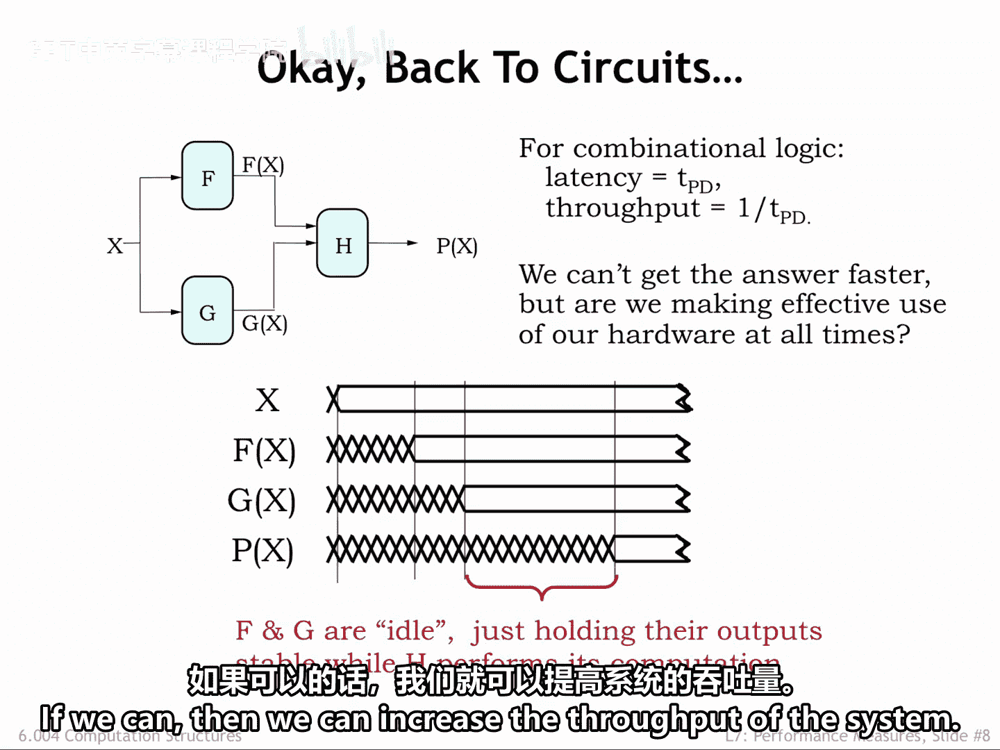
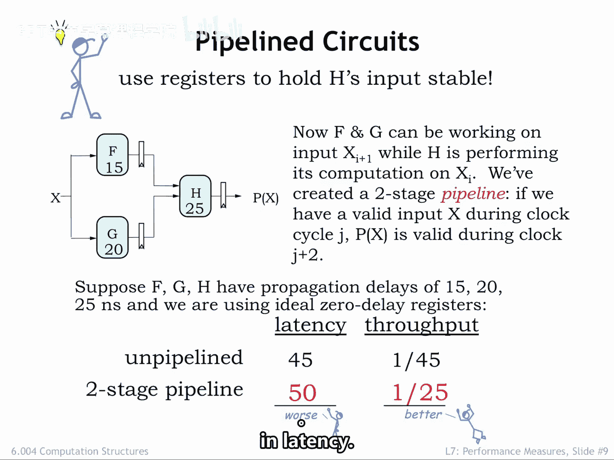
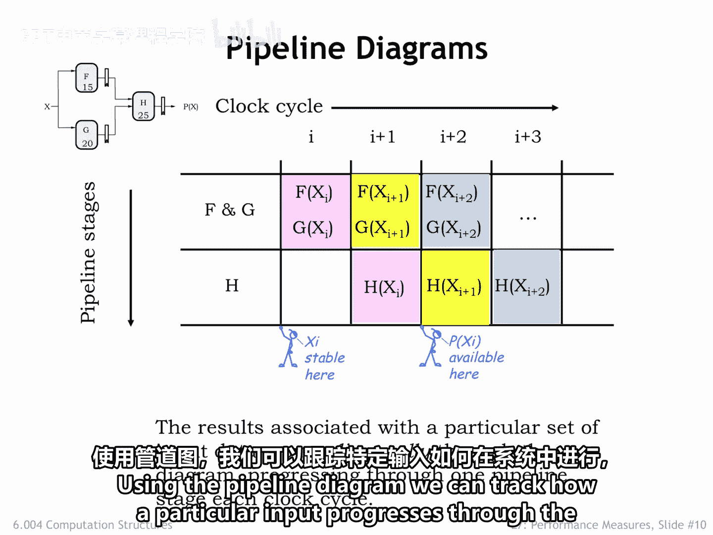
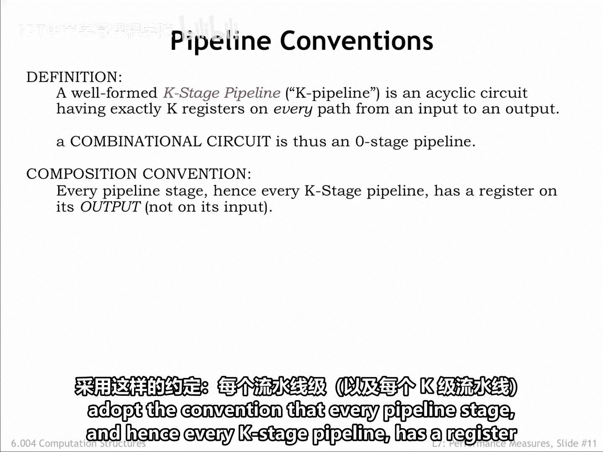
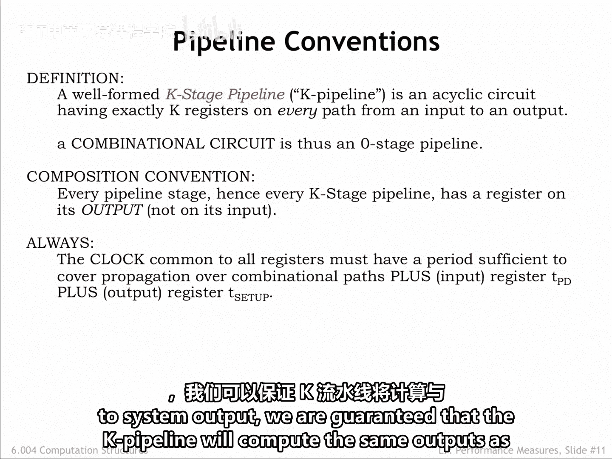
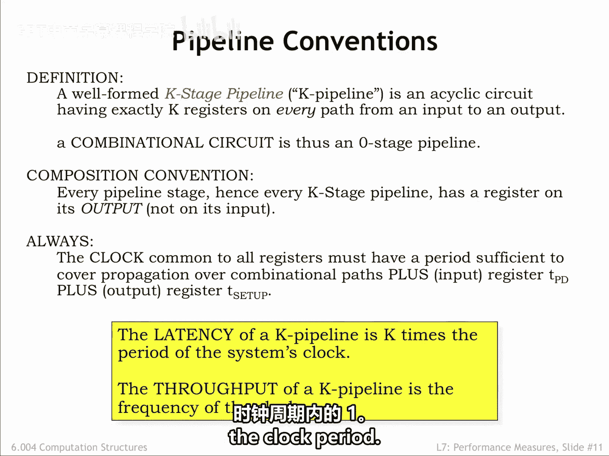

# 数字系统与计算机架构：P1：流水线电路 🚀

在本节课中，我们将学习如何通过流水线技术来提升电路的性能。我们将分析组合逻辑电路的延迟与吞吐量，并探讨如何通过插入寄存器将其改造为流水线电路，从而在增加少量延迟的代价下，显著提高吞吐量。

---

## 组合电路的性能分析

上一节我们讨论了电路性能的基本概念。本节中，我们来看看如何分析一个组合电路的性能。

一个大型组合电路的延迟就是其传播延迟 `D`。其吞吐量则是 `1 / D`，因为只有在完成当前输入的计算后，才能开始处理下一个输入。

考虑一个由三个组件 `F`、`G` 和 `H` 组成的组合系统，其中 `F` 和 `G` 并行工作，为 `H` 提供输入。

通过时序图，我们可以追踪特定输入值 `x` 的处理过程。在 `x` 有效且稳定一段时间后，`F` 和 `G` 模块产生输出 `F(x)` 和 `G(x)`。当 `H` 的输入有效且稳定后，`H` 模块将在其传播延迟所决定的时间后，产生系统输出 `P(x)`。

从有效输入到有效输出的总耗时由各组件模块的传播延迟决定。如果我们直接使用这些模块，就无法改进这个延迟。

---

## 提升吞吐量的思路

那么，如何提升系统的吞吐量呢？观察发现，在产生输出后，`F` 和 `G` 模块处于空闲状态，只是保持输出稳定，而 `H` 在进行计算。

我们能否找到一种方法，让 `F` 和 `G` 在处理下一个输入的同时，仍允许 `H` 处理第一个输入？换句话说，我们能否将组合电路的处理过程分为两个阶段：第一阶段计算 `F(x)` 和 `G(x)`，第二阶段计算 `H(x)`？如果可以，我们就能提高系统的吞吐量。

一个灵感是使用寄存器来保存 `F(x)` 和 `G(x)` 的值供 `H` 使用，同时让 `F` 和 `G` 模块开始处理下一个输入值。

为了简化时序分析，我们假设流水线寄存器的传播延迟和建立时间为零。时序电路的合适时钟周期由最慢处理阶段的传播延迟决定。

在这个例子中，包含 `F` 和 `G` 的阶段需要至少 20 纳秒的时钟周期才能正常工作，而包含 `H` 的阶段需要至少 25 纳秒。因此，第二阶段最慢，将系统时钟周期设定为 25 纳秒。

---

## 流水线系统的工作原理

这是我们提高组合逻辑吞吐量的通用方案：使用寄存器将处理过程划分为一系列阶段。寄存器捕获一个处理阶段的输出，并将其作为下一个处理阶段的输入保存。特定的输入将以每个时钟周期一个阶段的速度在系统中推进。

在这个例子中，处理流水线有两个阶段，时钟周期为 25 纳秒，因此流水线系统的延迟是 50 纳秒。换句话说，延迟等于 **阶段数 × 系统时钟周期**。

流水线系统的延迟比非流水线系统稍长。然而，流水线系统每个时钟周期（25 纳秒）就能产生一个输出。流水线系统以少量增加延迟为代价，获得了显著更好的吞吐量。

流水线图帮助我们可视化流水线系统的操作。流水线图的行代表流水线阶段，列代表连续的时钟周期。

在时钟周期 `I` 开始时，输入 `X_i` 变得稳定有效。然后在时钟周期 `I` 期间，`F` 和 `G` 模块处理该输入，并在周期结束时，结果 `F(X_i)` 和 `G(X_i)` 被第一和第二阶段之间的流水线寄存器捕获。

接着在周期 `I+1` 中，`H` 使用捕获的值来处理 `X_i`。同时，`F` 和 `G` 模块正在处理 `X_{i+1}`。可以看到，特定输入值的处理在图中沿对角线移动，每个时钟周期前进一个流水线阶段。

在周期 `I+1` 结束时，`H` 的输出被最终的流水线寄存器捕获，并可在周期 `I+2` 中使用。从输入到达到输出可用的总时间是两个周期。

处理过程周期复始，每个时钟周期产生一个新的输出。使用流水线图，我们可以追踪特定输入在系统中的进展，或者查看任何特定周期中所有阶段正在做什么。

---

## 流水线电路的形式化定义

我们将一个 **K 级流水线**（简称 K-流水线）定义为一个非循环电路，在其每条从输入到输出的路径上恰好有 K 个寄存器。

因此，一个非流水线的组合电路就是零级流水线。为了便于用流水线组件构建更大的流水线系统，我们约定每个流水线阶段（也就是每个 K 级流水线）在其输出端都有一个寄存器。

我们将使用分析时序电路时序的技术，来确保所有流水线寄存器共用的时钟信号具有足够的周期，以保证每个阶段的正确操作。

因此，对于每条从寄存器到寄存器、或从输入到寄存器的路径，我们需要计算输入寄存器的传播延迟、组合逻辑的传播延迟以及输出寄存器的建立时间之和。

然后，我们将选择系统时钟周期，使其大于或等于所有这些和中的最大值。在正确的时钟周期下，并且每条从系统输入到系统输出的路径上恰好有 K 个寄存器，我们就能保证 K-流水线计算出的输出与原始非流水线组合电路相同。

一个 K-流水线的延迟是系统时钟周期的 K 倍：
**延迟 = K × T_clk**

而一个 K-流水线的吞吐量是系统时钟的频率：
**吞吐量 = 1 / T_clk**

---

## 总结

本节课中我们一起学习了流水线电路的核心概念。我们了解到，通过将组合逻辑划分为多个阶段并用寄存器分隔，可以构建流水线。虽然这会略微增加系统的整体延迟（**延迟 = 阶段数 × 时钟周期**），但能显著提高吞吐量（**吞吐量 = 时钟频率**）。流水线图是分析和可视化其操作的有效工具。正确设计流水线的关键在于确保时钟周期满足最慢阶段的要求，以保证数据在各级之间正确传递。