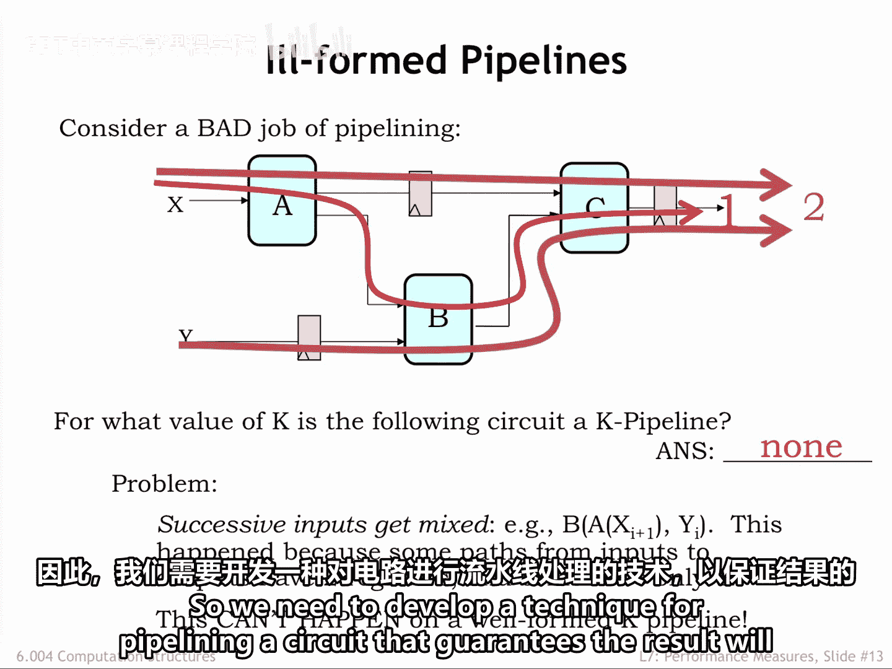
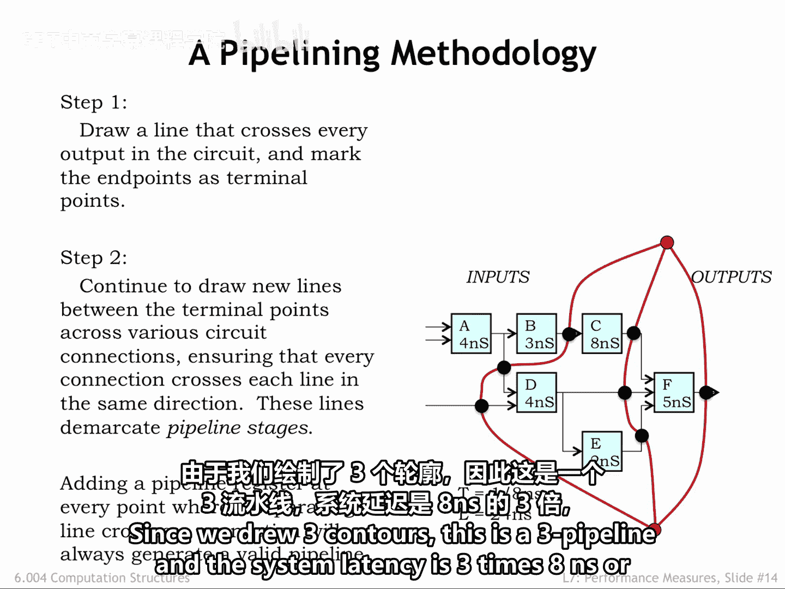
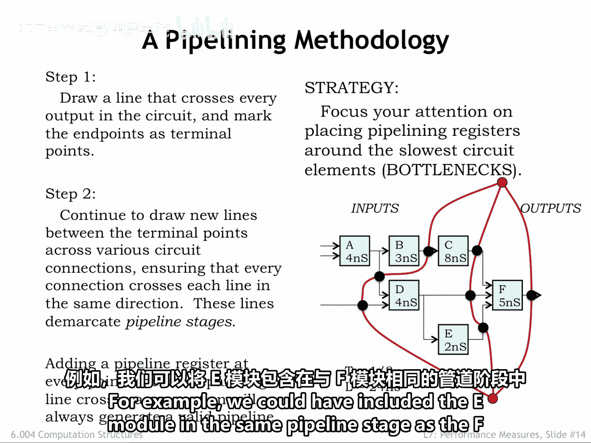
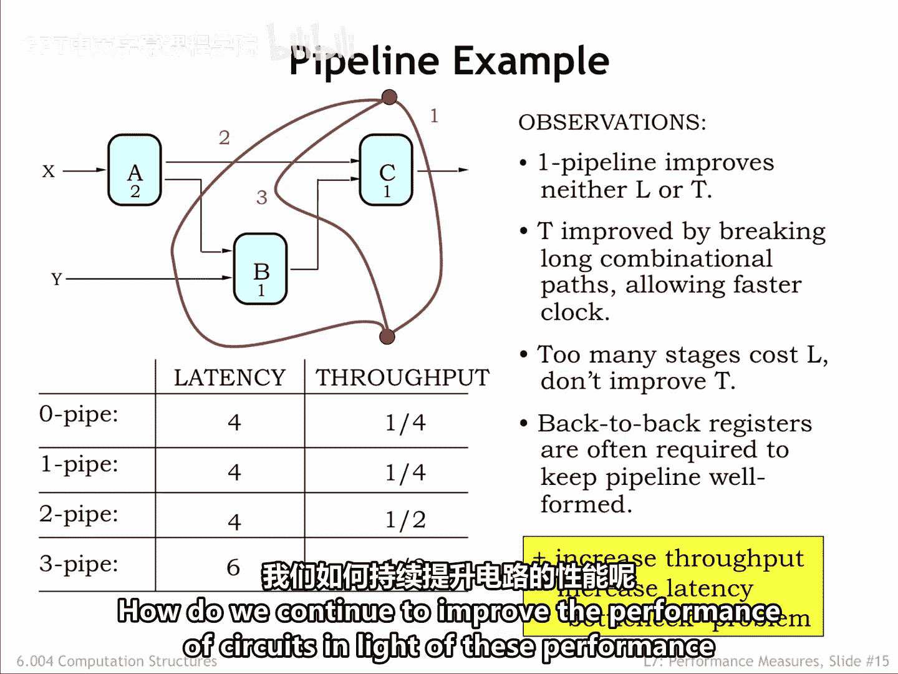
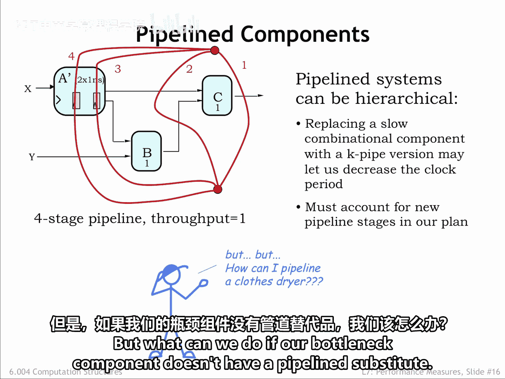

# 数字系统与计算机架构：P1：流水线设计方法论 🚀

在本节课中，我们将学习流水线电路设计的方法论。我们将了解如何将一个组合逻辑电路转换为一个结构良好、功能正确的流水线电路，并分析其性能指标，如吞吐量和延迟。

---

## 流水线结构的重要性

上一节我们介绍了流水线的基本概念，本节中我们来看看一个失败的流水线设计案例，并理解结构良好的流水线为何如此重要。

这是一个流水线设计的失败尝试。对于K值是多少时，这个电路才是一个K级流水线？我们来数一下从系统输入到系统输出的每条路径上的寄存器数量。

*   穿过A和C模块的顶部路径有两个寄存器。
*   穿过B和C模块的底部路径也有两个寄存器。
*   但是，穿过所有三个模块（A、B、C）的中间路径只有一个寄存器。

这**不是一个结构良好的K级流水线**。我们为什么要在意这一点？因为这种流水线电路计算出的结果，与原始的非流水线电路不同。问题的根源在于，在处理过程中，连续几代的输入值被混合在了一起。

例如，在周期 **I+1** 期间，B模块正在使用X输入的当前值，但使用的却是Y输入的前一个值。这种情况在结构良好的流水线中也可能发生，因此我们需要开发一种流水线设计技术，以确保结果结构良好。

---

## 确保流水线结构良好的策略

为了解决上述问题，我们需要一个策略来确保：如果我们沿着一条从输入到输出的路径添加了流水线寄存器，那么我们必须沿着**每一条**这样的路径都添加寄存器。

以下是我们的分步策略：

**步骤一**：画一条轮廓线，使其穿过电路的所有输出。将这条线的端点标记为“终点”，后续所有轮廓线都将在这两个终点之间绘制。

**步骤二**：在两个终点之间，沿着模块间的信号连接继续绘制轮廓线。确保每条信号连接都以相同的方向穿过新的轮廓线。这意味着系统输入将位于轮廓线的一侧，而系统输出位于另一侧。

这些轮廓线划分了流水线阶段。在信号连接与轮廓线相交的位置放置一个流水线寄存器。在下图中，我们用大黑点标记了流水线寄存器的位置。

通过从终点到终点绘制轮廓线，我们保证了会穿过每一条输入-输出路径，从而确保我们的流水线结构良好。

现在，我们可以通过寻找具有最长“寄存器到寄存器”或“输入到寄存器”传播延迟的流水线阶段，来计算系统时钟周期。

根据这些轮廓线，并假设流水线寄存器是零延迟的理想寄存器，系统时钟周期必须为 **8纳秒**，以适应C模块的操作。这给出了系统的吞吐量：每8纳秒产生一个输出。

由于我们绘制了三条轮廓线，这是一个**三级流水线**，系统的总延迟是 **3 × 8纳秒 = 24纳秒**。

---

## 流水线设计的目标与权衡

我们流水线设计的通常目标是：使用尽可能少的寄存器实现最大的吞吐量。

因此，我们的策略是找到系统中最慢的组件（在我们的例子中是C组件），并在其输入和输出端放置流水线寄存器。所以我们绘制了穿过C模块两侧的轮廓线。

这**将时钟周期设定为8纳秒**。我们这样定位轮廓线，使得任意两个流水线寄存器之间的最长路径最多为8纳秒。

在保持相同吞吐量和延迟的前提下，如何绘制轮廓线通常有多种选择。例如，我们可以将E模块和F模块放在同一个流水线阶段中。

让我们回顾一下流水线策略。

1.  首先，我们画一条穿过所有输出的轮廓线。这创建了一个一级流水线，其吞吐量和延迟始终与原始组合电路相同。
2.  然后，我们绘制下一条轮廓线，试图隔离系统中最慢的组件。这创建了一个二级流水线，其时钟周期为2纳秒，因此吞吐量为1/2（即比一级流水线快一倍）。
3.  我们可以添加额外的轮廓线，但请注意，二级流水线已经具有了可能的最小时钟周期。因此，在此之后，添加更多轮廓线只会增加流水线级数，从而**增加系统延迟，但不会提高吞吐量**。这并非错误，只是对硬件投资而言不值得。

注意，A和C模块之间的信号连接现在有两个背靠背的流水线寄存器。这没有问题，当我们将一个输入-输出路径长度不同的电路流水线化时，这种情况经常发生。

所以，我们的流水线策略是：设计吞吐量递增的流水线实现，通常以增加延迟为代价。有时我们很幸运，每个流水线阶段的延迟完全平衡，在这种情况下延迟不会增加。请注意，流水线电路的延迟永远不会小于非流水线电路。

---

## 突破性能瓶颈：使用流水线化组件

一旦我们隔离了最慢的组件，就无法再进一步提高吞吐量了。面对这种性能瓶颈，我们如何继续提升电路性能呢？

一个解决方案是：**使用流水线化的组件**（如果可用的话）。

假设我们能够用两级的流水线版本 **A‘** 替换原来的A组件。我们可以重新绘制流水线和轮廓线，确保考虑到A‘组件内部的流水线寄存器。这意味着我们的两条轮廓线必须穿过A‘组件，从而保证我们会在系统的其他地方添加流水线寄存器，以匹配A‘引入的两周期延迟。

现在，任何阶段的最大传播延迟是1纳秒，**吞吐量从1/2提升到了1/1（即每纳秒一个输出）**。这是一个四级流水线，因此延迟将是4纳秒。这很棒。

但是，如果我们的瓶颈组件没有可用的流水线替代品，我们该怎么办？

我们将在下一节中解决这个问题。

---

## 总结

本节课中我们一起学习了流水线电路设计的方法论。我们了解到，结构良好的流水线要求所有输入到输出的路径具有相同数量的寄存器。通过绘制轮廓线的策略，可以系统地实现这一点。流水线设计的目标是提高吞吐量，但通常会以增加延迟为代价，并且性能提升受限于系统中最慢的组件。为了突破此限制，可以使用内部已流水线化的组件。