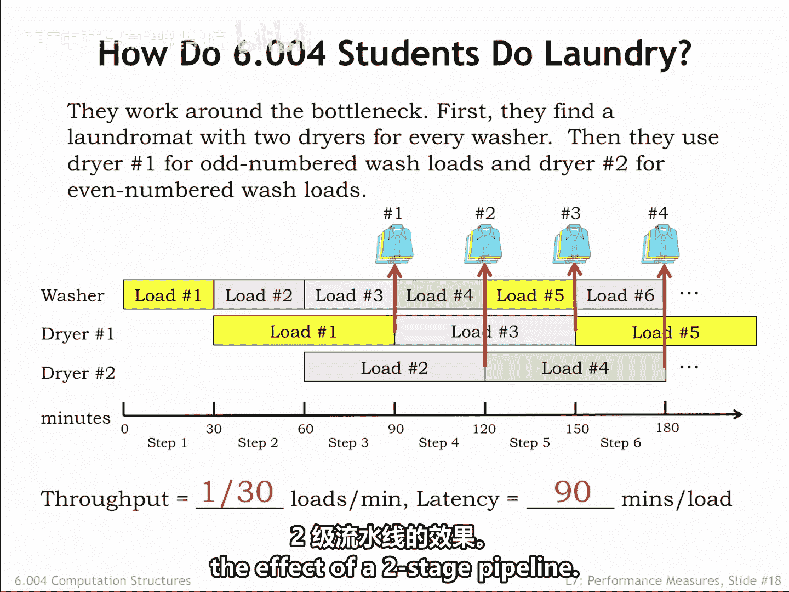
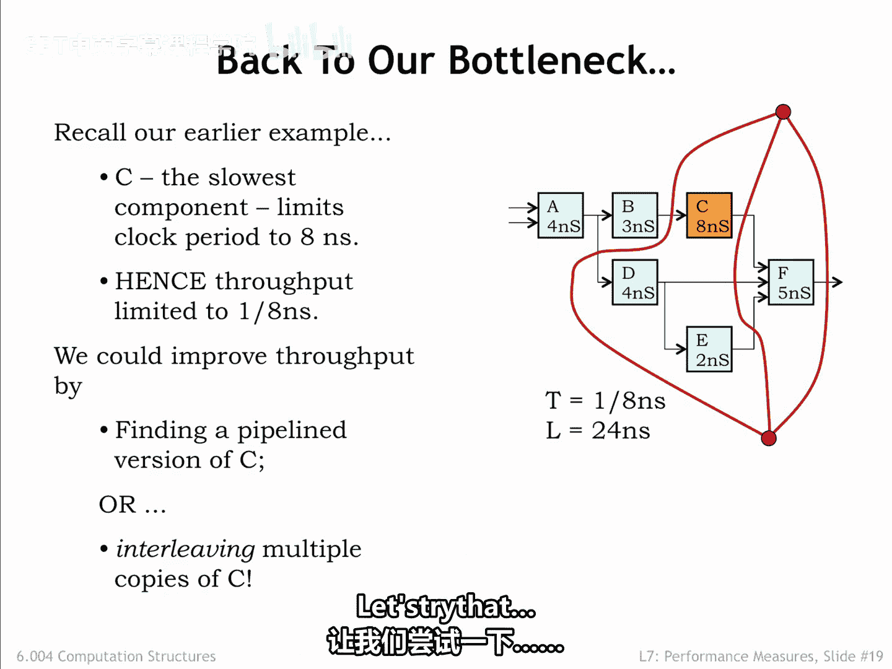
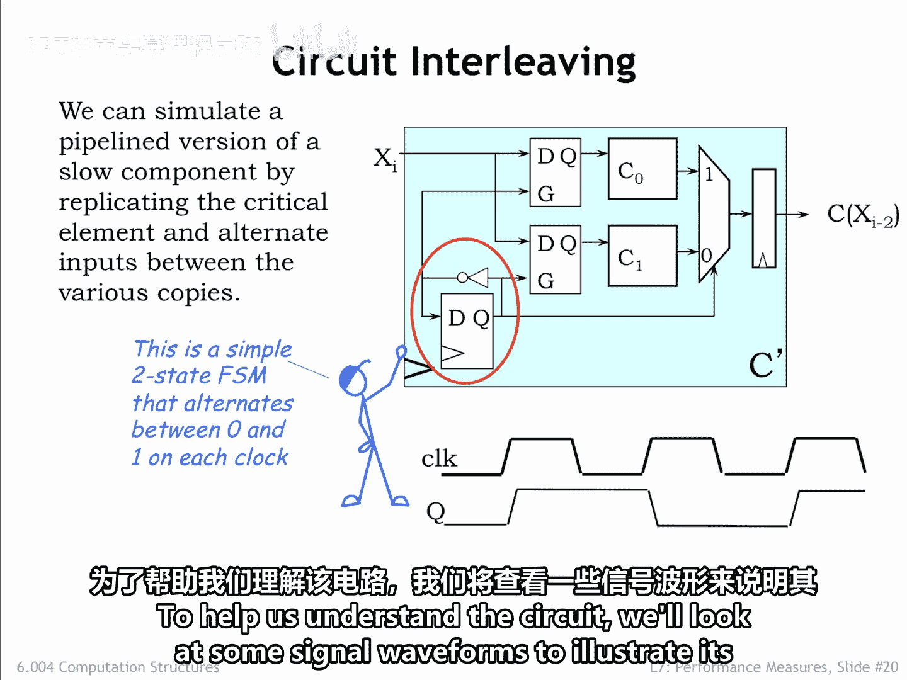
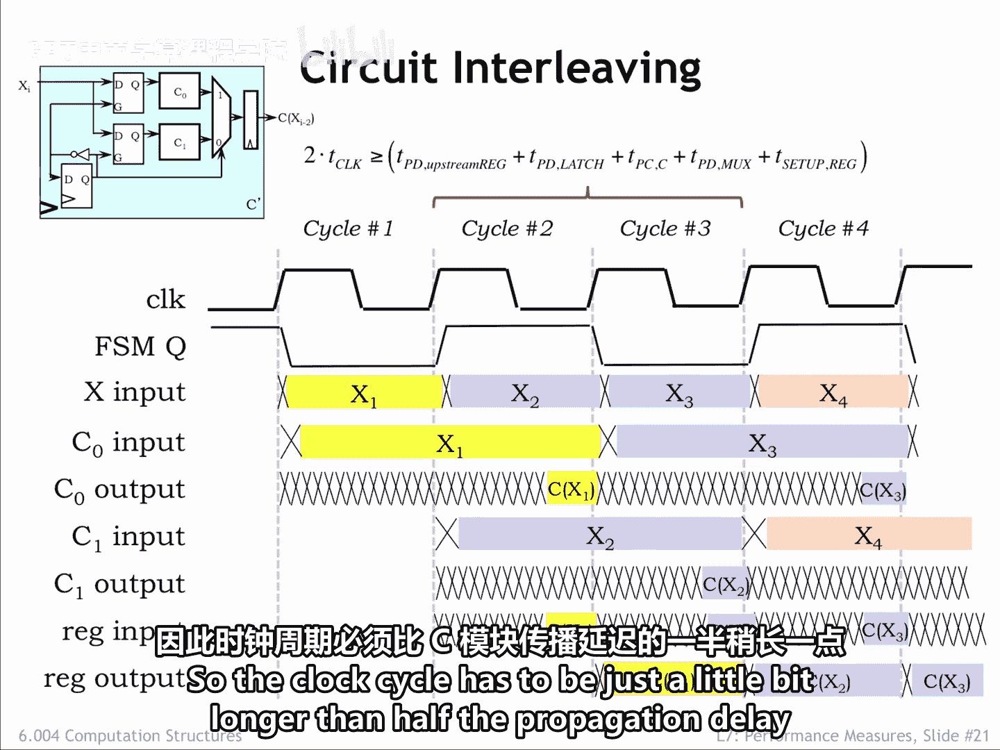
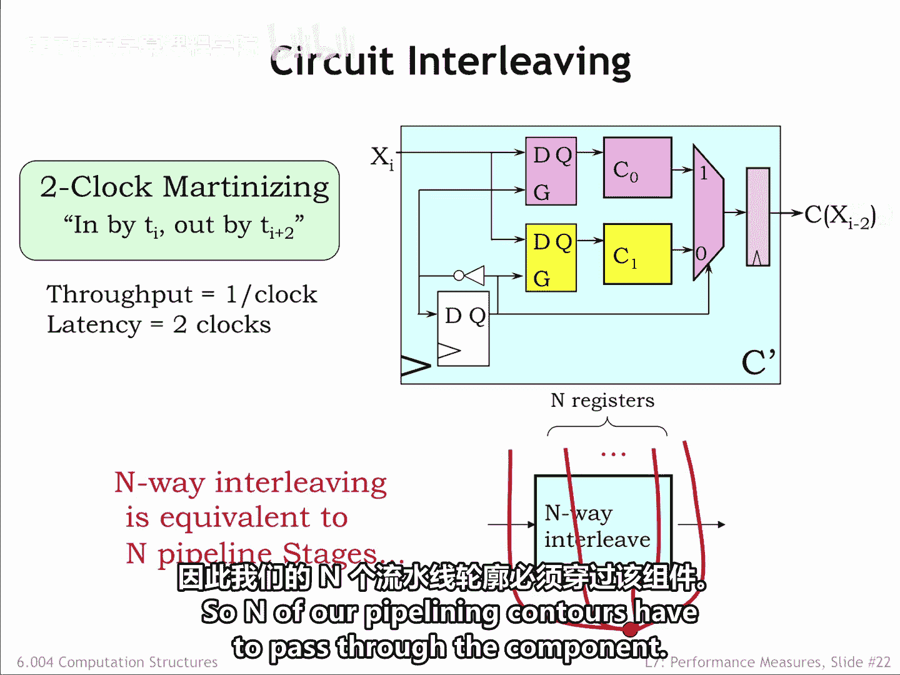
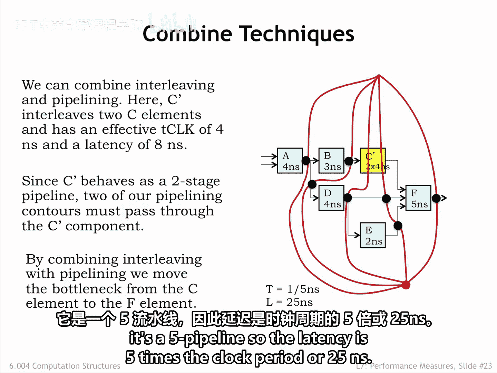
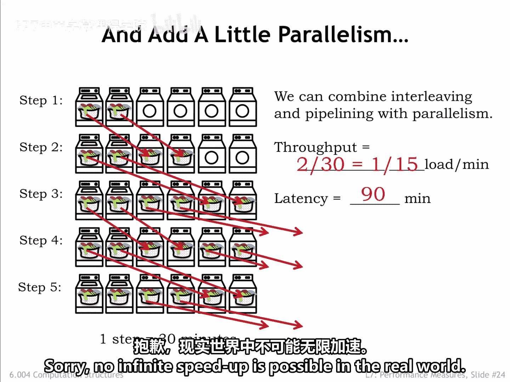

# 064：7.2.4 电路交错

在本节课中，我们将学习如何通过“交错”技术来提升数字系统的吞吐量。我们将从一个洗衣店的类比开始，理解交错的基本概念，然后将其应用到电路设计中，以解决流水线中慢速模块带来的瓶颈问题。

## 概述：通过交错提升吞吐量

上一节我们讨论了流水线设计，但遇到了一个瓶颈：系统中存在一个无法被流水线化的慢速模块（C模块），其延迟决定了整个系统的最小时钟周期。本节中，我们来看看如何通过“交错”技术来克服这个限制。交错的核心思想是使用多个相同的慢速组件，让它们交替工作，从而模拟出一个多级流水线的效果，最终提升系统的整体吞吐量。

## 从洗衣店到电路：交错的概念

为了理解交错，我们先看一个洗衣店的例子。学生们找到了一个拥有两台烘干机但只有一台洗衣机的洗衣店来解决烘干瓶颈。

以下是这个系统的运作计划，时间线以30分钟为步长进行划分：
*   洗衣机在每个时间步长都被使用，每30分钟产出一批新洗好的衣物。
*   烘干机的使用是交错的：一号烘干机用于烘干奇数批次的衣物，二号烘干机用于烘干偶数批次的衣物。
*   一旦启动，一台烘干机需要运行两个步长，总计60分钟。

由于两台烘干机错开时间运行，整个系统每30分钟就能产出一批干净、干燥的衣物。系统的稳定吞吐量是**每30分钟一批衣物**，而特定一批衣物的延迟是**90分钟**。

这个例子的关键结论是：考虑这个双烘干机系统的操作。**即使烘干机组件本身不是流水线化的，但通过两台烘干机交错工作的系统，其行为就像一个两级流水线，时钟周期为30分钟，延迟为60分钟。** 换句话说，通过交错使用两个非流水线组件，我们可以实现一个两级流水线的效果。

## 电路实现：通用双路交错器

回到上一节的电路例子，由于C模块8纳秒的延迟决定了最小时钟周期，我们无法将流水线系统的吞吐量提升到超过每8纳秒一个结果。为了进一步提升吞吐量，我们需要找到C组件的流水线版本，或者使用交错策略，用两个非流水线C组件的实例来模拟两级流水线的效果。我们来尝试后者。

上图展示了一个通用的双路交错器电路，这里使用了两个非流水线C组件的副本：C0和C1。
*   每个C组件的输入来自一个D锁存器，其任务是捕获并保持输入值。
*   还有一个多路复用器，用于选择哪个C组件的输出将被输出寄存器捕获。
*   电路的左下角是一个非常简单的两状态有限状态机（FSM），只有一个状态位。其下一个状态逻辑是一个单独的反相器，这使得状态在连续的时钟周期内在0和1之间交替。

下面的时序图显示了状态位在每个时钟上升沿之后如何变化。为了帮助我们理解电路，我们将查看一些信号波形来说明其操作。

首先，这是来自上一张幻灯片的时钟信号和FSM状态位的波形。一个新的X输入在时钟上升沿之后从上一级到达。

接下来，我们跟踪C0组件的操作。当FSM Q为低电平时，其输入锁存器打开。因此，新到达的X1输入通过锁存器，C0可以开始其计算，在第二个时钟周期结束时产生结果。注意，C0的输入锁存器在第二个时钟周期开始时关闭，即使X输入开始变化，它也能保持X1输入值稳定。其效果是C0在两个时钟周期的大部分时间内拥有有效且稳定的输入，从而有足够的时间计算结果。

C1的波形类似，只是偏移了一个时钟周期。当FSM Q为高电平时，C1的输入锁存器打开，因此新到达的X2输入通过锁存器，C1可以开始其计算，在第三个时钟周期结束时产生结果。

现在检查多路复用器的输出。当FSM Q为高时，它选择来自C0的值；当FSM Q为低时，它选择来自C1的值。我们可以在所示的波形中看到这一点。

最后，在时钟上升沿，输出寄存器捕获其输入上的值，并在该时钟周期的剩余时间内保持其稳定。

**交错电路的行为就像一个两级流水线。** 在周期I到达的输入值经过两个时钟周期处理，结果在周期I+2变得可用。

那么交错系统的时钟周期是多少？由于上游流水线寄存器（提供X输入）、内部锁存器、多路复用器以及输出寄存器的建立时间所带来的传播延迟，会损失一些时间。因此，时钟周期必须比C模块传播延迟的一半稍长一些。

## 在流水线图中处理交错组件

我们可以将交错电路视为一个两级流水线，每个时钟周期消耗一个输入，并在两个周期后产生一个结果。当在我们的流水线图中加入一个N路交错组件时，我们将其视为一个N级流水线。因此，必须有N条我们的流水线等高线穿过该组件。

在这里，我们用双路交错的C‘组件替换了流水线中的C组件。我们可以遵循绘制流水线等高线的流程：
1.  首先，我们画一条穿过所有输出的等高线。
2.  然后我们添加等高线，确保有两条穿过C‘组件。
3.  接着，我们在等高线与信号连接的交叉点添加流水线寄存器。

我们看到，穿过C‘的等高线导致在F模块的其他输入上添加了额外的流水线寄存器，以适应通过C‘的两周期延迟。我们乐观地将C‘的最小T_clock指定为4纳秒，这意味着现在决定系统时钟周期的慢速组件是传播延迟为5纳秒的F模块。

因此，我们新流水线电路的吞吐量是**每5纳秒一个输出**。由于有五条等高线，它是一个五级流水线，所以延迟是时钟周期的五倍，即**25纳秒**。通过并行运行流水线系统，我们可以继续增加吞吐量。

## 并行与交错的结合：进一步提升

这里展示了一个拥有两台洗衣机和四台烘干机的洗衣店，本质上是之前所示的一台洗衣机、两台烘干机系统的两个副本。操作如前所述，只是系统在每个步长生产和消耗两批衣物。因此，吞吐量是**每30分钟两批衣物**，有效速率为**每15分钟一批**。单批衣物的延迟没有改变，仍然是每批90分钟。

我们已经看到，即使有慢速组件，我们也可以使用交错和并行性来持续提高吞吐量。

那么我们能达到的吞吐量有上限吗？答案是肯定的。流水线寄存器和交错组件的时序开销将为可实现的时钟周期设定一个下限，从而为可实现的吞吐量设定一个上限。很遗憾，在现实世界中，无限加速是不可能的。

## 总结

本节课中我们一起学习了“电路交错”这一重要技术。我们从洗衣店的类比入手，理解了如何通过让多个相同组件交替工作来模拟流水线行为。接着，我们深入探讨了双路交错器的电路实现，包括其状态机控制、输入锁存和输出选择机制。然后，我们学习了如何在流水线分析图中处理交错组件，并将其视为多级流水线阶段。最后，我们看到了结合并行与交错可以进一步提升吞吐量，但也认识到由于电路本身的时序开销，吞吐量的提升存在理论上限。交错是优化数字系统性能、突破慢速组件瓶颈的一个非常实用的方法。