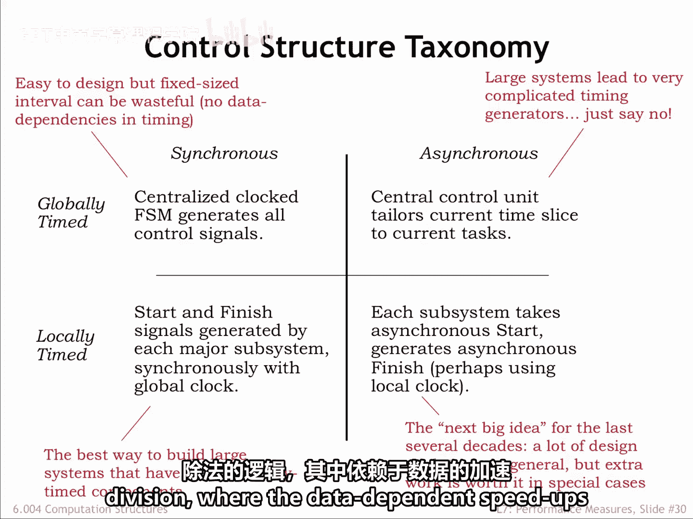
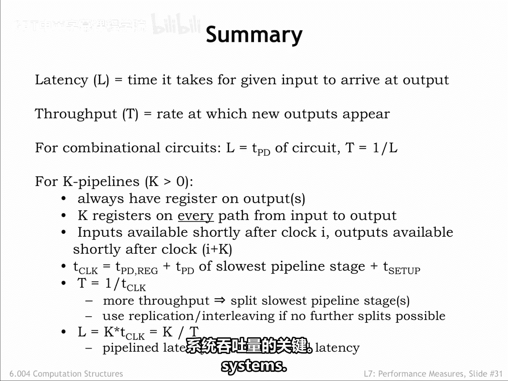

**数字系统与计算机架构：P1：6.4 控制结构总结**

在本节中，我们将总结关于流水线系统控制方法的学习内容。

上一节我们介绍了不同的流水线控制策略，本节中我们来回顾并总结其核心概念与性能衡量。

---

### **流水线控制方法概述**

控制流水线系统最直接的方法是使用一个系统时钟，其周期需适应最坏情况下的处理时间。

这种系统易于设计，但当某些数据值能更快处理时，无法产生更高的吞吐量。

我们了解到，可以使用简单的握手协议在系统中移动数据。

所有通信仍然发生在系统时钟的上升沿，但用于传输数据的具体时钟边沿由各阶段自身决定。

---

### **全局时钟调整的局限性**

人们可能会考虑是否可以通过调整全局时钟来利用数据依赖的处理加速。

但在大型系统中，必要的时序生成器会非常复杂。

通常，使用模块间的本地通信来确定系统时序，比在系统层面解决所有约束要容易得多。

因此，这种方法通常不是好的选择。

---

### **局部定时异步系统**

那么，像我们刚才看到的例子那样的局部定时异步系统呢？

每一代工程师都曾受到异步逻辑的吸引。

遗憾的是，对于大型系统（例如现代计算机），要设计出可靠的设计通常被证明过于困难。

但在某些特殊情况下，例如整数除法逻辑，数据依赖的加速使得额外的工作是值得的。

---

### **系统性能表征**

我们通过测量系统的**延迟**和**吞吐量**来表征其性能。

对于组合电路，延迟就是电路的传播延迟，其吞吐量是延迟的倒数。

我们引入了一种系统性的策略来设计K级流水线。

其中，每个阶段的输出端都有一个寄存器，并且从输入到输出的每条路径上恰好有K个寄存器。

系统时钟周期 **T_clock** 由最慢流水线级的传播延迟决定。

流水线系统的吞吐量是 **1 / T_clock**，其延迟是 **K × T_clock**。

流水线化是提高大多数高性能数字系统吞吐量的关键。

---

### **总结**

本节课中，我们一起学习了流水线系统的不同控制方法，包括固定时钟周期、握手协议以及异步逻辑的局限性。我们明确了使用系统时钟和握手协议的优缺点，并理解了为何全局时钟调整在大型系统中不实用。最后，我们回顾了如何用延迟和吞吐量来量化系统性能，以及流水线化作为提升吞吐量核心技术的原理。