# 067：流水线设计实例分析 🚀

在本节课中，我们将学习如何分析一个组合逻辑电路，并对其进行流水线化改造，以提升其吞吐量。我们将通过一个具体的“最大值比较器”电路实例，逐步理解传播延迟、吞吐量、流水线阶段划分等核心概念。

---

## 电路模块介绍

我们有一个名为 **CBbit** 的模块。该模块接收两个无符号二进制数 **A** 和 **B** 的对应位，以及来自高位 **CBbit** 模块的两个进位输入位 **C_in**。它的输出位 **R** 是 **A** 和 **B** 中较大者的对应位。它还有两个额外的输出位 **C_out**，分别指示到目前为止比较的位中，**A** 是否大于 **B**，或 **B** 是否大于 **A**。

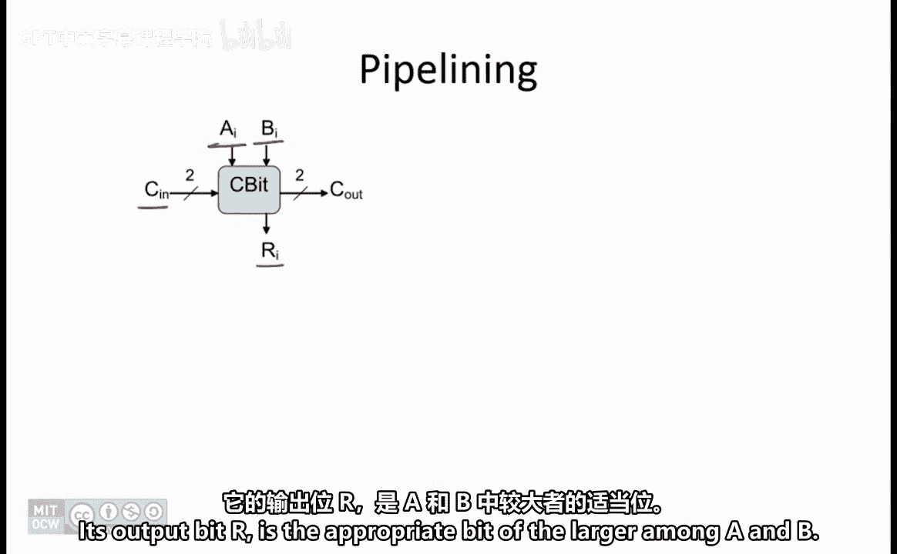

每个 **CBbit** 模块的传播延迟为 **4 纳秒**。

---

## 构建4位最大值比较器

**CBbit** 模块被用来创建一个名为 **Max4** 的组合逻辑器件，该器件用于确定其两个4位无符号二进制输入中的最大值。它由四个 **CBbit** 模块构成，结构如下图所示。

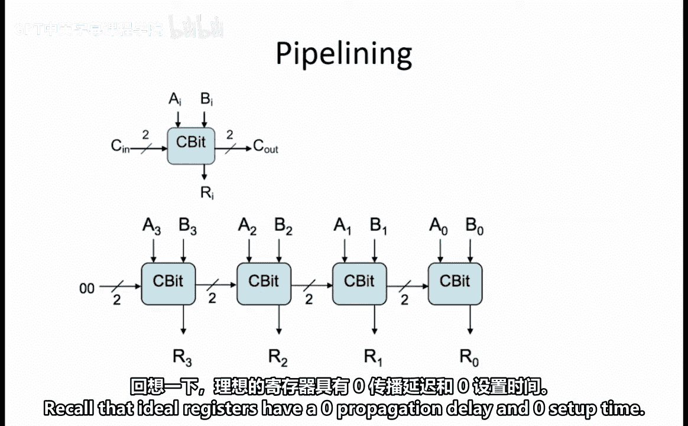

### 传播延迟与吞吐量分析

组合逻辑电路的传播延迟是其从输入到输出的最长路径上的延迟。在本电路中，最长路径需要穿过四个 **CBbit** 模块。由于每个模块的延迟为4纳秒，因此该组合电路的总传播延迟为：

**延迟 L = 4 × 4 ns = 16 ns**

组合逻辑电路的吞吐量是其延迟的倒数，因此该电路的吞吐量为：

**吞吐量 = 1 / 16 ns**

---

### 特殊情况分析：输入相等

接下来我们考虑一个问题：如果输入 **A[3:0]** 和 **B[3:0]** 是相同的数字，那么从最低位 **CBbit** 模块未使用的 **C_out** 输出端，我们预期会看到哪两个比特？

**C_out[1]** 位指示 **A > B**，**C_out[0]** 位指示 **B > A**。由于两个数字相同，这两个不等式均不成立，因此两个 **C_out** 输出都应为 **0**。

---

## 流水线化改造以最大化吞吐量

现在，我们希望对上述电路进行流水线化改造，以获得最大吞吐量。我们为此步骤提供了理想的流水线寄存器（传播延迟和建立时间均为0）。

为了最大化吞吐量，我们希望添加流水线寄存器，将每个独立的 **CBbit** 模块隔离到其自己的流水线阶段中。流水线化时，我们需要在所有输出端添加寄存器。

我们首先在所有四个输出端（R3, R2, R1, R0）画一条分割线，表示在此处添加流水线寄存器。

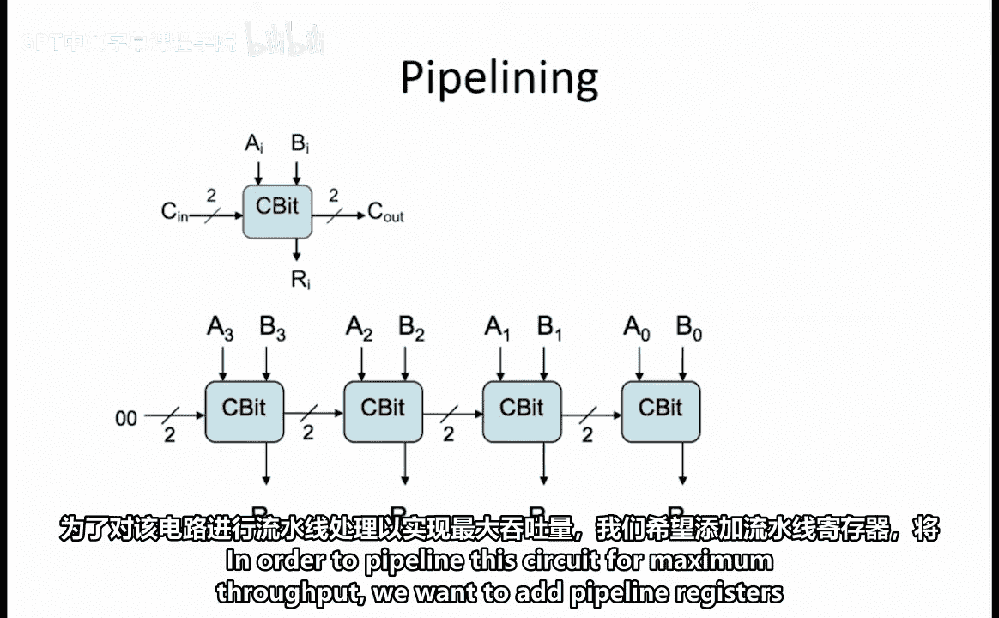

接着，为了隔离最低位的 **CBbit** 模块，我们画另一条分割线。这条线穿过输出 R3、R2、R1，经过两个低位 **CBbit** 模块之间，最后穿过输入 A0 和 B0。

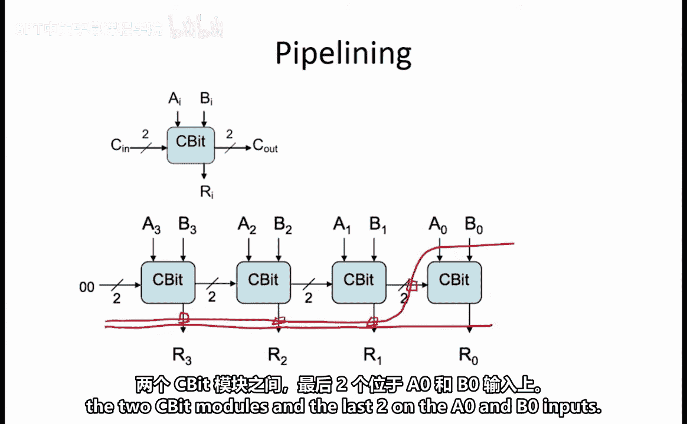

记住，分割线每穿过一条线，就意味着我们在那里添加一个流水线寄存器。这一步总共添加了六个寄存器：分别为 R3、R2、R1 各一个，两个模块之间一个，以及 A0 和 B0 输入各一个。

此时，无论观察哪条从输入到输出的路径，路径上的流水线寄存器数量都是2个。

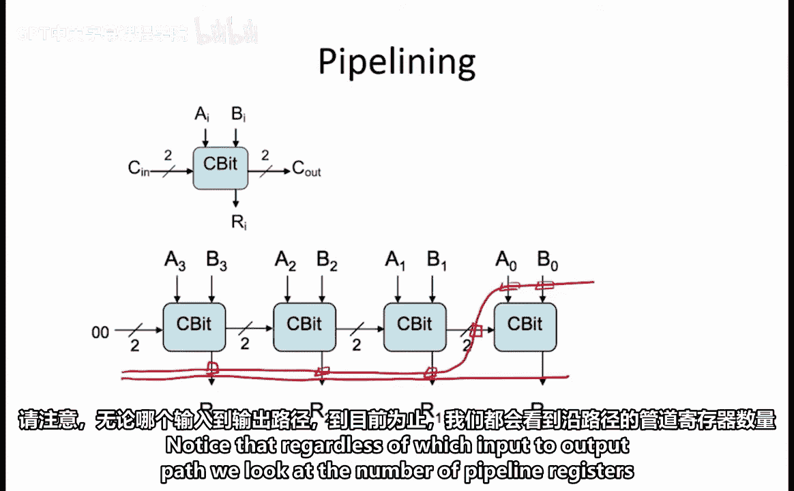

我们继续以这种方式进行，将每个 **CBbit** 模块都隔离到其自己的流水线阶段中。

---

### 流水线电路性能计算

现在每个 **CBbit** 模块都位于自己的流水线阶段，我们可以为此电路计时以获得最大吞吐量。

时钟周期必须为流水线寄存器的传播延迟、**CBbit** 模块的传播延迟以及下一级寄存器的建立时间留出足够时间。由于我们的寄存器是理想的（延迟和建立时间均为0），因此时钟周期等于一个 **CBbit** 模块的传播延迟：

**时钟周期 T = 4 ns**

流水线电路的延迟等于流水线阶段数乘以时钟周期。本例中有4个阶段：

**延迟 L_pipeline = 4 × 4 ns = 16 ns**

流水线电路的吞吐量是时钟周期的倒数：

**吞吐量 = 1 / 4 ns**

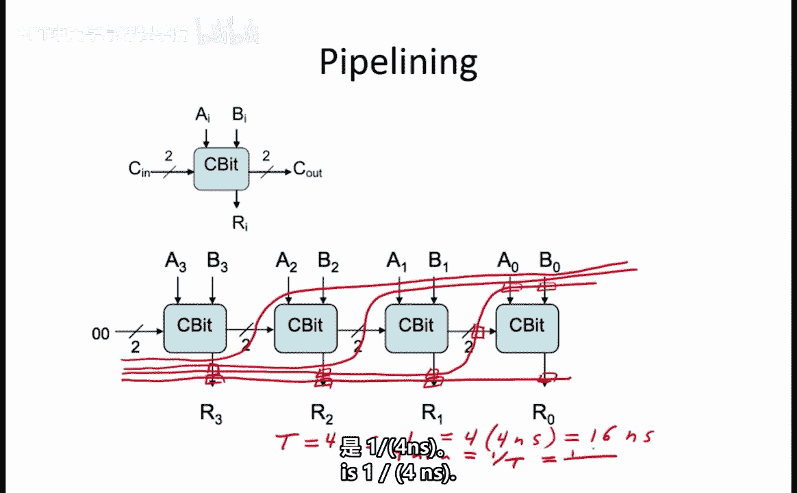

---

## 构建4输入最大值比较器

我们的 **CBbit** 模块还可以用来创建 **Max4x4** 电路，这是一个能确定四个4位二进制输入中最大值的组合电路。

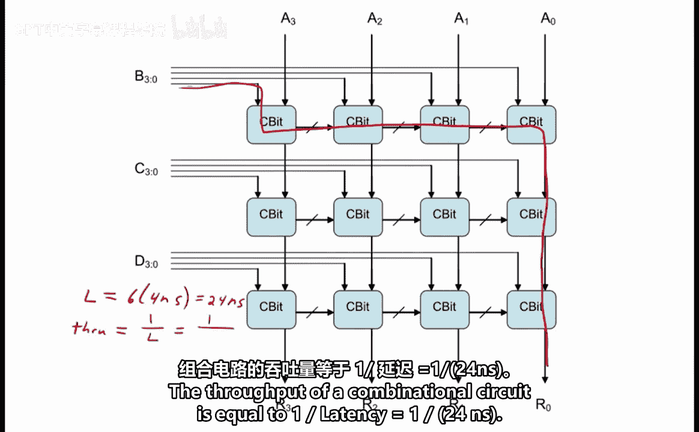

### 新电路的延迟与吞吐量

仔细观察电路，最长路径从左上的 **CBbit** 模块开始，到右下的 **CBbit** 模块结束。沿着这条路径数一数，需要穿过 **6** 个 **CBbit** 模块。

因此，该组合电路的延迟为：

**延迟 L = 6 × 4 ns = 24 ns**

其吞吐量为延迟的倒数：

**吞吐量 = 1 / 24 ns**

---

## 对新电路进行流水线化改造

我们的最终任务是流水线化这个新电路，以获得最大吞吐量。

和之前一样，我们首先在所有输出端画一条分割线。

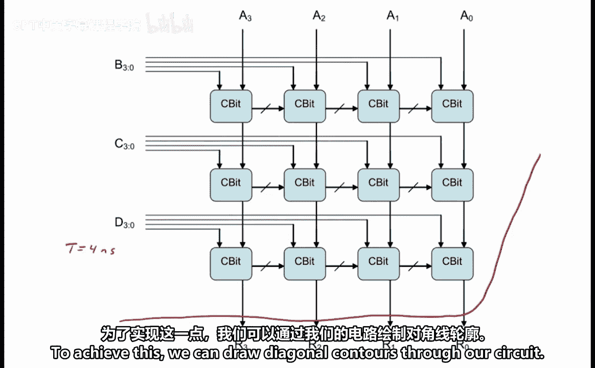

接下来，我们需要规划如何添加剩余的分割线，以使流水线电路的时钟周期最小化。时钟周期必须为寄存器延迟、组合逻辑延迟和建立时间留出时间。由于寄存器是理想的，周期仅等于相邻寄存器间组合逻辑的传播延迟。

为了最小化周期，我们希望每对流水线寄存器之间最多只有一个 **CBbit** 模块。这样可以使周期 **T = 4 ns**。

为了实现这一点，我们可以在电路中画对角线形式的分割线。

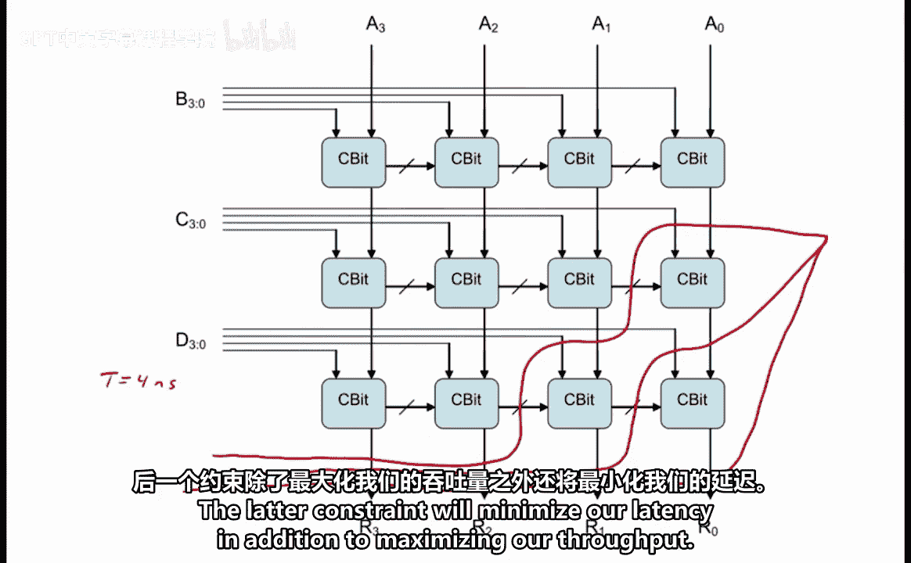

注意，这些分割线确保了任何一对流水线寄存器之间最多只有一个 **CBbit** 模块，同时，在单个流水线阶段内尽可能多地包含了可以并行执行的 **CBbit** 模块。后一个约束在最大化吞吐量的同时，也有助于最小化整体延迟。

此时，无论遵循哪条从输入到输出的路径，都会穿过三个流水线寄存器。

我们继续以这种方式添加流水线阶段，直到每个阶段只包含一个 **CBbit** 模块。

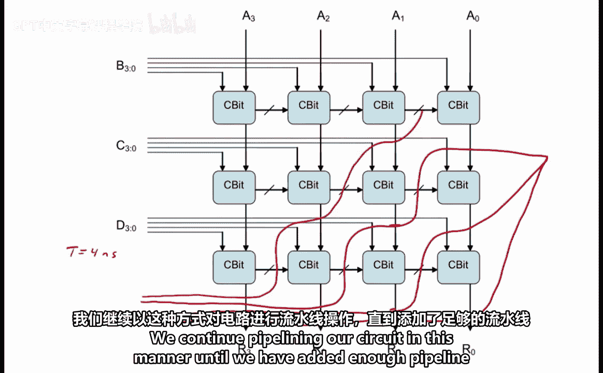

现在，任何从输入到输出的路径都需要穿过六个流水线寄存器，因为我们将电路拆分成了六个流水线阶段，从而分解了最长路径。

我们可以用 **T = 4 ns** 的周期来驱动这个电路。

因此，流水线化后的延迟为：

**延迟 L_pipeline = 6 × 4 ns = 24 ns**

吞吐量为：

**吞吐量 = 1 / 4 ns**

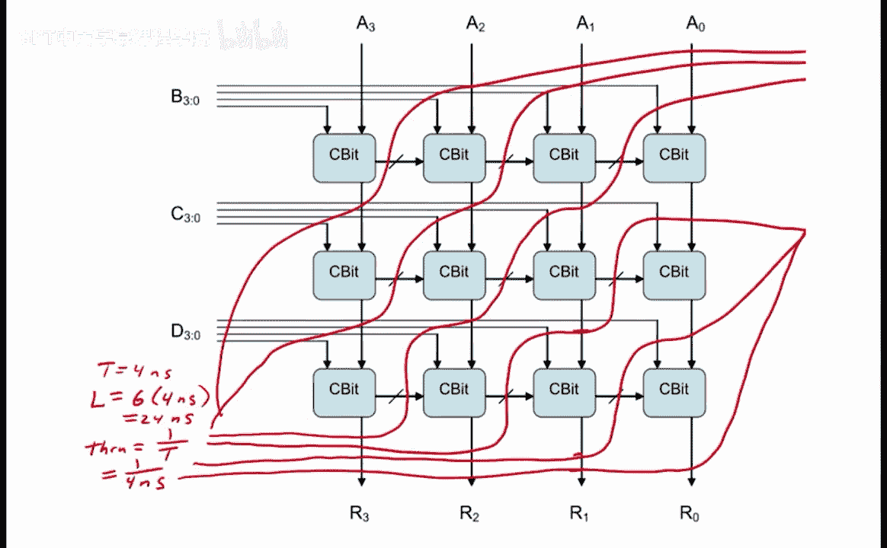

---

## 总结 📝

本节课中，我们一起学习了：
1.  分析组合逻辑电路的**传播延迟**和**吞吐量**。
2.  通过添加流水线寄存器对电路进行**流水线化改造**。
3.  计算流水线化后的**时钟周期**、**延迟**和**吞吐量**。
4.  掌握了通过画分割线来规划流水线阶段，以在**最小化时钟周期**（最大化吞吐量）和**控制总延迟**之间取得平衡的方法。

关键要点是：流水线化通过将长组合路径拆分为多个较短的、由寄存器分隔的阶段，允许电路以更高的频率（更短的周期）运行，从而显著提升吞吐量，尽管总延迟可能因寄存器开销而略有增加或保持不变。