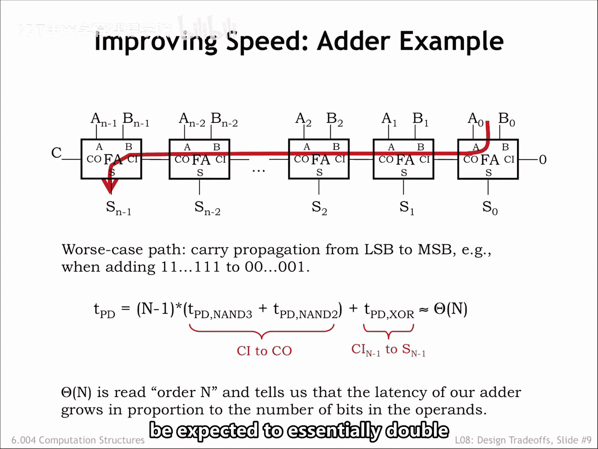
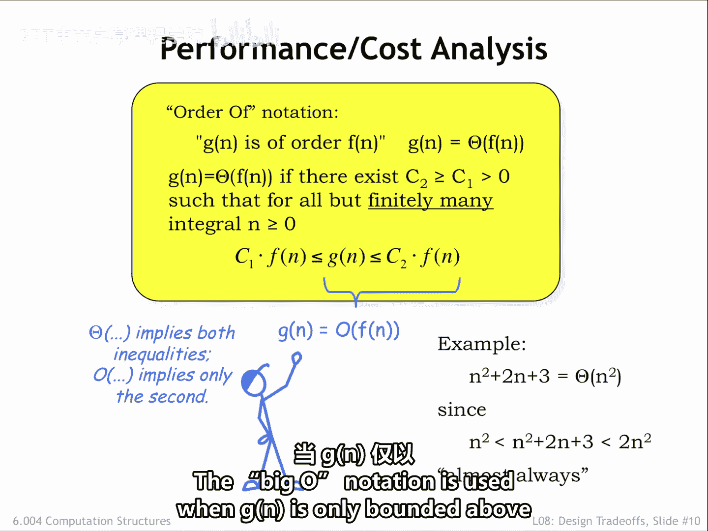
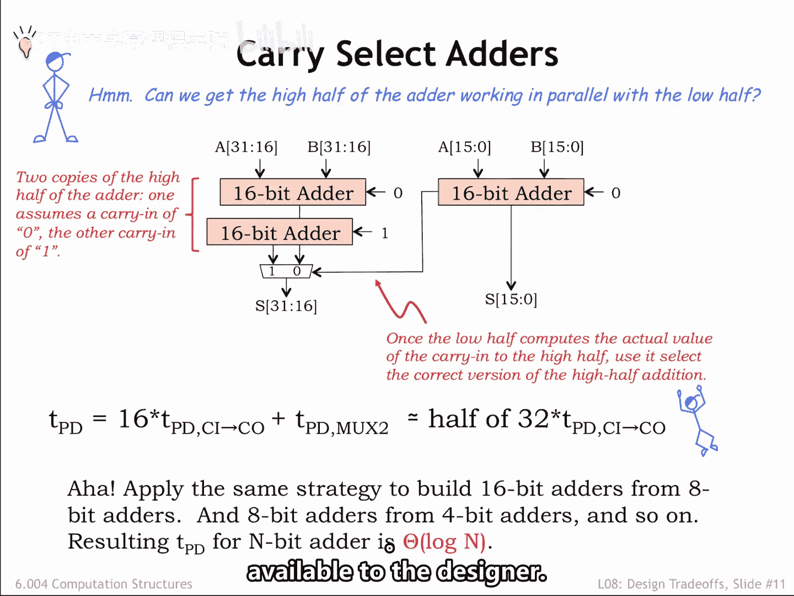
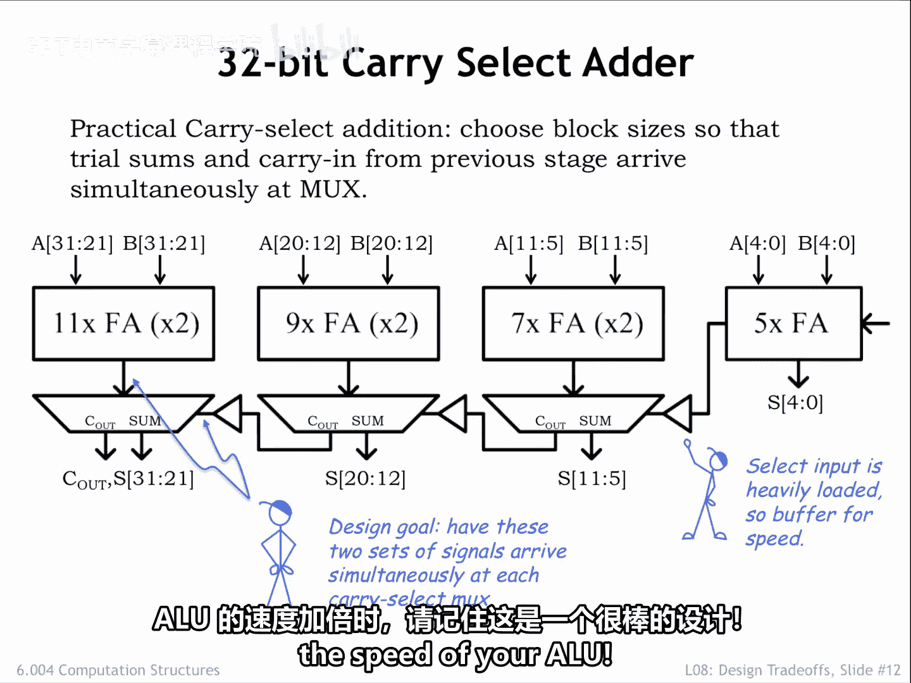

# 数字系统与计算机架构：P1：进位选择加法器 🧮

在本节课中，我们将要学习如何通过改进电路设计来提升加法器的性能。我们将从分析一个性能瓶颈——行波进位加法器开始，然后介绍一种名为“进位选择加法器”的优化方案，它能显著降低加法操作的延迟。

## 性能瓶颈分析

提升性能最直接的方法是减少电路的传播延迟。让我们来看一个常见的性能瓶颈：行波进位加法器。

为了改进它，我们首先需要找出从输入到输出具有最大传播延迟的路径，也就是决定整体 `TPD` 的路径。在这个例子中，这条路径就是贯穿每个全加器模块的、从进位输入到进位输出的长进位链。

为了触发这条路径，我们可以设置 A 输入全为 1，B 输入除最低位为 1 外全为 0，从而计算 `-1 + 1`。最终结果是 0，但请注意，每个全加器都必须等待前一级的进位输入，才能在其和输出端产生 0，并为下一个全加器生成进位输出。进位确实像波浪一样在电路中传播，每个全加器依次完成自己的工作。

这条路径上的总传播延迟是 `(n-1)` 乘以每个全加器从进位输入到进位输出的延迟，再加上产生最终和值的延迟。

## 大 O 表示法 📈

如果我们把操作数的大小（即 N）增加一倍，整体延迟会如何变化？使用大 O 表示法来总结延迟对 N 的依赖关系，有助于我们把握宏观趋势。显然，随着 N 增大，末尾异或门的延迟变得不那么重要，因此大 O 表示法会忽略随着 N 增长而相对不重要的项。

在这个例子中，延迟是 `O(n)`，这告诉我们，如果 N 增大一倍，延迟预期也会大致翻倍。

大 O 表示法（理论家称之为渐近分析）告诉我们随着 N 增长，哪个项将主导结果。黄色方框包含了正式定义，但一个例子可能更容易理解。

假设我们想描述方程 `n² + 2n + 3` 的值随着 n 增大的增长情况。主导项显然是 `n²`，并且除了有限个 n 值外，我们方程的值被 `n²` 的简单倍数上下限所界定。对于 `n ≥ 0`，下限总是成立。而在本例中，上限仅在 `n = 0, 1, 2, 3` 时不成立，对于所有其他正 n 值，上限不等式都成立。因此，我们说这个方程是 `O(n²)`。

实际上大 O 表示法有两种变体：我们使用 `Θ` 符号表示 `G(n)` 被 `F(n)` 的倍数上下界所限定；使用 `O` 符号表示 `G(n)` 仅被 `F(n)` 的倍数上界所限定。

## 进位选择加法器设计思路 💡

上一节我们分析了行波进位加法器的延迟问题，本节中我们来看看如何改进。行波进位加法器的问题在于，高位必须等待来自低位的进位输入。我们能否让加法器的高半部分与低半部分并行工作呢？

假设我们要构建一个 32 位加法器。让我们制作两个高 16 位加法器的副本：一个假设来自低位的进位输入是 0，另一个假设进位输入是 1。这样，我们现在有三个 16 位加法器，它们都可以在新到达的 A 和 B 输入上并行操作。

一旦 16 位加法完成，我们就可以使用低半部分产生的实际进位输出来选择那个使用了匹配进位输入值的高半部分加法器的答案。这种类型的加法器被恰当地命名为“进位选择加法器”。

这个进位选择加法器的延迟仅比一个 16 位行波进位加法器的延迟多一点。这大约是原始 32 位行波进位加法器延迟的一半。因此，以增加约 50% 的电路为代价，我们将延迟减半。

作为下一步，我们可以应用相同的策略来降低 16 位加法器的延迟，然后再降低上一步中使用的 8 位加法器的延迟。每一步，我们都将加法器延迟减半，并增加一个多路选择器的延迟。经过 `log₂(N)` 步后，N 将为 1，我们就完成了。此时，延迟将是一个执行 1 位加法的常数开销，加上 `log₂(n)` 乘以选择正确答案的多路选择器延迟。

因此，进位选择加法器的整体延迟是 `O(log n)`。注意，`log₂(n)` 和 `log n` 仅相差一个常数因子，因此在大 O 表示法中我们忽略对数的底数。进位选择加法器展示了设计者可用的一个清晰的性能与面积权衡。

## 优化设计实例 🛠️

由于加法器在许多数字系统中扮演重要角色，这里展示一个经过更精心设计的 32 位进位选择加法器版本。你可以在你的 ALU 设计中尝试它。

加法器模块的大小经过选择，使得试算和与前一级的进位输入大约同时到达进位选择多路选择器。请注意，由于多路选择器的选择信号负载较重，我们加入了一个缓冲器来加快选择信号的转换速度。

这个进位选择加法器比 32 位行波进位加法器快约 2.5 倍，代价是电路规模大约增加一倍。当你想让你的 ALU 速度翻倍时，这是一个值得记住的优秀设计。

---

本节课中我们一起学习了如何通过分析关键路径来识别性能瓶颈，并引入了大 O 表示法来量化延迟与输入规模的关系。我们重点介绍了进位选择加法器的设计原理，它通过并行计算不同进位假设下的结果，并用实际进位进行选择，从而将加法延迟从 `O(n)` 降低到 `O(log n)`，实现了显著的性能提升，同时展示了数字设计中典型的性能与面积权衡。