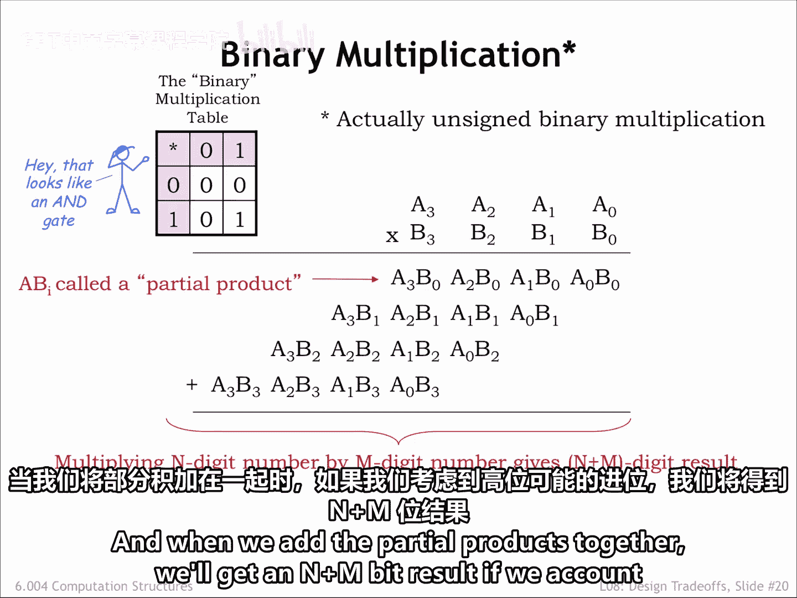
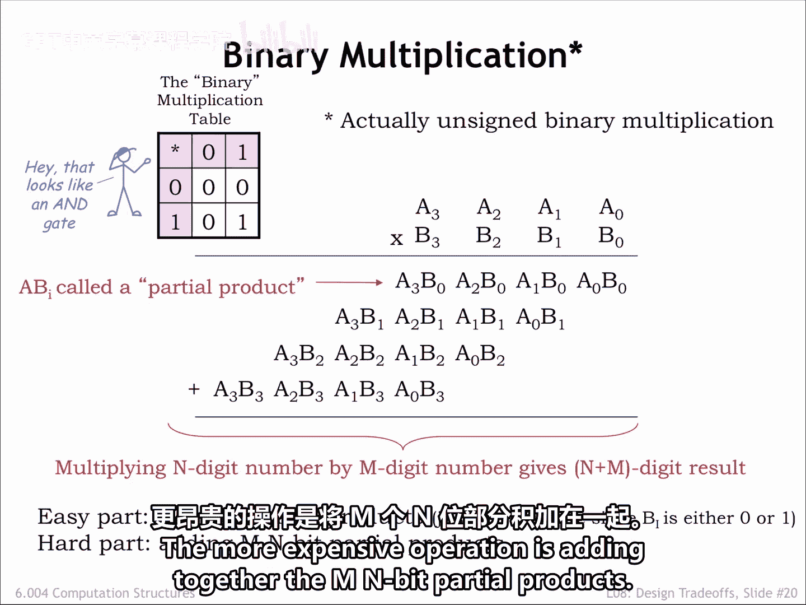
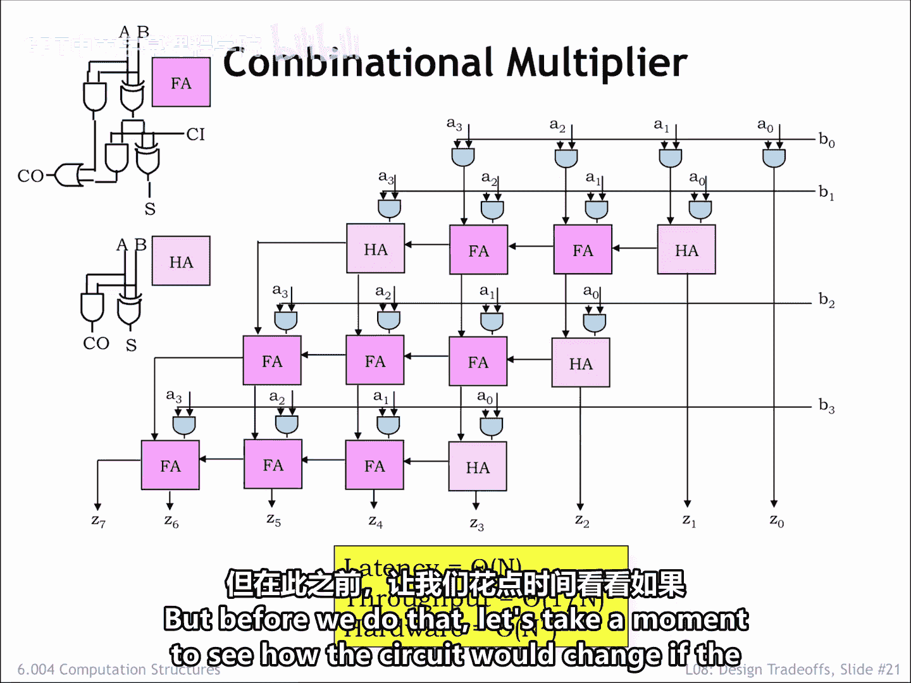
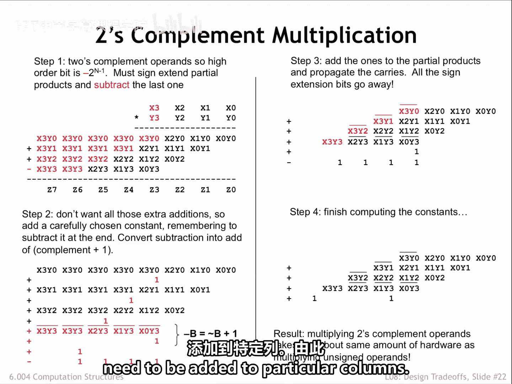
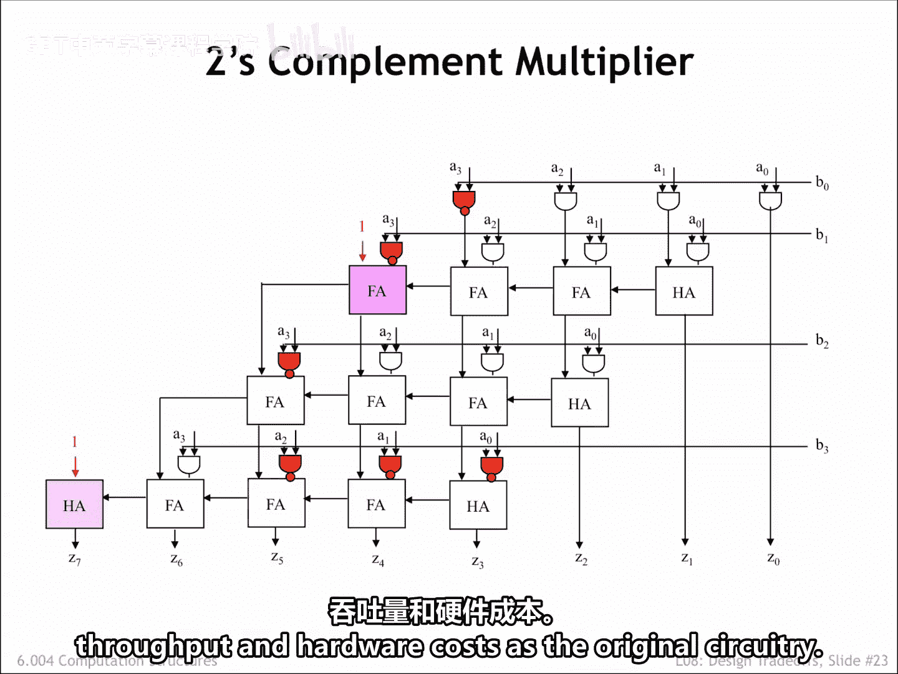

# 072：8.2.4 二进制乘法 🧮

在本节课中，我们将要学习二进制乘法的硬件实现原理。我们将从最直观的实现方式开始，然后探讨如何通过权衡来优化其面积或速度。

算术逻辑单元中最大、最慢的电路之一就是乘法器。我们将首先开发一个直接的实现方案，然后在下一节中，探讨如何通过权衡来使其变得更小或更快。

## 乘法运算的原理

以下是两个无符号二进制操作数的乘法运算，被分解为其基本操作步骤。这和我们小学时学习乘法的方式完全一样。

我们取乘数（B操作数）的每一位，利用我们记忆中的乘法表，将其与被乘数（A操作数）的每一位相乘。在从右向左处理被乘数的过程中，处理任何可能产生的进位。这一步的输出被称为**部分积**。

然后，我们对乘数的剩余位重复此步骤。每个部分积都向左移动一位，这反映了乘数各位权重的增加。

在我们的例子中，数字是单个比特，即0或1，因此乘法表非常简单。事实上，一位二进制乘法电路就是一个两输入的**与门**。并且，这里没有进位。由于没有进位，部分积的宽度为N位。如果乘数有M位，就会有M个部分积。当我们把这些部分积相加时，如果考虑到最高位可能产生的进位，我们将得到一个N+M位的结果。

**公式：** 部分积 = A × B[i] （其中i是乘数的第i位）

## 乘法器的电路实现

乘法运算中简单的部分是生成部分积，这只需要一些与门。更昂贵的操作是将M个N位的部分积相加。

以下是实现4位乘4位乘法所需的组合逻辑电路图。这个设计很容易扩展到更大的乘法器：对于更大的乘数，我们需要更多的行；对于更大的被乘数，我们需要更多的列。

*   M × N 个两输入与门用于计算M个部分积的各个比特。
*   加法器模块将当前行的部分积与之前所有行的部分积之和相加。

实际上，这里有两种类型的加法器模块：当模块需要三个输入时使用**全加器**；当只需要两个输入时使用更简单的**半加器**。

这个电路中最长的路径需要仔细分析。信息总是向下移动一行，或者向左移动到相邻的列。由于有M行，并且在任何特定的行和列中，从输入到输出的任何路径上最多有N+M个模块，因此电路的**延迟**是O(N)量级的（因为M和N只相差一个常数因子）。由于这是一个组合电路，其**吞吐量**就是延迟的倒数。而**硬件总量**是O(N²)量级的。

在下一节中，我们将研究如何降低硬件成本，或者如何提高吞吐量。

## 有符号数的乘法

但在我们继续之前，让我们花点时间看看，如果操作数是二进制补码整数而不是无符号整数，电路将如何改变。

对于二进制补码的乘数和被乘数，它们各自的最高位具有负的权重。因此，在将部分积相加时，我们需要将每个M位的部分积进行**符号扩展**到加法所需的完整N+M位宽度，以确保在进行加法时，负的部分积能被正确处理。

当然，由于乘数的最高位具有负权重，我们需要**减去**而不是加上最后一个部分积。现在，我们进行一些巧妙的变换：我们会在某些列上先加上一些值，然后再减去它们，目的是消除所有由符号扩展引起的额外加法。我们还将最后一个部分积的减法重写为：先对该部分积取反，然后再加1。

这听起来有些神秘，但经过一系列代数变换后，我们得到了最终需要完成的工作表。令人惊讶的是，这与原始的无符号乘法表没有太大不同。只有少数部分积的比特需要取反，并且有两个“1”需要加到特定的列中。

由此产生的电路如图所示。我们将一些与门改为了与非门以执行必要的取反操作，并修改了逻辑来处理需要加入的两个“1”。彩色元素显示了相对于原始无符号乘法器电路所做的更改。

基本上，用于乘法二进制补码操作数的电路，其延迟、吞吐量和硬件成本与原始电路相同。

## 总结

本节课中，我们一起学习了二进制乘法的硬件实现。我们从无符号数的乘法原理出发，构建了对应的组合逻辑电路，并分析了其延迟和硬件复杂度。接着，我们探讨了如何将该电路适配用于有符号的二进制补码乘法，通过巧妙的代数变换，最终发现其电路复杂度与无符号乘法器基本相同。在下一节中，我们将探讨如何优化这个乘法器。