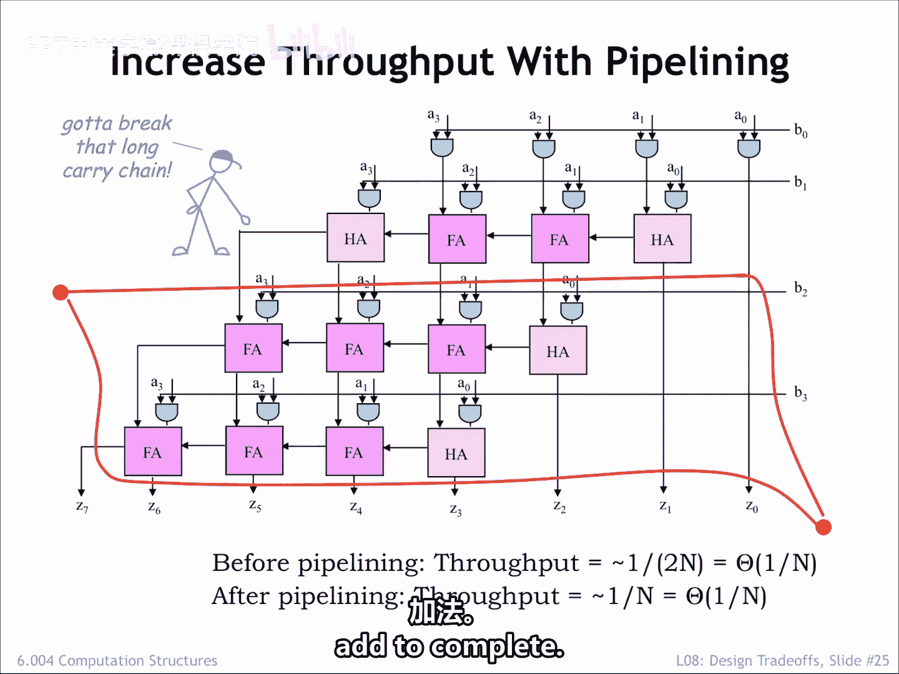
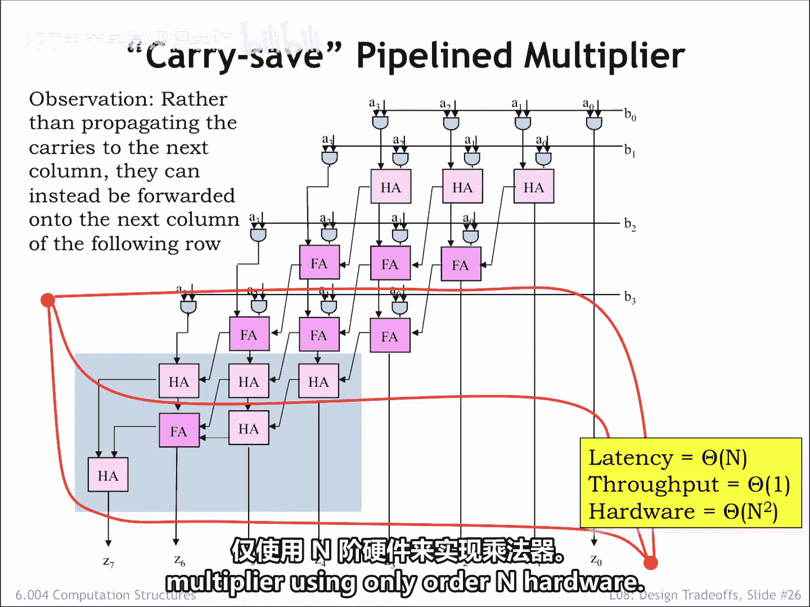
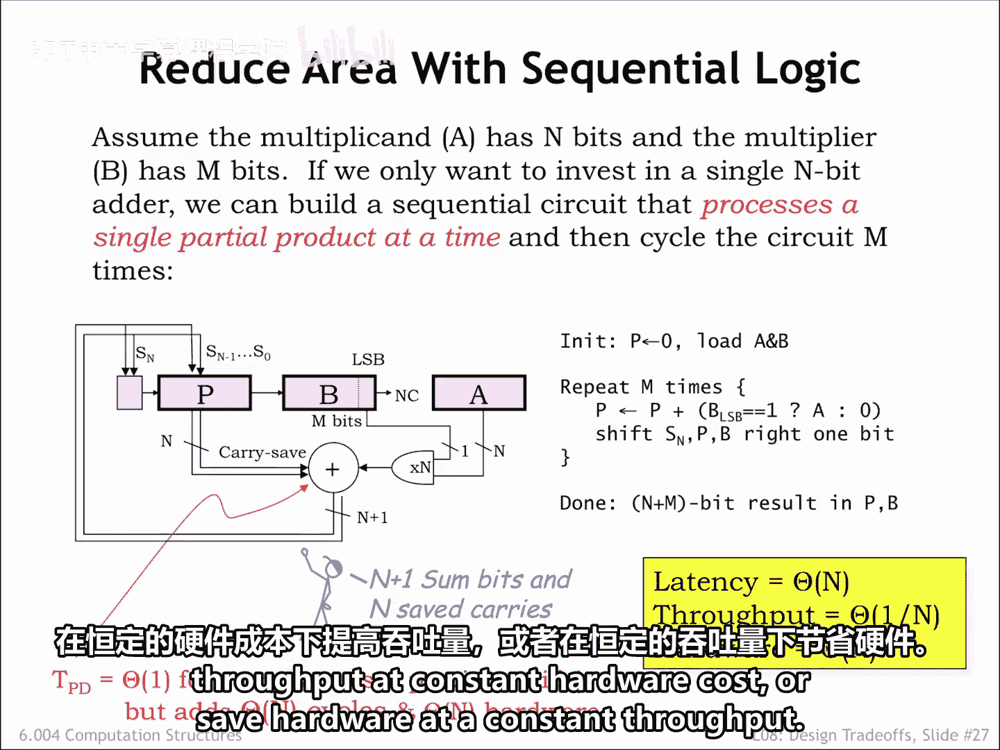

# 073：6.004 2017 第73讲 8.2.5 乘法器设计权衡

在本节课中，我们将学习如何改进原始组合逻辑乘法器的设计，重点关注如何通过流水线技术和进位保留加法器来权衡吞吐量、延迟和硬件成本。

## 概述

我们将分析原始组合乘法器的性能瓶颈，并探索两种优化策略：一种是使用流水线技术来显著提高吞吐量，另一种是采用顺序逻辑设计来大幅降低硬件成本。核心在于理解**进位传播**是限制性能的关键，并学习如何利用**进位保留加法**技术来克服它。

## 原始设计的瓶颈

原始的组合逻辑乘法器设计，其关键路径延迟与操作数的位数 `N` 成正比。这是因为每一行的加法操作中，进位信号需要从最低有效位串行传播到最高有效位。因此，其吞吐量（即每单位时间能完成的乘法运算次数）约为 `1/(2N)`。

上一节我们介绍了原始设计的性能限制，本节中我们来看看如何通过流水线技术来改进它。

## 流水线优化：提高吞吐量

我们的目标是使用流水线规划流程，将计算过程划分为多个阶段，以期获得更小的时钟周期和更高的吞吐量。

以下是实施流水线优化的步骤：

1.  **初始划分**：首先在所有输出端画一条轮廓线，这创建了一个单级流水线。但这并未改善吞吐量。
2.  **进一步划分**：添加另一条轮廓线，将计算大致分成两半。如果方向正确，我们期望看到吞吐量提升。确实，吞吐量实现了翻倍。
3.  **根本性瓶颈**：然而，优化前后的吞吐量都仍然是 `O(1/N)` 量级。只要一整行加法器位于同一个流水线阶段内，该阶段的延迟就仍然是 `O(N)`，因为必须为进位信号的逐位传播留出时间。

为了获得突破性的改进，我们需要一个关键洞察：必须打破长进位链。

### 打破进位链的技术

有几种方法可以解决这个问题。这里演示的技术在我们接下来的任务中会很有用。

在这个示意图中，我们重新组织了进位链。进位输出仍然连接到左侧一列的模块，但在这个设计中，是连接到下方一行的模块。因此，所有需要在特定列进行的加法仍然在该列完成，我们只是重组了由哪一行来执行加法。

让我们对这个修订后的示意图进行流水线划分，创建延迟大约相当于两个模块传播延迟的阶段。

*   **水平轮廓线**现在切断了长的进位链。
*   **阶段延迟**现在变为常数，与 `N` 无关。

需要注意的是，我们必须增加大约 `O(N)` 个额外的行来处理进位一直传播到最后的问题，这些额外的电路在图中以灰色框显示。

为了在每个阶段实现与 `N` 无关的延迟，我们需要大约 `O(N)` 条轮廓线（即 `O(N)` 个流水线阶段）。这意味着：
*   **时钟周期**现在是常数，记为 `O(1)`。
*   **吞吐量**也因此是 `O(1)`，与 `N` 无关。
*   **系统总延迟**因为有 `O(N)` 个阶段，所以是 `O(N)`。
*   **硬件成本**仍然是 `O(N²)`。

因此，流水线进位保留乘法器相比原始电路，吞吐量得到了显著提升。这是我们未来可以记住的另一种设计权衡。我们将在下一个优化中使用进位保留技术。

## 顺序乘法器：降低硬件成本

现在，我们来看看另一种优化方向：如何仅使用 `O(N)` 的硬件来实现乘法器。

这个顺序乘法器设计在每个时钟周期计算一个部分积，并将其累加到当前的和中。完成整个乘法运算需要 `O(N)` 个步骤。

在每个步骤中：
1.  从 `B` 寄存器的最低有效位取出乘数的下一个比特。
2.  该比特与被乘数相与，形成下一个部分积。
3.  该部分积被送入一个 `N` 位的进位保留加法器，与 `P` 寄存器中累积的和相加。
4.  `P` 寄存器的值和加法器的输出都是进位保留格式。这意味着除了 `N` 个数据位，还有 `N-1` 个“保留的进位”需要在下一个周期加到相应的列上。
5.  加法器的输出保存回 `P` 寄存器。
6.  为下一步做准备，`P` 和 `B` 寄存器都右移一位。这样，累积和的一个比特就被“退休”到 `B` 寄存器的高位部分，因为它不会再被剩余的部分积影响。

可以这样理解：我们不是将部分积左移来匹配当前乘数比特的权重，而是将累积和右移。

这种设计的关键优势在于：
*   **时钟周期**可以非常小，更重要的是，它与 `N` **无关**。由于没有进位传播，进位保留加法器的延迟极小，仅相当于一个全加器模块的操作时间。
*   **总延迟**：经过大约 `N` 步生成所有部分积后，还需要大约 `N` 步来完成进位保留加法器中进位的最终传播。因此，总延迟仍然是 `O(N)`。
*   **吞吐量**：在 `2N` 步结束后，答案组合在 `P` 和 `B` 寄存器中产生，所以吞吐量是 `O(1/N)`。
*   **硬件成本**：最大的变化在于硬件成本降至 `O(N)`，这相比原始组合乘法器的 `O(N²)` 成本是一个巨大的改进。

## 总结

本节课中我们一起学习了乘法器设计的几种权衡方案。我们看到，通过一些巧妙的设计，我们可以创造出具有 `O(1)` 吞吐量的设计，也可以创造出仅需 `O(N)` 硬件成本的设计。

**进位保留加法**技术在许多场景下都很有用。它的应用可以在硬件成本不变的情况下提高吞吐量，或者在吞吐量不变的情况下节省硬件成本。理解这些基本权衡对于计算机架构设计至关重要。