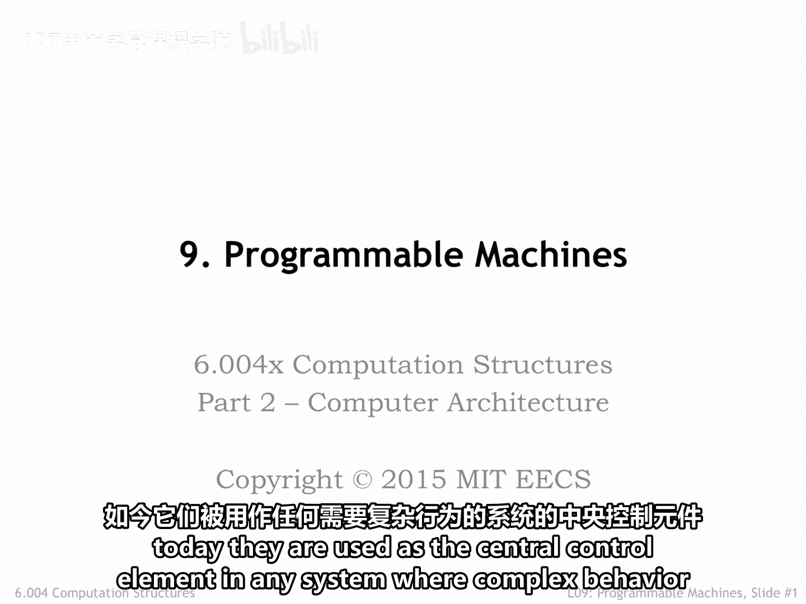
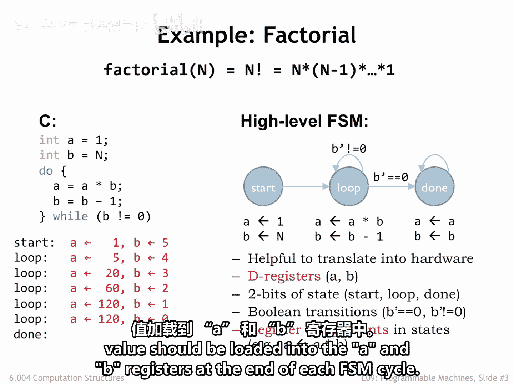
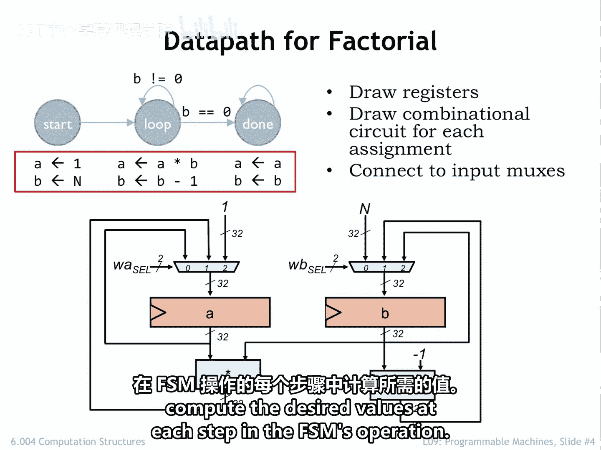
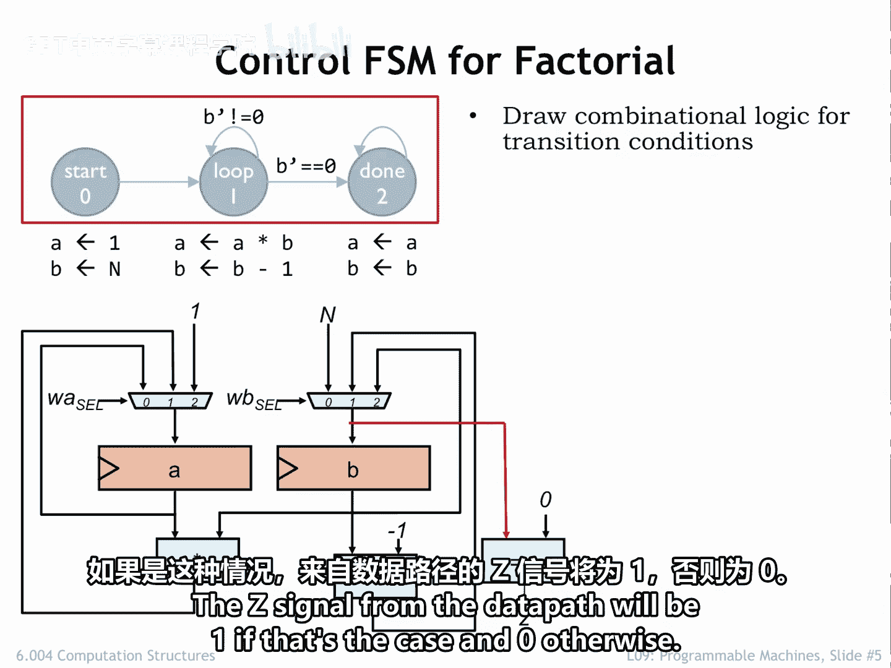
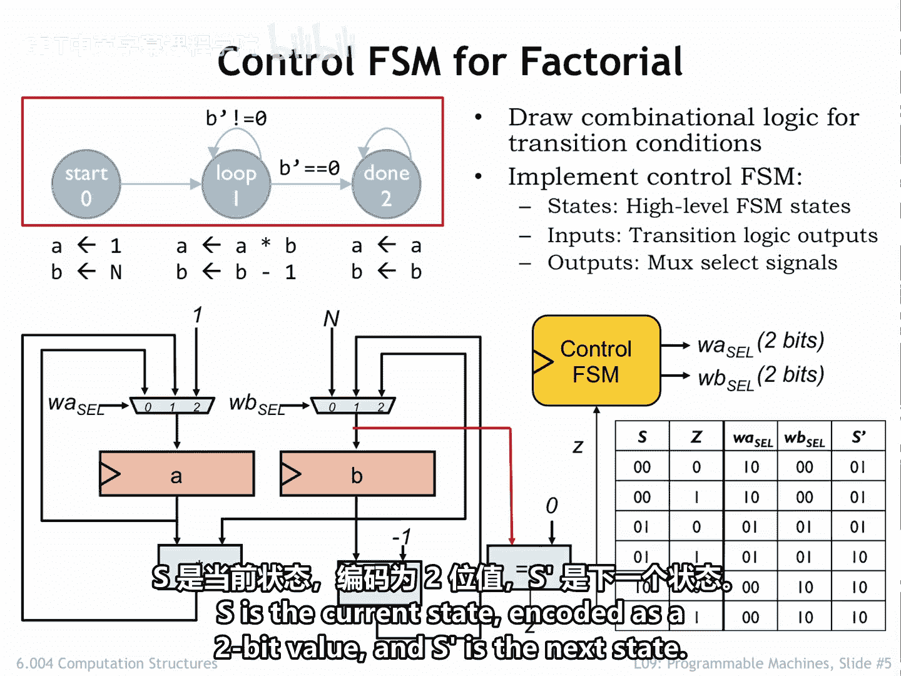
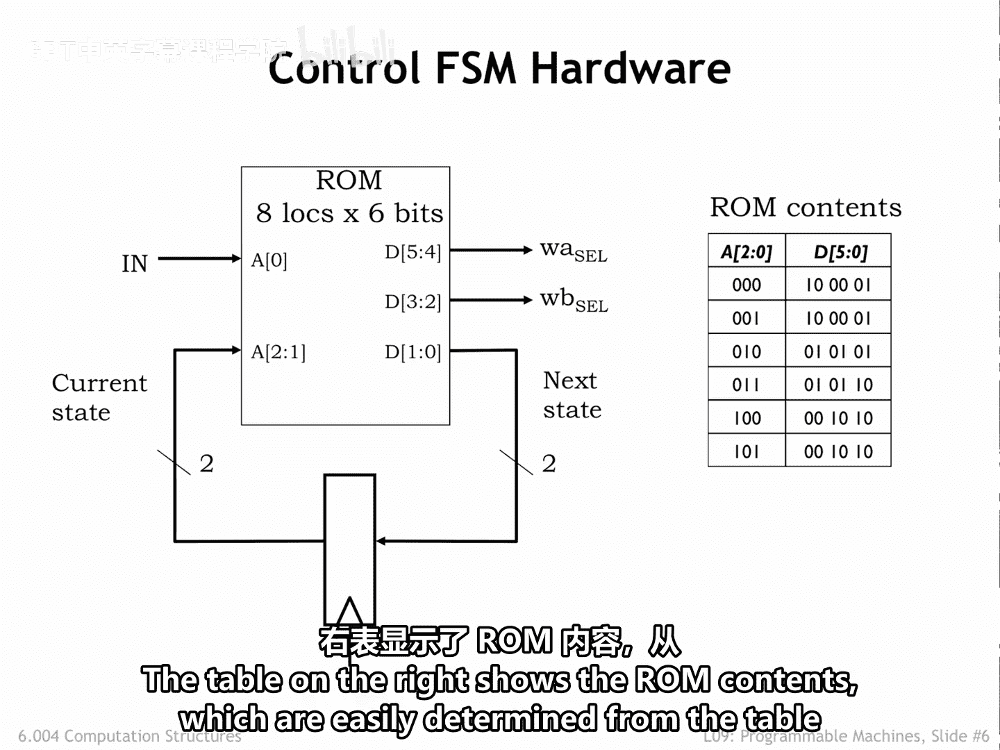

# 075：数据通路与有限状态机

欢迎来到6.004课程的第二部分。在本部分课程中，我们将注意力转向数字系统的设计与实现，这些系统能够对不同类型的二进制数据执行有用的计算。我们将为这些系统提出一个通用的设计，我们称之为计算机，以便它们能够在许多不同的应用领域中作为有用的工具。

计算机最初用于科学与工程领域的数值计算。但如今，它们被用作任何需要复杂行为的系统中的中央控制元件。

在本章中，我们有很多内容要学习。让我们开始吧。

## 设计目标：阶乘计算系统

假设我们想设计一个系统来计算某个数值参数N的阶乘函数。N的阶乘定义为N乘以N-1乘以N-2，依此类推直到1。

我们可以使用像C这样的编程语言来描述执行阶乘计算所需的一系列操作顺序。在这个程序中，有两个变量：A和B。A用于在我们逐步计算答案时累积结果。B用于保存下一个需要相乘的值。B从数值参数N的值开始。do循环是完成工作的地方，在每次循环迭代中，我们执行阶乘公式中的一个乘法，用结果更新累加器A的值，然后递减B的值，为下一次循环迭代做准备。

## 高级有限状态机设计

如果我们想实现一个执行该操作序列的数字系统，使用时序逻辑是合理的。下图是一个高级有限状态机的状态转移图，它被设计为以期望的顺序执行必要的计算。

我们称之为高级FSM，因为每个状态的输出不仅仅是简单的逻辑电平，而是指示要对源变量执行的操作的公式，并将结果存储在目标变量中。FSM运行时访问的状态序列反映了C程序执行所执行的步骤。

FSM重复循环状态，直到要存入B的新值等于0，此时FSM转换到最终的完成状态。

## 构建数据通路

高级FSM在设计使用数字逻辑构建块实现所需计算的电路时非常有用。我们将使用32位D寄存器来保存A和B的值。我们还需要一个2位D寄存器来保存当前状态的2位编码，即起始、循环或完成状态的编码。我们将包含逻辑来计算实现正确状态转换所需的输入。在本例中，我们需要知道B的新值是否为0。最后，我们需要逻辑来执行乘法和递减操作，并选择在每个FSM周期结束时应加载到A和B寄存器中的值。

让我们从设计实现所需计算的逻辑开始。我们称这部分逻辑为数据通路。

首先，我们需要两个32位D寄存器来保存A和B的值。然后，我们将绘制计算要存储在这些寄存器中的值所需的组合逻辑块。

在起始状态，我们需要将常量1加载到A寄存器，将常量N加载到B寄存器。

在循环状态，我们需要为A寄存器计算A乘以B，为B寄存器计算B减1。

最后，在完成状态，我们需要能够用其当前值重新加载每个寄存器。

我们将使用多路复用器来选择要加载到每个数据寄存器中的适当值。这些多路复用器由2位选择信号控制，这些信号选择三个32位输入值中的哪一个将成为要加载到寄存器中的32位值。

因此，通过为WA_sel和WB_sel选择适当的值，我们可以使数据通路在FSM操作的每一步计算所需的值。

## 添加控制逻辑

接下来，我们将添加控制FSM状态转换所需的组合逻辑。在本例中，我们需要测试要加载到B寄存器的新值是否为0。数据通路的Z信号在这种情况下为1，否则为0。

现在，我们可以添加控制FSM的硬件了，它有一个来自数据通路的输入Z，并生成两个2位输出WA_sel和WB_sel来控制数据通路。

## 有限状态机真值表与实现

这是FSM组合逻辑的真值表。S是编码为2位值的当前状态，S_prime是下一个状态。

利用我们在课程第一部分学到的技能，我们准备好绘制系统的原理图。我们知道如何设计适当的乘法器和递减电路，并且可以使用标准的寄存器和ROM实现来控制FSM。来自数据通路的Z信号与2位当前状态组合，形成组合逻辑的三个输入。在本例中，组合逻辑由一个具有2^3（即8）个位置的只读存储器实现。

每个ROM位置都有六个输出位的适当值，WA_sel、WB_sel和下一个状态各占2位。右侧的表格显示了ROM内容，这些内容很容易从前一页的表格中确定。

## 总结

在本节课中，我们一起学习了如何设计一个计算阶乘的数字系统。我们从高级C程序描述开始，将其转换为高级有限状态机。然后，我们详细设计了系统的两个主要部分：执行算术运算的数据通路，以及控制操作顺序和选择正确数据路径的有限状态机控制器。最后，我们展示了如何将整个系统实现为使用寄存器、组合逻辑块和ROM的数字电路。这种数据通路加控制器FSM的设计模式是构建复杂数字系统（包括计算机）的基础。