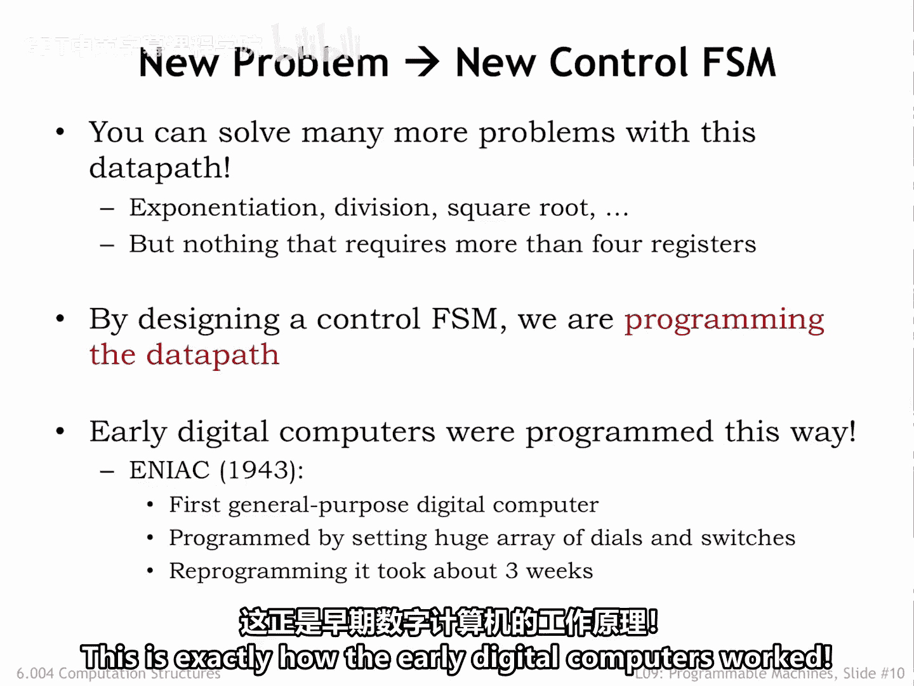

# 076：可编程数据通路

在本节课中，我们将学习如何设计一个通用的硬件系统，使其能够通过编程来解决多种不同的问题。我们将从专用计算电路的设计思路出发，探讨如何构建一个可编程的数据通路，并理解其背后的控制逻辑。

## 概述

我们之前已经找到了一种设计硬件来执行特定计算的方法。首先，绘制一个有限状态机（FSM）的状态转移图，以描述完成计算所需的一系列操作序列。接着，使用寄存器存储数值，并结合组合逻辑来实现所需操作，从而构建出合适的数据通路。最后，构建一个FSM来生成数据通路所需的控制信号。

那么，数据通路加上控制逻辑本身是否构成一个FSS？答案是肯定的。它包含寄存器和一些组合逻辑，因此它本身就是一个FSM。理论上，我们可以为其绘制真值表，但在实践中，由于存在大量寄存器状态（例如66位），真值表的行数将高达2的66次方，这在实际中是不可行的。

这种困难源于将寄存器和数据通路视为一个“超级FSM”状态的一部分。因此，我们通常将数据通路与控制FSM分开考虑。

## 构建通用数据通路

上一节我们介绍了专用电路的设计方法，本节中我们来看看如何将这种方法通用化，以便使用一个计算机电路来解决许多不同的问题。

大多数问题可能需要更多的操作数和结果存储空间，同时，一个更大的允许操作列表也会非常有用。这实际上有些棘手，我们需要确定一个最小操作集合。正如我们稍后将看到的，令人惊讶的是，非常简单的硬件就足以执行任何可实现的运算。

在另一个极端，许多复杂操作（例如快速傅里叶变换）最好通过一系列更简单的操作（例如加法和乘法）来实现，而不是作为一个单一的大型组合电路。这类设计权衡正是计算机架构的乐趣所在。

我们将更大的存储空间与我们选定操作集合的逻辑结合起来，形成一个通用数据通路，该通路可以重复用于解决许多不同问题。

以下是其工作原理。这里展示了一个包含四个数据寄存器的数据通路，用于保存结果。A选路器和B选路器允许选择任意数据寄存器作为算术和布尔运算的操作数。运算结果由Op选路器选择，并且可以通过将正确的写使能控制信号设置为1，并使用2位W选路信号来选择在下一个时钟上升沿加载哪个数据寄存器，从而写回任意数据寄存器。

请注意，数据寄存器有一个加载使能控制输入。当此信号为1时，寄存器将从其D输入端加载新值；否则，它将忽略D输入并简单地重新加载其先前值。

当然，我们还会添加一个控制FSM，为数据通路生成适当的控制信号序列。来自数据通路的Z输入允许系统执行数据相关的操作，即操作序列可以受到数据寄存器中实际值的影响。

## 编程通用硬件

如果我们想使用这个数据通路来计算阶乘（假设数据寄存器的初始内容如图所示），我们将使用以下控制FSM的状态转移图。

与最初的实现相比，我们需要更多的状态，因为这个数据通路在每个步骤只能执行一个操作。因此，每次迭代需要三个步骤：一个用于乘法，一个用于递减，一个用于测试是否完成。

正如这里所见，通用计算机硬件通常比优化的专用电路需要更多的周期，并且可能涉及更多的硬件。只要不需要超过四个数据寄存器来保存输入数据、中间结果和最终答案，你就可以用这个系统解决许多不同的问题，例如幂运算、除法、平方根等。

通过设计控制FSM，我们实际上是在对我们的数字系统进行编程，指定它将执行的操作序列。这正是早期数字计算机的工作方式。

上图是1943年在宾夕法尼亚大学建造的ENIAC计算机。维基百科关于ENIAC的文章告诉我们，ENIAC可以被编程来执行复杂的操作序列，包括循环、分支和子程序。将一个问题映射到机器上的任务非常复杂，通常需要数周时间。在纸上设计出程序后，通过操作其开关和电缆将程序输入ENIAC的过程可能需要数天。随后是一个验证和调试阶段，得益于能够逐步执行程序的能力。

显然，我们需要一种不那么繁琐的方式来为我们的计算机编程。

## 总结

本节课中，我们一起学习了从专用计算硬件到通用可编程数据通路的设计思路演变。我们了解到，通过将数据存储、运算单元和控制逻辑分离，并引入一个有限状态机来生成控制序列，可以构建一个能够解决多种问题的通用硬件框架。同时，我们也看到了早期编程方式的局限性，这为后续更高级的编程模型和计算机架构发展奠定了基础。