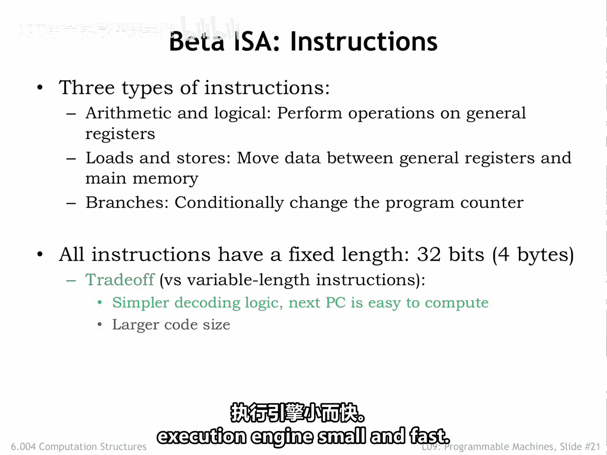
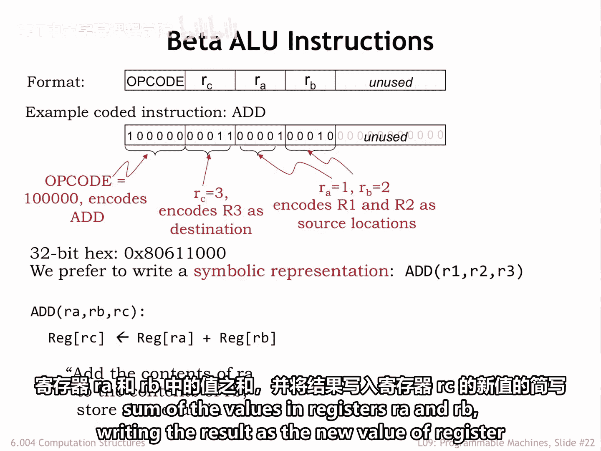
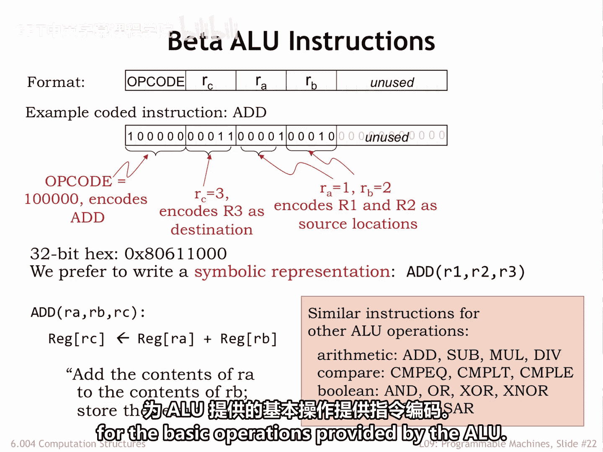
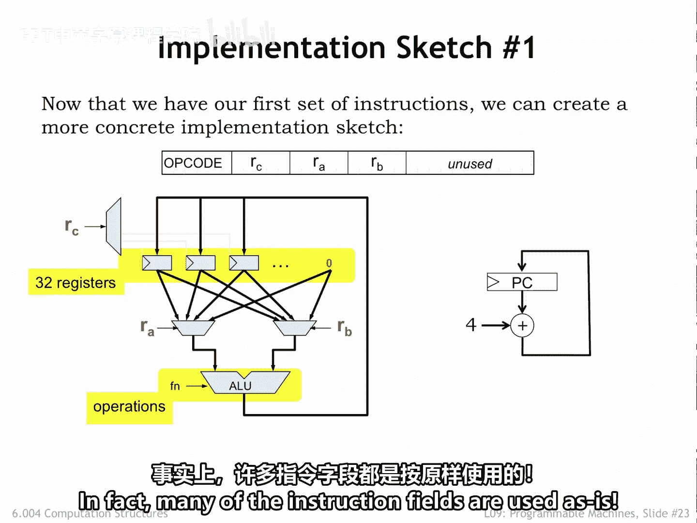

# 079：9.2.5 ALU指令

在本节课中，我们将要学习Beta指令集架构中的算术逻辑单元指令。我们将了解其指令格式、编码方式以及如何在数据通路中执行。

上一节我们介绍了Beta ISA提供的存储资源，本节中我们来看看如何设计Beta指令本身。Beta指令分为三类：执行寄存器值算术与逻辑运算的计算指令、访问主存值的加载与存储指令，以及改变程序计数器值的分支指令。我们将依次讨论每一类指令。

在Beta ISA中，所有指令编码的长度相同。每条指令编码为32位，因此恰好占据主存中的一个32位字。这种固定长度的指令编码使得控制单元解码指令的逻辑更简单。对于大多数指令，下一条指令位于当前指令之后的内存位置，计算下一条指令的地址非常简单，只需将程序计数器的当前值加4即可。

虽然固定长度编码在信息密度上可能不如变长编码高效，但解码变长指令的硬件非常复杂。如今，内存技术的进步使得代码大小不再是主要问题，设计的重点转向了满足现代应用所需的高性能。因此，我们选择固定长度编码，虽然代码体积稍大，但能保持硬件执行引擎的小巧与快速。

## 计算指令格式

Beta的计算指令在算术逻辑单元中执行。我们将使用课程第一部分设计的ALU。

Beta ALU指令包含四个字段：
*   一个6位字段，指定要执行的ALU操作，称为**操作码**。
*   两个5位字段**RA**和**RB**，指定源操作数来自的寄存器编号（R0到R31）。
*   一个5位字段**RC**，指定结果写入的目标寄存器。

这种指令格式使用了32位字中的21位，剩余位未使用，应设置为0。操作码字段始终位于指令的第31至26位。

以下是`ADD`指令的二进制编码示例。`ADD`的操作码是二进制值`100000`。`RC`字段指定结果写入R3，`RA`和`RB`字段指定源操作数来自R1和R2。因此，这条指令将R1和R2中的32位值相加，并将32位和写入R3。

我们通常使用十六进制表示指令的二进制编码，例如`0x80611000`。但更简便的方式是使用功能符号来描述指令，例如`ADD(R1, R2, R3)`。这里使用了一个称为**助记符**的符号名称（`ADD`），后跟括号内的操作数列表（源操作数R1、R2，目标操作数R3）。`ADD(RA, RB, RC)`是请求Beta计算寄存器RA和RB中值之和，并将结果作为寄存器RC新值的简写。

## 支持的ALU操作

以下是Beta支持的所有ALU操作的助记符列表。每一条指令的详细功能描述可在Beta文档手册中找到。所有这些指令都使用相同的四字段模板，仅在操作码字段的值上有所不同。

这一步相当直接，我们简单地为ALU提供的所有基本操作提供了指令编码。

## 数据通路实现草图

现在我们有了第一组指令，可以创建一个更具体的实现草图。

在我们的数据通路中：
*   指令中的5位`RA`和`RB`字段用于选择32个寄存器中的哪两个作为源操作数。注意，R31并非真正的读写寄存器，它只是常量0。因此，选择R31作为操作数意味着使用值0。
*   指令中的5位`RC`字段选择哪个寄存器将接收ALU的输出结果。
*   未显示的是将指令操作码转换为相应ALU功能码所需的硬件，例如可以使用一个64位置的ROM通过查表来执行转换。
*   程序计数器逻辑支持指令的顺序执行。它是一个32位寄存器，在每条指令结束时通过将其当前值加4来更新。这意味着下一条指令将来自存放当前指令的内存位置之后。

在此图中，我们可以看到RISC架构的一个优势：解码指令以产生控制数据通路所需信号所需的逻辑并不多。事实上，许多指令字段都是直接使用的。

## 总结

本节课中我们一起学习了Beta ISA的ALU指令。我们了解了其采用32位固定长度编码，包含操作码、两个源寄存器和一个目标寄存器字段。这种设计简化了硬件控制逻辑。我们还查看了所有支持的ALU操作助记符，并初步探讨了指令在数据通路中的执行过程，看到了RISC架构在解码效率上的优势。下一节，我们将继续探讨加载与存储指令。