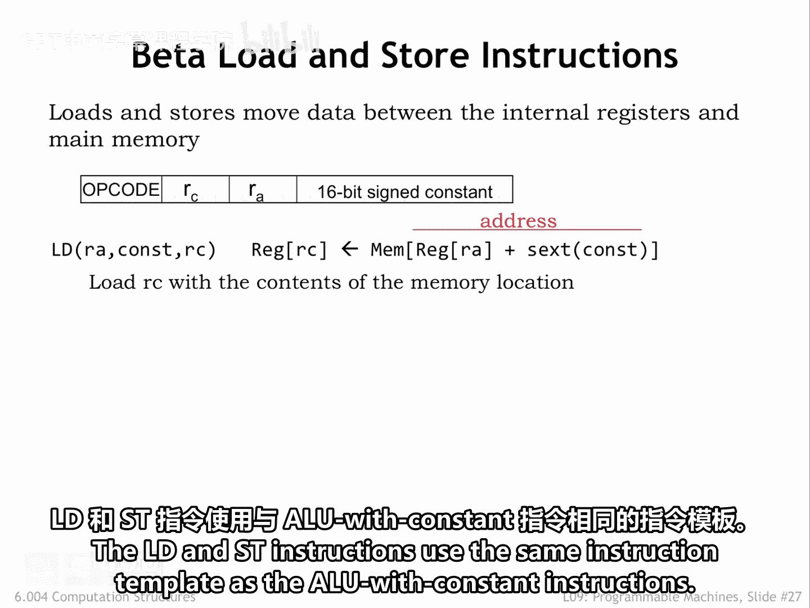
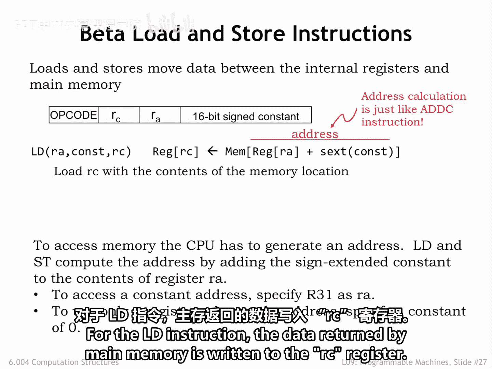
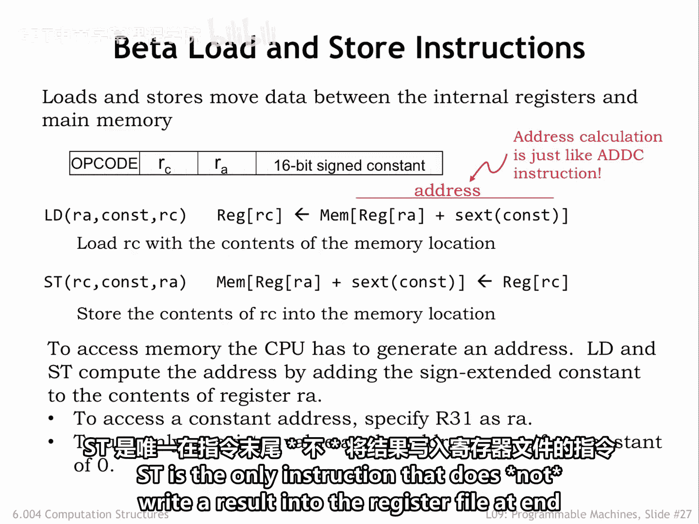
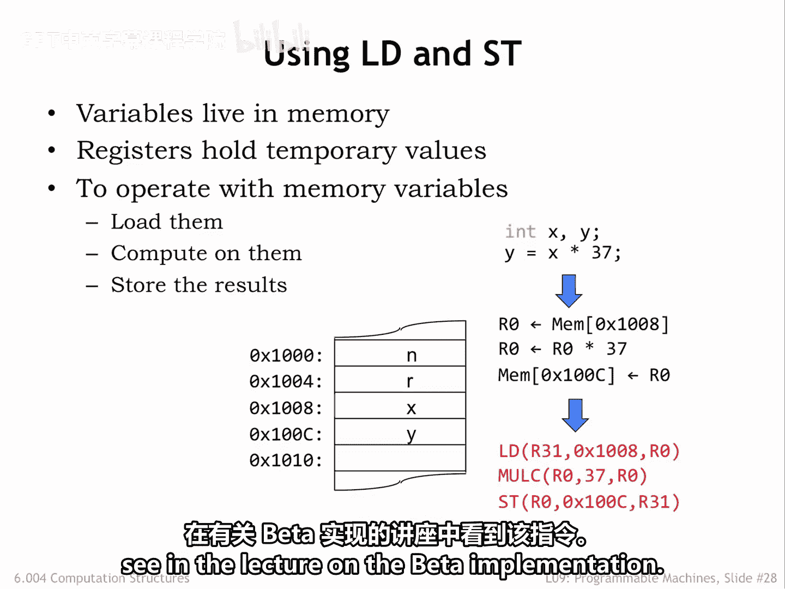

# 数字系统与计算机架构：P1：内存访问指令详解 🧠

在本节课中，我们将学习Beta ISA中第二类重要指令：加载（Load）和存储（Store）指令。这些指令是CPU访问内存中数据的唯一途径，因为Beta采用的是“加载-存储架构”。我们将详细探讨它们的工作原理、格式以及在编程中的应用。

## 加载与存储指令概述



上一节我们介绍了算术逻辑指令，本节中我们来看看专门用于内存访问的加载和存储指令。这两条指令与带常量的ALU指令使用相同的指令模板。


指令格式为：`OPCODE RA, CONSTANT(RC)`。其中`OPCODE`指定操作类型，`RA`是基址寄存器，`CONSTANT`是一个16位有符号常量，`RC`在加载指令中作为目标寄存器，在存储指令中作为源数据寄存器。

## 加载指令的工作原理



加载指令（LD）用于从内存读取数据到CPU寄存器。其核心操作是计算内存地址。

以下是加载指令的执行步骤：
1.  **地址计算**：将`RA`寄存器的值与指令低16位符号扩展后的常量相加。此计算与ADC指令完全相同，因此硬件可以复用。
    *公式：`Memory_Address = RA + SignExtend(CONSTANT)`*
2.  **内存访问**：将计算出的和作为地址发送给主内存。
3.  **数据写入**：从主内存返回的数据被写入`RC`寄存器。


## 存储指令的工作原理

存储指令（ST）用于将CPU寄存器中的数据写入内存。其地址计算过程与加载指令相同。

存储指令在几个方面比较特殊：
*   它是**唯一**需要读取`RC`寄存器值的指令，因此数据通路硬件需要稍作调整以适应此需求。
*   由于`RC`在此充当源操作数，它在指令的符号形式中作为第一个操作数出现，格式为：`ST(RC, CONSTANT, RA)`。`CONSTANT`和`RA`共同指定目标地址。
*   它是**唯一**在指令执行结束后**不**向寄存器文件写入结果的指令。




## 编程实例解析

让我们通过一个具体例子来理解这些指令的应用。假设我们需要从内存中加载变量`x`的值，乘以37，然后将结果写回存储变量`y`的内存位置。

使用Beta指令，我们可以用三条指令序列来表达这个计算：
```assembly
LD(R31, 0x1008, R1)  // 从地址 (R31=0 + 0x1008) 加载x的值到R1
MULC(R1, 37, R2)     // R2 = R1 * 37
ST(R2, 0x1010, R31)  // 将R2的值存储到地址 (0 + 0x1010)
```
*   第一条`LD`指令将`R31`（其值恒为0）与常量`0x1008`相加，得到地址`0x1008`，这正是变量`x`的存储位置。
*   第二条`MULC`指令执行乘法运算。
*   第三条`ST`指令执行类似的地`址计算，将结果写入变量`y`的地址`0x1010`。

## 处理大地址与LDR指令

加载和存储指令的地址计算方式在需要访问的地址能放入16位常量字段时（即地址 <= 0x7FFF）工作良好。

那么，当我们需要访问地址高于`0x7FFF`的内存位置时该怎么办？
这时，我们需要像处理任何大常量一样对待这些地址，将它们存储在内存中，以便后续通过加载指令读入寄存器供加载/存储指令使用。

但是，如果需要存储的大常量数量超过了低地址区（即我们可以直接访问的地址范围）的容量呢？
为了解决这个问题，Beta指令集包含了一条**加载相对地址指令（LDR）**。我们将在后续关于Beta实现的课程中详细讲解这条指令。



## 总结


本节课中我们一起学习了Beta ISA中的加载（LD）和存储（ST）指令。我们了解到它们是CPU与内存交互的唯一桥梁，采用`RA + 符号扩展(CONSTANT)`的方式计算有效地址。存储指令在操作数顺序和不对寄存器进行写回方面具有特殊性。通过实例，我们看到了如何用这些指令完成从内存读数据、运算、再写回内存的完整流程。最后，我们探讨了处理大地址的挑战，并引出了将在后续课程介绍的LDR指令作为解决方案。掌握这些指令是理解程序如何操作数据的关键一步。