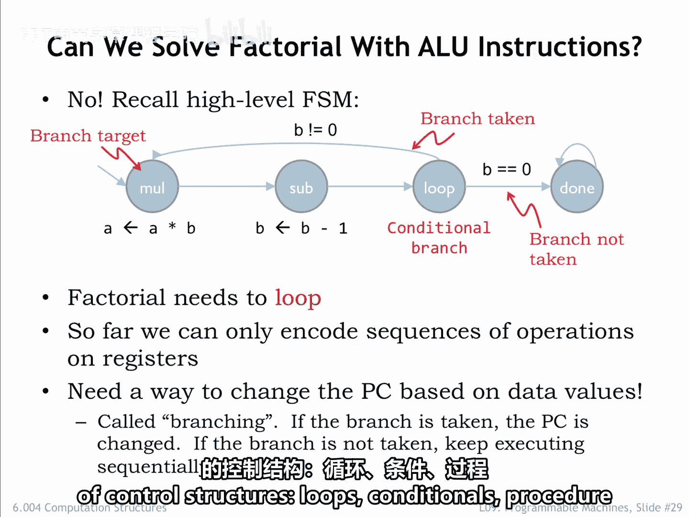
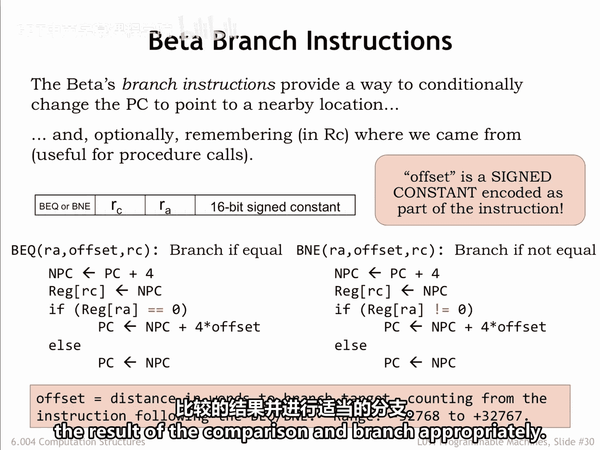
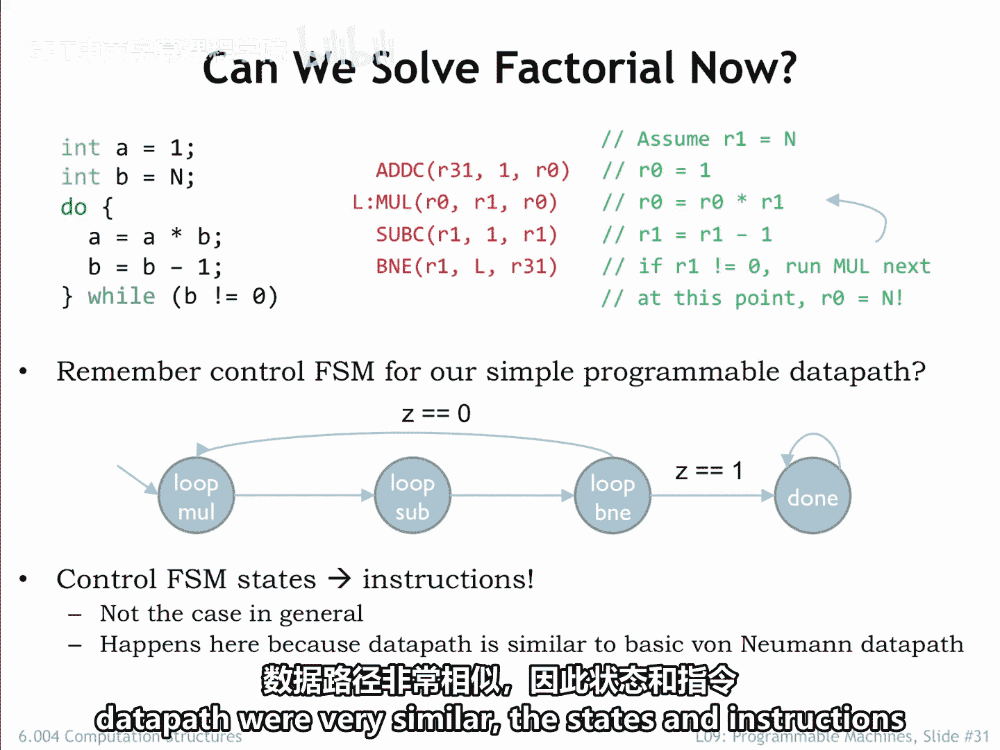

# 082：分支指令 🧭

在本节课中，我们将要学习第三类指令——分支指令。这类指令允许我们改变程序计数器（PC）的值，从而控制程序的执行流程，实现循环、条件判断等功能。

到目前为止，程序计数器在每个指令结束时都简单地增加4，以便下一条指令来自紧接当前指令之后的内存位置。换句话说，Beta处理器一直在按顺序执行内存中的指令。但在许多程序中，例如计算阶乘的程序，我们需要打破这种顺序执行。要么需要跳转回去重复执行之前的指令，要么因为某些条件依赖而跳过一些指令。我们需要一种方法，能够根据程序执行过程中产生的数据值来改变程序计数器。

## 分支指令概述

上一节我们介绍了顺序执行，本节中我们来看看如何通过分支指令改变执行流程。改变PC值，使其依赖于某些条件，是通过分支指令实现的，这种操作被称为**条件分支**。当分支被“采纳”时，PC值被改变，执行在新的位置（称为**分支目标**）重新开始。如果分支未被采纳，PC值增加4，执行在分支指令之后的指令处继续。顾名思义，分支指令代表了执行序列中的一个潜在分叉。我们将使用分支指令来实现许多不同类型的控制结构，如循环、条件语句、过程调用等。

分支指令也使用带有16位有符号常量的指令格式。分支指令的操作有点复杂，让我们逐步分析它们的操作。

## BEQ指令详解



让我们从BEQ指令的操作开始。首先，执行常规的PC+4计算，得到BEQ指令之后那条指令的地址。无论分支是否被采纳，这个值都会被写入RC寄存器。分支指令的这个特性非常方便，我们将在后续课程中用它来实现过程调用。注意，如果我们不需要记住PC+4的值，可以将R31指定为RC寄存器。

接下来，BEQ测试RA寄存器的值，看它是否等于0。如果等于0，则采纳分支，PC值增加指令常量字段指定的量。实际上，这个常量被称为**偏移量**，因为我们用它来偏移PC。它被视为字偏移量，并乘以4以转换为字节偏移量，因为PC使用字节寻址。

如果RA寄存器的内容不等于0，则PC值增加4，执行在BEQ之后的指令处继续。

关于偏移量，我再多说几句。分支指令使用的是所谓的**PC相对寻址**。这意味着分支目标的地址是相对于分支指令的地址（实际上是相对于分支之后那条指令的地址）来指定的。因此，偏移量为0指的是分支之后的指令，偏移量为-1指的是分支指令本身。

负偏移量被称为**向后分支**，通常出现在循环末尾测试循环条件的分支中，如果需要再次迭代，则向后跳转到循环开始处。正偏移量被称为**向前分支**，通常出现在if语句的代码中，如果条件不成立，我们可能会跳过程序的某一部分。

我们可以使用BEQ来实现所谓的**无条件分支**，即总是被采纳的分支。如果我们测试R31是否等于0，这总是成立的，所以`BEQ(R31, ...)`总是会分支到指定的目标。

## BNE指令与其他条件

还有一个BNE指令，其操作与BEQ相同，只是条件判断的逻辑相反。当寄存器RA的值**不等于0**时，采纳分支。

可能看起来只测试等于0或不等于0并不能满足所有需求。例如，我们如何判断A是否小于B？这就是比较指令的用武之地。它们执行更复杂的比较，如果比较结果为真则产生一个非零值，如果为假则产生0值。然后，我们可以使用BEQ和BNE来测试比较结果并进行相应的分支。

以下是BEQ和BNE指令的核心操作逻辑：

**BEQ(RA, offset, RC) 操作逻辑：**
```
if (RA == 0) {
    PC = PC + 4 + (offset * 4);
} else {
    PC = PC + 4;
}
RC = PC + 4; // 无论分支是否采纳，都存储下一条指令地址
```

**BNE(RA, offset, RC) 操作逻辑：**
```
if (RA != 0) {
    PC = PC + 4 + (offset * 4);
} else {
    PC = PC + 4;
}
RC = PC + 4;
```

## 阶乘计算示例



终于，我们现在可以编写Beta汇编代码，使用左侧C代码所示的迭代算法来计算阶乘了。

在Beta代码中，循环从第二条指令开始，并用标签`L:`标记。循环体包括所需的乘法运算和B的递减。然后在第四条指令中，测试B的值。如果B不等于0，BNE指令将分支回标签为L的指令。

请注意，在我们用于BEQ和BNE指令的符号表示法中，我们不直接写入偏移量，因为手动计算会很麻烦，并且如果我们在循环中添加或删除指令，偏移量也会改变。相反，我们引用我们希望分支到的指令，而将符号代码转换为二进制指令字段的程序会为我们计算偏移量。

Beta代码与我们之前在本讲座中讨论的简单可编程数据路径中为计算阶乘创建的高级有限状态机（FSM）所指定的操作之间，存在着令人满意的相似性。在这个例子中，高级FSM中的每个状态都与一个特定的Beta指令很好地对应起来。我们通常不会期望有这么高的对应度，但由于我们的Beta数据路径和示例数据路径非常相似，所以状态和指令匹配得相当好。

以下是计算阶乘的Beta汇编代码示例：
```assembly
// 假设初始值：R1 = n (要计算阶乘的数), R2 = 1 (结果累加器)
    CMOVE(1, R2)        // 初始化结果为1
L:  BEQ(R1, done, R31)  // 如果 R1 == 0，跳转到‘done’
    MUL(R2, R1, R2)     // R2 = R2 * R1
    SUB(R1, 1, R1)      // R1 = R1 - 1
    BNE(R1, L, R31)     // 如果 R1 != 0，跳转回‘L’
done:                   // 循环结束，R2中为n的阶乘结果
```

## 总结



本节课中我们一起学习了分支指令，这是控制程序执行流程的关键。我们了解了条件分支（BEQ, BNE）如何通过测试寄存器值来决定是否跳转，掌握了PC相对寻址和偏移量的概念，并通过阶乘计算的例子看到了如何使用分支指令来实现循环。分支指令使我们能够构建复杂的控制结构，是编程中实现条件逻辑和循环的基础。