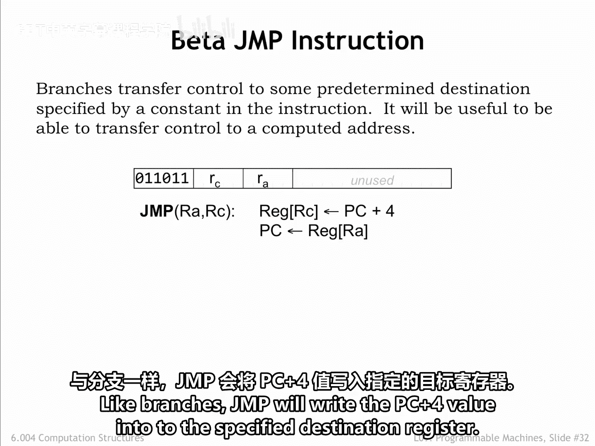
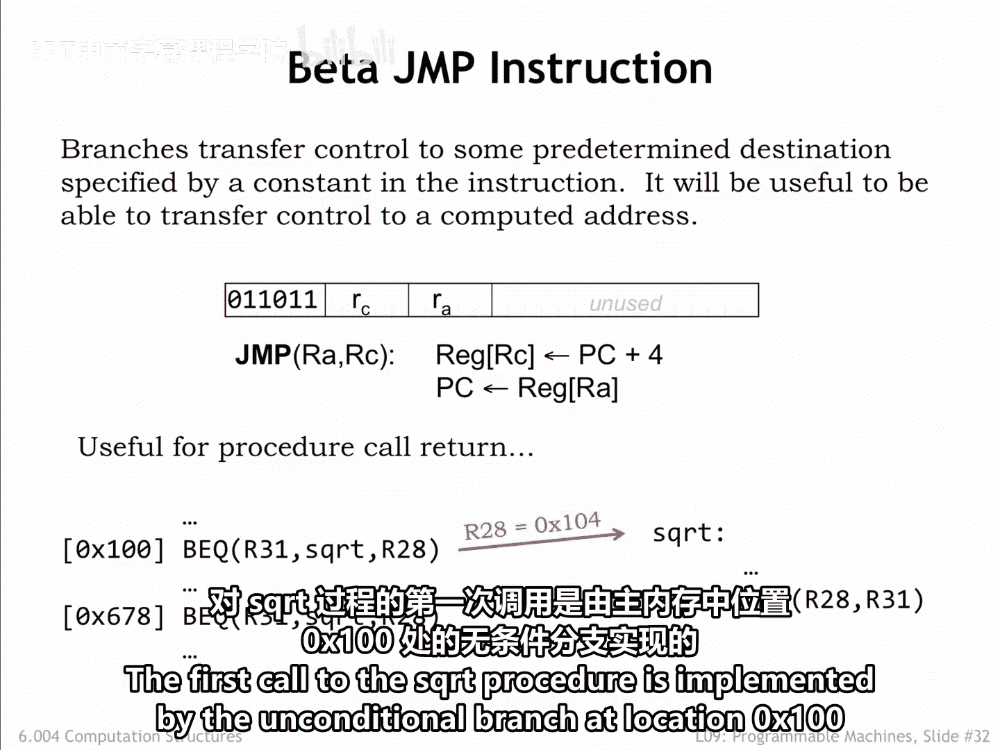
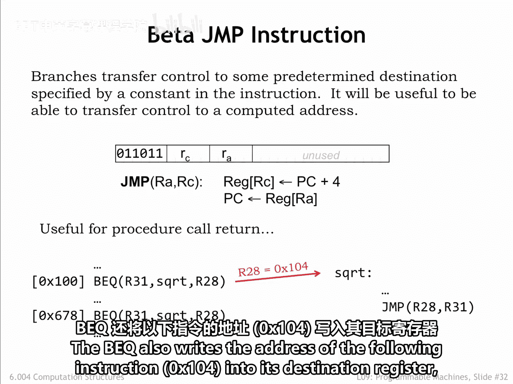
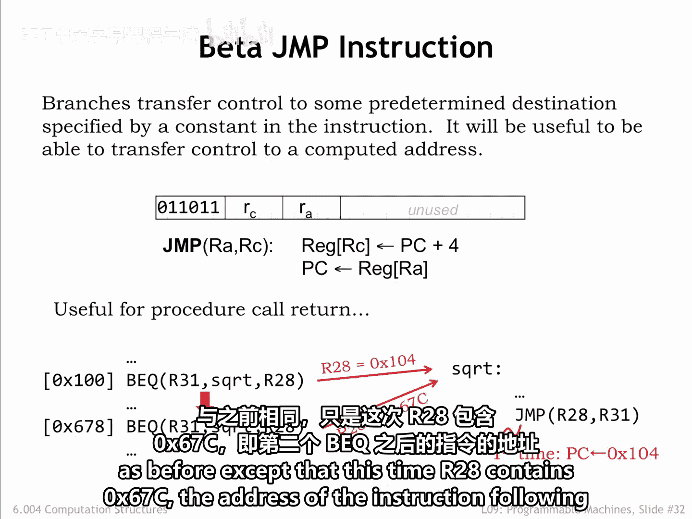
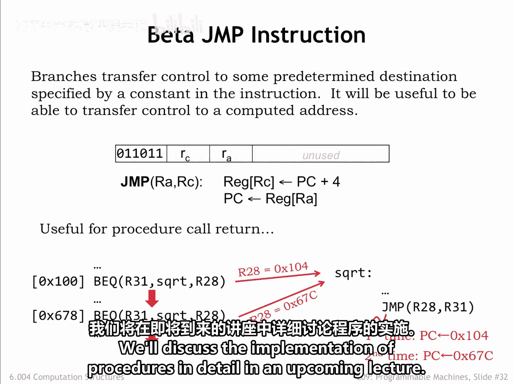
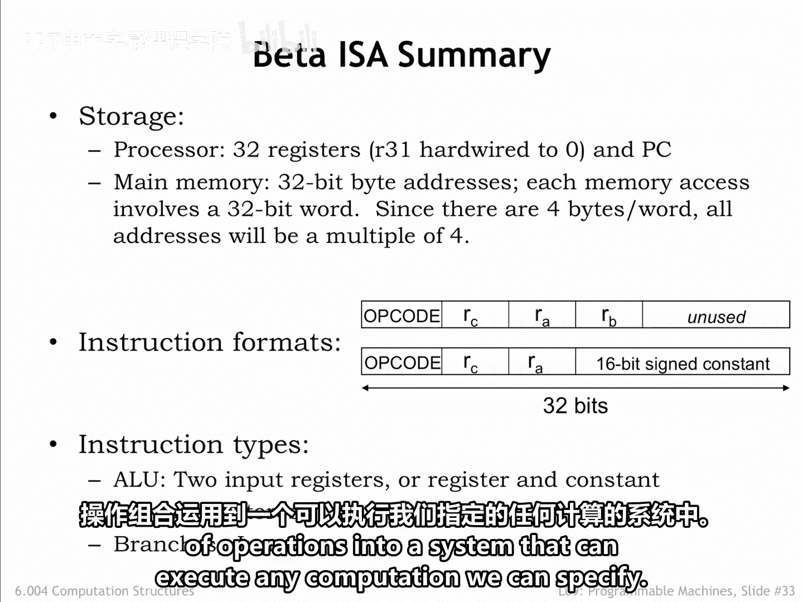

# 数字系统与计算机架构：P1：9.2.9 跳转指令



在本节课中，我们将要学习Beta指令集中的最后一种指令类型——跳转指令。我们将了解它如何与分支指令配合，共同实现程序中的过程调用与返回机制。

上一节我们介绍了条件分支指令，它能够根据条件改变程序的执行顺序。本节中我们来看看无条件跳转指令，它提供了计算目标指令地址的能力。

跳转指令的功能是简单地将程序计数器设置为某个寄存器中的值。与分支指令类似，跳转指令也会将`PC+4`的值写入指定的目标寄存器。

以下是跳转指令的格式：
```
JMP(Rc)
```
其操作可以描述为：
```
PC <- R[c]
R[31] <- PC + 4
```





这种能力对于在Beta代码中实现过程调用非常有用。假设我们有一个计算参数平方根的过程`sqrt`。我们不展示`sqrt`的具体代码，只关注其最后一条指令——一条跳转指令。在调用方程序中，程序员可能从两个不同的地方调用这个`sqrt`过程。

让我们观察一下执行过程。第一次调用`sqrt`过程是通过主存中地址`X100`处的一条无条件分支指令实现的。该分支的目标地址是`sqrt`过程的第一条指令，因此执行流会跳转到那里继续执行。

`BEQ`指令同时会将下一条指令的地址（`Hex 104`）写入其目标寄存器`R28`。



当我们执行到过程调用的末尾时，跳转指令会将`R28`中的值（即`Hex104`）加载到`PC`中。这样，执行就会在第一次`BEQ`指令之后继续。我们成功地从过程返回，并恢复了主程序中断点的执行。



当我们第二次调用`sqrt`过程时，事件序列与之前相同，只是这次`R28`中保存的是`Hex67C`，即第二条`BEQ`指令之后那条指令的地址。

因此，当我们第二次到达`sqrt`过程的末尾时，跳转指令会将`PC`设置为`67C`，执行将在第二次过程调用之后恢复。`BEQ`和`JMP`指令协同工作，完美地实现了过程的调用与返回。我们将在后续课程中详细讨论过程的实现细节。

至此，Beta指令集架构的设计就介绍完毕了。我们来做一个总结。

*   Beta拥有32个寄存器，用于保存可作为ALU操作数的值。
*   所有其他值，连同程序本身的二进制表示，都存储在主存中。
*   Beta支持32位内存地址，可以访问2^32（即4GB）的主存空间。
*   所有的Beta内存访问都针对32位字，因此所有地址必须是4的倍数（因为每个字有4个字节）。
*   指令有两种格式：第一种指定操作码、两个源寄存器和一个目标寄存器；第二种格式用指令本身存储的16位常量经符号扩展得到的32位常量，替换了第二个源寄存器。
*   指令分为三类：ALU运算指令、用于访问主存的加载/存储指令，以及改变执行顺序的分支与跳转指令。

以上就是全部内容。正如我们将在下一讲中看到的，我们将能够利用这套相对简单的指令集，构建出一个可以执行任何我们所能指定的计算的系统。



本节课中我们一起学习了跳转指令的格式与功能，并了解了它如何与分支指令配合实现过程调用。我们还回顾并总结了整个Beta指令集架构的核心特性。