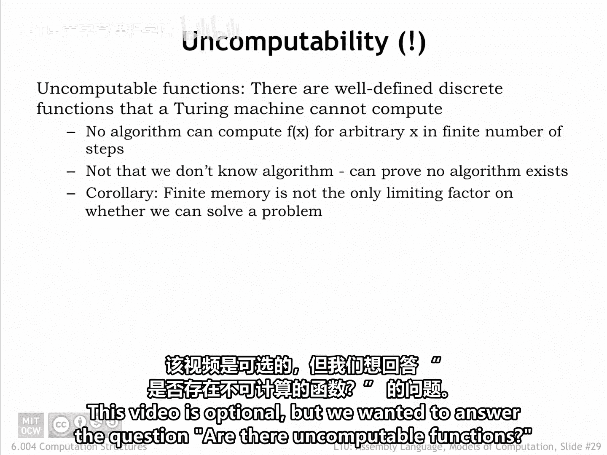
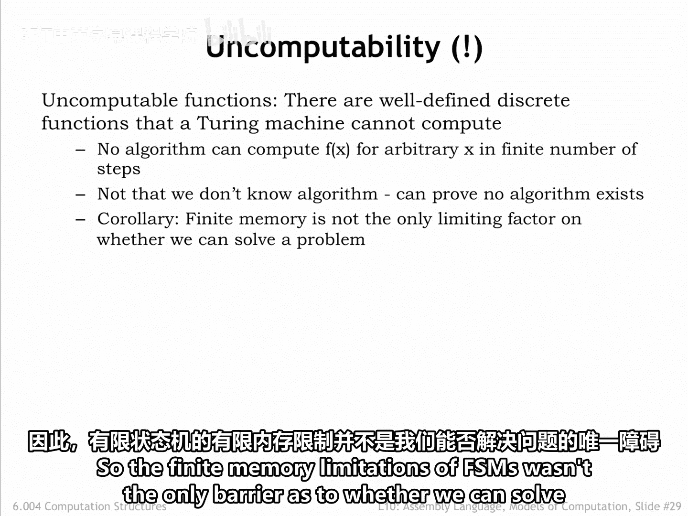
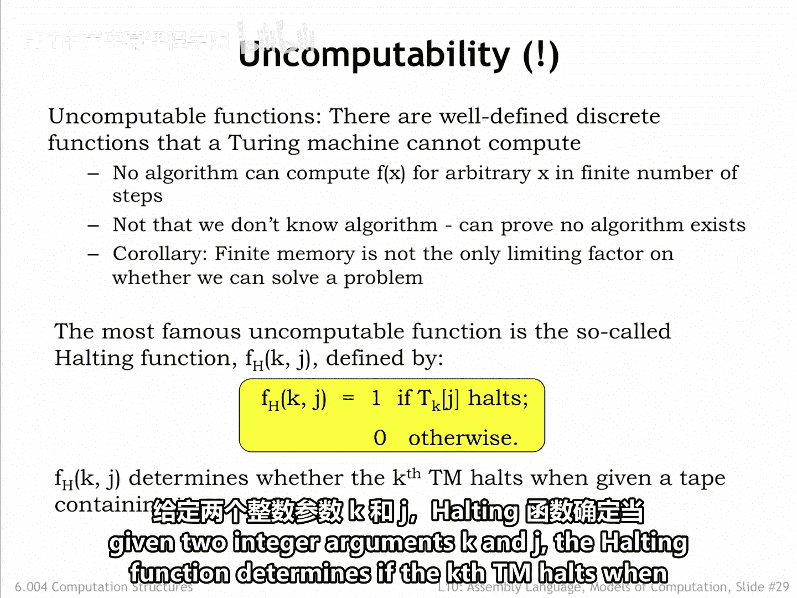
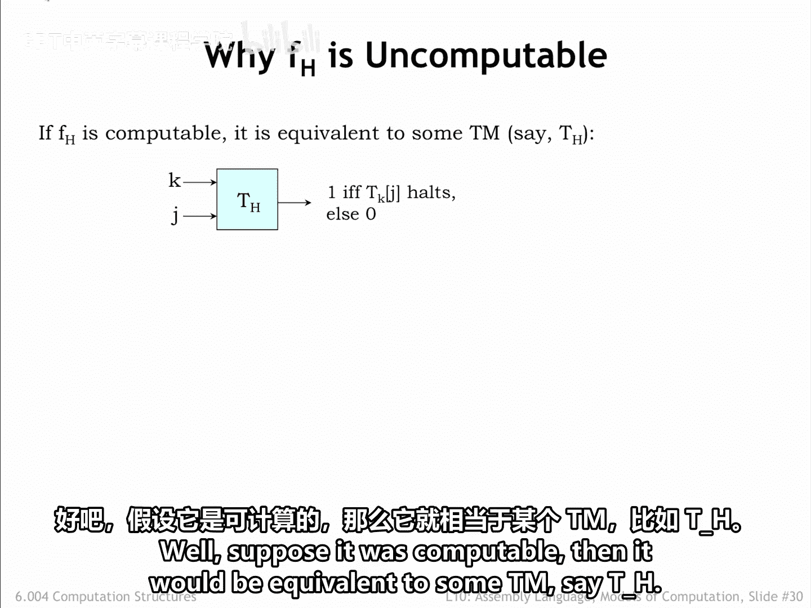
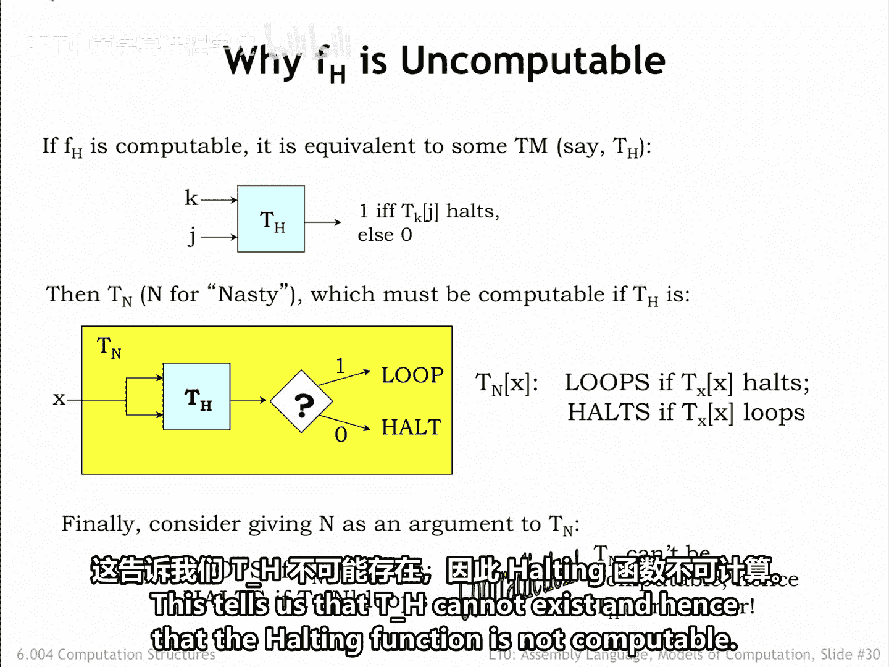

# 091：不可计算函数 🧮

在本节课中，我们将探讨一个计算机科学中的深刻问题：是否存在不可计算的函数？我们将了解什么是不可计算函数，并重点分析最著名的例子——停机问题。

## 概述

本节视频内容是可选的，但它旨在回答一个根本性问题：是否存在不可计算的函数？答案是肯定的。确实存在一些定义明确的离散函数，它们无法被任何图灵机计算。换句话说，不存在任何算法，能够在有限步骤内为任意有限的输入 `x` 计算出 `F(x)` 的值。这并非因为我们不知道算法，而是可以严格证明这样的算法根本不存在。这表明，有限状态机的内存限制并非我们能否解决问题的唯一障碍。

## 最著名的不可计算函数：停机函数 ⏸️

上一节我们确认了不可计算函数的存在，本节中我们来看看其中最著名的一个例子：停机函数。

当图灵机执行计算时，可能产生两种结果：要么图灵机将答案写入纸带并停机；要么图灵机永远循环下去。停机函数的作用就是告诉我们将会得到哪种结果。

给定两个整数参数 `K` 和 `J`，停机函数判断编号为 `K` 的图灵机在输入纸带内容为 `J` 时是否会停机。

## 为什么停机函数不可计算？ 🤔

我们已经了解了停机函数的定义，现在我们来快速勾勒一个论证，说明为什么停机函数是不可计算的。

假设停机函数是可计算的，那么它就等价于某个图灵机，我们称之为 `T_H`。

我们可以利用 `T_H` 来构建另一个图灵机 `T_N`（N 代表“棘手的”）。`T_N` 对单个参数 `x` 进行预处理，其结果要么循环，要么停机。

`T_N(x)` 的设计逻辑是：如果图灵机 `x` 在输入 `x` 时停机，则 `T_N(x)` 循环；反之，如果图灵机 `x` 在输入 `x` 时循环，则 `T_N(x)` 停机。其核心思想是，`T_N(x)` 的行为总是与 `T_x(x)` 的行为相反。

在假设我们拥有 `T_H` 来回答“停机还是循环”这个问题的前提下，`T_N` 是容易实现的。

现在，考虑当我们把 `n`（即 `T_N` 自身的编号）作为参数输入给 `T_N` 时会发生什么。根据 `T_N` 的定义：
*   如果停机函数告诉我们 `T_N(n)` 停机，那么 `T_N(n)` 将循环。
*   如果停机函数告诉我们 `T_N(n)` 循环，那么 `T_N(n)` 将停机。

显然，`T_N(n)` 不可能同时既循环又停机。因此，如果停机函数是可计算的且 `T_H` 存在，我们将推导出 `T_N` 应用于参数 `n` 时这种不可能的行为。这告诉我们 `T_H` 不可能存在，从而证明停机函数是不可计算的。

## 总结

本节课中我们一起学习了不可计算函数的概念。我们了解到，确实存在一些定义良好的函数（如停机函数），没有任何图灵机或算法能够计算它们。我们通过反证法分析了停机函数不可计算的原因：假设其可计算会导致逻辑矛盾。这个结论揭示了计算理论的一个基本极限，即并非所有数学上定义明确的问题都能通过算法解决。