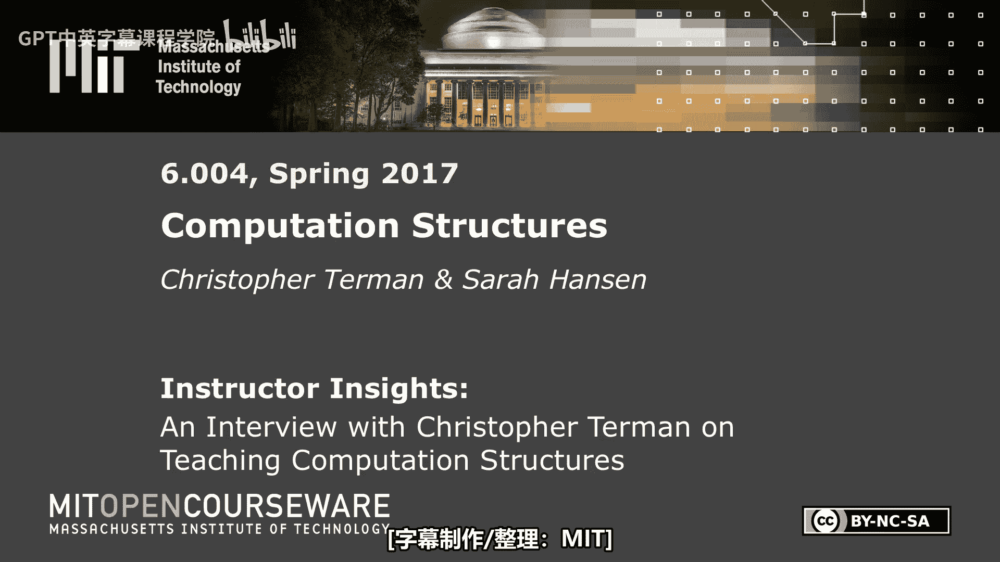
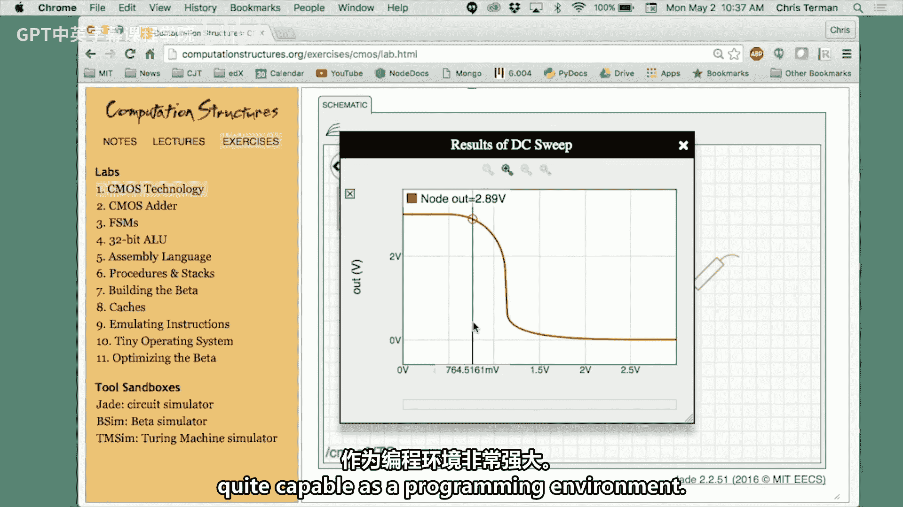

# 数字系统与计算机架构：P1：克里斯托弗·特曼访谈 - 关于教学计算结构

## 概述
在本节中，我们将通过克里斯托弗·特曼教授的访谈，了解他如何对计算结构产生兴趣、他的教学理念，以及他如何设计课程以满足不同背景学生的学习需求。访谈内容涵盖了课程结构、教学工具、学生互动以及未来展望等多个方面。

---

## 对计算结构产生兴趣
在20世纪70年代早期，我是一名大学生，为了支付学费，我在校园计算机上担任第三班操作员。在那个时代，学校只能负担得起一台计算机。由于观看闪烁的指示灯很无聊，我拿出了大学正在运行的计算机的电路图，开始尝试理解计算机的工作原理。从那时起，理解如何将这些组件组合成一台能够进行计算的机器，就成了我终生的兴趣。

## 教学与在线教育的兴趣
我一直被优秀的教师所吸引和激励。每个人在青少年或成年初期都会选择一个榜样，而我选择的榜样正是我遇到的那些优秀教师。因此，我立志要尽我所能成为最好的教师。看到学生点头并突然理解某个概念时，那种满足感非常强烈。教学是一种非常有成就感的体验，它形成了一个良性循环：你从教学中获得积极的反馈，然后在来年做得更好，从而获得更积极的反馈。四十年来，这感觉一直很棒。

## 学生背景的多样性
学生的背景差异很大。有些学生有很长的编程经验，甚至可能对计算机内部结构有所了解。而另一些学生则没有任何相关经验，他们可能只是使用过浏览器、笔记本电脑、电子邮件等，但对操作系统或内部硬件一无所知。他们带着兴趣而来，但完全没有背景知识。

## 满足多样化需求的课程结构
为了应对如此多样化的背景，课程必须提供大量丰富的材料。你需要为那些需要从零开始的学生提供起点，同时也需要为那些已经掌握前半部分内容的学生提供能激发他们兴趣的后半部分内容。我把这看作是一个自助餐：有很多菜品，你可以从头开始挑选，也可以跳过前几道菜，直接参与到对话的中间部分。关键在于拥有大量可供选择的材料。这也是6.004课程的一个标志性特点：我们提供了所有可能的学习材料方式，不仅针对不同背景，也针对不同的学习风格。有些学生喜欢交谈或倾听，有些喜欢阅读，有些则只想做习题集并进行即时学习。

## MITx平台如何支持这种“自助餐”模式
MITx平台首先是一个汇集所有不同类型材料的“一站式商店”。其次，它遵循了一种新兴的最佳实践，即如何向初学者解释材料：采用短小精悍的视频片段，每个片段介绍一个单一技能或概念，然后通过一些自测问题让学生检查理解。理论上，你只需观看视频，然后回答一些简单的问题（不是难题），如果你理解了视频内容，就能回答出来。这让学生有机会开始检索学习的过程，你会反复提问，学生逐渐将知识从短期记忆转移到中长期记忆。MITx平台非常适合构建这种学习序列，学生也很欣赏这种方式，一切都被分解得更易于消化。想象一下播放一个50分钟的视频，大约到第6分钟，你可能就会想同时查看电子邮件。因此，保持内容简短精悍很重要。现在，我们拥有大量短视频片段，MITx平台允许你组织这些片段并穿插问题，持续测试学习效果，这成为了一种组织有序的学习之旅。学生可以随时开始、停止并返回学习，因为它是异步的，他们可以自己选择时间和地点。我们教师总是幻想：学生没来上课，但凌晨三点他们清醒时，肯定在看视频。实际上，查看观看统计数据，在测验周确实有很多观看行为，很多人将其用作一种深入沉浸式的材料介绍方式。

## 教学与学习研究的激动时刻
对于真正关心教学学术研究的人来说，数字工具的出现使得通过最佳实践实现学习成为可能，这确实是一个激动人心的时代。在大学层面教学的我们，通常只是被递上一支粉笔并被要求去教学。而小学教师则经过培训学习如何教学。我们的教学方式多是基于轶事和经验，试图记住别人是如何教我们的。现在，在线课程提供了一个真正的教育实验室，我们可以尝试不同的技术，能够相当准确地评估某项练习、视频片段或设计问题的效果如何。我们可以在同一批学生中进行A/B测试。作为一名科学家和工程师，能够提出假设并通过一系列实验进行测试，这非常棒。借助MITx平台，我们真的可以进行这些实验，这太棒了，确实令人兴奋。

## 大课堂的教学策略
保持学生参与度很有趣，因为我们有如此多的不同材料，真正来听课的学生是那些通过听课方式学习效果最好的人。我本人就是这样的学生。所以，到场的学生不是被强制的，他们是自愿选择的，因此他们准备好接受口头讲授的某种程度的参与。我有一套精心准备并在课堂上展示的材料，这些材料经过调试，内容进度适中，大多数人能跟上。教学一段时间后，你会变得更加放松，所以这是一种非常轻松的体验。我会讲笑话，分享我职业生涯中的故事。有趣的是，学期末学生评价时，很多人说他们很喜欢这些故事。在讲完枯燥的技术细节后，说说“当我尝试使用那个东西时，发生了以下情况”，这很有趣。突然间，他们开始集中注意力，心想“哦，对”。我认为这有助于他们记忆相关内容。确实如此，你从讲座中记住的几乎从来不是技术要点，而是他们讲的笑话、发生的事故或犯的错误。这涉及一个叫做“流畅性”的概念，即事情进展得有多顺利。当每个人都点头，一切都很顺利时，你的思维反而可能开始游离。因此，在讲座中适当加入一些“不流畅”实际上是有好处的，比如停下来讲个笑话、犯个错误、把粉笔掉在地上说声“该死”并看看地板，或者我喜欢做的是：从讲台后面走出来，接近听众。你可以看到他们有点反应：“等等，他‘逃出来’了。”任何能打破“我只是在顺流而下”状态的事情，都能在保持人们参与度方面产生很大影响。这是一个很好的建议。

## 教学团队的角色
我们有一个由讲师组成的小团队。我长期以来一直是这个团队的一员，但近年来也有其他来自外部的人员加入。系里增加了讲师资源，所以还有另一位讲师参与，也有其他教员加入。这为人才库增加了一些深度。然后，我们有研究生助教负责辅导课，有本科生助教，还有实验助理。我们有一个完整的层级结构。他们几乎都上过这门课，并且都喜欢它。这门材料让人们觉得“这真的很棒，我等不及要告诉下一个人这是如何工作的”。当他们坐在那里与学生一起工作时，就像我一样，有一种热情会自然流露出来。学生实际上更喜欢另一种方式：向实验助理提问不那么令人生畏，他们可能上学期刚修完这门课，所以对需要做什么来达成目标记忆犹新。然后，你可以沿着层级向上寻求答案。这样，只有当你相当确定其他人无法解答时，才会向那些更令人生畏的人提问。所以，当问题传到我这里时，大多已经没人担心那是“愚蠢的问题”了。我并不真的相信有愚蠢的问题，我认为所有问题都很有趣。但学生会想：我问了10个人，没人知道，现在可以问你了，而且我相当确信这不是那种只要读了作业就能知道的明显问题。这种不同经验水平和年龄的搭配很好：在经验水平的高端，你可以得到任何问题的答案；在经验水平的低端，你是在和刚刚在几个月前做过你现在正在做的事情的人交谈，所以你可以问他们而不会感到尴尬。

## 在线论坛的作用与管理
在线论坛是课程中一个极好的资源。我第一次能够对一个问题进行深思熟虑的回答，并让180人看到答案，而不是只让一个人看到。当下一个人有同样的问题时，我就不必再花10分钟重复解答。对于大班教学来说，你无法为300人中的每一个都花费10分钟。所以，论坛是提问的好地方。我尽量对每个问题都给予深思熟虑且尊重的回答。即使问题类似于“哇，如果你读了材料就会知道”，我也会说：“如果你回头看材料，你会发现它解释了以下内容……”或者试着给出一点提示，暗示可能需要更多准备。但很多问题是：“我读了材料，但还是不明白，我需要一个例子。”我努力让学生感到非常自在地提问，这没有任何成本，他们可以匿名提问，这消除了一些障碍。在2017年秋季，论坛大约有2500条贡献，平均响应时间约为20分钟。学生可能会在凌晨3点提问，这怎么可能呢？原来，我们有一些助教，特别是在凌晨3点正是他们精力充沛的时候。我们许多参与课程的人都设置了实时发布通知，所以我们会立即收到电子邮件，通常可以马上输入答案。我认为快速的响应时间确实降低了学生的挫败感。没有什么比卡在某个问题上想说“我希望我能问别人”更糟的了。现在，即使在凌晨3点12分，你也可以说“等等，我可以提问并且能得到答案”，学生们非常非常感激这一点。论坛确实改变了学生遇到困难时的挫败感水平。遇到困难只是一个10分钟的过程，而不是一个持续两天的过程——“天哪，下次答疑时间在周末之后，我该怎么办？”当然，很多学生在非朝九晚五的时间学习。所以，这是让教学团队成为24/7全天候团队，而不仅仅是每周五天朝九晚五团队的一种方式。教学团队成员的工作时间也和论坛用户差不多，所以很匹配。

## 课程中的实验体验
学生可以获得动手进行数字设计的实践经验。这些实验可以在任何地方进行，因为它是基于浏览器的，无需下载软件，只需上网即可。我喜欢做的事情之一就是构建基于浏览器的计算机辅助设计工具。事实证明，它们确实运行得很好。现代浏览器环境作为编程环境相当强大，需要学习一些技巧，但一旦掌握，效果就很好。这些工具性能相当高，学生可以坐下来完成大部分设计工作。我们的学习很多是以设计驱动的，我们实际上试图让他们构建我们描述的东西，我们甚至可能详细地告诉他们如何组合。但“肌肉记忆”这个概念很重要：如果你亲自构建它，拖动组件并连接线路，你会记得更牢。或者你会问自己：“这个应该放在这里还是那里？”然后你回头看，开始真正仔细地阅读说明，并意识到“哦，我必须这样放才能工作”。我们让手和眼都参与进来，而不仅仅是听。如果你组装了某个东西，我们会构建测试来检查它是否功能正确。所以你可以立刻知道是否搞砸了。这不像交上去一周后，在我已经不再关心的时候拿回来一个红叉，然后说“好吧，该死”。在这里，他们必须做对才能完成，但我们会立刻告诉他们不对，然后他们继续努力，或者在论坛上发帖说“我的电路不工作”，工作人员可以从服务器远程调出他们的设计，说“哦，这里，这是你的错误”。这样，学生实际上是在扮演工程师的角色。这可能是他们第一次真正的“构建”体验，这些学生是大二学生。所以，说“哇，这很酷，我实际上组装并调试了电路”是有点趣味的。这意味着我必须找出哪里错了，我做错了什么，然后修复它。这是一次非常宝贵的经历。这就像深夜电视购物广告：看他们使用时觉得如此简单，但你把小工具买回家后它却不工作。他们在讲座中看过，在视频中看过，在示例中看过，一切都极其明显，认为这很简单，直到你自己动手做，然后你才填补了所有缺失的环节，意识到“哦，原来这么难，现在我明白了”。他们努力尝试修复，但我认为这些虚拟实验台的整体概念很棒。正如我所说，浏览器上的执行环境和图形环境是一流的，很容易构建使用相当复杂后台计算并拥有出色用户界面的复杂工具。而且浏览器是可移植的。回想20年前，我给你软件下载到电脑上做这些事，那简直是雷区，每个人的环境都略有不同。“哦，你没有那个库的最新版本？那你不能运行这个。”“但如果你更新了库，你又不能运行那个了。”那真是一场噩梦。因此，将这些实验体验打包成世界各地的人都能使用的方式，意义重大。有一次，我在香港地铁上，一个年轻人走过来对我说：“我上了你们的MITx课程，我真的很喜欢做电路实验，而且我不用下载任何东西。”我当时想，哇，这太有趣了。被人拦住并开始谈论这不仅仅是一种倾听体验，这很有趣。这些虚拟实验室实际上将课程从一种可能附带一些书面习题的倾听体验，转变为让你的手也动起来的体验。手动起来，脑就动起来，当人们的大脑开始运转时，他们记住的东西是惊人的。

## 学生首次尝试工程师角色时遇到的挑战
我认为很多挑战与信心有关。有时学生来找我说：“我想让这个工作。”我说：“好的，让我看看你的设计，我们来修复它。”我尽量把手放在口袋里，让他们自己修复，但我会说：“你有没有想过，如果这个工作而那个不工作，那说明了什么？”很多学生不善于利用已知信息来减少下一步尝试或测试的范围，从而缩小问题所在的位置。这是一种需要学习的技能：如何有条理地处理一个不工作的复杂事物（其中部分工作，但有些部分不工作），并尝试从两端向中间推进，找到不工作的地方。这是一种需要练习一段时间的技能，我们试图帮助培养这种技能。我很有信心这会奏效，但大多数学生相当确信要么模拟器坏了，要么没希望了。所以，当他们意识到有一种系统性的方法可以让东西工作时，他们会有些惊讶。一旦他们确信这是真的，他们就会变得更加自信，认为“它现在不工作，但我只需要再花10分钟，我相信它会工作的”，而不是说“哦，我唯一能做的就是举手求助，因为它不工作”。我们努力让学生摆脱那种“你的工作就是让它工作，而不仅仅是让我们过来看着我们让它工作”的心态。学生们会完成这个转变。所以，这似乎是课程的一个学习目标：不仅是学习数字系统的架构，还要培养工程师所具备的专业能力态度。有一系列过程你必须经历。同样，学习如何学习也是大二学生仍在做的事情。这可能是他们第一次被“扔进深水区”。我们尝试安排很多救生员在旁边，但我们准备做的不仅仅是拿着记录板检查他们是沉是浮。我们准备好跳进去说：“试试这个，试试那个。”在大一（有很多辅助轮）之后、高年级课程（帮助相对较少）之前，有这样的经历实际上非常有帮助。6.004课程的一大优点是，你宿舍楼里有一半的人都上过这门课。所以，即使我们有课程团队，你也可以去宿舍楼里问。正如我所说，每隔一个人就会说：“哦，我上过那门课，是的，我上过。”所以实际上有大量的关于材料和类似事情的知识。没有多少课程有这种机会，但我们充分利用了它。因此，在课堂结构化学习之外，发生了很多“走廊学习”和同伴学习。这很有趣，它说明了在本科阶段拥有共同学习经历以促进那种“走廊学习”的重要性，真的很有趣。此外，学生通常在白天很忙，容易分心。他们来上课时脑子里有很多事情。所以，很可能是在他们房间的安静环境中，他们才能真正在智力上钻研材料。首先，给他们一些值得钻研的东西是好的，但也要确保在他们离开你提供的结构化帮助环境时，能通过同伴或论坛获得支持。我认为这确实改变了学生消化课程的方式。讲座出勤率一般，但很多人在评估中对材料的学习掌握得很好。我认为这印证了你之前谈到的：你提供了多种学习方式的“自助餐”，所以来听课的人是那些通过这种形式学习效果最好的人。有些人我除了偶尔在实验答疑时间过来聊聊天外，几乎从未见过。我们有一项活动是在设计完成后进行的“检查”，你必须来解释你的设计。部分原因是为了确保也许是你自己做的设计，而不是你宿舍楼的朋友做的。至少，我们希望他们理解他们声称已经完成的设计。对于那些努力完成设计的人来说，他们喜欢过来展示，他们为自己的“成果”感到自豪。特别是在课程后期，我们有一个相当复杂的设计项目，要获得高分确实很难，你必须非常出色。令人惊讶的是，有很多人尝试这个项目，他们进来说：“好吧，我卡在这里了，给我一些下一步尝试的思路。”如果你敢说“嗯，你知道，只要这样做”，他们会说：“不，我不想要答案，我想……我在这里玩得很开心，所以不要拿走有趣的部分，我想自己琢磨出来，我只需要一些提示，告诉我应该把注意力集中在哪个谜题上。”乐趣就在于解谜和动手做的过程。我认为这很棒，因为当学生刚来时，他们往往专注于答案，比如“你给了我一份满是问题的工作表，所以我看了答案，我觉得我准备好了”。我说：“不，工作表不是为了让你知道那些问题的答案，工作表是帮助你诊断是否理解内容。所以，工作表能发生的最好事情是‘我不知道怎么做这个问题’，因此我应该去弄清楚怎么做。”所以，如果你在进行这种自我主导的掌握式学习（这也是我们试图帮助学生按照自己的节奏掌握材料的方式），我们必须提供大量的自我评估，他们必须将其用作评估工具。如果他们只是说“哦，这个问题的答案是3，我希望测验会考这个”，那他们就没有真正掌握。让学生不再只关注答案，而是真正专注于“我如何解决这类问题？在我知道的所有事情中，我首先必须选择适当的概念或技能，然后我必须知道如何应用它”，这很关键。看着他们从刚进来时专注于答案，到离开时能够说“好吧，你可以问我任何问题，因为我实际上知道如何从头开始做事情，而不仅仅是因为我能认出正确答案，我实际上能创造出正确答案”，这种转变很美妙。当人们能做到这一点时，他们会感到被赋能。

## 课程的未来展望
我即将退休，所以课程正在移交给一个新的团队，一些早期教学团队的成员将接手。他们当然有自己关于更好方法的强烈意见。我认为课程的基本结构、要教授的基本主题列表将保持不变，但他们心中有不同的设计体验构想，所以他们会找到自己的方式。这对我来说很有趣，因为我认为除非你教过300人的大课，否则你可能无法体会到那些在办公室面对两个学生或在10人的辅导课上效果很好的方法，对于300人的大课并不真正适用。你会突然意识到：“嗯，如果他们有问题会问的，所以我不需要太具体。”但有趣的是，“哇，300个问题，那是很多问题，每个学生3个问题，我这周就有900个问题。”于是你开始明白材料需要准备得多么仔细。在你发给我的一个问题中，你谈到了“设计”材料。大班教学在“设计”材料方面确实有一个真正的问题：这些材料要能帮助学生做你想让他们做的事，但你不能让他们无所适从，因为你只有有限的能力把他们全部拉回岸边。所以，你真的必须把大部分他们需要的东西都放进材料里。

## 关于“设计”材料以保持所有人跟上进度的更多说明
这是一个迭代的过程。人们说：“哇，6.004运行得像时钟一样精确，这是我上过的最有条理的课程。”我说：“嗯，你知道，20年前你不会这么说。”我们也有过一些不幸的作业、无法完成的作业，或者对某些学生太难、对所有人太简单的作业。是的，我们这样做，我们尝试获取学生反馈，论坛在这方面实际上很棒，你能即时得到“这个很糟糕”的反馈，然后你会说“哦，好吧”。如果你做得好，你会做笔记。我想我教这门课大概有30个学期了，这给了你很多机会在每个学期结束后反思什么做对了、什么做错了。有一个好的团队，他们通常能立刻发现问题：“哦，我们必须改这个”或者“我花了太多时间帮助学生解决这个，所以应该把它放进作业里”。甚至在实时教学中，我们也会在作业中添加一段话，提供更多解释或提示。所以，愿意将构建材料视为一个持续的过程很重要。过一段时间，大多数坑洼都会被填平，道路就会变得相当平坦。有时，意想不到的问题实际上是一扇通往全新事物的大门。有些学生说：“我思考了这个，并尝试用这种方式做，然后我想‘哇，这是多么了不起的见解’。”我们希望所有学生都有机会获得那种“啊哈”的顿悟时刻。所以现在我们要想办法把它融入到设计问题中，让每个人都说“有机会恍然大悟”。学生能够自己提出那个见解真的很棒，但这给了你一个视角，让你有机会理解学生是如何看待你所提出的问题的。他们误解了，所以回答了一个不同的问题，结果那个不同的问题至少很有趣，甚至可能比你问的更好。然后你开始进入另一个良性循环，慢慢地你积累了很多东西，最终得到那些看起来没什么，但背后经过了大量演化才以这种方式、这个顺序提出的问题。经历这个过程很有趣，也常常令人惊讶，你会说：“哦，我以为这已经很清楚了。”

---

## 总结
本节课中，我们一起学习了克里斯托弗·特曼教授关于计算结构教学的理念与实践。我们了解到他对计算结构的兴趣源于早年操作计算机的经历，他的教学热情则受到优秀教师的激励。课程设计采用“自助餐”模式，通过MITx平台提供丰富的材料以适应不同背景和学习风格的学生。教学策略包括保持课堂互动、利用在线论坛提供即时支持，以及通过基于浏览器的虚拟实验室提供动手设计体验。课程不仅传授技术知识，还注重培养学生解决问题的能力和工程思维。教学团队结构多元，支持系统完善。课程材料经过多年迭代优化，未来将由新团队在保持核心结构的基础上继续发展创新。